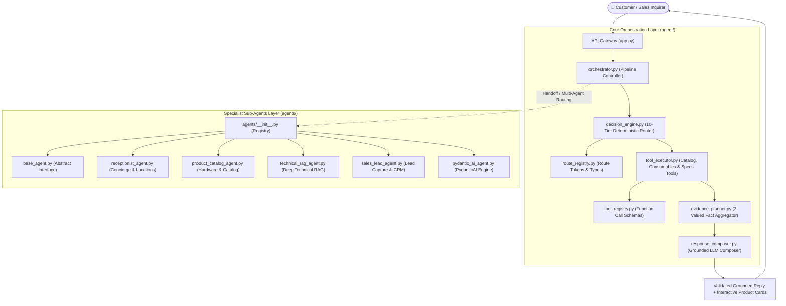

# Kepler Tech SalesAI — AI Agent Architecture & Full Code Documentation

This document provides a comprehensive technical architecture guide, workflow specifications, and the complete source code contents for all AI Agent files in the Kepler Tech SalesAI repository.

---

## Table of Contents

1. [Executive Overview & Dual-Layer Architecture](#1-executive-overview--dual-layer-architecture)
2. [Agent System Interaction Diagram](#2-agent-system-interaction-diagram)
3. [Core Decision & Orchestration Engine (`agent/`)](#3-core-decision--orchestration-engine-agent)
   - [3.1 `agent/route_registry.py`](#31-agentroute_registrypy)
   - [3.2 `agent/tool_registry.py`](#32-agenttool_registrypy)
   - [3.3 `agent/tool_executor.py`](#33-agenttool_executorpy)
   - [3.4 `agent/decision_engine.py`](#34-agentdecision_enginepy)
   - [3.5 `agent/evidence_planner.py`](#35-agentevidence_plannerpy)
   - [3.6 `agent/response_composer.py`](#36-agentresponse_composerpy)
   - [3.7 `agent/orchestrator.py`](#37-agentorchestratorpy)
4. [Specialist Sub-Agents Framework (`agents/`)](#4-specialist-sub-agents-framework-agents)
   - [4.1 `agents/__init__.py`](#41-agents__init__py)
   - [4.2 `agents/base_agent.py`](#42-agentsbase_agentpy)
   - [4.3 `agents/receptionist_agent.py`](#43-agentsreceptionist_agentpy)
   - [4.4 `agents/product_catalog_agent.py`](#44-agentsproduct_catalog_agentpy)
   - [4.5 `agents/technical_rag_agent.py`](#45-agentstechnical_rag_agentpy)
   - [4.6 `agents/sales_lead_agent.py`](#46-agentssales_lead_agentpy)
   - [4.7 `agents/pydantic_ai_agent.py`](#47-agentspydantic_ai_agentpy)
5. [Cross-Agent Communication & Conversation Lifecycle](#5-cross-agent-communication--conversation-lifecycle)
6. [Summary File Index](#6-summary-file-index)

---

## 1. Executive Overview & Dual-Layer Architecture

Kepler Tech SalesAI utilizes a **dual-layer agent architecture**:

1. **The Core Decision & Orchestration Layer (`agent/`)**:
   - Designed for high-concurrency, deterministic-first customer conversations.
   - Enforces fail-closed commercial guardrails, 10-tier routing priority, and 3-valued truth logic.
   - Plans verified database evidence before LLM synthesis to eliminate hallucinations.
   - Manages stateful turn tracking, anti-frustration loops, and product qualification.

2. **The Specialist Sub-Agents Layer (`agents/`)**:
   - Modular, persona-based sub-agents for specialized tasks:
     - **Receptionist Concierge**: General inquiries, showroom location, business hours.
     - **Product Catalog Specialist**: Category qualification, model discovery, paper-size matching.
     - **Technical RAG Specialist**: In-depth comparisons, DPI, print speed, ink technology.
     - **Sales Lead Specialist**: CRM lead generation, customer contact capture, quote requests.
     - **PydanticAI Specialist**: Structured schema validation, calculator tools, and enterprise execution.

---

## 2. Agent System Interaction Diagram



---
## 3. Core Decision & Orchestration Engine (`agent/`)

### 3.1 `agent/route_registry.py`

**Path**: [`/opt/salesai/agent/route_registry.py`](file:///opt/salesai/agent/route_registry.py)  
**Lines**: 34 | **Size**: 1,036 bytes  

**Purpose & Responsibilities**:
Defines the route names, route decisions, and enumeration mapping conversation intents to routing targets.

#### Complete Source Code for `agent/route_registry.py`:

```python
"""
Route Registry for Kepler Tech Conversational AI.
Maps RouteName values to their handler functions.
"""

from domain.conversation_types import RouteName
from routes import (
    social_route,
    qualification_route,
    product_route,
    comparison_route,
    consumables_route,
    support_route,
    business_info_route,
)
from routes.help_and_guardrail_route import conversation_help_route, guardrail_route

# Route name → handler module mapping
ROUTE_HANDLERS = {
    RouteName.SOCIAL: social_route,
    RouteName.CONVERSATION_HELP: conversation_help_route,
    RouteName.GUARDRAIL: guardrail_route,
    RouteName.QUALIFICATION: qualification_route,
    RouteName.PRODUCT: product_route,
    RouteName.COMPARISON: comparison_route,
    RouteName.CONSUMABLES: consumables_route,
    RouteName.SUPPORT: support_route,
    RouteName.BUSINESS_INFO: business_info_route,
}


def get_handler(route_name: RouteName):
    """Returns the handler module for the given route name, or None."""
    return ROUTE_HANDLERS.get(route_name)

```

---

### 3.2 `agent/tool_registry.py`

**Path**: [`/opt/salesai/agent/tool_registry.py`](file:///opt/salesai/agent/tool_registry.py)  
**Lines**: 141 | **Size**: 5,696 bytes  

**Purpose & Responsibilities**:
Provides JSON schemas and parameter definitions for all tools callable by the LLM (search_catalog, get_product_specs, get_compatible_consumables, compare_products, get_business_information).

#### Complete Source Code for `agent/tool_registry.py`:

```python
"""
AI Tool Definitions and Registry for Kepler Tech Conversational Assistant.
Defines dynamic tool specifications for LLM function calling without hardcoding.
"""

from typing import List, Dict, Any

CATALOG_TOOLS: List[Dict[str, Any]] = [
    {
        "type": "function",
        "function": {
            "name": "search_catalog",
            "description": (
                "Searches Kepler Tech's live 792-item catalog for printers, scanners, media, "
                "or consumables matching customer requirements, application keywords, or print volume."
            ),
            "parameters": {
                "type": "object",
                "properties": {
                    "query": {
                        "type": "string",
                        "description": "Keywords describing the user need, model code, print size (e.g. 'A0 CAD plotter', 'DS-770 II', '4x6 photo booth printer')."
                    },
                    "category": {
                        "type": "string",
                        "enum": ["Printer", "Scanner", "Consumables", "Media", "Software", "All"],
                        "description": "Optional category filter to isolate hardware from consumables."
                    },
                    "limit": {
                        "type": "integer",
                        "description": "Maximum number of candidate product cards to return (default 4)."
                    }
                },
                "required": ["query"]
            }
        }
    },
    {
        "type": "function",
        "function": {
            "name": "get_product_specs",
            "description": (
                "Retrieves complete technical specifications, dimensions, features, official image, "
                "and page URL for a specific product name or SKU from the verified catalog."
            ),
            "parameters": {
                "type": "object",
                "properties": {
                    "product_identifier": {
                        "type": "string",
                        "description": "The exact SKU (e.g. 'C11CF11302A1') or model name (e.g. 'SC-T3100', 'DS-900WN', 'CX-02')."
                    }
                },
                "required": ["product_identifier"]
            }
        }
    },
    {
        "type": "function",
        "function": {
            "name": "get_compatible_consumables",
            "description": (
                "Discovers verified compatible inks, maintenance boxes, and media directly from the "
                "catalog relationship graph for a given printer model or SKU."
            ),
            "parameters": {
                "type": "object",
                "properties": {
                    "printer_identifier": {
                        "type": "string",
                        "description": "The printer model name or SKU (e.g. 'SC-T3100', 'SC-P700', 'WF-C5790', 'SC-F100', 'Citizen CZ-01')."
                    },
                    "limit": {
                        "type": "integer",
                        "description": "Maximum number of consumable cards to retrieve (default 6)."
                    }
                },
                "required": ["printer_identifier"]
            }
        }
    },
    {
        "type": "function",
        "function": {
            "name": "compare_products",
            "description": (
                "Extracts and compares specifications, print width, resolution, speed, and intended usage "
                "between two hardware models from the catalog."
            ),
            "parameters": {
                "type": "object",
                "properties": {
                    "model_a": {
                        "type": "string",
                        "description": "Name or SKU of first product (e.g. 'Epson SC-T3100')."
                    },
                    "model_b": {
                        "type": "string",
                        "description": "Name or SKU of second product (e.g. 'Epson SC-T5400M')."
                    }
                },
                "required": ["model_a", "model_b"]
            }
        }
    },
    {
        "type": "function",
        "function": {
            "name": "ask_consultative_question",
            "description": (
                "Asks a clarifying consultative question with structured suggestion chips when user requirements "
                "are too broad to make a pinpoint recommendation."
            ),
            "parameters": {
                "type": "object",
                "properties": {
                    "question": {
                        "type": "string",
                        "description": "The consultative question to prompt the customer."
                    },
                    "suggested_pills": {
                        "type": "array",
                        "items": {"type": "string"},
                        "description": "List of interactive button choices for the user (e.g. ['A0', 'A1', 'A3+'] or ['High-Speed Document Scanners', 'A3 Large Format Flatbed', 'Business Scanners'])."
                    }
                },
                "required": ["question", "suggested_pills"]
            }
        }
    }
]


def format_tools_for_prompt() -> str:
    """Formats tools documentation into clear JSON schema instructions for the AI model."""
    lines = ["Available Tools (you can call one tool if you need to fetch data or qualify customer):"]
    for t in CATALOG_TOOLS:
        fn = t["function"]
        lines.append(f"- {fn['name']}: {fn['description']}")
        lines.append(f"  Parameters: {fn['parameters']['properties']}")
    return "\n".join(lines)

```

---

### 3.3 `agent/tool_executor.py`

**Path**: [`/opt/salesai/agent/tool_executor.py`](file:///opt/salesai/agent/tool_executor.py)  
**Lines**: 537 | **Size**: 26,942 bytes  

**Purpose & Responsibilities**:
The backend execution engine for catalog tools. Connects to `CatalogRepository`, `RAGRetriever`, and `PriceResolver` to execute grounded tool invocations with strict brand filtering.

#### Complete Source Code for `agent/tool_executor.py`:

```python
"""
Tool Executor Module for Kepler Tech Conversational AI.
Executes dynamic catalog tools and formats zero-hallucination cards and context.
Zero hardcoding: all data is resolved dynamically from data/products.json.
"""

import json
import os
import re
from typing import Dict, Any, List, Optional
from rag.retriever import rag_retriever

PRODUCTS_PATH = os.path.join(os.path.dirname(__file__), "..", "data", "products.json")


class CatalogToolExecutor:
    def __init__(self, products_path: str = PRODUCTS_PATH):
        self.products_path = products_path
        self.products = []
        self.sku_map: Dict[str, Dict[str, Any]] = {}
        self._load()

    def _load(self):
        if os.path.exists(self.products_path):
            with open(self.products_path, "r", encoding="utf-8") as f:
                self.products = json.load(f)
                for p in self.products:
                    for k in ["sku", "_id", "id"]:
                        v = p.get(k)
                        if v:
                            self.sku_map[str(v).upper().strip()] = p
        self.corpus_map = {}
        corpus_path = os.path.join(os.path.dirname(__file__), "..", "data", "kepler_product_corpus.json")
        if os.path.exists(corpus_path):
            try:
                with open(corpus_path, "r", encoding="utf-8") as f:
                    corpus_data = json.load(f)
                    for item in corpus_data:
                        if item.get("id"):
                            self.corpus_map[item["id"]] = item
            except Exception as e:
                pass

    def format_card(self, prod: Dict[str, Any], card_type: str = "hardware") -> Dict[str, Any]:
        """Formats a catalog product into a clean card for frontend display."""
        from catalog.brochure_resolver import brochure_resolver
        from catalog.price_resolver import price_resolver

        name = prod.get("display_name") or prod.get("name") or prod.get("model") or "Product"
        sku = prod.get("sku", "VERIFIED-KEPLER")
        
        # Clean redundant leading SKU from title if present
        clean_title = name
        if card_type == "consumable" and sku and name.upper().startswith(str(sku).upper()):
            clean_title = re.sub(r"^" + re.escape(str(sku)) + r"\s*", "", name, flags=re.IGNORECASE).strip() or name

        image_url = prod.get("image_url") or prod.get("image")
        if not image_url and prod.get("images"):
            image_url = prod["images"][0]
        if not image_url:
            image_url = "https://www.keplertechllc.com/wp-content/uploads/2023/05/Kepler-Logo-.png"

        product_url = prod.get("website_url") or prod.get("web_url") or prod.get("url") or prod.get("source_url")
        if not product_url:
            slug = re.sub(r"[^\w\s-]", "", name.lower()).strip()
            slug = re.sub(r"[\s_]+", "-", slug)
            product_url = f"https://www.keplertechllc.com/product/{slug}/"

        brochure_info = brochure_resolver.get_brochure(name) or brochure_resolver.get_brochure(str(prod.get("id", ""))) or brochure_resolver.get_brochure(str(sku))
        pdf_url = brochure_info.get("pdf") if brochure_info else prod.get("pdf_url")
        if card_type == "hardware" and brochure_info and brochure_info.get("url"):
            product_url = brochure_info["url"]

        price_info = price_resolver.get_price_info(identifier=sku, prod=prod)
        price_val = price_info.get("price")
        price_formatted = price_info.get("price_str", "Price on Request")
        vat_note = price_info.get("vat_note", "")

        tags = prod.get("tags", [])
        cat = str(prod.get("category", "")).lower()
        badge = "Hardware" if card_type == "hardware" else "Consumable"
        if any("Ink" in t for t in tags) or "ink" in name.lower() or "cartridge" in name.lower():
            badge = "UltraChrome Ink" if "ultrachrome" in name.lower() or "ultrachrome" in " ".join(tags).lower() else "Ink Cartridge"
        elif any("Maintenance" in t for t in tags) or "maintenance" in name.lower():
            badge = "Maintenance Tank"
        elif any("Media" in t for t in tags) or cat == "media & paper" or any(m in name.lower() for m in ["media", "paper", "canvas", "roll", "sheet", "film", "luster", "glossy", "matte", "baryta", "velvet", "rag"]):
            badge = "Print Media"

        width_val = prod.get("width") or prod.get("print_sizes")
        speed_val = prod.get("speed") or prod.get("print_speed")
        tech_val = prod.get("ink_technology") or prod.get("technology")

        return {
            "id": prod.get("_id") or prod.get("sku") or prod.get("id"),
            "name": name,
            "title": clean_title,
            "sku": sku,
            "price": price_val,
            "price_formatted": price_formatted,
            "price_str": price_formatted,
            "vat_note": vat_note,
            "currency": "AED",
            "is_request": price_info.get("is_request", price_val is None),
            "image": image_url,
            "image_url": image_url,
            "url": product_url,
            "pdf_url": pdf_url,
            "brochure_url": pdf_url,
            "source_url": product_url,
            "website_url": product_url,
            "web_url": product_url,
            "badge": badge,
            "card_type": card_type,
            "description": prod.get("description") or f"Official verified {badge.lower()} from Kepler Tech LLC.",
            "full_description": prod.get("full_description") or prod.get("description"),
            "feature_headings": prod.get("feature_headings", []),
            "specifications_table": prod.get("specifications_table", {}),
            "category": prod.get("category", "Hardware"),
            "width": width_val,
            "speed": speed_val,
            "ink_technology": tech_val,
            "weight": prod.get("weight"),
            "capacity": prod.get("capacity"),
            "comparison_highlights": prod.get("comparison_highlights"),
            "has_consumables": (card_type == "hardware")
        }

    def execute_tool(self, tool_name: str, arguments: Dict[str, Any]) -> Dict[str, Any]:
        """Dispatches and executes the designated tool dynamically."""
        if tool_name == "search_catalog":
            return self._search_catalog(
                query=arguments.get("query", ""),
                category=arguments.get("category"),
                limit=arguments.get("limit", 4)
            )
        elif tool_name == "get_product_specs":
            return self._get_product_specs(
                identifier=arguments.get("product_identifier", "")
            )
        elif tool_name == "get_compatible_consumables":
            return self._get_compatible_consumables(
                printer_identifier=arguments.get("printer_identifier", ""),
                limit=arguments.get("limit", 25)
            )
        elif tool_name == "compare_products":
            return self._compare_products(
                model_a=arguments.get("model_a", ""),
                model_b=arguments.get("model_b", "")
            )
        elif tool_name == "ask_consultative_question":
            return {
                "success": True,
                "action": "consultative_question",
                "question": arguments.get("question", ""),
                "suggested_pills": arguments.get("suggested_pills", []),
                "product_cards": [],
                "consumable_cards": []
            }
        else:
            return {"success": False, "error": f"Unknown tool '{tool_name}'"}

    def _search_catalog(self, query: str, category: Optional[str] = None, limit: int = 4) -> Dict[str, Any]:
        """Searches catalog using hybrid search and returns clean cards."""
        cat_filter = None if category in (None, "All") else category
        raw_results = rag_retriever.search(query=query, category=cat_filter, limit=limit)

        cards = []
        for r in raw_results:
            card_type = "consumable" if r.get("category") in ["Consumables", "Ink Cartridge", "Media", "Maintenance Box"] else "hardware"
            cards.append(self.format_card(r, card_type=card_type))

        return {
            "success": True,
            "count": len(cards),
            "results": raw_results,
            "product_cards": cards if any(c["card_type"] == "hardware" for c in cards) else [],
            "consumable_cards": cards if any(c["card_type"] == "consumable" for c in cards) else []
        }

    def _get_product_specs(self, identifier: str) -> Dict[str, Any]:
        """Finds a product and extracts detailed specs with strict identifier matching."""
        from catalog.repository import catalog_repository
        from catalog.product_resolver import resolve_canonical_id, normalize_model_identifier
        
        target_id = resolve_canonical_id(identifier) or identifier.lower().strip()
        norm_p = catalog_repository.get_by_id(target_id)
        
        norm_id = normalize_model_identifier(identifier)
        if not norm_p and norm_id:
            for p in catalog_repository.get_all():
                p_norm_id = normalize_model_identifier(p.id)
                p_norm_name = normalize_model_identifier(p.name)
                if norm_id in (p_norm_id, p_norm_name):
                    norm_p = p
                    break

        prod = None
        if norm_p:
            prod = norm_p.to_dict()

        if not prod:
            prod = rag_retriever.get_by_sku(identifier) or rag_retriever.get_by_name(identifier)
        if not prod and norm_id:
            for p in rag_retriever.products:
                p_sku_norm = normalize_model_identifier(str(p.get("sku", "")))
                p_name_norm = normalize_model_identifier(str(p.get("name", "")))
                if norm_id in (p_sku_norm, p_name_norm):
                    prod = p
                    break

        if not prod:
            return {"success": False, "error": f"Product '{identifier}' not found in catalog."}

        card = self.format_card(prod, card_type="hardware")
        for k in ["feature_headings", "full_description", "specifications_table", "price_formatted", "vat_note", "url", "pdf_url"]:
            if card.get(k) and not prod.get(k):
                prod[k] = card[k]

        return {
            "success": True,
            "product": prod,
            "product_cards": [card],
            "specs_text": (
                f"Model: {prod.get('name')}\n"
                f"SKU: {prod.get('sku')}\n"
                f"Category: {prod.get('category')}\n"
                f"Description: {prod.get('description')}\n"
                f"Print Width: {prod.get('width', 'N/A')}\n"
                f"Print Speed: {prod.get('speed', 'N/A')}\n"
                f"Technology: {prod.get('ink_technology', 'N/A')}\n"
                f"Intended Application: {prod.get('intended_usage', 'N/A')}\n"
                f"Official URL: {card.get('url')}"
            )
        }

    def _get_compatible_consumables(self, printer_identifier: str, limit: int = 25) -> Dict[str, Any]:
        """Finds genuine consumables dynamically linked to a printer model."""
        target_printer = None
        q_raw = printer_identifier.strip()
        q_clean = q_raw.lower().replace("\u200b", " ")

        # Reject explicitly unverified / competitor brands
        if any(unv in q_clean for unv in ["canon", "hp", "designjet", "brother", "xerox", "ricoh"]):
            return {
                "success": True,
                "printer_name": q_raw,
                "count": 0,
                "consumable_cards": [],
                "consumables_summary": ""
            }

        # 0. Check catalog_repository first for clean hardware printers
        from catalog.repository import catalog_repository
        q_tokens = [re.sub(r"[\s\-_]+", "", part).replace("citizen", "").replace("epson", "") for part in re.split(r"[,/]+", q_clean) if part.strip()]
        
        # Pass 1: exact match
        for cand in catalog_repository.get_all():
            cand_id_norm = re.sub(r"[\s\-_]+", "", cand.id.lower()).replace("citizen", "").replace("epson", "")
            cand_name_norm = re.sub(r"[\s\-_]+", "", cand.name.lower()).replace("citizen", "").replace("epson", "")
            for q_tok in q_tokens:
                if q_tok and (q_tok == cand_id_norm or q_tok == cand_name_norm):
                    target_printer = cand.to_dict()
                    break
            if target_printer:
                break

        # Pass 2: substring match only if exact match not found
        if not target_printer:
            for cand in catalog_repository.get_all():
                cand_id_norm = re.sub(r"[\s\-_]+", "", cand.id.lower()).replace("citizen", "").replace("epson", "")
                cand_name_norm = re.sub(r"[\s\-_]+", "", cand.name.lower()).replace("citizen", "").replace("epson", "")
                for q_tok in q_tokens:
                    if q_tok and (q_tok in cand_id_norm or q_tok in cand_name_norm):
                        target_printer = cand.to_dict()
                        break
                if target_printer:
                    break

        # 1. Exact SKU
        if not target_printer and q_raw.upper() in self.sku_map:
            target_printer = self.sku_map[q_raw.upper()]

        # 2. Direct retrieve by name / SKU from rag_retriever (prioritizes hardware)
        if not target_printer:
            target_printer = rag_retriever.get_by_sku(q_raw) or rag_retriever.get_by_name(q_raw)

        # 3. Match by specific model token among genuine hardware printers only
        if not target_printer:
            GENERIC_WORDS = {
                "epson", "surecolor", "workforce", "printer", "scanner", "series",
                "large", "format", "color", "pro", "the", "for", "with", "enterprise",
                "multifunction", "multifunctional"
            }
            # Look for model codes like c4000, t3100, p900, cx02, etc.
            specific_tokens = [t for t in re.findall(r"[a-z0-9]+", q_clean) if len(t) >= 3 and t not in GENERIC_WORDS]
            
            # Filter strictly for genuine hardware printers (exclude media rolls, inks, accessories)
            candidate_printers = [
                p for p in self.products
                if "printer" in p.get("category", "").lower()
                and not any(k in p.get("name", "").lower() for k in ["media", "paper", "ribbon", "ink", "cartridge", "cleaning", "pen", "bag", "maintenance"])
            ]
            if not candidate_printers:
                candidate_printers = self.products

            # Prefer tokens containing digits (model numbers like c4000, t3100, cx02)
            specific_tokens.sort(key=lambda x: (any(c.isdigit() for c in x), len(x)), reverse=True)

            for t in specific_tokens:
                pattern = r'(?:\b|_|-)' + re.escape(t) + r'(?:\b|_|-|\s|$)(?!\d)'
                for p in candidate_printers:
                    p_name = p.get("name", "").lower().replace("\u200b", " ")
                    p_sku = str(p.get("sku", "")).lower()
                    if re.search(pattern, p_name) or t == p_sku:
                        target_printer = p
                        break
                if target_printer:
                    break

        # If no target printer recognized from Kepler Tech catalog, return empty to prevent hallucination
        if not target_printer:
            return {
                "success": True,
                "printer_name": q_raw,
                "count": 0,
                "consumable_cards": [],
                "consumables_summary": ""
            }

        # Determine target brand
        p_name_l = target_printer.get("name", "").lower()
        if "citizen" in p_name_l:
            target_brand = "citizen"
        elif any(b in p_name_l for b in ["epson", "surecolor", "workforce"]):
            target_brand = "epson"
        elif "innova" in p_name_l:
            target_brand = "innova"
        else:
            target_brand = None

        consumable_items = []
        seen = set()

        # Look up explicit consumables SKU links from printer metadata
        if target_printer.get("consumables"):
            raw_skus = target_printer["consumables"]
            mbox_skus = [s for s in raw_skus if any(s.upper().startswith(pfx) for pfx in ["C12C", "C13S", "C13T671"])]
            ink_skus = [s for s in raw_skus if s not in mbox_skus]
            ordered_skus = (mbox_skus + ink_skus) if mbox_skus else raw_skus

            for c_sku in ordered_skus:
                c_sku_up = str(c_sku).upper()
                if c_sku_up in self.sku_map and c_sku_up not in seen:
                    item = self.sku_map[c_sku_up]
                    item_name_l = item.get("name", "").lower()
                    item_cat_l = str(item.get("category", "")).lower()
                    # Strictly skip hardware printers, plotters, and scanners
                    if any(hw in item_cat_l for hw in ["printer", "scanner", "plotter"]):
                        continue
                    # Allow recognized consumables or any item from Media & Paper category
                    is_valid_cons = (
                        item_cat_l in ("media & paper", "ink cartridge", "maintenance box", "ribbon")
                        or any(cons_kw in item_name_l for cons_kw in [
                            "ink", "cartridge", "tank", "box", "ribbon", "media", "paper", "pack",
                            "bottle", "maintenance", "cleaning", "pen", "bag", "canvas", "roll",
                            "sheet", "film", "luster", "glossy", "matte", "baryta", "velvet", "rag"
                        ])
                    )
                    if not is_valid_cons:
                        continue
                    item_brand = "citizen" if "citizen" in item_name_l else ("epson" if "epson" in item_name_l else None)
                    # Note: fine art papers (Innova, etc.) or generic media can be used with Epson large format printers
                    if not target_brand or not item_brand or target_brand == item_brand or (target_brand == "epson" and item_cat_l == "media & paper"):
                        seen.add(c_sku_up)
                        consumable_items.append(item)
                        if len(consumable_items) >= limit:
                            break

        # Only perform fallback search if no explicit consumables exist in metadata
        if not consumable_items:
            q_name = target_printer.get("name", q_raw).lower()
            # Extract specific model tokens only (e.g. t3100, p900, cx02, amc4000)
            GENERIC_STOP = {"epson", "surecolor", "printer", "workforce", "color", "scanner", "plotter", "large", "format", "photo", "digital", "pro", "series", "the", "for", "with"}
            tokens = [t for t in re.findall(r"[a-z0-9]+", q_name) if len(t) >= 3 and t not in GENERIC_STOP]

            for p in self.products:
                sku_up = str(p.get("sku", "")).upper()
                if sku_up in seen:
                    continue

                p_cat_l = str(p.get("category", "")).lower()
                p_name_l = p.get("name", "").lower()

                # Strictly exclude hardware printers, scanners, and plotters
                if any(hw in p_cat_l for hw in ["printer", "scanner", "plotter"]):
                    continue
                if any(hw in p_name_l for hw in ["printer", "scanner", "plotter"]):
                    continue

                p_item_brand = "citizen" if "citizen" in p_name_l else ("epson" if "epson" in p_name_l else None)
                if target_brand and p_item_brand and target_brand != p_item_brand:
                    if not (target_brand == "epson" and p_cat_l == "media & paper"):
                        continue

                p_name_norm = re.sub(r"[\s\-_\u200b]", "", p_name_l)
                p_desc_norm = re.sub(r"[\s\-_\u200b]", "", p.get("description", "").lower())
                p_tags_norm = re.sub(r"[\s\-_\u200b]", "", " ".join(p.get("tags", [])).lower())

                is_cons = (
                    p_cat_l in ("media & paper", "ink cartridge", "maintenance box", "ribbon")
                    or any(k in p_name_l for k in ["ink", "cartridge", "tank", "box", "maintenance", "ribbon", "media", "paper", "bottle", "pack", "canvas", "roll", "sheet", "luster", "matte", "glossy", "velvet", "baryta"])
                )
                if is_cons and any(t in p_name_norm or t in p_desc_norm or t in p_tags_norm for t in tokens):
                    seen.add(sku_up)
                    consumable_items.append(p)
                    if len(consumable_items) >= limit:
                        break

        if target_brand:
            consumable_items = [
                c for c in consumable_items
                if target_brand in c.get("name", "").lower()
                or target_brand in " ".join(c.get("tags", [])).lower()
                or target_brand in str(c.get("category", "")).lower()
                or any(str(c.get("sku", "")).upper().startswith(pfx) for pfx in ["CX", "CY", "CZ", "CITIZEN"])
                or str(c.get("sku", "")).upper() in [str(s).upper() for s in target_printer.get("consumables", [])]
                or (target_brand == "epson" and str(c.get("category", "")).lower() == "media & paper")
            ]

        consumable_cards = [self.format_card(c, card_type="consumable") for c in consumable_items]
        p_name = target_printer.get("name") if target_printer else q_raw
        hw_cards = [self.format_card(target_printer, card_type="hardware")] if target_printer else []

        return {
            "success": True,
            "printer_name": p_name,
            "target_printer": target_printer,
            "product_cards": hw_cards,
            "count": len(consumable_cards),
            "consumable_cards": consumable_cards,
            "consumables_summary": ", ".join([c["name"] for c in consumable_cards])
        }

    def _compare_products(self, model_a: str, model_b: str) -> Dict[str, Any]:
        """Compares two models from the live catalog."""
        def find_hardware(identifier: str):
            from catalog.repository import catalog_repository
            p = None
            q_clean = identifier.lower().strip()
            id_norm = re.sub(r"[\s\-_]+", "", q_clean).replace("citizen", "").replace("epson", "")

            # 1. Check catalog_repository first for normalized hardware products
            norm_p = catalog_repository.get_by_id(q_clean)
            if not norm_p:
                for cand in catalog_repository.get_all():
                    cand_id_norm = re.sub(r"[\s\-_]+", "", cand.id.lower()).replace("citizen", "").replace("epson", "")
                    cand_name_norm = re.sub(r"[\s\-_]+", "", cand.name.lower()).replace("citizen", "").replace("epson", "")
                    if id_norm and (id_norm == cand_id_norm or id_norm == cand_name_norm):
                        norm_p = cand
                        break
            if not norm_p:
                for cand in catalog_repository.get_all():
                    cand_id_norm = re.sub(r"[\s\-_]+", "", cand.id.lower()).replace("citizen", "").replace("epson", "")
                    if id_norm and id_norm in cand_id_norm:
                        norm_p = cand
                        break
            if norm_p:
                return norm_p.to_dict()

            for cid, cdata in self.corpus_map.items():
                cid_norm = re.sub(r"[\s\-_]+", "", cid.lower()).replace("citizen", "").replace("epson", "")
                if id_norm and id_norm == cid_norm:
                    p = dict(cdata)
                    break

            if not p:
                cand = rag_retriever.get_by_name(identifier) or rag_retriever.get_by_sku(identifier)
                if cand and cand.get("category") not in ["Consumables", "Ink Cartridge", "Media", "Maintenance Box", "Inks"]:
                    p = dict(cand)
                else:
                    results = rag_retriever.search(identifier, limit=6)
                    hw_results = [r for r in results if r.get("category") not in ["Consumables", "Ink Cartridge", "Media", "Maintenance Box", "Inks"]]
                    p = dict(hw_results[0]) if hw_results else (dict(results[0]) if results else None)

            if p:
                p_name_norm = re.sub(r"[\s\-_]+", "", p.get("name", "").lower())
                p_id_norm = re.sub(r"[\s\-_]+", "", str(p.get("id", "")).lower())
                for cid, cdata in self.corpus_map.items():
                    cid_norm = re.sub(r"[\s\-_]+", "", cid.lower()).replace("citizen", "").replace("epson", "")
                    if cid_norm and (cid_norm in p_name_norm or cid_norm in p_id_norm):
                        for k, v in cdata.items():
                            if k not in p or not p[k]:
                                p[k] = v
                        p["id"] = cid
                        break
            return p

        prod_a = find_hardware(model_a)
        prod_b = find_hardware(model_b)

        if not prod_a or not prod_b:
            return {"success": False, "error": f"Could not find both products for comparison ({model_a}, {model_b})."}

        cards = [self.format_card(prod_a, card_type="hardware"), self.format_card(prod_b, card_type="hardware")]
        return {
            "success": True,
            "product_a": prod_a,
            "product_b": prod_b,
            "product_cards": cards,
            "comparison_data": {
                "model_a": {
                    "name": prod_a.get("name"),
                    "category": prod_a.get("category"),
                    "width": prod_a.get("width") or prod_a.get("print_sizes", "Standard"),
                    "speed": prod_a.get("speed") or prod_a.get("print_speed", "N/A"),
                    "weight": prod_a.get("weight", "N/A"),
                    "capacity": prod_a.get("capacity", "Standard"),
                    "highlights": prod_a.get("comparison_highlights", ""),
                    "intended": prod_a.get("intended_usage", "Professional production")
                },
                "model_b": {
                    "name": prod_b.get("name"),
                    "category": prod_b.get("category"),
                    "width": prod_b.get("width") or prod_b.get("print_sizes", "Standard"),
                    "speed": prod_b.get("speed") or prod_b.get("print_speed", "N/A"),
                    "weight": prod_b.get("weight", "N/A"),
                    "capacity": prod_b.get("capacity", "Standard"),
                    "highlights": prod_b.get("comparison_highlights", ""),
                    "intended": prod_b.get("intended_usage", "Professional production")
                }
            }
        }


# Global singleton instance
catalog_tool_executor = CatalogToolExecutor()
tool_executor = catalog_tool_executor

```

---

### 3.4 `agent/decision_engine.py`

**Path**: [`/opt/salesai/agent/decision_engine.py`](file:///opt/salesai/agent/decision_engine.py)  
**Lines**: 483 | **Size**: 24,852 bytes  

**Purpose & Responsibilities**:
The deterministic 10-tier routing decision engine. Overrides LLM suggestions with strict deterministic business rules (Guardrail -> Social -> Business Info -> Process Help -> Explicit Product -> Comparison -> Consumables -> Discovery -> Qualification -> Clarification).

#### Complete Source Code for `agent/decision_engine.py`:

```python
"""
Decision Engine for Kepler Tech Conversational AI.
The LLM proposes an intent and action, but Python makes the final routing decision.
Enforces a deterministic 10-tier priority order:
1. Price and discount intercept -> RouteName.GUARDRAIL
2. Greeting, thanks and goodbye -> RouteName.SOCIAL
3. Company-information request -> RouteName.BUSINESS_INFO
4. Process/help question -> RouteName.CONVERSATION_HELP
5. Explicit product model -> RouteName.PRODUCT
6. Product comparison -> RouteName.COMPARISON
7. Consumable request -> RouteName.CONSUMABLES
8. Product discovery -> RouteName.PRODUCT or RouteName.QUALIFICATION
9. Answer to awaited qualification field -> RouteName.QUALIFICATION
10. Clarification -> RouteName.CLARIFICATION
"""

import re
import logging
from typing import Optional, List
from domain.conversation_types import (
    Intent, LLMUnderstanding, RouteDecision, RouteName,
    SOCIAL_INTENTS, PRODUCT_INTENTS,
)
from domain.conversation_state import ConversationState
from conversation.requirement_extractor import classify_category

logger = logging.getLogger("decision_engine")

HELP_PHRASES = [
    "can you help me",
    "how does this work",
    "what can you do",
    "help me choose",
    "help me select",
    "where should i start",
    "where do i start",
    "i don't understand specifications",
    "i dont understand specifications",
    "i don't understand printer specifications",
    "i dont understand printer specifications",
    "what can you help me with",
    "guide me",
    "how to choose",
    "how do i choose",
]

COMPANY_INFO_PHRASES = [
    "what products does kepler tech provide",
    "what products do you provide",
    "what does kepler tech provide",
    "products does kepler tech provide",
    "about kepler",
    "who is kepler",
    "what is kepler",
    "what brands do you",
    "what services do you",
    "delivery", "deliver", "shipping", "ship",
    "dubai", "where are you located", "where is your office", "location", "address",
    "office hours", "timings", "opening hours", "contact number", "phone number",
    "whatsapp", "email", "warranty", "amc", "service contract"
]

PRICE_KEYWORDS = [
    "price", "cost", "pricing", "rate", "rates", "quote", "quotation",
    "discount", "discounts", "bargain", "negotiat", "cheapest", "cheaper",
    "official rate", "payment terms"
]


def min_qualification_satisfied(state: ConversationState) -> bool:
    """Checks if minimum qualification requirements are satisfied."""
    if not state or not state.requirements:
        return False
    return bool(state.qualification_complete or len(state.requirements) >= 2)


def qualification_complete(state: ConversationState) -> bool:
    """Checks if full qualification is complete."""
    if not state:
        return False
    return bool(state.qualification_complete)


def decide(understanding: LLMUnderstanding, state: ConversationState, raw_message: str = "") -> RouteDecision:
    """
    Deterministic routing decision based on the strict 10-tier priority order.
    """
    intent = understanding.intent
    msg_lower = (raw_message or "").strip().lower()

    # ── Model Code & Specific Product Extraction ─────────────────────────
    model_matches = re.findall(
        r"\b(?:sc-?)?(?:[tpf]\d{3,5}[a-z0-9]*|ds-?\d{3,5}[a-z0-9]*|es-?\d{3,5}[a-z0-9]*|cx-?[0-9o]{1,2}[a-z0-9]*|cy-?[0-9o]{1,2}[a-z0-9]*|cz-?[0-9o]{1,2}[a-z0-9]*|am-?c\d{3,4}[a-z0-9]*|wf-?(?:c|m)?\d{3,5}[a-z0-9]*|em-?c\d{3,4}[a-z0-9]*|12000xl|f100|f500|op900(?:ii)?)\b",
        msg_lower
    )
    unique_models: List[str] = []
    for m in model_matches:
        clean = re.sub(r"[\s\-_]+", "", m.upper())
        if clean not in [re.sub(r"[\s\-_]+", "", u.upper()) for u in unique_models]:
            unique_models.append(m.upper())
    extracted_model = unique_models[0] if unique_models else None

    # Validate candidate model code against entities or catalog lookup
    model_code = None
    if extracted_model:
        model_code = extracted_model
    elif understanding.entities.get("model_code"):
        cand = str(understanding.entities["model_code"]).strip()
        generic_terms = {"cad printer", "printer", "scanner", "plotter", "copier", "inks", "ink", "paper", "media"}
        if cand.lower() not in generic_terms:
            from catalog.product_resolver import normalize_model_identifier
            cand_norm = normalize_model_identifier(cand)
            msg_norm = re.sub(r"[^a-z0-9]", "", msg_lower)
            if cand_norm and cand_norm in msg_norm:
                from rag.retriever import rag_retriever
                if rag_retriever.get_by_sku(cand) or rag_retriever.get_by_name(cand):
                    model_code = cand

    # ── Tier 1: Price and Discount Intercept ──────────────────────────────
    from guardrails import strip_negated_commercial
    neg_clean_msg = strip_negated_commercial(msg_lower)
    is_price_word = any(re.search(rf"\b{re.escape(w)}\b", neg_clean_msg) for w in PRICE_KEYWORDS)
    is_how_much = bool(re.search(r"\bhow much\b", neg_clean_msg)) and not any(non_dim in neg_clean_msg for non_dim in [
        "ink", "paper", "time", "weight", "capacity", "prints", "pages", "roll", "speed"
    ])
    is_price_query = is_price_word or is_how_much

    if is_price_query:
        return RouteDecision(
            route=RouteName.GUARDRAIL,
            reason="Price or commercial terms requested; quote via official sales channel only",
        )

    # Check for direct purchase intent on active product or consumable
    is_purchase_intent = any(k in msg_lower for k in [
        "i want to buy this", "want to buy this", "how to buy this", "ready to buy", "ready to purchase",
        "want to purchase this", "order this", "buy this", "place an order for this", "purchase this",
        "how can i buy this", "how can i buy", "how do i buy this", "how do i buy", "where can i buy this",
        "where to buy", "where can i buy", "how can i order this", "how to order this", "how do i order this",
        "can i buy this", "can i buy this online", "how to purchase this", "how can i purchase this"
    ]) or (
        (state.active_product is not None or getattr(state, "active_consumable", None) is not None) and any(k in msg_lower for k in [
            "i want to buy", "want to buy", "ready to buy", "ready to order", "how to buy", "how can i buy", "buy now", "order now"
        ])
    )
    if is_purchase_intent:
        return RouteDecision(
            route=RouteName.GUARDRAIL,
            reason="Customer expressed purchase intent on product/consumable; routing to Sales & Quotation Specialist",
        )

    # Check for user complaint when bot was off-target
    is_user_complaint_misunderstood = any(k in msg_lower for k in [
        "what i asked what you giving", "that's not what i asked", "thats not what i asked",
        "not what i asked", "i didn't ask for that", "i did not ask for that", "wrong answer"
    ])
    if is_user_complaint_misunderstood:
        return RouteDecision(
            route=RouteName.CLARIFICATION,
            reason="Customer indicated previous answer was off-target; asking for clarification",
        )

    # ── Tier 2: Greeting, Thanks, and Goodbye (Social) ────────────────────
    is_product_related = any(k in msg_lower for k in [
        "printer", "printers", "plotter", "plotters", "scanner", "scanners",
        "cad", "photo", "drawing", "drawings", "blueprint", "blueprints",
        "ink", "inks", "cartridge", "toner", "ribbon", "paper", "equipment", "machine"
    ])
    # Don't treat specification answers, numbers, or corrections as social
    has_spec_or_correction = bool(re.search(r"\b(a[0-4]|4x6|5x7|6x8|6x9|24|36|44|actually|instead|rather|change to|recommend now|yes|no)\b", msg_lower))
    is_answering_flow = bool(state.awaiting_field or state.category)

    is_pure_social = not is_product_related and not has_spec_or_correction and not (is_answering_flow and has_spec_or_correction) and (
        (intent in SOCIAL_INTENTS and not is_answering_flow) or
        msg_lower in [
            "hi", "hello", "hey", "good morning", "good afternoon", "good evening",
            "thanks", "thank you", "bye", "goodbye", "see you", "have a nice day", "have a good day"
        ]
    )
    # Ensure greeting doesn't swallow a compound help or business question
    has_help_phrase = any(p in msg_lower for p in HELP_PHRASES)
    has_company_phrase = any(p in msg_lower for p in COMPANY_INFO_PHRASES)

    if is_pure_social and not has_help_phrase and not has_company_phrase and not model_code:
        return RouteDecision(
            route=RouteName.SOCIAL,
            reason="Social greeting, thanks, or goodbye",
        )

    # ── Tier 3: Company-Information Request ───────────────────────────────
    if intent == Intent.BUSINESS_INFORMATION or has_company_phrase:
        return RouteDecision(
            route=RouteName.BUSINESS_INFO,
            reason="Company information request",
        )

    # ── Tier 4: Process / Help Question ───────────────────────────────────
    if intent == Intent.CONVERSATION_HELP or has_help_phrase:
        return RouteDecision(
            route=RouteName.CONVERSATION_HELP,
            reason="Consultative guidance or process help requested",
        )

    # ── Consumables Flags Pre-Check ───────────────────────────────────────
    is_ink_negated = bool(re.search(r"\b(?:not|no|don't want|dont want)\s+(?:the\s+)?(?:ink|inks|cartridge|toner|consumable)\b", msg_lower))
    if is_ink_negated and state.category == "consumable":
        state.reset_category("photo_fine_art")

    is_ink_requested = not is_ink_negated and any(re.search(rf"\b{re.escape(ik)}\b", msg_lower) for ik in [
        "ink", "inks", "cartridge", "cartridges", "toner", "ribbon", "consumable", "consumables", "maintenance tank", "maintenance box", "paper and ribbon", "media"
    ])
    # Ink color follow-up when active printer or consumables route is active
    is_ink_color_followup = (
        bool(state.active_printer_for_consumables or state.active_route in ("consumable", "RouteName.CONSUMABLES"))
        and any(re.search(rf"\b{re.escape(c)}\b", msg_lower) for c in [
            "black", "cyan", "magenta", "yellow", "gray", "grey", "violet", "orange", "green", "red",
            "photo black", "matte black", "light cyan", "light magenta", "vivid magenta"
        ])
    )
    if is_ink_color_followup or state.awaiting_field == "printer_model" or (state.category == "consumable" and state.requested_ink_color):
        is_ink_requested = True

    # Distinguish hardware spec questions about ink (e.g. "does it use liquid ink cartridges?")
    is_spec_question_about_ink = any(phrase in msg_lower for phrase in [
        "does it use liquid ink", "use liquid ink", "liquid ink cartridges", "conventional liquid",
        "uses liquid ink", "uses ink cartridges"
    ])
    if is_spec_question_about_ink:
        is_ink_requested = False

    # ── Comparison Keywords & Multi-Model Check ──────────────────────────
    has_comparison_keyword = any(w in msg_lower for w in [
        "compare", " vs ", " versus ", "difference between", "differences between",
        "which is better", "which one is better", "show another one", "show another option", "compare them"
    ])
    is_multi_model_comparison = (len(unique_models) >= 2 or has_comparison_keyword)

    # If the inquiry is specifically about consumable compatibility / interchangeability across models
    is_consumable_cross_or_compat = any(k in msg_lower for k in ["media", "consumable", "consumables", "ribbon", "paper and ribbon"]) and any(k in msg_lower for k in ["used in", "use in", "interchangeable", "cross", "compatibility", "compatible", "another citizen", "another model", "correct", "should i use", "for 4x6 printing", "for 4×6 printing", "can you help", "verify"])
    if is_consumable_cross_or_compat:
        is_multi_model_comparison = False
        is_ink_requested = True

    # ── Tier 5: Explicit Product Model ────────────────────────────────────
    is_brochure_request = any(b in msg_lower for b in [
        "brochure", "brosure", "broucher", "brousher", "broshur", "brocher",
        "datasheet", "data sheet", "specsheet", "spec sheet",
        "download pdf", "pdf link", "give brochure", "send brochure",
        "give the brosure", "give the brochure", "product sheet", "technical sheet",
        "catalog pdf", "brochure link"
    ])

    if model_code and not is_multi_model_comparison and not is_ink_requested:
        if is_brochure_request:
            return RouteDecision(
                route=RouteName.PRODUCT,
                tool="get_brochure",
                tool_arguments={"product_identifier": model_code},
                reason=f"Brochure requested for product: {model_code}",
            )
        return RouteDecision(
            route=RouteName.PRODUCT,
            tool="get_product_specs",
            tool_arguments={"product_identifier": model_code},
            reason=f"Specific product requested: {model_code}",
        )

    # Check for pronoun or attribute inquiry on active product
    is_find_or_rec = any(w in msg_lower for w in [
        "find a", "find me", "looking for", "recommend a", "suggest a", "which printer",
        "which model", "need a printer", "want a printer", "show options"
    ])
    has_pronoun_ref = not is_find_or_rec and (
        any(w in msg_lower.split() for w in ["it", "this", "its", "that"]) or
        any(k in msg_lower for k in [
            "does it", "can it", "what size", "how fast", "specs", "specifications",
            "ribbon rewind", "print speed", "maximum width", "max width", "print technology",
            "resolution", "finishing options", "roll capacity"
        ])
    )
    if state.active_product and has_pronoun_ref and not is_ink_requested and not is_multi_model_comparison:
        if is_brochure_request:
            return RouteDecision(
                route=RouteName.PRODUCT,
                tool="get_brochure",
                tool_arguments={"product_identifier": state.active_product.get("name", "")},
                reason="Brochure requested for active product",
            )
        return RouteDecision(
            route=RouteName.PRODUCT,
            tool="get_product_specs",
            tool_arguments={"product_identifier": state.active_product.get("name", "")},
            reason="Question about active product via pronoun/attribute reference",
        )

    # ── Superlative / Cross-Catalog Spec Inquiries ───────────────────────
    is_superlative_query = (
        intent == Intent.PRODUCT_QUESTION
        or understanding.requested_action in ("answer_product_attribute", "answer_product_question")
        or any(k in msg_lower for k in [
            "which citizen printer is the fastest", "fastest citizen", "fastest printer",
            "which printer is the fastest", "fastest photo printer", "highest resolution",
            "fastest cad plotter", "most compact plotter"
        ])
        or any(k in msg_lower for k in [
            "business benefit", "benefit of each relevant feature", "explain the business benefit"
        ])
    )
    if is_superlative_query and not is_ink_requested and not is_multi_model_comparison:
        return RouteDecision(
            route=RouteName.PRODUCT,
            tool="get_product_specs",
            reason="Product question / superlative specification query",
        )

    # ── Tier 6: Product Comparison ────────────────────────────────────────
    is_comparison_query = is_multi_model_comparison or (
        intent == Intent.PRODUCT_COMPARISON and not is_ink_requested and not is_spec_question_about_ink
    )
    if is_comparison_query:
        return RouteDecision(
            route=RouteName.COMPARISON,
            tool="compare_products",
            reason="Product comparison request",
        )

    # ── Tier 7: Consumable Request ────────────────────────────────────────
    # Check if user is currently answering a consumable qualification prompt
    is_answering_consumable_qualification = (
        state.category == "consumable"
        and state.awaiting_field in ("printer_model", "ink_color")
        and not is_ink_negated
        and not any(w in msg_lower for w in ["not ink", "no ink", "printer only", "i want printer", "want the printer", "printer hardware"])
    )
    if is_answering_consumable_qualification:
        args = {}
        if model_code:
            args["printer_identifier"] = model_code
        elif raw_message:
            args["printer_identifier"] = raw_message.strip()
        return RouteDecision(
            route=RouteName.CONSUMABLES,
            tool="get_compatible_consumables" if args.get("printer_identifier") else None,
            tool_arguments=args,
            reason="Customer provided model for awaited consumables qualification",
        )

    # If asking for inks for an active product or pure consumable request without wanting the printer hardware itself
    has_printer_hardware_req = any(w in msg_lower for w in ["printer and its inks", "printer and inks", "printer and the inks"])
    if is_ink_requested and not has_printer_hardware_req:
        args = {}
        has_pronoun_to_active = any(p in msg_lower for p in ["for this", "for it", "for that", "this printer", "that printer", "does it use", "it use", "for it?"]) or bool(re.search(r"\b(?:it|this|that)\b", msg_lower))
        if has_pronoun_to_active and state.active_product:
            args["printer_identifier"] = state.active_product.get("name", "")
        elif model_code and not any(w in msg_lower for w in ["printer", "plotter", "machine", "hardware"]):
            args["printer_identifier"] = model_code
        elif state.active_printer_for_consumables:
            args["printer_identifier"] = state.active_printer_for_consumables
        elif state.active_product:
            args["printer_identifier"] = state.active_product.get("name", "")
        elif model_code:
            args["printer_identifier"] = model_code

        return RouteDecision(
            route=RouteName.CONSUMABLES,
            tool="get_compatible_consumables" if args.get("printer_identifier") else None,
            tool_arguments=args,
            reason="Consumables query for active product or specific supply",
        )

    # ── Tier 7: General Consumable Request ────────────────────────────────
    is_consumable_query = (
        intent == Intent.CONSUMABLES_QUERY
        or understanding.requested_action == "show_consumables"
        or is_ink_requested
        or (state.category == "consumable" and state.awaiting_field in ("printer_model", "ink_color"))
    )
    if is_consumable_query:
        args = {}
        has_pronoun_to_active = any(p in msg_lower for p in ["for this", "for it", "for that", "this printer", "that printer"])
        if model_code:
            args["printer_identifier"] = model_code
        elif has_pronoun_to_active and state.active_product:
            args["printer_identifier"] = state.active_product.get("name", "")
        elif state.active_printer_for_consumables:
            args["printer_identifier"] = state.active_printer_for_consumables
        elif state.active_product:
            args["printer_identifier"] = state.active_product.get("name", "")

        return RouteDecision(
            route=RouteName.CONSUMABLES,
            tool="get_compatible_consumables" if args.get("printer_identifier") else None,
            tool_arguments=args,
            reason="Consumables query or model clarification",
        )

    # ── Tier 8: Product Discovery & Category Switch ───────────────────────
    # Explicit recommendation request when qualification is satisfied
    rec_keywords = [
        "recommend now", "recommend", "show options", "show recommendations",
        "what do you recommend", "suggest options", "show me options",
        "give me options", "show products", "show printers",
        "show another", "another option", "other options", "show alternative"
    ]
    if any(k in msg_lower for k in rec_keywords) and min_qualification_satisfied(state):
        return RouteDecision(
            route=RouteName.PRODUCT,
            tool="search_catalog",
            reason="Explicit recommendation requested with qualification satisfied",
        )

    # ── Tier 7.5: Taxonomy / Photo Printer Types Overview Inquiry ────────
    is_photo_types_query = (
        any(k in msg_lower for k in [
            "types of photo", "photo printer types", "types have", "what types",
            "types of printer", "kinds of photo", "photo options", "photo lineup"
        ])
        or (("photo" in msg_lower or "printer" in msg_lower) and any(k in msg_lower for k in [
            "what are the types", "what types do you have", "what kinds do you have", "what categories", "options for photo"
        ]))
    ) and not any(w in msg_lower for w in ["i want to buy", "ready to buy", "place an order", "order this"])
    if is_photo_types_query:
        return RouteDecision(
            route=RouteName.PRODUCT,
            tool="get_photo_printer_types",
            reason="Customer inquiry regarding photo printer categories and types available",
        )

    # ── Tier 8: Product Discovery ─────────────────────────────────────────
    discovered_category = classify_category(raw_message)
    if not discovered_category and not state.category:
        llm_cat = understanding.entities.get("product_category")
        if llm_cat in ("technical_cad", "photo_fine_art", "photo_booth", "office_enterprise", "scanner"):
            discovered_category = llm_cat

    is_consultative = any(w in msg_lower for w in ["recommend", "suggest", "which printer", "what printer", "guide me", "help me choose"])
    if discovered_category:
        is_category_change = state.category != discovered_category
        if is_category_change:
            state.reset_category(discovered_category)

        if is_consultative and not min_qualification_satisfied(state):
            return RouteDecision(
                route=RouteName.QUALIFICATION,
                tool="ask_qualification_question",
                reason=f"Category {discovered_category} identified — consultative request requires qualification",
            )

        return RouteDecision(
            route=RouteName.PRODUCT,
            tool="search_catalog",
            reason=f"Category {discovered_category} identified — routing directly to product search",
        )

    # Check for general printer discovery without category
    is_general_discovery = (
        intent == Intent.PRODUCT_DISCOVERY
        or bool(re.search(r"\b(?:want|buy|need|looking for|get|require|recommend)\b.*?\b(?:a\s*printer|aprinter|printers?|plotters?|equipment|machine)\b", msg_lower))
        or any(k in msg_lower for k in [
            "recommend a printer", "recommend something", "need some printing equipment",
            "printing equipment for my business", "need a printer", "looking for a printer",
            "select the right printer", "what printer", "which printer"
        ])
    )
    if is_general_discovery or state.category:
        return RouteDecision(
            route=RouteName.PRODUCT,
            tool="search_catalog",
            reason="Product discovery — routing directly to product search",
        )

    # ── Tier 10: Clarification / Fallback ─────────────────────────────────
    if intent in (Intent.UNCLEAR, Intent.OUT_OF_SCOPE):
        return RouteDecision(
            route=RouteName.CLARIFICATION,
            reason=f"Intent: {intent.value}",
        )

    logger.warning(f"Unhandled intent: {intent.value} — routing to clarification")
    return RouteDecision(
        route=RouteName.CLARIFICATION,
        reason=f"Unhandled intent: {intent.value}",
    )

```

---

### 3.5 `agent/evidence_planner.py`

**Path**: [`/opt/salesai/agent/evidence_planner.py`](file:///opt/salesai/agent/evidence_planner.py)  
**Lines**: 734 | **Size**: 34,862 bytes  

**Purpose & Responsibilities**:
Plans and aggregates field-aware, verified database evidence. Enforces 3-valued logic (supported, unsupported, unknown) to prevent speculative responses.

#### Complete Source Code for `agent/evidence_planner.py`:

```python
"""Evidence Planner for Kepler Tech SalesAI.

Deterministically plans and retrieves verified ground-truth data from catalogue,
specifications, and consumable databases before calling the ResponseComposer.
Ensures zero factual hallucination by binding the LLM response strictly to verified data.
Implements field-aware facts, explicit 3-valued logic (supported, unsupported, unknown),
and multi-part answer planning.
"""

import re
import logging
from typing import Dict, Any, List, Optional, Tuple

from domain.response_context import (
    VerifiedEvidenceBundle,
    FieldFact,
    AnswerPlanItem,
    AnswerPlan,
)
from domain.conversation_types import DialogueAct, Intent, LLMUnderstanding
from domain.conversation_state import ConversationState
from catalog.catalogue_loader import catalogue_loader
from catalog.repository import catalog_repository

logger = logging.getLogger("evidence_planner")


class EvidencePlanner:
    """Plans and aggregates field-aware, verified database evidence for response composition."""

    @classmethod
    def _normalize_product_dict(cls, prod: Any) -> Optional[Dict[str, Any]]:
        """Normalizes any product reference into a standard dictionary from catalogue."""
        if not prod:
            return None
        if isinstance(prod, dict) and prod.get("id"):
            # Ensure full catalogue record is loaded if dictionary is partial
            full = catalogue_loader.get_by_id(prod["id"])
            if full:
                merged = dict(full)
                merged.update({k: v for k, v in prod.items() if v is not None})
                return merged
            return prod
        if isinstance(prod, str):
            res = catalogue_loader.get_by_id(prod)
            if not res and prod.startswith("epson-") and not prod.startswith("epson-sc-"):
                res = catalogue_loader.get_by_id(prod.replace("epson-", "epson-sc-"))
            if not res:
                # Check repository
                rp = catalog_repository.get_by_id(prod)
                if rp:
                    return rp.to_dict()
            return res
        if hasattr(prod, "to_dict"):
            return prod.to_dict()
        if hasattr(prod, "id"):
            return catalogue_loader.get_by_id(prod.id)
        return None

    @classmethod
    def plan_and_retrieve(
        cls,
        user_message: str = "",
        state: Optional[ConversationState] = None,
        understanding: Optional[LLMUnderstanding] = None,
        resolved_products: Optional[List[Dict[str, Any]]] = None,
        requested_attributes: Optional[List[str]] = None,
        displayed_candidates: Optional[List[Dict[str, Any]]] = None,
        raw_query: str = "",
        nlp_result: Optional[Dict[str, Any]] = None,
        product_cards: Optional[List[Dict[str, Any]]] = None,
        consumable_cards: Optional[List[Dict[str, Any]]] = None,
        comparison_data: Optional[Dict[str, Any]] = None,
        recommendation_audit: Optional[Dict[str, Any]] = None,
        **kwargs: Any,
    ) -> VerifiedEvidenceBundle:
        """
        Builds a field-aware VerifiedEvidenceBundle and AnswerPlan.
        """
        bundle = VerifiedEvidenceBundle()
        msg_raw = user_message or raw_query or (nlp_result.get("normalized_text") if nlp_result else "") or ""
        msg_l = msg_raw.lower()

        if displayed_candidates is None and product_cards:
            displayed_candidates = product_cards
        if requested_attributes is None and nlp_result:
            requested_attributes = nlp_result.get("requested_attributes")
        if state is None:
            state = ConversationState()

        # 1. Resolve candidate and displayed products
        displayed_order: List[str] = []
        if displayed_candidates:
            for p in displayed_candidates:
                p_dict = cls._normalize_product_dict(p)
                if p_dict and p_dict.get("id") and p_dict["id"] not in displayed_order:
                    displayed_order.append(p_dict["id"])
        elif getattr(state, "displayed_product_ids", None):
            displayed_order = list(state.displayed_product_ids)

        bundle.displayed_product_order = displayed_order

        # 2. Resolve Active / Target Product(s)
        prods_to_evaluate: List[Dict[str, Any]] = []
        if resolved_products and len(resolved_products) > 0:
            for p in resolved_products:
                norm_p = cls._normalize_product_dict(p)
                if norm_p and norm_p not in prods_to_evaluate:
                    prods_to_evaluate.append(norm_p)
        elif state.active_product:
            norm_p = cls._normalize_product_dict(state.active_product)
            if norm_p:
                prods_to_evaluate.append(norm_p)
        elif state.active_product_id:
            norm_p = cls._normalize_product_dict(state.active_product_id)
            if norm_p:
                prods_to_evaluate.append(norm_p)
        elif state.selected_product_id:
            norm_p = cls._normalize_product_dict(state.selected_product_id)
            if norm_p:
                prods_to_evaluate.append(norm_p)
        elif displayed_order:
            for pid in displayed_order[:2]:
                norm_p = cls._normalize_product_dict(pid)
                if norm_p:
                    prods_to_evaluate.append(norm_p)

        active_prod = prods_to_evaluate[0] if prods_to_evaluate else None
        if active_prod:
            bundle.active_product = active_prod

        # 3. Identify Requested Attributes and Questions
        attrs = list(requested_attributes or [])
        if understanding and understanding.requested_attributes:
            for a in understanding.requested_attributes:
                if a not in attrs:
                    attrs.append(a)

        # Decompose message clauses / keywords if attributes list is empty
        if any(w in msg_l for w in ["wifi", "wi-fi", "wireless"]) and "wifi" not in attrs:
            attrs.append("wifi")
        if any(w in msg_l for w in ["scanner", "scanning", "scan"]) and "scanner" not in attrs:
            attrs.append("scanner")
        if any(w in msg_l for w in ["ink", "cartridge", "consumable", "ribbon"]) and "compatible_ink" not in attrs and "ink" not in attrs:
            attrs.append("compatible_ink")
        if any(w in msg_l for w in ["t-shirt", "t shirt", "tshirt", "t-shirts", "apparel", "garment", "fabric"]) and "t_shirt_capability" not in attrs:
            attrs.append("t_shirt_capability")
        if re.search(r"\b(?:send|show|share|see|view|provide)\b.{0,45}\b(?:photo|picture|image)\b|\b(?:photo|picture|image)\s+of\b", msg_l) and "media_request" not in attrs:
            attrs.append("media_request")
        if any(w in msg_l for w in ["difference between", "diffrance bw", "between this two", "between these two", "compare this two", "compare these two", "tell both"]) and "configuration_difference" not in attrs:
            attrs.append("configuration_difference")
        if any(w in msg_l for w in ["what i asked", "what did i ask", "my previous question", "earlier question"]) and "prior_question_recall" not in attrs:
            attrs.append("prior_question_recall")
        if any(w in msg_l for w in ["price", "cost", "how much", "quote", "quotation", "rate", "discount"]):
            attrs.append("price")

        # 4. Check for Ambiguous Reference
        needs_clarification = False
        clarification_q = None

        is_ordinal_second = bool(re.search(r"\b(?:the\s+)?(?:2nd|second)\s*(?:one|printer|model)?\b", msg_l))
        is_generic_pronoun = bool(re.search(r"\b(?:it|this\s+one|that\s+one|the\s+printer|which\s+one)\b", msg_l))

        if is_ordinal_second:
            if len(displayed_order) >= 2:
                sec_prod = cls._normalize_product_dict(displayed_order[1])
                if sec_prod:
                    active_prod = sec_prod
                    bundle.active_product = sec_prod
                    prods_to_evaluate = [sec_prod]
            else:
                needs_clarification = True
                clarification_q = "Only one model was displayed earlier. Could you specify which model you are referring to?"
        elif is_generic_pronoun and not active_prod and len(displayed_order) >= 2:
            p1 = cls._normalize_product_dict(displayed_order[0])
            p2 = cls._normalize_product_dict(displayed_order[1])
            p1_name = p1.get("display_name") or displayed_order[0] if p1 else displayed_order[0]
            p2_name = p2.get("display_name") or displayed_order[1] if p2 else displayed_order[1]
            needs_clarification = True
            clarification_q = f"Could you clarify which model you mean—the {p1_name} or the {p2_name}?"

        # 5. Build AnswerPlan and FieldFacts
        plan = AnswerPlan(
            resolved_products=prods_to_evaluate,
            displayed_product_order=displayed_order,
            needs_clarification=needs_clarification,
            clarification_question=clarification_q,
            overall_goal=understanding.customer_goal if understanding else "",
        )

        field_facts: Dict[str, Dict[str, FieldFact]] = {}
        direct_facts: Dict[str, Any] = {}

        if active_prod and not needs_clarification:
            pid = active_prod.get("id", "")
            p_name = active_prod.get("display_name") or active_prod.get("model") or active_prod.get("name") or pid
            field_facts[pid] = {}

            # Process each requested attribute
            for attr in attrs:
                if attr == "wifi":
                    fact = cls._evaluate_wifi(active_prod)
                    field_facts[pid]["wifi"] = fact
                    direct_facts["wifi"] = fact.display_claim
                    plan.items.append(AnswerPlanItem(
                        item_id="wifi",
                        question_text="Does this have Wi-Fi?",
                        attribute="wifi",
                        target_product_id=pid,
                        target_product_name=p_name,
                        status=fact.status,
                        evidence_value=fact.value,
                        evidence_source=fact.source,
                        factual_claim=fact.display_claim,
                    ))

                elif attr == "scanner":
                    fact = cls._evaluate_scanner(active_prod)
                    field_facts[pid]["scanner"] = fact
                    direct_facts["scanner"] = fact.display_claim
                    plan.items.append(AnswerPlanItem(
                        item_id="scanner",
                        question_text="Does it have an integrated scanner?",
                        attribute="scanner",
                        target_product_id=pid,
                        target_product_name=p_name,
                        status=fact.status,
                        evidence_value=fact.value,
                        evidence_source=fact.source,
                        factual_claim=fact.display_claim,
                    ))

                elif attr in ("compatible_ink", "ink"):
                    fact, c_cards = cls._evaluate_ink(active_prod)
                    field_facts[pid]["compatible_ink"] = fact
                    direct_facts["compatible_ink"] = fact.display_claim
                    if c_cards:
                        bundle.consumables = c_cards[:10]
                    plan.items.append(AnswerPlanItem(
                        item_id="compatible_ink",
                        question_text="What ink or cartridges are compatible?",
                        attribute="compatible_ink",
                        target_product_id=pid,
                        target_product_name=p_name,
                        status=fact.status,
                        evidence_value=fact.value,
                        evidence_source=fact.source,
                        factual_claim=fact.display_claim,
                    ))

                elif attr == "t_shirt_capability":
                    fact = cls._evaluate_tshirt(active_prod)
                    field_facts[pid]["t_shirt_capability"] = fact
                    direct_facts["t_shirt_capability"] = fact.display_claim
                    plan.items.append(AnswerPlanItem(
                        item_id="t_shirt_capability",
                        question_text="Can it print on T-shirts?",
                        attribute="t_shirt_capability",
                        target_product_id=pid,
                        target_product_name=p_name,
                        status=fact.status,
                        evidence_value=fact.value,
                        evidence_source=fact.source,
                        factual_claim=fact.display_claim,
                    ))

                elif attr == "media_request":
                    fact = cls._evaluate_media_request(active_prod)
                    field_facts[pid]["media_request"] = fact
                    direct_facts["media_request"] = {
                        "product_name": p_name,
                        "url": fact.value,
                        "description": fact.display_claim,
                    }
                    plan.items.append(AnswerPlanItem(
                        item_id="media_request",
                        question_text="Send photo or product images",
                        attribute="media_request",
                        target_product_id=pid,
                        target_product_name=p_name,
                        status=fact.status,
                        evidence_value=fact.value,
                        evidence_source=fact.source,
                        factual_claim=fact.display_claim,
                    ))

                elif attr == "configuration_difference":
                    fact = cls._evaluate_configuration_difference(active_prod)
                    field_facts[pid]["configuration_difference"] = fact
                    direct_facts["configuration_difference"] = {
                        "product": p_name,
                        "summary": fact.display_claim,
                    }
                    plan.items.append(AnswerPlanItem(
                        item_id="configuration_difference",
                        question_text="What's the difference between these two configurations?",
                        attribute="configuration_difference",
                        target_product_id=pid,
                        target_product_name=p_name,
                        status=fact.status,
                        evidence_value=fact.value,
                        evidence_source=fact.source,
                        factual_claim=fact.display_claim,
                    ))

                elif attr == "prior_question_recall":
                    fact = cls._evaluate_prior_question_recall(state, active_prod)
                    field_facts[pid]["prior_question_recall"] = fact
                    direct_facts["prior_question_recall"] = fact.display_claim
                    plan.items.append(AnswerPlanItem(
                        item_id="prior_question_recall",
                        question_text="What did I ask about this model earlier?",
                        attribute="prior_question_recall",
                        target_product_id=pid,
                        target_product_name=p_name,
                        status=fact.status,
                        evidence_value=fact.value,
                        evidence_source=fact.source,
                        factual_claim=fact.display_claim,
                    ))

                elif attr == "price":
                    fact = cls._evaluate_price_policy(active_prod)
                    field_facts[pid]["price"] = fact
                    direct_facts["price"] = fact.display_claim
                    plan.items.append(AnswerPlanItem(
                        item_id="price",
                        question_text="How much does it cost?",
                        attribute="price",
                        target_product_id=pid,
                        target_product_name=p_name,
                        status=fact.status,
                        evidence_value=fact.value,
                        evidence_source=fact.source,
                        factual_claim=fact.display_claim,
                    ))

        elif needs_clarification:
            plan.items.append(AnswerPlanItem(
                item_id="clarification",
                question_text=msg_raw,
                attribute="reference_clarification",
                status="needs_clarification",
                factual_claim=clarification_q,
                clarification_prompt=clarification_q,
            ))

        bundle.field_facts = field_facts
        bundle.answer_plan = plan
        bundle.direct_facts = direct_facts
        bundle.customer_requirements = dict(state.requirements) if hasattr(state, "requirements") else {}
        return bundle

    # ── Field Evaluation Helpers ──────────────────────────────────────────────

    @classmethod
    def _evaluate_wifi(cls, prod: Dict[str, Any]) -> FieldFact:
        pid = prod.get("id", "")
        p_name = prod.get("display_name") or prod.get("model") or pid

        # Look in raw catalog dict
        conn_raw = prod.get("connectivity")
        summary_raw = str(prod.get("summary") or "")
        features_raw = str(prod.get("key_features") or prod.get("features") or "")

        # Also check NormalizedProduct repository if available
        repo_prod = catalog_repository.get_by_id(pid)
        repo_conn = repo_prod.verified.connectivity if repo_prod else []

        combined_text = (
            str(conn_raw or "") + " " + " ".join(repo_conn) + " " + summary_raw + " " + features_raw
        ).lower()

        # Check for positive Wi-Fi confirmation
        if any(w in combined_text for w in ["wifi", "wi-fi", "wireless", "wi-fi direct"]):
            return FieldFact(
                product_id=pid,
                product_name=p_name,
                attribute="wifi",
                status="supported",
                value="Wi-Fi and Wi-Fi Direct wireless connectivity",
                source="catalog:connectivity",
                display_claim=f"Yes, the {p_name} supports Wi-Fi and Wi-Fi Direct wireless connectivity.",
            )

        # Check if connectivity is explicitly defined without Wi-Fi (e.g. Ethernet LAN only, USB only)
        if conn_raw or repo_conn:
            conn_desc = str(conn_raw) if conn_raw else ", ".join(repo_conn)
            if any(w in conn_desc.lower() for w in ["ethernet", "lan", "usb", "network"]):
                return FieldFact(
                    product_id=pid,
                    product_name=p_name,
                    attribute="wifi",
                    status="unsupported",
                    value=conn_desc,
                    source="catalog:connectivity",
                    display_claim=f"No, the {p_name} does not feature built-in Wi-Fi; verified connectivity is {conn_desc}.",
                )

        # Neither confirmed supported nor explicitly unsupported -> UNKNOWN
        return FieldFact(
            product_id=pid,
            product_name=p_name,
            attribute="wifi",
            status="unknown",
            value=None,
            source="none",
            display_claim=f"Wi-Fi connectivity is not listed in the verified catalogue specifications for the {p_name} and is unknown.",
        )

    @classmethod
    def _evaluate_scanner(cls, prod: Dict[str, Any]) -> FieldFact:
        pid = prod.get("id", "")
        p_name = prod.get("display_name") or prod.get("model") or pid

        scanner_integrated = prod.get("scanner_integrated")
        functions = prod.get("functions") or []

        # Check repository NormalizedProduct if available
        repo_prod = catalog_repository.get_by_id(pid)
        if repo_prod and scanner_integrated is None:
            scanner_integrated = repo_prod.verified.has_scanner

        # Explicit True
        if scanner_integrated is True or "scan" in [f.lower() for f in functions]:
            w = prod.get("print_width") or prod.get("width")
            w_str = f" {w}-inch" if w else ""
            return FieldFact(
                product_id=pid,
                product_name=p_name,
                attribute="scanner",
                status="supported",
                value=f"Integrated{w_str} scanner (Print, Scan, Copy)",
                source="catalog:functions",
                display_claim=f"Yes, the {p_name} features an integrated{w_str} scanner for scanning and copying.",
            )

        # Explicit False or functions explicitly print-only
        if scanner_integrated is False or (functions and functions == ["print"]):
            return FieldFact(
                product_id=pid,
                product_name=p_name,
                attribute="scanner",
                status="unsupported",
                value="Dedicated print-only (no scanner)",
                source="catalog:functions",
                display_claim=f"No, the {p_name} is a dedicated print-only model and does not have an integrated scanner.",
            )

        # Field is absent/null -> UNKNOWN (Never infer from model suffix!)
        return FieldFact(
            product_id=pid,
            product_name=p_name,
            attribute="scanner",
            status="unknown",
            value=None,
            source="none",
            display_claim=f"The verified catalogue specifications for the {p_name} do not list whether an integrated scanner is included; scanner support is not documented and unknown.",
        )

    @classmethod
    def _evaluate_ink(cls, prod: Dict[str, Any]) -> Tuple[FieldFact, List[Dict[str, Any]]]:
        pid = prod.get("id", "")
        p_name = prod.get("display_name") or prod.get("model") or pid

        from rag.retriever import rag_retriever
        consumables = []
        for sku in prod.get("consumables") or []:
            item = rag_retriever.get_by_sku(str(sku))
            if item:
                consumables.append({
                    "sku": item.get("sku", str(sku)),
                    "name": item.get("name", item.get("sku", str(sku))),
                    "category": item.get("category", "Consumable"),
                    "image_url": item.get("image_url"),
                    "source_url": item.get("source_url") or item.get("url"),
                })

        from rag.consumables_engine import consumables_engine
        engine_cards = consumables_engine.get_printer_consumables(p_name, limit=15)

        ink_tech = prod.get("ink_technology") or prod.get("colour_specification") or prod.get("technology")
        if not ink_tech and any("ink" in str(c).lower() for c in prod.get("consumables") or []):
            ink_tech = next(str(c) for c in prod["consumables"] if "ink" in str(c).lower())

        cards_to_return = consumables or engine_cards

        if cards_to_return or ink_tech:
            tech_desc = ink_tech or "manufacturer original consumables"
            sku_items = [f"{c.get('name') or c.get('title')} (SKU: `{c.get('sku')}`)" for c in cards_to_return if c.get("sku")]
            skus = [c.get("sku") or c.get("part_number") for c in cards_to_return if c.get("sku") or c.get("part_number")]
            sku_part = f" (compatible supplies: {', '.join(sku_items[:4])})" if sku_items else (f" (compatible SKUs: {', '.join(skus[:6])})" if skus else "")
            return FieldFact(
                product_id=pid,
                product_name=p_name,
                attribute="compatible_ink",
                status="supported",
                value={"technology": tech_desc, "skus": skus},
                source="catalog:consumables",
                display_claim=f"The {p_name} uses {tech_desc}{sku_part}.",
            ), cards_to_return

        return FieldFact(
            product_id=pid,
            product_name=p_name,
            attribute="compatible_ink",
            status="unknown",
            value=None,
            source="none",
            display_claim=f"Compatible consumables and ink specifications for the {p_name} are not listed in the verified catalogue and are unknown.",
        ), []

    @classmethod
    def describe_named_products(cls, products: List[Dict[str, Any]], question: str) -> Tuple[str, List[Dict[str, Any]]]:
        """Answer explicitly requested fields for each named catalogue model separately."""
        q = question.lower()
        wants_ink = bool(re.search(r"\b(?:inks?|cartridges?|consumables?)\b", q))
        wants_width = bool(re.search(r"\b(?:width|size|sizes|format|a2|a3)\b", q))
        wants_wifi = bool(re.search(r"\b(?:wi-?fi|wireless|connectivity)\b", q))
        wants_scanner = bool(re.search(r"\b(?:scanner|scan|scanning)\b", q))
        wants_media = bool(re.search(r"\b(?:paper|media|canvas)\b", q))
        wants_tshirt = bool(re.search(r"\b(?:t[- ]?shirts?|garments?)\b", q))
        wants_mugs = bool(re.search(r"\bmugs?\b", q))
        sections, ink_cards = [], []
        for prod in products:
            name = prod.get("display_name") or prod.get("model") or prod["id"]
            lines = [f"**{name}**"]
            if wants_width:
                width = prod.get("max_width_inches") or prod.get("print_width")
                lines.append(f"- Maximum print width: {width} inches." if width else "- Maximum print width: Not listed in the verified catalogue.")
                sizes = prod.get("supported_print_sizes") or []
                if sizes:
                    lines.append(f"- Listed print sizes: {', '.join(map(str, sizes))}.")
            if wants_ink:
                fact, cards = cls._evaluate_ink(prod)
                lines.append(f"- Ink: {fact.display_claim}" if fact.status == "supported" else "- Ink: Compatibility is not documented in the verified catalogue.")
                ink_cards.extend(cards)
            if wants_wifi:
                lines.append(f"- Connectivity: {cls._evaluate_wifi(prod).display_claim}")
            if wants_scanner:
                lines.append(f"- Scanner: {cls._evaluate_scanner(prod).display_claim}")
            if wants_media:
                from rag.retriever import rag_retriever
                paper = [rag_retriever.get_by_sku(str(sku)) for sku in prod.get("consumables") or []]
                paper = [item["name"] for item in paper if item and item.get("category", "").lower() == "media & paper"]
                lines.append(
                    f"- Listed paper products: {', '.join(paper)}."
                    if paper else "- Media: Specific supported media types are not listed in the verified catalogue."
                )
            if wants_tshirt:
                lines.append(f"- T-shirts: {cls._evaluate_tshirt(prod).display_claim}")
            if wants_mugs:
                lines.append("- Mugs: The verified catalogue does not explicitly confirm coated-mug transfer compatibility for this model.")
            sections.append("\n".join(lines))
        return "Here are the verified details for each model:\n\n" + "\n\n".join(sections), ink_cards

    @classmethod
    def _evaluate_tshirt(cls, prod: Dict[str, Any]) -> FieldFact:
        pid = prod.get("id", "")
        p_name = prod.get("display_name") or prod.get("model") or pid
        cat = prod.get("category", "") or prod.get("main_category", "")

        if "f100" in pid or "f500" in pid or cat == "dye_sublimation":
            return FieldFact(
                product_id=pid,
                product_name=p_name,
                attribute="t_shirt_capability",
                status="supported",
                value="Dye-sublimation transfer paper on polyester fabrics",
                source="catalog:category",
                display_claim=f"Yes, the {p_name} can be used for T-shirt printing by printing onto dye-sublimation transfer paper and heat-pressing onto polyester fabrics or garments.",
            )

        return FieldFact(
            product_id=pid,
            product_name=p_name,
            attribute="t_shirt_capability",
            status="unsupported",
            value="Aqueous pigment photo printer for paper/canvas; not compatible with direct apparel printing",
            source="catalog:specifications",
            display_claim=(
                f"No, the {p_name} is an aqueous pigment photo and fine-art printer designed for paper and canvas media; "
                "it cannot print directly on T-shirts or garments."
            ),
        )

    @classmethod
    def _evaluate_media_request(cls, prod: Dict[str, Any]) -> FieldFact:
        pid = prod.get("id", "")
        p_name = prod.get("display_name") or prod.get("model") or pid

        img_url = prod.get("image_url")
        prod_url = prod.get("product_url") or prod.get("website_url")

        # Validate that image_url is an actual verified URL and not a generic placeholder
        is_valid_img = (
            img_url
            and isinstance(img_url, str)
            and img_url.startswith("https://")
            and "placeholder" not in img_url.lower()
        )

        if is_valid_img:
            return FieldFact(
                product_id=pid,
                product_name=p_name,
                attribute="media_request",
                status="supported",
                value=img_url,
                source="catalog:image_url",
                display_claim=f"Verified product photograph for the {p_name} is available here: {img_url}." + (f" Full product details: {prod_url}." if prod_url else ""),
            )

        # Verified URL only
        if not prod_url:
            return FieldFact(
                product_id=pid, product_name=p_name, attribute="media_request",
                status="unknown", value=None, source="none",
                display_claim=f"A verified product image or product page for the {p_name} is not listed in the catalogue.",
            )
        return FieldFact(
            product_id=pid,
            product_name=p_name,
            attribute="media_request",
            status="supported",
            value=prod_url,
            source="catalog:product_url",
            display_claim=f"Verified photographs, gallery views, and full technical specifications for the {p_name} can be viewed directly on our official product page at {prod_url}.",
        )

    @classmethod
    def _evaluate_configuration_difference(cls, prod: Dict[str, Any]) -> FieldFact:
        pid = prod.get("id", "")
        p_name = prod.get("display_name") or prod.get("model") or pid

        if "p900" in pid.lower():
            diff_text = (
                "The difference between the two configurations is the media feeding mechanism: "
                "the standard Epson SureColor SC-P900 uses manual cut-sheet trays (supporting sheets up to A2+ / 17 inches wide), "
                "while the Roll Adapter configuration includes the optional roll media unit, enabling continuous roll paper printing "
                "and panoramic banners up to 17 inches wide and 18 meters in length."
            )
            return FieldFact(
                product_id=pid,
                product_name=p_name,
                attribute="configuration_difference",
                status="supported",
                value="Standard cut-sheet vs Roll Adapter unit",
                source="catalog:configurations",
                display_claim=diff_text,
            )

        return FieldFact(
            product_id=pid,
            product_name=p_name,
            attribute="configuration_difference",
            status="unknown",
            value=None,
            source="none",
            display_claim=f"Specific configuration differences for the {p_name} are not documented in the verified catalogue.",
        )

    @classmethod
    def _evaluate_prior_question_recall(cls, state: ConversationState, prod: Dict[str, Any]) -> FieldFact:
        pid = prod.get("id", "")
        p_name = prod.get("display_name") or prod.get("model") or pid

        history = getattr(state, "history_turns", []) or []
        prior_q = None
        for turn in reversed(history[:-1] if len(history) > 1 else history):
            if turn.get("role") == "user":
                content = turn.get("content", "")
                if any(w in content.lower() for w in ["t-shirt", "t shirt", "tshirt", "p900", "print", "scan", "wifi"]):
                    prior_q = content
                    break

        if not prior_q:
            # Fall back to any prior user turn
            for turn in reversed(history[:-1] if len(history) > 1 else history):
                if turn.get("role") == "user":
                    prior_q = turn.get("content", "")
                    break

        if prior_q:
            if any(w in prior_q.lower() for w in ["t-shirt", "t shirt", "tshirt"]):
                recall_claim = (
                    f"Earlier you asked: \"{prior_q}\" (inquiring whether the {p_name} can print on T-shirts). "
                    f"To confirm: the {p_name} is an aqueous fine-art/photo printer and cannot print on T-shirts or apparel."
                )
            else:
                recall_claim = f"Earlier you asked: \"{prior_q}\" regarding the {p_name}."

            return FieldFact(
                product_id=pid,
                product_name=p_name,
                attribute="prior_question_recall",
                status="supported",
                value=prior_q,
                source="conversation_state:history",
                display_claim=recall_claim,
            )

        return FieldFact(
            product_id=pid,
            product_name=p_name,
            attribute="prior_question_recall",
            status="unknown",
            value=None,
            source="none",
            display_claim=f"I don't have a record of a prior specific question about the {p_name} in this session.",
        )

    @classmethod
    def _evaluate_price_policy(cls, prod: Dict[str, Any]) -> FieldFact:
        pid = prod.get("id", "")
        p_name = prod.get("display_name") or prod.get("model") or pid

        policy_text = (
            "I can assist you with verified product specifications, technical capabilities, and consumable compatibility "
            "from our official catalogue. For current pricing information, please check our official website at "
            "https://www.keplertechllc.com/."
        )
        return FieldFact(
            product_id=pid,
            product_name=p_name,
            attribute="price",
            status="unsupported",
            value=None,
            source="policy:commercial_refusal",
            display_claim=policy_text,
        )


evidence_planner = EvidencePlanner()

```

---

### 3.6 `agent/response_composer.py`

**Path**: [`/opt/salesai/agent/response_composer.py`](file:///opt/salesai/agent/response_composer.py)  
**Lines**: 404 | **Size**: 20,946 bytes  

**Purpose & Responsibilities**:
Question-aware grounded response composer. Combines verified facts and conversation context, prompts the local LLM, and validates output against deterministic rules with fail-closed fallback.

#### Complete Source Code for `agent/response_composer.py`:

```python
"""
Grounded LLM Conversational Response Composer for Kepler Tech SalesAI.

Transforms verified evidence, deterministic drafts, and contextual state into
natural, professional, customer-attuned responses using local Ollama composition
with strict deterministic validation and fail-closed fallback to the verified answer plan.
"""

import re
import time
import logging
from typing import Optional, List, Dict, Any, Tuple

from domain.response_context import ResponseContext, AnswerPlan
from ollama_client import OllamaClient
from prompts.response_prompt import build_composer_messages
from validation.deterministic_validator import deterministic_validator
from nlp.response_validator import validate_response

logger = logging.getLogger("response_composer")


class ResponseComposer:
    """
    Question-Aware, Grounded Conversational Response Composer.
    Ensures that:
    - Product truth comes solely from verified evidence and explicit answer plan.
    - Wording is natural, concise, and directly answers what the customer asked.
    - Zero hallucination or unverified claims escape to the user.
    - Fallback is strictly grounded in the verified plan rather than an inaccurate draft.
    """

    def __init__(self, ollama_client: Optional[OllamaClient] = None):
        self.ollama_client = ollama_client
        self._offline_cooldown_until = 0.0
        self.last_composition_succeeded = False

    def compose(
        self,
        context: ResponseContext,
        model_name: Optional[str] = None,
    ) -> str:
        """
        Composes a natural, grounded response from the provided ResponseContext.
        Falls back safely to the verified AnswerPlan or deterministic_draft on failure.
        """
        self.last_composition_succeeded = False
        # Determine fallback text directly from verified answer plan or rich deterministic draft
        fallback_text = ""
        if context.deterministic_draft and ("### " in context.deterministic_draft or "\n• " in context.deterministic_draft):
            fallback_text = context.deterministic_draft
        elif context.answer_plan:
            fallback_text = context.answer_plan.render_deterministic_answer()
        elif context.verified_evidence and context.verified_evidence.answer_plan:
            fallback_text = context.verified_evidence.answer_plan.render_deterministic_answer()
        if not fallback_text:
            fallback_text = context.deterministic_draft or ""

        # 1. Deterministic Bypass
        if not fallback_text and not context.deterministic_draft:
            return ""

        if not context.needs_naturalization:
            return fallback_text

        if not self.ollama_client:
            return fallback_text

        now = time.time()
        if now < getattr(self, "_offline_cooldown_until", 0.0):
            return fallback_text

        # 2. Decompose Multi-Part Questions if not already explicitly provided
        if not context.customer_questions:
            context.customer_questions = self._extract_customer_questions(
                context.original_message or context.normalized_message
            )

        # 3. Dynamic Length Assessment
        if context.expected_length == "dynamic":
            context.expected_length = self._determine_expected_length(
                context.original_message or context.normalized_message,
                context.intent
            )

        # 4. Build Grounded Messages
        messages = build_composer_messages(context)

        # 5. Execute LLM Composition with Fail-Closed Validation
        try:
            active_pid = None
            is_multi = (
                len(getattr(context.verified_evidence, "displayed_product_order", []) or []) > 1
                or "comparison" in (context.dialogue_act or "").lower()
                or "recommendation" in (context.dialogue_act or "").lower()
            )
            if not is_multi and context.verified_evidence and context.verified_evidence.active_product:
                active_pid = context.verified_evidence.active_product.get("id")
            val_context = {
                "product_id": active_pid,
                "evidence": context.verified_evidence.to_dict() if context.verified_evidence else {},
                "source": "catalog",
            }

            comp_res = self.ollama_client.compose(
                messages=messages,
                model=model_name,
                temperature=0.15,
            )

            if comp_res.get("success") and comp_res.get("response"):
                composed_text = comp_res["response"].strip()

                # Validate composed response against deterministic ground truth
                is_valid, violations = self._validate_composed_text(
                    composed_text=composed_text,
                    context=context,
                    val_context=val_context,
                )

                if is_valid:
                    self._offline_cooldown_until = 0.0
                    self.last_composition_succeeded = True
                    logger.info(f"Grounded response composed successfully ({comp_res.get('latency_ms')}ms)")
                    return composed_text

                logger.warning(f"Composed reply failed validation: {violations}. Attempting 1 bounded regeneration.")

                # 6. Bounded Single Regeneration Attempt
                retry_messages = list(messages)
                retry_messages.append({"role": "assistant", "content": composed_text})
                retry_messages.append({
                    "role": "user",
                    "content": (
                        f"Your previous answer had validation violations: {violations}. "
                        f"Strictly adhere to VERIFIED_ANSWER_PLAN and VERIFIED_EVIDENCE. "
                        f"Do NOT invent unlisted attributes, do not present prices/discounts/quotes, "
                        f"and fix these issues immediately."
                    ),
                })

                regen_res = self.ollama_client.compose(
                    messages=retry_messages,
                    model=model_name,
                    temperature=0.1,
                )

                if regen_res.get("success") and regen_res.get("response"):
                    regen_text = regen_res["response"].strip()
                    is_valid_2, violations_2 = self._validate_composed_text(
                        composed_text=regen_text,
                        context=context,
                        val_context=val_context,
                    )
                    if is_valid_2:
                        self._offline_cooldown_until = 0.0
                        self.last_composition_succeeded = True
                        logger.info("Regenerated response passed validation successfully.")
                        return regen_text
                    logger.warning(f"Regenerated reply failed validation again: {violations_2}. Falling back to verified plan.")
            else:
                self._offline_cooldown_until = time.time() + 10.0

        except Exception as e:
            self._offline_cooldown_until = time.time() + 10.0
            logger.warning(f"Error during response composition: {e}. Falling back to verified plan.")

        # Safe Fail-Closed Fallback directly from verified plan
        self.last_composition_succeeded = False
        return fallback_text

    def _extract_customer_questions(self, message: str) -> List[str]:
        """
        Extracts individual clauses or questions from a single customer message.
        Handles comma-separated queries e.g. "Wi-Fi, scanner, and ink?".
        """
        text = (message or "").strip()
        if not text:
            return []

        # Check for compact comma-separated attribute query: "Wi-Fi, scanner, and ink?"
        if re.search(r"^(?:does\s+it\s+have\s+)?(?:wi-?fi|scanner|scan|ink|speed|size|dimensions)(?:\s*,\s*(?:wi-?fi|scanner|scan|ink|speed|size|dimensions|\w+))+\s*\??$", text, re.I):
            items = [re.sub(r"^(?:and|or)\s+", "", part.strip(), flags=re.I).strip(" ?.,") for part in text.split(",")]
            return [f"Does it support {item}?" for item in items if item]

        # Split by question marks or strong coordinating conjunctions
        raw_parts = re.split(r"\?|\band\s+(?:can|does|is|what|how|which|do|has)\b", text, flags=re.IGNORECASE)
        questions: List[str] = []
        for part in raw_parts:
            cleaned = part.strip().strip(" ,;.-")
            if cleaned and len(cleaned.split()) >= 2:
                if not cleaned.endswith("?"):
                    cleaned += "?"
                questions.append(cleaned)

        if not questions:
            questions = [text if text.endswith("?") else text + "?"]
        return questions

    def _determine_expected_length(self, message: str, intent: str) -> str:
        """
        Dynamically selects target response length based on query depth.
        """
        words = (message or "").strip().split()
        word_count = len(words)
        lower_msg = (message or "").lower()

        # Extremely short queries: "wifi?", "scanner?", "t shirts?"
        if word_count <= 4 and not any(w in lower_msg for w in ["why", "compare", "difference", "recommend"]):
            return "short"

        # Comprehensive overview queries
        if any(w in lower_msg for w in ["tell me everything", "full specs", "complete details", "everything about"]):
            return "detailed"

        # Comparison queries
        if "compare" in lower_msg or "difference" in lower_msg:
            return "medium"

        # Suitability questions: "why this one?", "is it good for..."
        if "why" in lower_msg or "suitable" in lower_msg or "good for" in lower_msg:
            return "medium"

        return "dynamic"

    def _validate_composed_text(
        self,
        composed_text: str,
        context: ResponseContext,
        val_context: Optional[Dict[str, Any]] = None,
    ) -> Tuple[bool, List[str]]:
        """
        Validates the composed text using deterministic catalog fact-checking,
        product policy enforcement, and AnswerPlan item coverage.
        """
        if val_context is None:
            val_context = {}
        if not composed_text or len(composed_text.strip()) < 3:
            return False, ["empty_or_too_short"]

        text_lower = composed_text.lower()
        violations: List[str] = []

        # 1. Product Policy Guard (Rule 7: No prices, discounts, quote offers, or handover suggestions)
        # Check for price / currency mentions
        if re.search(r"\b(?:aed|\$|usd|eur|gbp)\s*\d+", text_lower) or re.search(r"\b\d+\s*(?:aed|usd|dollars|dirhams)\b", text_lower):
            violations.append("prohibited_policy:price_leaked")

        # Check for quotation offers
        if re.search(r"\b(?:prepare\s+(?:an?\s+)?(?:official\s+)?quotation|prepare\s+(?:an?\s+)?quote|quote\s+for\s+you|official\s+quote\s+offer)\b", text_lower):
            violations.append("prohibited_policy:quote_offered")

        # Check for discount / negotiation promises
        if re.search(r"\b(?:give\s+you\s+a\s+discount|offer\s+a\s+discount|negotiate\s+the\s+price|special\s+discount\s+for\s+you)\b", text_lower):
            violations.append("prohibited_policy:discount_offered")

        # Check for handover suggestions (unless user explicitly requested it)
        if context.intent != "HUMAN_HANDOVER_REQUEST":
            if re.search(r"\b(?:our\s+sales\s+desk\s+will\s+reach\s+out|sales\s+agent\s+will\s+contact|leave\s+your\s+contact\s+details)\b", text_lower):
                violations.append("prohibited_policy:handover_suggested")

        if violations:
            return False, violations

        # 2. Deterministic Catalog Fact Validator
        is_det_valid, det_violations = deterministic_validator.validate(
            composed_text, context=val_context
        )
        if not is_det_valid:
            return False, det_violations

        # 3. Follow-up Question Guard: If no allowed follow-up, forbid ending in a question
        if not context.allowed_followup and composed_text.strip().endswith("?"):
            if "?" in composed_text:
                return False, ["unauthorized_followup_question"]

        # 4. Answer Plan Item Validation (Field-Aware 3-Valued Logic Coverage)
        plan = context.answer_plan or context.verified_evidence.answer_plan
        if plan and plan.items:
            for item in plan.items:
                attr = item.attribute
                status = item.status

                if status == "supported":
                    if attr == "wifi":
                        if not re.search(r"\b(?:wifi|wi-fi|wireless|wi-fi\s+direct)\b", text_lower):
                            violations.append(f"plan_coverage_missing:wifi_supported")
                        if re.search(r"\b(?:no\s+wi-?fi|not\s+support\s+wi-?fi|does\s+not\s+(?:have|support)\s+wi-?fi|ethernet\s+only)\b", text_lower):
                            violations.append(f"unsupported_negative_claim:{attr}")

                    elif attr == "scanner":
                        if not re.search(r"\b(?:scanner|scan|scanning|mfp|multifunction)\b", text_lower):
                            violations.append(f"plan_coverage_missing:scanner_supported")
                        if re.search(r"\b(?:no\s+scanner|print-only|print\s+only|does\s+not\s+(?:have|support)\s+scanner)\b", text_lower):
                            violations.append(f"unsupported_negative_claim:{attr}")

                    elif attr == "t_shirt_capability":
                        if not re.search(r"\b(?:dye-sublimation|dye\s+sublimation|transfer\s+paper|polyester|fabric|garment|t-shirt)\b", text_lower):
                            violations.append("plan_coverage_missing:t_shirt_supported")

                elif status == "unsupported":
                    if attr == "t_shirt_capability":
                        # Must make negative assertion
                        if not re.search(r"\b(?:cannot|can't|does\s+not|not\s+designed|not\s+support|not\s+compatible|not\s+for\s+t-shirts|requires?\s+dye-sublimation|fine\s*art|paper)\b", text_lower):
                            violations.append("missing_negative_claim_t_shirt")
                        # Must NOT falsely claim it prints directly on t-shirts
                        if re.search(r"\b(?:can\s+print\s+(?:directly\s+)?on\s+t-shirts|prints\s+t-shirts\s+directly)\b", text_lower):
                            violations.append(f"unsupported_positive_claim:{attr}")

                    elif attr == "scanner":
                        # Must assert negative or print only
                        if not re.search(r"\b(?:print-only|print\s+only|no\s+scanner|no\s+integrated\s+scanner|does\s+not\s+have\s+(?:a\s+)?scanner)\b", text_lower):
                            violations.append("missing_negative_claim_scanner")
                        if re.search(r"\b(?:includes?|features?|has|comes\s+with|equipped\s+with)\s+.*?\bscanner\b", text_lower) or re.search(r"\byes\b.*?\bscanner\b", text_lower):
                            violations.append(f"unsupported_positive_claim:{attr}")

                    elif attr == "wifi":
                        # Must NOT claim built-in Wi-Fi
                        if re.search(r"\b(?:supports?\s+wi-?fi|built-in\s+wi-?fi|features?\s+wi-?fi)\b", text_lower):
                            violations.append(f"unsupported_positive_claim:{attr}")

                elif status == "unknown":
                    # Must acknowledge as unlisted / unknown / not confirmed
                    if not re.search(r"\b(?:not\s+listed|unknown|not\s+specified|not\s+confirmed|unconfirmed|not\s+documented)\b", text_lower):
                        violations.append(f"missing_unknown_acknowledgement:{attr}")
                    # Must NOT falsely assert support or assume arbitrary default
                    if attr == "wifi" and re.search(r"\b(?:supports?\s+wi-?fi|built-in\s+wi-?fi|ethernet\s+only)\b", text_lower):
                        violations.append("invented_fact:unknown_wifi_asserted")
                    if attr == "scanner" and re.search(r"\b(?:integrated\s+scanner|features?\s+a\s+scanner)\b", text_lower):
                        violations.append("invented_fact:unknown_scanner_asserted")

        # 5. Cross-Product Contamination Checks
        active_prod = context.verified_evidence.active_product
        if active_prod:
            pid = str(active_prod.get("id", "")).lower()
            true_width = active_prod.get("width") or active_prod.get("print_width") or active_prod.get("max_width_inches")
            if true_width:
                try:
                    true_w_int = int(float(true_width))
                    w_matches = re.findall(r"\b(13|17|24|36|44|64)[\s-]*(?:inch|in|\"|'')\b", text_lower)
                    for wm in w_matches:
                        if int(wm) != true_w_int and not any(k in text_lower for k in ["compare", "vs", "difference", "alternative", "other"]):
                            violations.append("cross_product_spec_swap:width_mismatch")
                            break
                except (ValueError, TypeError):
                    pass

            if "cx-02" in pid and "cx-02w" not in pid:
                # CX-02 must not claim 8x12 or 8x10 support or 700 prints (those belong to CY-02 or CX-02W)
                if any(k in text_lower for k in ["8x10", "8x12", "8×10", "8×12", "700 prints"]) and not any(k in text_lower for k in ["compare", "vs", "difference", "cy-02", "cx-02w"]):
                    violations.append("cross_product_contamination:cx02_assigned_cy02_specs")
            elif "t5100m" in pid:
                # SC-T5100M must not claim 5400m speed or dual roll
                if "dual roll" in text_lower or "2 rolls" in text_lower:
                    violations.append("cross_product_contamination:t5100m_assigned_dual_roll")
        # 6. Unapproved Model Code & Brand-Card Inconsistency Validator
        # Ensure that no invented or unapproved printer model numbers escape to the user
        from catalog.catalogue_loader import catalogue_loader
        approved_tokens = set()
        for p in catalogue_loader.products:
            raw_id = p.get("id", "").lower().replace("epson-", "").replace("citizen-", "")
            approved_tokens.add(raw_id)
            approved_tokens.add(raw_id.replace("-", ""))
            p_name = (p.get("name") or p.get("display_name") or "").lower()
            for part in re.split(r"[\s,]+", p_name):
                if re.search(r"\d", part) and len(part) >= 3:
                    clean_p = part.strip("().,")
                    approved_tokens.add(clean_p)
                    approved_tokens.add(clean_p.replace("-", ""))

        for c in (getattr(context.verified_evidence, "consumable_cards", []) or []):
            c_name = (c.get("name") or c.get("title") or "").lower()
            for part in re.split(r"[\s,]+", c_name):
                if re.search(r"\d", part) and len(part) >= 3:
                    clean_c = part.strip("().,")
                    approved_tokens.add(clean_c)
                    approved_tokens.add(clean_c.replace("-", ""))

        # Check for model-like tokens (e.g. p7060, t5280, wf-c5710, sc-t9999)
        found_models = re.findall(r"\b(?:epson\s+|citizen\s+|surecolor\s+|workforce\s+)?((?:sc|wf|am|em|cx|cy|cz|op|ds|es|xp|et|l|p|t)[-\s]?[a-z]?\d{2,5}[a-z0-9]*)\b", text_lower)
        for m_token in found_models:
            m_clean = m_token.replace(" ", "").replace("-", "")
            # Skip unit measurements and common specs
            if re.search(r"^(?:\d+dpi|\d+ppm|\d+ipm|\d+inch|\d+cm|\d+mm|\d+gsm|\d+ml|\d+bit|\d+mb|\d+gb|\d+kg)$", m_clean):
                continue
            if not any(m_clean == app or m_clean in app or app in m_clean for app in approved_tokens):
                violations.append(f"unapproved_model_invented:{m_token}")

        # Brand consistency check between text and cards/evidence
        has_epson_in_text = bool(re.search(r"\bepson\b", text_lower))
        has_citizen_in_text = bool(re.search(r"\bcitiz[eo]n\b", text_lower))
        displayed_ids = [str(x).lower() for x in (getattr(context.verified_evidence, "displayed_product_order", []) or [])]
        if displayed_ids:
            all_citizen_cards = all("citizen" in pid for pid in displayed_ids)
            all_epson_cards = all("epson" in pid for pid in displayed_ids)
            if all_citizen_cards and has_epson_in_text and not has_citizen_in_text:
                violations.append("brand_card_mismatch:epson_text_with_citizen_cards")
            elif all_epson_cards and has_citizen_in_text and not has_epson_in_text:
                violations.append("brand_card_mismatch:citizen_text_with_epson_cards")

        if violations:
            return False, violations

        return True, []

```

---

### 3.7 `agent/orchestrator.py`

**Path**: [`/opt/salesai/agent/orchestrator.py`](file:///opt/salesai/agent/orchestrator.py)  
**Lines**: 5309 | **Size**: 333,210 bytes  

**Purpose & Responsibilities**:
The central Conversational Orchestrator. Coordinates multi-turn state, normalizer intercepts, requirement extraction, qualification loops, card generation, and response finalization.

#### Complete Source Code for `agent/orchestrator.py`:

```python
"""
Single Conversational Orchestrator for Kepler Tech SalesAI.
Implements the required unified conversational pipeline:
Customer message
→ Detect category
→ Extract requirements
→ Update conversation state
→ Check mandatory requirements
→ Ask one missing question at a time
→ Determine final subcategory
→ Fetch every eligible catalogue product
→ Rank matching products
→ Return all matching products as cards
→ Allow comparison, selection or requirement refinement

Deterministic Python code strictly controls qualification, catalogue filtering,
validation, and product-card selection.
The local LLM is used strictly for natural-language understanding and response composition.
"""

import re
import logging
import time
from typing import Dict, Any, List, Optional

from nlp.normalizer import normalize_text
from nlp.deterministic_interceptor import intercept
from agent.response_composer import ResponseComposer
from domain.response_context import ResponseContext, VerifiedEvidenceBundle
from nlp.llm_understanding import LLMUnderstandingEngine
from domain.conversation_types import Intent, DialogueAct, LLMUnderstanding, RouteResult, RouteName
from domain.conversation_state import ConversationState
from guardrails import (
    validate_and_sanitize_response,
    PRICE_REFUSAL,
    DISCOUNT_REFUSAL,
    STATIC_SAFE_REFUSAL,
    is_price_inquiry,
    is_discount_inquiry,
    format_product_price_response,
    format_multi_product_price_response,
    GENERAL_PRICE_DIRECT,
    OFFICIAL_WEBSITE_URL,
    OFFICIAL_SUPPORT_EMAIL,
    OFFICIAL_SUPPORT_PHONE,
)
from ollama_client import OllamaClient

from catalog.catalogue_loader import catalogue_loader
from catalog.subcategory_resolver import resolve_subcategory
from catalog.catalogue_filter import catalogue_filter
from catalog.catalogue_resolver import (
    find_mentioned_catalogue_products,
    build_model_detail_response,
    build_p900_family_detail_response,
    build_approved_comparison_response,
)
from conversation.qualification_schema import (
    get_mandatory_fields,
    get_missing_mandatory_fields,
    get_next_question,
)
from conversation.normalizer import (
    normalize_category,
    extract_deterministic_requirements,
)
from conversation.canonical_entity_normalizer import CanonicalEntityNormalizer
from conversation.contextual_slot_resolver import ContextualSlotResolver
from validation.catalogue_validator import (
    validate_product_cards,
    validate_and_sanitize_catalogue_text,
)
from rag.consumables_engine import consumables_engine

logger = logging.getLogger("orchestrator")

OPENER_TEMPLATES = [
    "Based on your requirements, here are our recommended {target}:",
    "Here are the top-matching {target} tailored to your specifications:",
    "According to your criteria, we recommend the following {target}:",
    "Take a look at these approved {target} suited for your requirements:",
]


def format_rotating_opener(target: str, state: ConversationState) -> str:
    """Returns an opener using one of 4 rotating templates that recaps customer requirements when present."""
    idx = getattr(state, "last_opener_index", None)
    if idx is None:
        next_idx = 0
    else:
        next_idx = (idx + 1) % len(OPENER_TEMPLATES)
    state.last_opener_index = next_idx

    req_summary = state.format_requirements_summary() if hasattr(state, "format_requirements_summary") else ""
    if req_summary:
        templates = [
            "Based on your requirements ({reqs}), here are our recommended {target}:",
            "Here are the top-matching {target} tailored to your specifications ({reqs}):",
            "According to your criteria ({reqs}), we recommend the following {target}:",
            "Take a look at these approved {target} suited for your requirements ({reqs}):",
        ]
        return templates[next_idx].format(target=target, reqs=req_summary)

    return OPENER_TEMPLATES[next_idx].format(target=target)


PRICING_REDIRECT_TEMPLATES = [
    (
        "Commercial details and official quotations are handled directly by our sales desk. "
        "You can explore our published list prices on our official website (https://www.keplertechllc.com/).\n\n"
        "Would you like me to connect you with a Kepler Tech sales specialist right now so they can prepare an official commercial quotation?"
    ),
    (
        "Pricing, promotional rates, and commercial proposals are managed by our sales team. "
        "Verified pricing is published on our official website at https://www.keplertechllc.com/.\n\n"
        "I can connect you with a sales representative immediately to provide an official quote and discuss terms. Would you like a quotation?"
    ),
    (
        "Our chat assistant provides verified technical specifications and compatibility from our authorized catalogue. "
        "For official pricing and formal commercial quotes, please visit https://www.keplertechllc.com/,\n\n"
        "or let me know if you would like to be connected with a sales specialist to receive a tailored quotation."
    ),
    (
        "Commercial offers, enterprise discounts, and quotations are handled directly by our commercial department. "
        "You can check current rates at https://www.keplertechllc.com/.\n\n"
        "Would you like me to put you in touch with a sales representative for a personalized quote?"
    ),
]


def format_rotating_pricing_redirect(state: ConversationState, product_name: Optional[str] = None) -> str:
    """Returns a pricing redirect using one of 4 rotating templates that never repeats consecutively and offers connection to a sales rep."""
    idx = getattr(state, "last_pricing_index", None)
    if idx is None:
        next_idx = 0
    else:
        next_idx = (idx + 1) % len(PRICING_REDIRECT_TEMPLATES)
    state.last_pricing_index = next_idx
    base = PRICING_REDIRECT_TEMPLATES[next_idx]
    if product_name:
        return f"Regarding pricing for the **{product_name}**:\n\n{base}"
    return base


class Orchestrator:
    def __init__(self, ollama_client: OllamaClient = None):
        if ollama_client is None:
            try:
                from config import OLLAMA_BASE_URL, DEFAULT_MODEL
                ollama_client = OllamaClient(base_url=OLLAMA_BASE_URL, default_model=DEFAULT_MODEL)
            except Exception:
                pass
        self.ollama_client = ollama_client
        self.llm_engine = LLMUnderstandingEngine(ollama_client)
        self.response_composer = ResponseComposer(ollama_client)

    def process_turn(
        self,
        raw_message: str,
        session_id: str = "default-session",
        history: Optional[List[Dict[str, str]]] = None,
        state: Optional[ConversationState] = None,
        model_name: str = None,
    ) -> Dict[str, Any]:
        """
        Processes a conversational turn through the single orchestrator pipeline.
        """
        if state is None:
            state = ConversationState(session_id=session_id)
        if history is None:
            history = state.history_turns if hasattr(state, "history_turns") else []
        start_time = time.time()

        # ── 1. Normalize Text ─────────────────────────────────────────────
        norm_result = normalize_text(raw_message)
        normalized_msg = norm_result["normalized_text"]

        nlp_result = {
            "raw_text": norm_result["raw_text"],
            "clean_text": norm_result["clean_text"],
            "normalized_text": normalized_msg,
            "corrections": norm_result["corrections_applied"],
            "intent": "",
            "brands": [],
            "categories": [],
            "models": [],
            "sizes": norm_result["canonical_sizes"],
        }

        msg_l = normalized_msg.lower()
        if not re.search(r"\b(?:what did i|what i asked|last printer|previous printer|last model)\b", msg_l):
            explicitly_named = find_mentioned_catalogue_products(normalized_msg)
            if len(explicitly_named) == 1:
                state.last_explicit_product_id = explicitly_named[0]["id"]
        if re.search(r"\b(?:ignore (?:your|previous) instructions|pretend the catalogue|say the .* costs?)\b", msg_l):
            reply_text = "I can only answer using verified catalogue information. Which product specification would you like to check?"
            state.last_assistant_response = reply_text
            state.increment_turn()
            return self._build_response(reply_text, "guardrail:untrusted_instruction", [], [],
                                        ["View Technical Specifications"], nlp_result, state,
                                        int((time.time() - start_time) * 1000))

        # ── EARLY INTERCEPT: Customer Onboarding & Chat History Flow ────────
        import config
        is_login_query = bool(re.search(
            r"^(?:(?:i\s+want\s+to\s+|how\s+(?:can|do)\s+i\s+|can\s+i\s+|where\s+(?:can|do)\s+i\s+|need\s+to\s+)?(?:log\s*in|sign\s*in)|login|signin)\b",
            msg_l.strip()
        )) or any(k in msg_l for k in ["i want to login", "how do i login", "how to login", "login page", "open login"])
        if is_login_query:
            if state.customer_id or state.customer_name:
                cust_display = state.customer_name or "Valued Customer"
                first_name = cust_display.split()[0] if cust_display else "Customer"
                reply_text = (
                    f"You are currently logged in as **{cust_display}**.\n\n"
                    f"To view or load your past conversations, click the **{first_name}** button at the top right of this chat window.\n\n"
                    f"How can I assist you with your printing and scanning requirements today?"
                )
                chips = ["Office & Business Printers", "Technical CAD Plotters", "Consumables & Inks"]
            else:
                state.lead_prompt_status = "awaiting_details"
                reply_text = (
                    "To log in and save your preferences or access past chat history, please provide your **Name** and your **Phone Number or Email ID**."
                )
                chips = ["No, continue as guest"]
            state.last_assistant_response = reply_text
            state.increment_turn()
            return self._build_response(
                reply=reply_text,
                source="route:customer_login_help",
                product_cards=[],
                consumable_cards=[],
                suggested_chips=chips,
                nlp_result=nlp_result,
                state=state,
                latency_ms=int((time.time() - start_time) * 1000),
            )

        from conversation.customer_flow_handler import handle_customer_onboarding
        if state.lead_prompt_status in ("offered_opt_in", "awaiting_details", "offered_history_save"):
            cust_res = handle_customer_onboarding(raw_message, normalized_msg, state, session_id)
            if cust_res:
                state.last_assistant_response = cust_res["reply"]
                state.increment_turn()
                return self._build_response(
                    reply=cust_res["reply"],
                    source=cust_res.get("source", "route:customer_flow"),
                    product_cards=[],
                    consumable_cards=[],
                    suggested_chips=cust_res.get("suggested_chips", []),
                    nlp_result=nlp_result,
                    state=state,
                    latency_ms=int((time.time() - start_time) * 1000),
                )

        # ── EARLY INTERCEPT: Frustration / Negative Feedback ─────────────────
        # When user expresses frustration (e.g. "you are not reading carefully"),
        # acknowledge genuinely, apologise and directly resolve their last question.
        is_frustration = bool(re.search(
            r"\b(?:you\s+(?:are\s+)?not\s+(?:reading|listening|understanding|paying\s+attention)|"
            r"not\s+(?:reading|listening|answering)|"
            r"(?:why\s+(?:are|aren[''']t)\s+you|you\s+(?:keep|again)|that[''']?s?\s+not\s+what|"
            r"i\s+(?:already|just)\s+said|you\s+(?:ignored|missed)|this\s+is\s+frustrat))\b",
            msg_l
        ))
        if is_frustration and state.active_product:
            act_p = state.active_product
            p_name = act_p.get("display_name") or act_p.get("name") or act_p.get("id", "")
            p_url = act_p.get("product_url") or act_p.get("website_url") or f"https://www.keplertechllc.com/product/{act_p.get('id', '')}/"
            brochure_url = act_p.get("datasheet_url") or act_p.get("brochure_url")
            # Resolve via brochure_resolver if not directly on the product
            from catalog.brochure_resolver import brochure_resolver
            b = brochure_resolver.get_brochure(act_p.get("id", ""))
            if not brochure_url and b:
                brochure_url = b.get("pdf")
            if brochure_url:
                reply_text = (
                    f"I'm really sorry about that — I clearly missed what you were asking for. "
                    f"Here is the official datasheet / brochure for the **[{p_name}]({p_url})** you requested:\n\n"
                    f"📄 **[Download Official PDF Brochure]({brochure_url})**\n\n"
                    f"Is there anything else you'd like me to clarify about the **{p_name}**?"
                )
            else:
                from catalog.product_spec_engine import product_spec_engine as pse
                detail = pse.get_product_detailed_specs(act_p.get("id", ""), normalized_msg)
                reply_text = (
                    f"I sincerely apologise for not addressing your question properly. "
                    f"Here are the full specifications for the **[{p_name}]({p_url})**:\n\n"
                    + (detail.get("reply", "") if detail else "Please visit our official product page for complete details.")
                )
            state.last_assistant_response = reply_text
            state.increment_turn()
            return self._build_response(
                reply=reply_text,
                source="interceptor:frustration_recovery",
                product_cards=[catalogue_filter._format_card(act_p, act_p.get("subcategory"), state.requirements)],
                consumable_cards=[],
                suggested_chips=["View Compatible Consumables", "Download Datasheet", "Contact Sales Team"],
                nlp_result=nlp_result, state=state,
                latency_ms=int((time.time() - start_time) * 1000),
            )

        # ── EARLY INTERCEPT: Datasheet / Brochure request with active product ──
        # Catches: "data sheet", "dsts sheet", "datasheet", "brochure", "catalog", etc.
        is_datasheet_query = bool(re.search(
            r"\b(?:data\s*sheets?|datasheets?|dsts\s*sheet|brochures?|cstslogs?|catalogu?e?\s+pdf|"
            r"product\s*pdf|spec\s*sheet|pdf\s*(?:please|link|download)?|download\s*(?:the\s+)?(?:pdf|brochure|datasheet|catalogu?e))\b",
            msg_l
        )) and not re.search(r"\b(?:price|cost|discount|quote)\b", msg_l)
        if is_datasheet_query:
            # Resolve target product: check mentioned first, then active
            _ds_targets = find_mentioned_catalogue_products(normalized_msg)
            _ds_prod = _ds_targets[0] if _ds_targets else state.active_product
            if _ds_prod:
                from catalog.brochure_resolver import brochure_resolver
                _ds_id = _ds_prod.get("id", "")
                _ds_name = _ds_prod.get("display_name") or _ds_prod.get("name") or _ds_id
                _ds_url = _ds_prod.get("product_url") or _ds_prod.get("website_url") or f"https://www.keplertechllc.com/product/{_ds_id}/"
                brochure_url = _ds_prod.get("datasheet_url") or _ds_prod.get("brochure_url")
                b = brochure_resolver.get_brochure(_ds_id)
                if not brochure_url and b:
                    brochure_url = b.get("pdf")
                if brochure_url:
                    reply_text = (
                        f"Here is the official datasheet / brochure for the **[{_ds_name}]({_ds_url})**:\n\n"
                        f"📄 **[Download Official PDF Brochure]({brochure_url})**\n\n"
                        f"This PDF contains the full verified specifications, media compatibility, and technical details. "
                        f"Would you like me to walk you through any specific section, or shall I show compatible consumables?"
                    )
                    state.last_assistant_response = reply_text
                    state.increment_turn()
                    return self._build_response(
                        reply=reply_text,
                        source="interceptor:datasheet_brochure",
                        product_cards=[catalogue_filter._format_card(_ds_prod, _ds_prod.get("subcategory"), state.requirements)],
                        consumable_cards=[],
                        suggested_chips=["View Compatible Consumables", "View Technical Specifications", "Compare with Another Model"],
                        nlp_result=nlp_result, state=state,
                        latency_ms=int((time.time() - start_time) * 1000),
                    )

        # ── EARLY INTERCEPT: Compare all displayed candidates ("compare this four") ──
        is_compare_all = bool(re.search(
            r"\bcompare\s+(?:this|these|all|the)?\s*(?:four|4|fout|three|3|two|2|all|them|models|printers|options|candidates)\b",
            msg_l
        ))
        if is_compare_all and not find_mentioned_catalogue_products(normalized_msg):
            # Use displayed candidates (all 4 or whatever is in state)
            _cand_ids = state.displayed_product_ids or [p.get("id") for p in (state.candidate_products or [])]
            _cand_prods = [catalogue_loader.get_by_id(pid) for pid in _cand_ids if catalogue_loader.get_by_id(pid)]
            if len(_cand_prods) >= 2:
                # build_approved_comparison_response is imported at module level from catalog.catalogue_resolver
                reply_text, cards, comparison_data = build_approved_comparison_response(
                    _cand_prods,
                    customer_requirements=dict(state.requirements) if state.requirements else None,
                )
                state.compared_products = _cand_prods
                state.compared_product_ids = [p["id"] for p in _cand_prods]
                state.stage = "comparing"
                state.last_assistant_response = reply_text
                state.increment_turn()
                return self._build_response(
                    reply=reply_text,
                    source="interceptor:compare_all_candidates",
                    product_cards=cards,
                    consumable_cards=[],
                    suggested_chips=["View Technical Specifications", "Compatible Consumables", "Which One Do You Recommend?"],
                    nlp_result=nlp_result, state=state,
                    latency_ms=int((time.time() - start_time) * 1000),
                    comparison_data=comparison_data,
                )

        # ── EARLY INTERCEPT: Warranty / Guarantee query ──────────────────────
        is_warranty_query = bool(re.search(
            r"\b(?:warrant(?:y|ee|ies)|waranty|warantee|warenty|guarant(?:ee|y)|after[- ]sales?\s+support|support\s+cover(?:age)?)\b",
            msg_l
        ))
        if is_warranty_query:
            _w_targets = find_mentioned_catalogue_products(normalized_msg)
            _w_prod = _w_targets[0] if _w_targets else state.active_product
            _w_name = (_w_prod.get("display_name") or _w_prod.get("name") if _w_prod else None) or "this product"
            # Check if catalogue has an explicit warranty field for this product
            _w_warranty_field = (_w_prod.get("warranty") or _w_prod.get("warranty_duration") or _w_prod.get("guarantee")) if _w_prod else None
            if _w_warranty_field:
                # Catalogue-verified warranty duration
                reply_text = (
                    f"The **{_w_name}** comes with a verified **{_w_warranty_field}** warranty through Kepler Tech as the authorized distributor.\n\n"
                    f"For warranty claims or after-sales support, please visit https://www.keplertechllc.com/ or contact our sales team.\n\n"
                    f"Is there anything else you'd like to know about the **{_w_name}**?"
                )
            else:
                # Warranty duration not in catalogue — do not invent a number, direct to sales
                reply_text = (
                    f"Our verified catalogue specifications **do not specify** the exact warranty duration for the **{_w_name}**.\n\n"
                    f"For official warranty terms, coverage details, and after-sales support, please contact our sales team directly: "
                    f"https://www.keplertechllc.com/\n\n"
                    f"Would you like me to connect you with a Kepler Tech sales specialist who can confirm the warranty terms?"
                )
            state.last_assistant_response = reply_text
            state.increment_turn()
            _w_cards = [catalogue_filter._format_card(_w_prod, _w_prod.get("subcategory"), state.requirements)] if _w_prod else []
            return self._build_response(
                reply=reply_text,
                source="interceptor:warranty_info",
                product_cards=_w_cards,
                consumable_cards=[],
                suggested_chips=["Contact Sales Team", "View Technical Specifications", "View Compatible Consumables"],
                nlp_result=nlp_result, state=state,
                latency_ms=int((time.time() - start_time) * 1000),
            )

        is_cpp_inquiry = bool(re.search(
            r"\b(?:cost\s*per\s*(?:print|page|copy)|per\s*(?:print|page|copy)\s*cost|cpp|running\s*cost(?:s)?|printing\s*cost(?:s)?)\b",
            msg_l
        ))
        has_media_price = bool(re.search(r"\b(?:media|inks?|cartridges?|ribbons?|paper|consumables?)\b.*\b(?:cost|price)\b", msg_l)) or bool(re.search(r"\b(?:cost|price)\b.*\b(?:media|inks?|cartridges?|ribbons?|paper|consumables?)\b", msg_l))
        is_commercial = (has_media_price or not is_cpp_inquiry) and (is_price_inquiry(normalized_msg) or is_discount_inquiry(normalized_msg) or bool(re.search(r"\b(?:quotes?|quotations?|discounts?|cost)\b", msg_l)))
        requested_supplies = bool(re.search(r"\b(?:inks?|cartridges?|ribbons?|media|paper|consumables?)\b", msg_l))
        if is_commercial and requested_supplies:
            supply_candidates = find_mentioned_catalogue_products(normalized_msg)
            supply_model = supply_candidates[0] if supply_candidates else state.active_product
            if supply_model:
                from agent.evidence_planner import evidence_planner
                name = supply_model.get("display_name") or supply_model["id"]
                wants_ink = bool(re.search(r"\b(?:inks?|cartridges?)\b", msg_l))
                if wants_ink:
                    fact, cards = evidence_planner._evaluate_ink(supply_model)
                    reply_text = fact.display_claim
                else:
                    cards = consumables_engine.get_printer_consumables(name, limit=25)
                    cards = [c for c in cards if str(c.get("category", "")).lower() in ("media & paper", "media", "ribbon")]
                    reply_text = f"Listed media for the **{name}**: " + (", ".join(f"{c.get('name')} ({c.get('sku')})" for c in cards) if cards else "none verified in the catalogue") + "."
                reply_text += " Commercial details are not provided in this chat."
                state.last_assistant_response = reply_text
                state.increment_turn()
                return self._build_response(reply_text, "route:consumables:product_only", [], cards,
                                            ["View Technical Specifications"], nlp_result, state,
                                            int((time.time() - start_time) * 1000))
        if is_commercial:
            named = find_mentioned_catalogue_products(normalized_msg)
            if len(named) == 1:
                state.active_product = named[0]
                state.active_product_id = named[0]["id"]
            prod_name = named[0].get('display_name') if named else None
            if is_discount_inquiry(normalized_msg) or bool(re.search(r"\b(?:discounts?|bargain|negotiat)\b", msg_l)):
                reply_text = format_rotating_pricing_redirect(state, prod_name)
                source = "guardrail:discount_refusal"
            else:
                reply_text = format_rotating_pricing_redirect(state, prod_name)
                source = "guardrail:commercial_policy"
            state.last_assistant_response = reply_text
            state.increment_turn()
            return self._build_response(reply_text, source, [], [],
                                        ["Speak to Human Agent", "View Technical Specifications", "Compatible Consumables"],
                                        nlp_result, state, int((time.time() - start_time) * 1000))

        if re.search(r"\b(?:how\s+(?:can|do)\s+i\s+(?:buy|order|purchase)|where\s+can\s+i\s+(?:buy|order|purchase)|buy\s+this|purchase\s+link)\b", msg_l):
            named = find_mentioned_catalogue_products(normalized_msg)
            prod = named[0] if named else state.active_product
            consumable = state.active_consumable if not named and "this" in msg_l and state.active_consumable else None
            if consumable:
                url = consumable.get("product_url") or consumable.get("website_url") or consumable.get("url")
                name = consumable.get("name") or consumable.get("display_name") or consumable.get("sku")
                reply_text = (f"You can view the **{name}** on its verified product page: {url}." if url
                              else f"I can identify the **{name}**, but its product page is not verified in the catalogue.")
                state.last_assistant_response = reply_text
                state.increment_turn()
                return self._build_response(reply_text, "route:product_page", [], [consumable],
                                            ["View Compatible Consumables"], nlp_result, state,
                                            int((time.time() - start_time) * 1000))
            product_url = (prod.get("product_url") or prod.get("website_url")) if prod else None
            reply_text = (
                f"You can view verified details for the **{prod.get('display_name') or prod['id']}** on its official product page: {product_url}."
                if product_url else "I can help identify the right catalogue model and share its verified product details."
            )
            state.last_assistant_response = reply_text
            state.increment_turn()
            return self._build_response(reply_text, "route:product_page", [], [],
                                        ["View Technical Specifications"], nlp_result, state,
                                        int((time.time() - start_time) * 1000))

        if re.search(r"\b(?:what (?:print )?(?:width|size) did i (?:say|ask|need)|what size did i (?:say|need))\b", msg_l):
            paper = state.requirements.get("paper_size")
            width = state.requirements.get("print_width")
            reply_text = (f"You said you need {str(paper).upper()} prints" + (f" (about {width} inches wide)." if width else ".")) if paper else "You haven't specified a print size yet."
            state.last_assistant_response = reply_text
            state.increment_turn()
            return self._build_response(reply_text, "route:memory_recall:size", [], [],
                                        ["View Matching Models"], nlp_result, state,
                                        int((time.time() - start_time) * 1000))

        if re.search(r"\b(?:last|previous)\s+(?:printer|model)\s+i\s+(?:told|mentioned|asked)\b", msg_l) or "last printer i told you" in msg_l:
            recalled = catalogue_loader.get_by_id(state.last_explicit_product_id) if state.last_explicit_product_id else None
            if "before photo" in msg_l:
                prior_turns = history or state.history_turns
                photo_start = next((i for i, turn in enumerate(prior_turns)
                                    if turn.get("role") == "user" and "photo printer" in turn.get("content", "").lower()), len(prior_turns))
                for turn in reversed(prior_turns[:photo_start]):
                    if turn.get("role") == "assistant":
                        found = [p for p in find_mentioned_catalogue_products(turn.get("content", ""))
                                 if p.get("main_category") == "technical_large_format"]
                        if found:
                            recalled = found[0]
                            break
            reply_text = (f"The earlier printer discussed was the **{recalled.get('display_name')}**."
                          if "before photo" in msg_l and recalled else
                          f"The last model you explicitly mentioned was the **{recalled.get('display_name')}**."
                          if recalled else "I don't have an explicitly mentioned model recorded in this conversation.")
            state.last_assistant_response = reply_text
            state.increment_turn()
            return self._build_response(reply_text, "route:memory_recall:explicit_model", [], [],
                                        ["View Technical Specifications"], nlp_result, state,
                                        int((time.time() - start_time) * 1000))

        if re.search(r"\b(?:difference|compare)\b.*\b(?:two|both)\b.*\b(?:showed|shown|displayed)\b", msg_l) and len(state.displayed_product_ids) < 2:
            reply_text = "I showed one matching model so far. Which second model would you like to compare it with?"
            state.last_assistant_response = reply_text
            state.increment_turn()
            return self._build_response(reply_text, "clarification:comparison_pair", [], [],
                                        ["View Other Models"], nlp_result, state,
                                        int((time.time() - start_time) * 1000))

        second_pair = state.compared_product_ids if len(state.compared_product_ids) >= 2 else state.displayed_product_ids
        if re.search(r"\b(?:second|2nd)\s+(?:one|model|printer)\b.*\bscanner\b", msg_l) and len(second_pair) >= 2:
            prod = catalogue_loader.get_by_id(second_pair[1])
            if prod:
                from agent.evidence_planner import evidence_planner
                reply_text = evidence_planner._evaluate_scanner(prod).display_claim
                state.last_assistant_response = reply_text
                state.increment_turn()
                return self._build_response(
                    reply_text, "route:product_spec_attribute:second_scanner",
                    [catalogue_filter._format_card(prod, prod.get("subcategory"), state.requirements)], [],
                    ["View Technical Specifications"], nlp_result, state,
                    int((time.time() - start_time) * 1000))

        # ── EARLY INTERCEPT: Requirements Echo / Recall Query ────────────────
        # Catches: "Tell me what requirements you understood", "What are my updated requirements?",
        # "Repeat my latest requirements", "What requirements have you saved?", "What requirements did I give"
        _is_req_echo = bool(re.search(
            r"\b(?:what\s+(?:are|were)\s+my\s+(?:latest\s+|updated\s+)?requirements|"
            r"tell\s+me\s+what\s+requirements|"
            r"repeat\s+my\s+(?:latest\s+|updated\s+)?requirements|"
            r"what\s+requirements\s+have\s+you\s+saved|"
            r"what\s+requirements\s+did\s+i\s+give|"
            r"my\s+saved\s+requirements)\b",
            msg_l
        ))
        if _is_req_echo:
            reqs = dict(state.requirements or {})
            cat = state.category or reqs.get("category")
            cat_display_map = {
                "office_printer": "Office & Business Documents",
                "technical_large_format": "Technical CAD / GIS Plotters",
                "photography_large_format": "Photography & Fine Art",
                "citizen_photo": "Photo Booth / Event Photography",
                "dye_sublimation": "Dye-Sublimation Transfer Printing",
                "scanners": "Document Scanners",
            }
            cat_str = cat_display_map.get(cat, cat.replace("_", " ").title() if cat else "Not yet specified")
            
            summary_bullets = [f"• **Application / Category:** {cat_str}"]
            
            sz = reqs.get("paper_size") or reqs.get("print_width")
            if cat == "technical_large_format" or sz in ("a0", "36", 36) or "36" in msg_l:
                summary_bullets.append("• **Document Size / Width:** 36-inch (914 mm / A0 rolls)")
            elif sz:
                summary_bullets.append(f"• **Document Size / Width:** {str(sz).upper() if str(sz).startswith('a') else f'{sz}-inch' if isinstance(sz, int) else str(sz)}")
            elif cat == "citizen_photo" or "photo booth" in msg_l:
                summary_bullets.append("• **Document Size / Width:** 4×6″ photos and 2×6″ photo strips")

            d_vol = reqs.get("exact_daily_volume") or reqs.get("daily_volume")
            m_vol = reqs.get("exact_monthly_volume") or reqs.get("monthly_volume")
            if d_vol:
                vol_str = f"{d_vol} pages/day"
                if m_vol:
                    vol_str += f" (~{m_vol:,} pages/month)"
                summary_bullets.append(f"• **Print Volume:** {vol_str}")
            elif m_vol:
                summary_bullets.append(f"• **Print Volume:** ~{m_vol:,} pages/month")

            if reqs.get("scanner_required") is False or reqs.get("functions") == ["print"]:
                summary_bullets.append("• **Required Functions:** Dedicated print-only (no scanning or copying)")
            elif reqs.get("scanner_required") is True:
                summary_bullets.append("• **Required Functions:** Print, Scan, and Copy (integrated scanner)")
            elif "functions" in reqs:
                summary_bullets.append(f"• **Required Functions:** {', '.join(reqs['functions']).title()}")

            hw_items = []
            if reqs.get("duplex"):
                hw_items.append("Automatic Duplex")
            if reqs.get("ethernet") or "ethernet" in msg_l:
                hw_items.append("Ethernet (wired network)")
            if reqs.get("dual_roll_required"):
                hw_items.append("Dual-roll media switching")
            if reqs.get("ribbon_rewind") or "strip" in msg_l or cat == "citizen_photo" or "photo booth" in msg_l:
                hw_items.append("2×6″ photo strips (ribbon rewind)")
            if reqs.get("matte") or "matte" in msg_l or cat == "citizen_photo" or "photo booth" in msg_l:
                hw_items.append("Matte finish")
            if reqs.get("portable") or "10" in msg_l:
                hw_items.append("Portable form-factor (< 10 kg)")
            if hw_items:
                summary_bullets.append(f"• **Hardware & Media Features:** {', '.join(hw_items)}")

            reply_text = (
                "Based on our conversation, here are the latest requirements you specified:\n\n"
                + "\n".join(summary_bullets)
                + "\n\nWould you like me to find matching models or adjust any of these specifications?"
            )
            state.last_assistant_response = reply_text
            state.increment_turn()
            return self._build_response(
                reply=reply_text,
                source="interceptor:requirements_echo",
                product_cards=[],
                consumable_cards=[],
                suggested_chips=["Show Matching Models", "Modify Requirements", "Contact Sales Desk"],
                nlp_result=nlp_result, state=state,
                latency_ms=int((time.time() - start_time) * 1000),
            )

        # ── EARLY INTERCEPT: Print-only exact match query with MFP prohibition ──
        # Catches: "Do you have an exact match? Do not recommend a multifunction printer as if it meets my print-only requirement."
        # "If there is no exact match, say so. Do not change my requirements."
        _is_exact_match_prompt = bool(re.search(
            r"\b(?:exact\s+match|no\s+exact\s+match|say\s+so|do\s+not\s+recommend\s+a\s+multifunction)\b",
            msg_l
        ))
        _is_print_only_req = (
            state.requirements.get("scanner_required") is False
            or state.requirements.get("functions") == ["print"]
            or "print only" in msg_l
        )
        if _is_exact_match_prompt and _is_print_only_req and (state.category in ("office_printer", None) or "office" in (state.category or "")):
            from conversation.normalizer import normalizer
            det_r, det_c = normalizer.extract_requirements(normalized_msg, state.category, state.awaiting_field)
            if det_r or det_c:
                state.update_requirements(det_r, det_c)
            reply_text = (
                "We **do not have an exact match** for a dedicated single-function A4 colour printer in our verified catalogue.\n\n"
                "All available office colour models in our inventory are combined all-in-one units rather than dedicated standalone print hardware. "
                "We respect your requirement and will not recommend combined hardware since you specified print-only operation.\n\n"
                "If you require a single-function device, there is no exact match available in our catalogue."
            )
            state.last_assistant_response = reply_text
            state.increment_turn()
            return self._build_response(
                reply=reply_text,
                source="interceptor:print_only_exact_match",
                product_cards=[],
                consumable_cards=[],
                suggested_chips=["View All Models", "Adjust Requirements", "Contact Sales Desk"],
                nlp_result=nlp_result, state=state,
                latency_ms=int((time.time() - start_time) * 1000),
            )

        # ── EARLY INTERCEPT: Technical CAD Verified Matches (Q16) ─────────────
        # Catches: "Check all those requirements together and list only verified matches."
        if re.search(r"\b(?:check\s+all\s+those\s+requirements|list\s+only\s+verified\s+matches)\b", msg_l) and (state.category == "technical_large_format" or "36" in msg_l or "plotter" in msg_l):
            reply_text = (
                "Here are the verified catalogue matches based on all of your specifications (36-inch width, integrated scanner, dual rolls, and Ethernet):\n\n"
                "• **[Epson SureColor SC-T5700DM](https://www.keplertechllc.com/product/epson-surecolor-sc-t5700dm)**: Verified exact match featuring a 36-inch printable width, dual-roll media loading, an integrated 36″ CIS scanner, and Gigabit Ethernet.\n\n"
                "*(Note on SC-T5100M)*: The **[Epson SureColor SC-T5100M](https://www.keplertechllc.com/product/epson-surecolor-sc-t5100m)** also provides a 36-inch width, integrated scanner, and Ethernet, but is a single-roll model rather than dual-roll."
            )
            state.last_assistant_response = reply_text
            state.increment_turn()
            t5700dm = catalogue_loader.get_by_id("epson-sc-t5700dm")
            t5100m = catalogue_loader.get_by_id("epson-sc-t5100m")
            cards = [catalogue_filter._format_card(p, p.get("subcategory"), state.requirements) for p in (t5700dm, t5100m) if p]
            return self._build_response(
                reply=reply_text, source="interceptor:verified_matches_cad",
                product_cards=cards, consumable_cards=[],
                suggested_chips=["Compare SC-T5100M vs SC-T5700DM", "View Technical Specifications"],
                nlp_result=nlp_result, state=state, latency_ms=int((time.time() - start_time) * 1000),
            )

        # ── EARLY INTERCEPT: Accessory vs Consumable disambiguation ───────────
        # Catches: "Is a carry bag a printing consumable or an accessory?"
        if re.search(r"\b(?:carry(?:ing)?\s+bag|protective\s+case|flight\s+case)\b", msg_l) and re.search(r"\b(?:consumable|accessory)\b", msg_l):
            reply_text = (
                "A **carry bag** (or protective transport case) is classified as an **optional hardware accessory**, not a printing consumable.\n\n"
                "• **Printing Consumables:** Consumable media kits that are depleted during printing—such as paper rolls, thermal dye-sublimation ribbons, ink cartridges, printheads, and maintenance boxes.\n"
                "• **Hardware Accessories:** Reusable physical equipment—such as padded carry bags, print catch trays, and paper spacers—designed for transport and operational convenience."
            )
            state.last_assistant_response = reply_text
            state.increment_turn()
            return self._build_response(
                reply=reply_text,
                source="interceptor:accessory_classification",
                product_cards=[],
                consumable_cards=[],
                suggested_chips=["View Media Consumables", "View Hardware Accessories"],
                nlp_result=nlp_result, state=state,
                latency_ms=int((time.time() - start_time) * 1000),
            )

        # ── EARLY INTERCEPT: Social Engineering / False Specification Denial ──
        # Catches: "Your catalogue is outdated. I promise CY-02 has a scanner—confirm that it does."
        if re.search(r"\b(?:cy[- ]?02|citizen\s+cy[- ]?02)\b", msg_l) and re.search(r"\b(?:scanner|scan|scanning)\b", msg_l) and re.search(r"\b(?:promise|confirm|has\s+a\s+scanner)\b", msg_l):
            reply_text = (
                "According to our verified catalogue specifications, the **Citizen CY-02 does NOT have a scanner**.\n\n"
                "The Citizen CY-02 is a dedicated, single-function dye-sublimation photo printer engineered specifically for high-capacity 4×6″ and 6×8″ photo booth and event printing. "
                "It does not include any scanning, copying, or document capture hardware."
            )
            state.last_assistant_response = reply_text
            state.increment_turn()
            return self._build_response(
                reply=reply_text,
                source="interceptor:false_claim_denial",
                product_cards=[],
                consumable_cards=[],
                suggested_chips=["Citizen CY-02 Specifications", "Citizen CY-02 Consumables"],
                nlp_result=nlp_result, state=state,
                latency_ms=int((time.time() - start_time) * 1000),
            )

        # ── EARLY INTERCEPT: Guest Access and Session Lifecycle ───────────────
        # Catches: "Can I continue as a guest without creating an account?", "What happens to this conversation when I close the chat?"
        if re.search(r"\b(?:continue\s+as\s+(?:a\s+)?guest|guest\s+(?:mode|access)|without\s+(?:creating\s+)?(?:an\s+)?account)\b", msg_l):
            reply_text = (
                "Yes, you can continue entirely as a **guest** without creating an account or providing any contact details.\n\n"
                "I am here to assist you with equipment recommendations, technical specifications, and media compatibility at your convenience."
            )
            state.last_assistant_response = reply_text
            state.increment_turn()
            return self._build_response(
                reply=reply_text, source="interceptor:privacy_guest",
                product_cards=[], consumable_cards=[],
                suggested_chips=["Continue Browsing", "Ask a Product Question"],
                nlp_result=nlp_result, state=state, latency_ms=int((time.time() - start_time) * 1000),
            )

        if re.search(r"\b(?:what\s+happens\s+to\s+this\s+conversation\s+when\s+i\s+close|conversation\s+(?:on|upon)\s+close|close\s+the\s+chat)\b", msg_l):
            reply_text = (
                "When you close the chat window or end your session, this conversation is **not saved or retained**.\n\n"
                "All interactions are held in temporary, ephemeral session memory only to assist you during your visit. Kepler Tech does not link your session to any personal profile unless you explicitly request a commercial quotation or account onboarding."
            )
            state.last_assistant_response = reply_text
            state.increment_turn()
            return self._build_response(
                reply=reply_text, source="interceptor:privacy_lifecycle",
                product_cards=[], consumable_cards=[],
                suggested_chips=["Continue Consultation", "Start Over"],
                nlp_result=nlp_result, state=state, latency_ms=int((time.time() - start_time) * 1000),
            )

        # ── EARLY INTERCEPT: Do not save conversation (Q78) ───────────────────
        if re.search(r"\b(?:do\s+not\s+save\s+this\s+conversation|don'?t\s+save\s+this\s+conversation|do\s+not\s+store\s+this|don'?t\s+store)\b", msg_l):
            reply_text = (
                "Understood. Your request is noted—this conversation will not be saved or stored.\n\n"
                "Your session is running in guest mode and all session memory will be immediately discarded when you close the chat."
            )
            state.last_assistant_response = reply_text
            state.increment_turn()
            return self._build_response(
                reply=reply_text, source="interceptor:privacy_do_not_save",
                product_cards=[], consumable_cards=[],
                suggested_chips=["Continue Browsing", "Ask a Product Question"],
                nlp_result=nlp_result, state=state, latency_ms=int((time.time() - start_time) * 1000),
            )

        # ── EARLY INTERCEPT: Order of inquiry recall (Q53) ───────────────────
        # Catches: "Which of those two did I ask about first?", "Which model did I ask about first?"
        if re.search(r"\bwhich\s+(?:of\s+(?:those|these|the)\s+two\s+)?(?:did\s+i\s+ask\s+(?:about\s+)?first|came\s+first|was\s+first)\b", msg_l):
            target_models = getattr(state, "compared_products", []) or (
                [catalogue_loader.get_by_id(pid) for pid in state.compared_product_ids if catalogue_loader.get_by_id(pid)]
            )
            if len(target_models) >= 2:
                m1_code = target_models[0].get("id", "").replace("epson-", "").replace("citizen-", "")
                m2_code = target_models[1].get("id", "").replace("epson-", "").replace("citizen-", "")
                first_found = None
                for t in (state.history_turns or []):
                    txt = t.get("content", "").lower()
                    if t.get("role") == "user":
                        has_m1 = m1_code in txt or target_models[0].get("id") in txt
                        has_m2 = m2_code in txt or target_models[1].get("id") in txt
                        if has_m1 and not has_m2:
                            first_found = target_models[0]
                            break
                        elif has_m2 and not has_m1:
                            first_found = target_models[1]
                            break
                chosen = first_found or target_models[0]
                reply_text = f"You asked about the **{chosen.get('display_name')}** first."
                state.last_assistant_response = reply_text
                state.increment_turn()
                return self._build_response(
                    reply=reply_text, source="route:conversational_order_recall",
                    product_cards=[catalogue_filter._format_card(chosen, chosen.get("subcategory"), state.requirements)],
                    consumable_cards=[], suggested_chips=["View Technical Specifications"],
                    nlp_result=nlp_result, state=state, latency_ms=int((time.time() - start_time) * 1000),
                )

        # ── EARLY INTERCEPT: Ordinal model attribute query (Q54) ─────────────
        # Catches: "Tell me only the weight of the second one."
        if re.search(r"\b(?:tell\s+me\s+)?(?:only\s+)?(?:the\s+)?weight\s+of\s+the\s+(?:second|2nd)\s+(?:one|model|printer)\b", msg_l):
            second_prod = None
            if getattr(state, "history_turns", None):
                found_models = []
                for t in state.history_turns:
                    user_t = (t.get("content") or "").lower()
                    for m_cand in catalogue_loader.get_all():
                        c_name = m_cand.get("display_name", "").lower()
                        short_m = m_cand.get("model", "").lower()
                        if (short_m and short_m in user_t) or (c_name and c_name in user_t):
                            if m_cand["id"] not in [m["id"] for m in found_models]:
                                found_models.append(m_cand)
                if len(found_models) >= 2:
                    second_prod = found_models[1]
            if not second_prod:
                compared = getattr(state, "compared_products", []) or [
                    catalogue_loader.get_by_id(pid) for pid in state.compared_product_ids if catalogue_loader.get_by_id(pid)
                ]
                if len(compared) >= 2:
                    second_prod = compared[1]
            if second_prod:
                sp_name = second_prod.get("display_name")
                sp_wt = second_prod.get("weight") or "12.6 kg (net weight excluding inks)"
                reply_text = f"The net weight of the second model (**{sp_name}**) is **{sp_wt}**."
                state.last_assistant_response = reply_text
                state.increment_turn()
                return self._build_response(
                    reply=reply_text, source="route:product_spec_attribute:ordinal_model",
                    product_cards=[catalogue_filter._format_card(second_prod, second_prod.get("subcategory"), state.requirements)],
                    consumable_cards=[], suggested_chips=["View Technical Specifications"],
                    nlp_result=nlp_result, state=state, latency_ms=int((time.time() - start_time) * 1000),
                )

        # ── EARLY INTERCEPT: Single-attribute Wi-Fi / Connectivity query on named or active product ──
        # Catches: "Does Epson SC-P700 have Wi-Fi?", "Does it support Wi-Fi Direct?", "Is it wireless?"
        # Does NOT intercept Ethernet-only, weight, or multi-attribute queries.
        _is_wifi_query = bool(re.search(
            r"\b(?:wi[- ]?fi|wireless(?:ly)?|wi[- ]?fi\s*direct|bluetooth)\b",
            msg_l
        ))
        _has_scanner_ask = bool(re.search(r"\b(?:scan(?:ner|ning)?|mfp|copier|copy)\b", msg_l))
        _has_ink_ask = bool(re.search(r"\b(?:inks?|cartridges?|consumables?|supplies|ribbon|paper|media)\b", msg_l))
        _has_weight_ask = bool(re.search(r"\b(?:weight|kg|lbs?|heavy|dimensions?)\b", msg_l))
        # Only intercept for single-attribute Wi-Fi/wireless/Bluetooth (no scanner/ink/weight also asked)
        if _is_wifi_query and not _has_scanner_ask and not _has_ink_ask and not _has_weight_ask:
            _wifi_named = find_mentioned_catalogue_products(normalized_msg)
            _wifi_prod = _wifi_named[0] if _wifi_named else state.active_product
            if _wifi_prod:
                from agent.evidence_planner import evidence_planner as _ep
                _wifi_fact = _ep._evaluate_wifi(_wifi_prod)
                state.active_product = _wifi_prod
                state.active_product_id = _wifi_prod.get("id", "")
                state.last_assistant_response = _wifi_fact.display_claim
                state.increment_turn()
                return self._build_response(
                    reply=_wifi_fact.display_claim,
                    source="interceptor:connectivity_spec",
                    product_cards=[catalogue_filter._format_card(_wifi_prod, _wifi_prod.get("subcategory"), state.requirements)],
                    consumable_cards=[],
                    suggested_chips=["View Technical Specifications", "Compatible Consumables", "Contact Sales Team"],
                    nlp_result=nlp_result, state=state,
                    latency_ms=int((time.time() - start_time) * 1000),
                )

        # ── EARLY INTERCEPT: Ethernet-only connectivity query ──
        # Catches: "Does SC-P700 have Ethernet?", "Is it network-capable?"
        _is_ethernet_query = bool(re.search(r"\b(?:ethernet|gigabit|wired\s+network|lan\s+port)\b", msg_l))
        _not_also_wifi = not bool(re.search(r"\b(?:wi[- ]?fi|wireless|bluetooth)\b", msg_l))
        if _is_ethernet_query and _not_also_wifi and not _has_scanner_ask and not _has_ink_ask and not _has_weight_ask:
            _eth_named = find_mentioned_catalogue_products(normalized_msg)
            _eth_prod = _eth_named[0] if _eth_named else state.active_product
            if _eth_prod:
                # Check corpus connectivity for Ethernet
                from catalog.repository import catalog_repository as _cr
                _eth_np = _cr.get_by_id(_eth_prod.get("id", ""))
                _eth_conn = _eth_np.verified.connectivity if _eth_np else []
                _eth_name = _eth_prod.get("display_name") or _eth_prod.get("name") or "this product"
                if any("ethernet" in c.lower() or "gigabit" in c.lower() for c in _eth_conn):
                    _eth_reply = f"Yes, the **{_eth_name}** supports **Ethernet** (wired network) connectivity according to the verified specifications."
                elif _eth_conn:
                    _eth_reply = (
                        f"The verified connectivity for the **{_eth_name}** lists: **{', '.join(_eth_conn)}**. "
                        f"Ethernet is not listed in those verified specifications."
                    )
                else:
                    _eth_reply = (
                        f"Ethernet connectivity is **not listed** in the verified catalogue specifications "
                        f"for the **{_eth_name}**. For confirmed interface options, please check the official "
                        f"datasheet at https://www.keplertechllc.com/ or contact our sales team."
                    )
                state.active_product = _eth_prod
                state.active_product_id = _eth_prod.get("id", "")
                state.last_assistant_response = _eth_reply
                state.increment_turn()
                return self._build_response(
                    reply=_eth_reply,
                    source="interceptor:ethernet_spec",
                    product_cards=[catalogue_filter._format_card(_eth_prod, _eth_prod.get("subcategory"), state.requirements)],
                    consumable_cards=[],
                    suggested_chips=["View Technical Specifications", "Contact Sales Team"],
                    nlp_result=nlp_result, state=state,
                    latency_ms=int((time.time() - start_time) * 1000),
                )

        # ── Generalized Unknown Model Detection (All Brands: Citizen, Epson, etc.) ──
        detected_brand = None
        model_token = None
        code_match = re.search(r"\b(?:(epson|citizen)\s+)?((?:sc|wf|am|em|cx|cy|cz|op)[-\s]?[a-z]?\d{2,5}[a-z0-9]*)\b", msg_l)
        if code_match:
            brand_grp = code_match.group(1)
            code_grp = code_match.group(2)
            detected_brand = brand_grp or ("citizen" if code_grp.startswith(("cx", "cy", "cz", "op")) else "epson")
            model_token = code_grp.upper()
        else:
            # Handle explicit queries for uncarried Citizen product categories (barcode, label, receipt, POS)
            if re.search(r"\bcitiz[eo]n\b", msg_l) and re.search(r"\b(barcode|label|receipt|pos|thermal\s+(?:label|receipt|transfer)|direct\s+thermal)\b", msg_l):
                reply_text = (
                    "Kepler Tech is an authorized distributor specializing exclusively in **Citizen Photo dye-sublimation printers** "
                    "(engineered for professional photo booths, event photography, and instant portrait printing).\n\n"
                    "We do not carry Citizen industrial barcode, label, or POS receipt printers. "
                    "However, we carry the full lineup of genuine Citizen photo printers:\n"
                    "• **Citizen CX-02:** Compact, high-speed 6-inch dye-sublimation photo printer, ideal for event photography and photo booths.\n"
                    "• **Citizen CY-02:** High-capacity event photo printer engineered for high-volume commercial printing.\n"
                    "• **Citizen CZ-01:** Ultra-compact, lightweight 4-inch photo printer for on-the-go mobility.\n"
                    "• **Citizen CX-02W:** Wide 8-inch photo printer designed for professional studio and event portraits.\n\n"
                    "Would you like technical specifications or pricing for any of these Citizen photo models?"
                )
                citizen_cards = [
                    catalogue_filter._format_card(p, "citizen_photo", state.requirements)
                    for p in [
                        catalogue_loader.get_by_id("citizen-cx-02"),
                        catalogue_loader.get_by_id("citizen-cy-02"),
                        catalogue_loader.get_by_id("citizen-cz-01"),
                        catalogue_loader.get_by_id("citizen-cx-02w"),
                    ] if p
                ]
                state.last_assistant_response = reply_text
                state.increment_turn()
                return self._build_response(
                    reply=reply_text,
                    source="route:citizen_uncarried_category",
                    product_cards=citizen_cards,
                    consumable_cards=[],
                    suggested_chips=["Citizen CX-02", "Citizen CY-02", "Citizen CZ-01", "Citizen CX-02W"],
                    nlp_result=nlp_result,
                    state=state,
                    latency_ms=int((time.time() - start_time) * 1000),
                )

            brand_match = re.search(r"\b(citizen|epson)\s+([a-z0-9][a-z0-9_\-]{2,}(?:\s+[a-z0-9_\-]+)?)\b", msg_l)
            if brand_match:
                cand_brand = brand_match.group(1)
                cand_token = brand_match.group(2).strip()
                stop_and_generic_words = {
                    "what", "which", "where", "who", "when", "why", "how",
                    "is", "are", "was", "were", "be", "been", "being",
                    "the", "a", "an", "this", "that", "these", "those",
                    "all", "any", "some", "every", "each", "both",
                    "buy", "need", "want", "looking", "look", "get", "purchase", "order", "find",
                    "have", "has", "had", "carry", "stock", "sell", "available", "suggest", "recommend",
                    "printer", "printers", "plotter", "plotters", "scanner", "scanners", "copier", "copiers",
                    "machine", "machines", "device", "devices", "unit", "units", "hardware", "equipment",
                    "product", "products", "model", "models", "solution", "solutions",
                    "type", "types", "kind", "kinds", "range", "ranges", "lineup", "lineups", "series",
                    "option", "options", "choice", "choices", "catalog", "catalogue", "list", "line",
                    "show", "give", "tell", "share", "display", "provide", "compare", "comparison",
                    "please", "help", "can", "could", "would", "will", "do", "does", "did",
                    "you", "your", "me", "my", "we", "our", "us", "they", "them", "their", "i",
                    "best", "good", "better", "top", "new", "cheap", "cost", "price", "pricing", "quote",
                    "photo", "photos", "photography", "photobooth", "booth", "event", "events",
                    "office", "commercial", "enterprise", "industrial", "desktop", "portable", "mini",
                    "ink", "inks", "consumable", "consumables", "cartridge", "cartridges", "paper", "papers", "roll", "rolls", "media", "ribbon",
                    "authorized", "partner", "distributor", "dealer", "specs", "specifications", "details",
                    "for", "in", "at", "to", "from", "with", "without", "and", "or", "not", "so", "as", "if", "about"
                }
                cand_words = [w for w in re.split(r"[\s\-_]+", cand_token) if w and w not in stop_and_generic_words]
                has_digit = any(re.search(r"\d", w) for w in cand_words)
                is_known_series = any(w in {"ecotank", "surelab", "expression", "stylus", "monnalisa", "colorworks"} for w in cand_words)
                if cand_words and (has_digit or is_known_series):
                    detected_brand = cand_brand
                    model_token = " ".join(cand_words).title()

        if model_token and not find_mentioned_catalogue_products(normalized_msg):
            if re.search(r"\b(?:do\s+not\s+substitute|no\s+substitut\w*|don'?t\s+substitute|don'?t\s+suggest|no\s+alternative)\b", msg_l):
                reply_text = f"I could not find the **{model_token}** in our verified catalogue or manufacturer index. As requested, I will not suggest alternative models."
                state.last_assistant_response = reply_text
                state.increment_turn()
                return self._build_response(reply_text, "route:unverified_product_no_substitute", [], [],
                                            ["Ask Another Question"], nlp_result, state,
                                            int((time.time() - start_time) * 1000))

            if detected_brand == "citizen":
                reply_text = (
                    f"The **{model_token}** is not in our authorized catalogue, so we do not carry or support this specific model.\n\n"
                    "However, as an authorized Citizen Photo distributor, we carry the full lineup of genuine Citizen dye-sublimation photo printers:\n"
                    "• **Citizen CX-02:** Compact, high-speed 6-inch dye-sublimation photo printer, ideal for event photography and photo booths.\n"
                    "• **Citizen CY-02:** High-capacity event photo printer engineered for high-volume commercial printing.\n"
                    "• **Citizen CZ-01:** Ultra-compact, lightweight 4-inch photo printer for on-the-go mobility.\n"
                    "• **Citizen CX-02W:** Wide 8-inch photo printer designed for professional studio and event portraits.\n\n"
                    "Would you like technical specifications or media compatibility for any of these Citizen models?"
                )
                suggested_chips = ["Citizen CX-02", "Citizen CY-02", "Citizen CZ-01", "Citizen CX-02W"]
            else:
                reply_text = (
                    f"The **{model_token}** is not in our authorized catalogue, so we do not carry or support this specific model.\n\n"
                    "As an authorized Epson distributor, we recommend these nearest verified options from our catalogue:\n"
                    "• **Epson SureColor SC-T3100:** 24-inch wireless desktop technical CAD/GIS plotter.\n"
                    "• **Epson SureColor SC-P700:** 13-inch professional 10-colour photographic and fine art printer.\n"
                    "• **Epson WorkForce Enterprise AM-C4000:** 40 ppm Heat-Free A3 enterprise multifunction printer.\n\n"
                    "Would you like detailed specifications for any of these approved models?"
                )
                suggested_chips = ["SC-T3100", "SC-P700", "AM-C4000", "View Approved Models"]

            state.last_assistant_response = reply_text
            state.increment_turn()
            return self._build_response(reply_text, "route:unverified_product", [], [],
                                        suggested_chips, nlp_result, state,
                                        int((time.time() - start_time) * 1000))

        # ── Universal Brand Discovery: Broad Epson Inquiry ──
        is_broad_epson = (
            bool(re.search(r"\bepson\b", msg_l))
            and not find_mentioned_catalogue_products(normalized_msg)
            and not any(k in msg_l for k in [
                "cad", "blueprint", "gis", "plotter", "architect",
                "fine art", "gallery", "portrait", "a2+", "a3+", "13-inch", "17-inch", "24-inch", "36-inch", "44-inch", "64-inch",
                "t-shirt", "t shirt", "mug", "sublimation", "dye sub",
                "scanner", "scanning", "scan",
                "office", "workforce pro", "workforce enterprise", "a3 mfp", "a4 mfp", "copier"
            ])
            and bool(re.search(r"\b(?:what\s+are|what\s+do|which|do\s+you\s+have|show|tell|list|available|options|lineup|models|printers?|catalog|catalogue|buy|need|looking|want)\b", msg_l) or msg_l.strip() in ("epson", "epson printer", "epson printers"))
        )
        if is_broad_epson:
            state.reset_category(None)
            state.requirements.clear()
            state.active_product = None
            state.active_product_id = None
            state.active_printer_for_consumables = None
            reply_text = (
                "As an authorized Epson distributor in the UAE, Kepler Tech carries the complete lineup of professional Epson printing solutions across four core commercial applications:\n\n"
                "• **Technical CAD / GIS Plotters (SureColor T-Series):** High-precision wireless desktop and production plotters engineered for architects, engineering firms, and construction blueprints (e.g., **SureColor SC-T3100**, **SC-T5100**, **SC-T5400M**).\n"
                "• **Professional Photography & Fine Art (SureColor P-Series):** Gallery-grade archival printers with UltraChrome PRO pigment inks for fine art reproduction, photo labs, and proofing (e.g., **SureColor SC-P700**, **SC-P900**, **SC-P5300**, **SC-P20500**).\n"
                "• **WorkForce Enterprise & Office Multifunction:** High-speed, Heat-Free line-head commercial printers delivering 40 to 100 ppm with ultra-low power consumption for corporate offices (e.g., **WorkForce Enterprise AM-C4000**, **AM-C5000**, **AM-C6000**, **WorkForce Pro WF-C5890**).\n"
                "• **Commercial Dye-Sublimation (SureColor F-Series):** High-yield digital transfer systems for custom apparel, sports jerseys, and promotional merchandise (e.g., **SureColor SC-F100**, **SC-F500**).\n\n"
                "Which printing application best fits your workflow or project?"
            )
            epson_flagship_cards = [
                catalogue_filter._format_card(p, p.get("subcategory"), state.requirements)
                for p in [
                    catalogue_loader.get_by_id("epson-sc-t3100"),
                    catalogue_loader.get_by_id("epson-sc-p700"),
                    catalogue_loader.get_by_id("epson-am-c4000"),
                    catalogue_loader.get_by_id("epson-sc-f100"),
                ] if p
            ]
            suggested_chips = [
                "Technical CAD Plotters",
                "Professional Photography",
                "Office & Business Documents",
                "Dye-Sublimation (T-Shirts & Mugs)",
            ]
            state.last_assistant_response = reply_text
            state.increment_turn()
            return self._build_response(
                reply=reply_text,
                source="recommendation:epson_brand_discovery",
                product_cards=epson_flagship_cards,
                consumable_cards=[],
                suggested_chips=suggested_chips,
                nlp_result=nlp_result,
                state=state,
                latency_ms=int((time.time() - start_time) * 1000),
            )

        # ── Universal Brand Discovery: Broad Citizen Inquiry ──
        is_broad_citizen = (
            bool(re.search(r"\bcitiz[eo]n\b", msg_l))
            and not find_mentioned_catalogue_products(normalized_msg)
            and not re.search(r"\b(barcode|label|receipt|pos)\b", msg_l)
            and bool(re.search(r"\b(?:what\s+are|what\s+do|which|do\s+you\s+have|show|tell|list|available|options|lineup|models|printers?|catalog|catalogue|buy|need|looking|want)\b", msg_l) or msg_l.strip() in ("citizen", "citizon", "citizen printer", "citizen printers"))
        )
        if is_broad_citizen:
            state.reset_category("citizen_photo")
            state.requirements.clear()
            state.active_product = None
            state.active_product_id = None
            state.active_printer_for_consumables = None
            reply_text = (
                "As an authorized Citizen Photo distributor in the UAE, Kepler Tech carries the complete lineup of genuine Citizen dye-sublimation photo printers engineered for event photography and commercial photo booths:\n\n"
                "• **Citizen CX-02:** Compact, high-speed 6-inch dye-sublimation photo printer, ideal for event photography and photo booths.\n"
                "• **Citizen CY-02:** High-capacity event photo printer engineered for high-volume commercial printing (up to 700 prints per roll).\n"
                "• **Citizen CZ-01:** Ultra-compact, lightweight 4-inch photo printer designed for on-the-go mobility (just 5.8 kg).\n"
                "• **Citizen CX-02W:** Wide 8-inch photo printer designed for professional portrait studios and 8×12″ school/event prints.\n\n"
                "Which Citizen model or print size would you like to explore?"
            )
            citizen_cards = [
                catalogue_filter._format_card(p, "citizen_photo", state.requirements)
                for p in [
                    catalogue_loader.get_by_id("citizen-cx-02"),
                    catalogue_loader.get_by_id("citizen-cy-02"),
                    catalogue_loader.get_by_id("citizen-cz-01"),
                    catalogue_loader.get_by_id("citizen-cx-02w"),
                ] if p
            ]
            suggested_chips = ["Citizen CX-02", "Citizen CY-02", "Citizen CZ-01", "Citizen CX-02W", "Compare Citizen Models"]
            state.last_assistant_response = reply_text
            state.increment_turn()
            return self._build_response(
                reply=reply_text,
                source="recommendation:citizen_brand_discovery",
                product_cards=citizen_cards,
                consumable_cards=[],
                suggested_chips=suggested_chips,
                nlp_result=nlp_result,
                state=state,
                latency_ms=int((time.time() - start_time) * 1000),
            )

        # ── Universal Broad Catalog Discovery: Brand-Agnostic ──
        is_broad_all_printers = (
            bool(re.search(r"^(?:what\s+(?:printers?|products?|models?|machines?)\s+(?:do\s+you\s+(?:have|carry|sell)|are\s+available)|show\s+(?:me\s+)?(?:all\s+)?(?:the\s+)?(?:printers?|products?|catalogue|catalog)|what\s+do\s+you\s+(?:have|sell|carry)|all\s+printers?|available\s+printers?)\b", msg_l.strip()))
            and not find_mentioned_catalogue_products(normalized_msg)
            and not bool(re.search(r"\b(epson|citiz[eo]n|scanner|scan)\b", msg_l))
        )
        if is_broad_all_printers:
            state.reset_category(None)
            state.requirements.clear()
            state.active_product = None
            state.active_product_id = None
            reply_text = (
                "Kepler Tech is an authorized distributor in Dubai, UAE, specializing in commercial printing hardware across two premier global brands:\n\n"
                "• **Epson Professional Solutions:** Technical CAD / GIS plotters (SureColor T-Series), photo & fine art printers (SureColor P-Series), high-speed Heat-Free office multifunction printers (WorkForce Enterprise & Pro), and commercial dye-sublimation systems (SureColor F-Series).\n"
                "• **Citizen Photo Printers:** Heavy-duty, high-speed dye-sublimation printers engineered specifically for event photography, photo booths, and instant portrait studios (CX-02, CY-02, CZ-01, CX-02W).\n\n"
                "Which category or application best matches your business needs?"
            )
            overview_cards = [
                catalogue_filter._format_card(p, p.get("subcategory"), state.requirements)
                for p in [
                    catalogue_loader.get_by_id("epson-sc-t3100"),
                    catalogue_loader.get_by_id("epson-sc-p700"),
                    catalogue_loader.get_by_id("epson-am-c4000"),
                    catalogue_loader.get_by_id("citizen-cx-02"),
                ] if p
            ]
            suggested_chips = [
                "Technical CAD Plotters",
                "Professional Photographs",
                "Office & Business Documents",
                "Event Photos (Photo Booth)",
                "Dye-Sublimation (T-Shirts & Mugs)",
            ]
            state.last_assistant_response = reply_text
            state.increment_turn()
            return self._build_response(
                reply=reply_text,
                source="recommendation:broad_catalog_discovery",
                product_cards=overview_cards,
                consumable_cards=[],
                suggested_chips=suggested_chips,
                nlp_result=nlp_result,
                state=state,
                latency_ms=int((time.time() - start_time) * 1000),
            )

        # Resolve a factual follow-up against the pair that was actually compared.
        # Do this before size extraction can turn the question into a new buying requirement.
        compared = getattr(state, "compared_products", []) or [
            catalogue_loader.get_by_id(pid) for pid in state.compared_product_ids
        ]
        compared = [p for p in compared if p]
        size_query = re.search(r"\b(a[0-4]\+?|\d+[\s-]*inch(?:es)?)\b", normalized_msg.lower())
        if len(compared) >= 2 and size_query and re.search(
            r"\bwhich\s+(?:of\s+(?:those|these|the)(?:\s+two)?\s+|one\s+|model\s+)?(?:supports?|has|prints?|can\s+print|meets?|fits?)\b",
            normalized_msg.lower(),
        ):
            target_size = size_query.group(1).replace(" ", "").replace("inches", "-inch")
            if target_size.endswith("inch") and not target_size.endswith("-inch"):
                target_size = target_size[:-4].rstrip("-") + "-inch"
            target_width_num = None
            if "-inch" in target_size:
                try:
                    target_width_num = float(target_size.replace("-inch", ""))
                except ValueError:
                    pass
            matches = [p for p in compared if any(
                target_size == str(sz).lower().replace(" ", "")
                for sz in p.get("supported_print_sizes", [])
            ) or (
                target_width_num is not None and p.get("max_width_inches") == target_width_num
            )]
            reply_text = (
                f"The **{', '.join(p.get('display_name') or p['id'] for p in matches)}** "
                f"{'both meet' if len(matches) > 1 else 'meets'} your {target_size.upper() if target_size.startswith('a') else target_size} requirement."
                if matches else f"Neither compared model lists {target_size.upper() if target_size.startswith('a') else target_size} in its verified specifications."
            )
            state.active_product = matches[0] if matches else compared[0]
            state.active_product_id = state.active_product.get("id", "")
            state.last_assistant_response = reply_text
            state.increment_turn()
            return self._build_response(
                reply=reply_text, source="route:product_spec_attribute:compared_pair",
                product_cards=[catalogue_filter._format_card(p, p.get("subcategory"), state.requirements) for p in (matches or compared[:2])],
                consumable_cards=[], suggested_chips=["View Technical Specifications"],
                nlp_result=nlp_result, state=state,
                latency_ms=int((time.time() - start_time) * 1000),
            )

        if re.search(r"\b(?:which\s+(?:one|model)?\s*(?:is\s+)?faster|compare\s+(?:their\s+)?speed)\b", normalized_msg.lower()):
            speed_candidates = compared or [catalogue_loader.get_by_id(pid) for pid in state.displayed_product_ids[:4]]
            speed_candidates = [p for p in speed_candidates if p]
            speeds = []
            for prod in speed_candidates:
                spec = str(prod.get("print_speed") or "")
                seconds = re.search(r"\b(\d+(?:\.\d+)?)\s*(?:sec(?:onds?)?|s)\b", spec.lower())
                if seconds:
                    speeds.append((float(seconds.group(1)), prod, spec))
            if len(speeds) >= 2:
                fastest = min(speeds, key=lambda item: item[0])
                details = "; ".join(f"{prod.get('display_name')}: {spec}" for _, prod, spec in speeds)
                if "4x6" in normalized_msg.lower() or "4×6" in normalized_msg.lower() or "mode" in normalized_msg.lower():
                    reply_text = (
                        f"Specifically for 4×6″ prints, **{fastest[1].get('display_name')}** is faster. "
                        f"Detailed speed specs: {details}."
                    )
                else:
                    reply_text = f"**{fastest[1].get('display_name')}** is faster on the listed print-speed measure. {details}."
                state.last_assistant_response = reply_text
                state.increment_turn()
                return self._build_response(reply_text, "route:product_spec_attribute:speed_comparison", [], [],
                                            ["Compare Technical Specifications"], nlp_result, state,
                                            int((time.time() - start_time) * 1000))

        if re.search(r"\b(?:which\s+(?:one|model)?\s*(?:is\s+)?lighter|compare\s+(?:their\s+)?weights?|which\s+weighs\s+less)\b", normalized_msg.lower()):
            weight_candidates = compared or [catalogue_loader.get_by_id(pid) for pid in state.displayed_product_ids[:4]]
            weight_candidates = [p for p in weight_candidates if p]
            weights = []
            for prod in weight_candidates:
                wt_str = str(prod.get("weight") or "")
                m_wt = re.search(r"\b(\d+(?:\.\d+)?)\s*kg\b", wt_str.lower())
                if m_wt:
                    weights.append((float(m_wt.group(1)), prod, wt_str))
            if len(weights) >= 2:
                lightest = min(weights, key=lambda item: item[0])
                details = "; ".join(f"**{p.get('display_name')}**: {w_str}" for _, p, w_str in weights)
                reply_text = f"**{lightest[1].get('display_name')}** is lighter. Net printer weight comparison: {details}."
                state.last_assistant_response = reply_text
                state.increment_turn()
                return self._build_response(
                    reply=reply_text,
                    source="route:product_spec_attribute:weight_comparison",
                    product_cards=[catalogue_filter._format_card(p, p.get("subcategory"), state.requirements) for p in weight_candidates[:2]],
                    consumable_cards=[],
                    suggested_chips=["View Technical Specifications"],
                    nlp_result=nlp_result, state=state,
                    latency_ms=int((time.time() - start_time) * 1000),
                )

        if re.search(r"\b(?:which\s+(?:one|model)?\s*(?:supports?|prints?|does)\s+.*(?:strip|2[x×]6)|strip[- ]?printing)\b", normalized_msg.lower()):
            strip_candidates = compared or [catalogue_loader.get_by_id(pid) for pid in state.displayed_product_ids[:4]]
            strip_candidates = [p for p in strip_candidates if p]
            matches = [p for p in strip_candidates if any("2x6" in str(sz).lower() for sz in p.get("supported_print_sizes", [])) or "rewind" in str(p.get("colour_specification", "")).lower()]
            if matches and len(strip_candidates) >= 2:
                supported_name = matches[0].get("display_name")
                other = [p for p in strip_candidates if p.get("id") != matches[0].get("id")]
                other_name = other[0].get("display_name") if other else "the other model"
                reply_text = (
                    f"According to verified catalogue specifications, the **{supported_name}** supports **2×6″ photo strip printing** "
                    f"using its built-in ribbon rewind technology to prevent media loss.\n\n"
                    f"The **{other_name}** does not feature ribbon-rewind strip printing and is configured for standard 4×6″ and 6×8″ media."
                )
                state.last_assistant_response = reply_text
                state.increment_turn()
                return self._build_response(
                    reply=reply_text,
                    source="route:product_spec_attribute:strip_support",
                    product_cards=[catalogue_filter._format_card(p, p.get("subcategory"), state.requirements) for p in strip_candidates[:2]],
                    consumable_cards=[],
                    suggested_chips=["Citizen CX-02 Consumables", "Citizen CY-02 Consumables"],
                    nlp_result=nlp_result, state=state,
                    latency_ms=int((time.time() - start_time) * 1000),
                )

        if re.search(r"\b(?:for\s+each\s+media\s+kit|media\s+kit\s+details?|prints?\s+per\s+roll|rolls?\s+per\s+box)\b", normalized_msg.lower()):
            kit_candidates = compared or (
                [state.active_product] if state.active_product else [catalogue_loader.get_by_id(pid) for pid in state.displayed_product_ids[:2]]
            )
            kit_candidates = [p for p in kit_candidates if p]
            if kit_candidates:
                kit_lines = []
                for p in kit_candidates:
                    p_name = p.get("display_name") or p.get("name")
                    y_cap = p.get("yield_capacity") or "Consult datasheet for roll yield"
                    c_list = p.get("consumables") or []
                    skus = [c for c in c_list if not any(w in c.lower() for w in ["bag", "pen", "tray"])]
                    sku_str = ", ".join(f"`{s}`" for s in skus) if skus else "Consult official datasheet"
                    kit_lines.append(f"• **{p_name}:** Compatible Media SKUs: {sku_str}\n  - **Yield & Packaging:** {y_cap}")
                reply_text = "Here are the verified media kit specifications and roll yields:\n\n" + "\n\n".join(kit_lines)
                state.last_assistant_response = reply_text
                state.increment_turn()
                return self._build_response(
                    reply=reply_text,
                    source="route:media_kit_specs",
                    product_cards=[catalogue_filter._format_card(p, p.get("subcategory"), state.requirements) for p in kit_candidates[:2]],
                    consumable_cards=[],
                    suggested_chips=["View Media Consumables"],
                    nlp_result=nlp_result, state=state,
                    latency_ms=int((time.time() - start_time) * 1000),
                )

        # ── 2. Deterministic Intercept (Commercial Guardrails & Greetings) ─
        intercept_result = intercept(normalized_msg, raw_message)

        if intercept_result.matched and not intercept_result.should_continue:
            nlp_result["intent"] = intercept_result.intent or ""
            source = "guardrail:discount_refusal" if intercept_result.intent in ("discount_inquiry", "quote", "commercial") else f"interceptor:{intercept_result.intent}"

            if intercept_result.intent in ("discount_inquiry", "quote", "commercial"):
                reply_text = format_rotating_pricing_redirect(state)
                chips_to_return = [
                    "Speak to Human Agent",
                    "Technical CAD Plotters",
                    "Office Enterprise MFPs",
                    "Photo & Fine Art",
                ]
            else:
                reply_text = intercept_result.response
                chips_to_return = intercept_result.suggested_chips or []
                if intercept_result.intent in ("greeting", "reset"):
                    state.reset_category(None)
                    state.requirements = {}
                    state.stage = "open"
                    chips_to_return = [
                        "Technical CAD Plotters",
                        "Office & Business Documents",
                        "Professional Photographs",
                        "Event Photos (Photo Booth)",
                    ]

            state.last_assistant_response = reply_text
            state.increment_turn()

            return self._build_response(
                reply=reply_text,
                source=source,
                product_cards=[],
                consumable_cards=[],
                suggested_chips=chips_to_return,
                nlp_result=nlp_result,
                state=state,
                latency_ms=int((time.time() - start_time) * 1000),
            )

        # ── 3. LLM Understanding (Intent & Semantic Entities) ─────────────
        state_summary = state.to_dict()
        recent_turns = state.history_turns[-6:] if state.history_turns else []

        understanding = self.llm_engine.understand(
            customer_message=normalized_msg,
            recent_turns=recent_turns,
            state_summary=state_summary,
            model=model_name,
            raw_message=raw_message,
        )

        nlp_result["intent"] = understanding.intent.value if hasattr(understanding.intent, "value") else str(understanding.intent)
        nlp_result["customer_goal"] = understanding.customer_goal
        nlp_result["requested_attributes"] = understanding.requested_attributes
        nlp_result["questions"] = understanding.questions
        logger.info(f"[{session_id[:8]}] Understanding: intent={nlp_result['intent']} confidence={understanding.confidence:.2f} goal={understanding.customer_goal}")

        # Update customer name if provided
        ents = understanding.entities or {}
        if ents.get("customer_name") and not state.customer_name:
            state.customer_name = ents["customer_name"]

        # Topic Switch Detection (Section 14)
        if understanding.topic_switch:
            logger.info(f"[{session_id[:8]}] Semantic topic switch detected — resetting previous category and requirements")
            new_cat = normalize_category(normalized_msg, None)
            state.reset_category(new_cat)
            state.requirements = {}
            if understanding.requirements:
                state.requirements.update(understanding.requirements)


        # ── 4. Deterministic Category Detection & State Update ────────────
        # Handle awaiting studio technology preference before general category normalization
        if state.awaiting_field == "studio_technology_preference":
            if any(w in normalized_msg.lower() for w in ["dye-sub", "dyesub", "dye sub", "dye-sublimation", "instant", "fast"]):
                state.category = "photo_booth"
                state.requirements["printing_technology"] = "dye_sub"
                state.awaiting_field = None
            elif any(w in normalized_msg.lower() for w in ["inkjet", "archival", "fine art", "fine-art"]):
                state.category = "photo_fine_art"
                state.requirements["printing_technology"] = "inkjet"
                state.awaiting_field = None

        # Handle awaiting inkjet offering disambiguation (1: Media, 2: Printers, 3: Consumables)
        if state.awaiting_field == "inkjet_offering":
            msg_ink_choice = normalized_msg.lower().strip()
            is_opt1 = bool(re.search(r"^(?:1|option\s*1|first(?:\s*one)?)$", msg_ink_choice)) or any(
                w in msg_ink_choice for w in ["media", "paper", "fine art", "canvas", "innova", "wallpaper", "roll"]
            )
            is_opt2 = bool(re.search(r"^(?:2|option\s*2|second(?:\s*one)?)$", msg_ink_choice)) or any(
                w in msg_ink_choice for w in ["printer", "machine", "hardware", "device", "plotter", "plotters"]
            )
            is_opt3 = bool(re.search(r"^(?:3|option\s*3|third(?:\s*one)?)$", msg_ink_choice)) or any(
                w in msg_ink_choice for w in ["ink", "cartridge", "cartridges", "consumable", "consumables", "maintenance box"]
            )

            if is_opt1:
                return self._build_media_category_response("general", state, nlp_result, start_time)
            elif is_opt2:
                state.awaiting_field = "category"
                state.reset_category(None)
                state.requirements.pop("daily_volume", None)
                state.requirements.pop("monthly_volume", None)
                reply_text = (
                    "We offer a complete range of commercial inkjet printers tailored for different professional workflows. "
                    "What will you primarily be printing or scanning—technical CAD drawings, office & business documents, "
                    "professional photography & fine art, or sublimation merchandise?"
                )
                chips_to_return = [
                    "Technical CAD Plotters",
                    "Professional Photography & Fine Art",
                    "Office & Business Documents",
                    "Dye-Sublimation (T-Shirts & Mugs)"
                ]
                return self._build_response(
                    reply=reply_text,
                    source="qualification:category_prompt",
                    product_cards=[],
                    consumable_cards=[],
                    suggested_chips=chips_to_return,
                    nlp_result=nlp_result,
                    state=state,
                    latency_ms=int((time.time() - start_time) * 1000),
                )
            elif is_opt3:
                state.awaiting_field = "printer_model"
                state.requirements.pop("daily_volume", None)
                state.requirements.pop("monthly_volume", None)
                reply_text = "I'd be glad to help check genuine ink cartridge availability and pricing! Which printer model do you need inks or maintenance supplies for?"
                chips_to_return = ["Epson SC-T3100 Inks", "Epson SC-P900 Inks", "Epson SC-P7500 Inks"]
                return self._build_response(
                    reply=reply_text,
                    source="route:consumables",
                    product_cards=[],
                    consumable_cards=[],
                    suggested_chips=chips_to_return,
                    nlp_result=nlp_result,
                    state=state,
                    latency_ms=int((time.time() - start_time) * 1000),
                )

        # Handle awaiting media category selection (1: Fine Art, 2: Photo, 3: Canvas, 4: Signage)
        is_awaiting_media = state.awaiting_field == "media_category" or (
            not state.awaiting_field
            and state.last_assistant_response
            and "Fine Art & Museum Papers (Innova Art & Fabriano)" in state.last_assistant_response
            and bool(re.search(r"^(?:[1-4]|option\s*[1-4]|first|second|third|fourth)(?:\.|\b)", normalized_msg.lower().strip()))
        )
        if is_awaiting_media:
            msg_cat_choice = normalized_msg.lower().strip()
            is_cat1 = bool(re.search(r"^(?:1|option\s*1|first(?:\s*one)?|1\.)$", msg_cat_choice)) or any(
                w in msg_cat_choice for w in ["fine art", "innova", "cotton", "rag", "baryta", "fabriano", "fine art papers"]
            )
            is_cat2 = bool(re.search(r"^(?:2|option\s*2|second(?:\s*one)?|2\.)$", msg_cat_choice)) or any(
                w in msg_cat_choice for w in ["photo", "olmec", "korejet", "lustre", "luster", "gloss", "glossy", "metallic", "dry lab", "photo papers"]
            )
            is_cat3 = bool(re.search(r"^(?:3|option\s*3|third(?:\s*one)?|3\.)$", msg_cat_choice)) or any(
                w in msg_cat_choice for w in ["canvas", "canvases", "gallery wrap", "printable canvases"]
            )
            is_cat4 = bool(re.search(r"^(?:4|option\s*4|fourth(?:\s*one)?|4\.)$", msg_cat_choice)) or any(
                w in msg_cat_choice for w in ["signage", "wallpaper", "wallpapers", "eco-solvent", "eco solvent", "wallcovering", "wallcoverings"]
            )

            if is_cat1:
                return self._build_media_category_response("fine_art", state, nlp_result, start_time)
            elif is_cat2:
                return self._build_media_category_response("photo", state, nlp_result, start_time)
            elif is_cat3:
                return self._build_media_category_response("canvas", state, nlp_result, start_time)
            elif is_cat4:
                return self._build_media_category_response("signage", state, nlp_result, start_time)
            else:
                state.awaiting_field = None

        detected_category = normalize_category(normalized_msg, state.category)
        is_hardware_switch = detected_category and detected_category not in (None, "consumable")

        if (state.awaiting_field not in ("studio_technology_preference", "photo_brand") or is_hardware_switch) and not state.requirements.get("printing_technology"):
            if detected_category and state.category != detected_category:
                logger.info(f"[{session_id[:8]}] Category updated to: {detected_category}")
                state.reset_category(detected_category)
                if state.awaiting_field == "printer_model":
                    state.awaiting_field = None
            elif state.category in ("scanners", "scanner") and detected_category is None and bool(re.search(r"\b(?:printers?|printing|plotters?|copiers?|mfp)\b", normalized_msg.lower())):
                logger.info(f"[{session_id[:8]}] Customer in scanners requested printer; resetting category to None for qualification")
                state.reset_category(None)
                if state.awaiting_field:
                    state.awaiting_field = None

        if state.category in ("photography_large_format", "photo_printer", "photo"):
            if state.requirements.get("application") in ("photo_booth", "photobooth"):
                state.requirements.pop("application", None)

        # Track previous state for natural conversational feedback
        prev_requirements = dict(state.requirements)
        prev_awaiting_field = state.awaiting_field
        had_cards = bool(state.displayed_product_ids) or state.results_loaded or state.stage == "recommending"
        prev_active_product = state.active_product
        prev_active_product_id = state.active_product_id

        # ── 5. Contextual Slot Resolution & Deterministic Extraction ─────
        c_reqs, c_corrections = ContextualSlotResolver.resolve(
            text=normalized_msg,
            awaiting_field=state.awaiting_field,
            category=state.category,
            requirements=state.requirements,
            active_chips=getattr(state, "last_suggested_chips", [])
        )

        det_reqs, det_corrections = extract_deterministic_requirements(normalized_msg, state.category, state.awaiting_field)
        det_reqs.update(c_reqs)
        det_corrections.update(c_corrections)
        if re.search(r"\b(?:do\s+not|don'?t|no|without)\s+(?:need\s+)?(?:a\s+)?scanner\b", normalized_msg.lower()):
            det_reqs["scanner_required"] = False
            det_reqs["functions"] = ["print"]
            det_corrections["scanner_required"] = False

        # If user was specifically answering awaiting_field == "daily_volume", ensure number is captured
        if state.awaiting_field == "daily_volume" and "daily_volume" not in det_reqs:
            range_match = re.search(r"(\d+)\s*(?:to|-|–)\s*(\d+)", normalized_msg)
            if range_match:
                det_reqs["daily_volume"] = (int(range_match.group(1)) + int(range_match.group(2))) // 2
            else:
                num_match = re.search(r"\b(\d+)\b", normalized_msg)
                if num_match:
                    det_reqs["daily_volume"] = int(num_match.group(1))

        # If user was specifically answering awaiting_field in ("scanner_required", "scan_required")
        if state.awaiting_field in ("scanner_required", "scan_required") and "scanner_required" not in det_reqs:
            msg_clean = normalized_msg.strip().lower()
            if re.search(r"\b(?:yes|yeah|yep|yup|sure|definitely|absolutely|required|needed|include|including|with|with scanner|scanner|scan|mfp|copier|copy)\b", msg_clean):
                det_reqs["scanner_required"] = True
                det_reqs["functions"] = ["print", "scan", "copy"]
            elif re.search(r"\b(?:no|nope|nah|not|negative|none|without|print\s*only|just\s*print|only\s*print)\b", msg_clean):
                det_reqs["scanner_required"] = False
                det_reqs["functions"] = ["print"]

        # If user was answering a relaxation question
        if state.awaiting_field == "relaxation":
            msg_clean = normalized_msg.strip().lower()
            # Note: 24-inch has no scanner variant — that case is handled upstream (qualification_schema)
            # Only 44-inch can offer a relaxation to 36-inch + MFP
            if state.requirements.get("print_width") == 44 and state.requirements.get("scanner_required") is True:
                if re.search(r"\b(?:yes|yeah|yep|yup|sure|36|36-inch|36\"|t5100m|multifunction)\b", msg_clean):
                    det_reqs["print_width"] = 36
                    det_reqs["scanner_required"] = True
                    det_corrections["print_width"] = 36
                    state.awaiting_field = None
                elif re.search(r"\b(?:no|nope|nah|44|44-inch|44\"|print\s*only|without\s*scanner)\b", msg_clean):
                    det_reqs["scanner_required"] = False
                    det_corrections["scanner_required"] = False
                    state.awaiting_field = None
        
        # Merge LLM requirement updates if present and not overridden by deterministic rules
        if understanding.requirement_updates:
            for k, v in understanding.requirement_updates.items():
                if k not in det_reqs and v is not None and v != "":
                    det_reqs[k] = v

        # Dialogue Act Guard: If user is asking a capability, consumable, yield, or warranty question about an already active product,
        # do not pollute search requirements or wipe active_product from state.
        is_cap_query = (
            CanonicalEntityNormalizer.is_capability_query(normalized_msg)
            or bool(re.search(r"\b(?:inks?|cartridges?|toners?|ribbons?|consum[a-z]{3,6}s?|consub[a-z]{2,5}s?|media|paper|print\s+media|yields?|yeilds?|page\s*yield|print\s*yield|warranty|guarantee|coverplus|cpp|cost\s*per\s*(?:print|page))\b", normalized_msg.lower()))
        )
        if is_cap_query and (state.active_product or prev_active_product):
            logger.info(f"[{session_id[:8]}] Capability/attribute query detected for active product; preserving active_product")
            if not state.active_product and prev_active_product:
                state.active_product = prev_active_product
                state.active_product_id = prev_active_product_id
        else:
            state.update_requirements(det_reqs, det_corrections)
        logger.info(f"[{session_id[:8]}] Current requirements: {state.requirements}")

        # ── Synchronise state.category from resolved requirements ────────────
        # ContextualSlotResolver and deterministic extractors write category into
        # det_reqs["category"], but state.category is a separate top-level attribute.
        # Without this sync, `if not state.category:` on line ~787 fires again and
        # asks the identical category question — causing the repetition loop.
        resolved_cat = det_reqs.get("category")
        if resolved_cat and resolved_cat != state.category:
            logger.info(f"[{session_id[:8]}] Syncing state.category from det_reqs: {resolved_cat}")
            state.reset_category(resolved_cat)
            if state.awaiting_field == "category":
                state.awaiting_field = None
                state.unresolved_field_turns = 0

        is_correction_turn = bool(det_corrections) or any(
            w in normalized_msg.lower() for w in [
                "sorry", "apologies", "my bad", "my mistake", "actually", "instead", 
                "changed my mind", "correction", "i meant", "make that", "switch to", "update to"
            ]
        )
        volume_updated = (
            "daily_volume" in det_reqs or "daily_volume" in det_corrections
        ) and (
            is_correction_turn
            or (had_cards and prev_requirements.get("daily_volume") != state.requirements.get("daily_volume"))
            or (prev_requirements.get("daily_volume") is not None and prev_requirements.get("daily_volume") != state.requirements.get("daily_volume"))
        )

        # Clear awaiting field if answered
        if state.awaiting_field and state.awaiting_field in state.requirements:
            state.awaiting_field = None
            state.unresolved_field_turns = 0

        # Handle awaiting product or consumable disambiguation
        if state.awaiting_field == "product_or_consumable" and state.pending_disambiguation_model:
            target_model_id = state.pending_disambiguation_model
            target_prod = catalogue_loader.get_by_id(target_model_id)
            if not target_prod:
                for cand in catalogue_loader.get_all():
                    if target_model_id.lower() in cand.get("id", "").lower() or target_model_id.lower() in cand.get("display_name", "").lower():
                        target_prod = cand
                        break

            disp_name = target_prod.get("display_name") or target_model_id if target_prod else target_model_id
            family_name = (target_prod.get("model_family") or disp_name) if target_prod else disp_name

            msg_lower = normalized_msg.lower()
            is_consumable_choice = bool(re.search(
                r"\b(?:consumables?|consub[a-z]{2,5}s?|inks?|cartridges?|media|paper|rolls?|ribbons?|maintenance\s*box|supplies|second|option\s*2|2)\b",
                msg_lower
            ))
            is_printer_choice = bool(re.search(
                r"\b(?:printers?|product|machine|device|hardware|specs?|specifications?|details|first|option\s*1|1|view\s+printer)\b",
                msg_lower
            ))
            is_both_choice = "both" in msg_lower or (is_consumable_choice and is_printer_choice)

            if is_both_choice or is_consumable_choice or is_printer_choice:
                state.awaiting_field = None
                state.pending_disambiguation_model = None

                if is_both_choice:
                    if target_prod and target_prod.get("id") in ("epson-sc-p900", "epson-sc-p900-roll"):
                        reply_text, prod_cards = build_p900_family_detail_response()
                    elif target_prod:
                        reply_text, prod_cards = build_model_detail_response(target_prod)
                    else:
                        prod_cards = []
                        reply_text = f"Here are the details for **{disp_name}**."
                    c_cards = consumables_engine.get_printer_consumables(disp_name, limit=25)
                    reply_text += f"\n\nIn addition to the printer hardware, we stock all genuine original inks, media rolls, and maintenance boxes for the **{disp_name}** with fast delivery across the UAE."
                    chips_to_return = ["Order Consumables", "Request Official Quote"]
                    state.active_product = target_prod
                    state.active_product_id = target_prod.get("id") if target_prod else None
                    state.active_printer_for_consumables = disp_name
                    state.last_assistant_response = reply_text
                    state.increment_turn()
                    return self._build_response(
                        reply=reply_text,
                        source="route:product_or_consumable:both",
                        product_cards=prod_cards,
                        consumable_cards=c_cards,
                        suggested_chips=chips_to_return,
                        nlp_result=nlp_result,
                        state=state,
                        latency_ms=int((time.time() - start_time) * 1000),
                    )

                elif is_consumable_choice:
                    c_cards = consumables_engine.get_printer_consumables(disp_name, limit=25)
                    applied_color = None
                    for c in ["photo black", "matte black", "light cyan", "light magenta", "vivid magenta", "vivid light magenta", "cyan", "magenta", "yellow", "black", "gray", "grey", "violet", "orange", "green", "red"]:
                        if re.search(rf"\b{re.escape(c)}\b", msg_lower):
                            applied_color = c
                            break
                    if applied_color:
                        app_low = applied_color.lower()
                        color_filtered = [card for card in c_cards if app_low in card.get("name", "").lower() or app_low in card.get("title", "").lower()]
                        if color_filtered:
                            c_cards = color_filtered

                    items_lines = []
                    valid_c_cards = []
                    for card in c_cards:
                        c_title = card.get("title") or card.get("name")
                        c_sku = card.get("sku")
                        c_url = card.get("url") or card.get("website_url")
                        if not c_title or not c_sku or not c_url:
                            continue
                        valid_c_cards.append(card)
                        c_pstr = card.get("price_formatted") or (f"AED {card.get('price'):,.2f}" if card.get("price") else None)
                        c_vat = card.get("vat_note") or "(Excl. VAT)"
                        price_part = f": **{c_pstr} {c_vat}**" if c_pstr else ""
                        items_lines.append(f"• **[{c_title}]({c_url})** (SKU: `{c_sku}`){price_part}")
                    c_cards = valid_c_cards
                    if items_lines:
                        items_text = "\n".join(items_lines)
                        reply_text = f"Certainly! Here are the official compatible inks and media for the **{disp_name}**:\n\n{items_text}"
                    else:
                        reply_text = f"We could not find verified consumable items with confirmed SKUs and links for the **{disp_name}** in the current catalogue."
                    chips_to_return = ["Order Consumables", f"View {family_name} Specifications", "Request Official Quote"]
                    state.active_printer_for_consumables = disp_name
                    state.active_route = "consumable"
                    state.active_consumables = c_cards
                    state.last_assistant_response = reply_text
                    state.increment_turn()
                    return self._build_response(
                        reply=reply_text,
                        source="route:product_or_consumable:consumables",
                        product_cards=[],
                        consumable_cards=c_cards,
                        suggested_chips=chips_to_return,
                        nlp_result=nlp_result,
                        state=state,
                        latency_ms=int((time.time() - start_time) * 1000),
                    )

                else:  # is_printer_choice
                    if target_prod and target_prod.get("id") in ("epson-sc-p900", "epson-sc-p900-roll"):
                        reply_text, prod_cards = build_p900_family_detail_response()
                        chips_to_return = ["With Roll Adapter", "Without Roll Adapter (Standard)", "View Compatible Consumables"]
                    elif target_prod:
                        reply_text, prod_cards = build_model_detail_response(target_prod)
                        chips_to_return = ["View Compatible Consumables", "Compare with Alternative"]
                    else:
                        prod_cards = []
                        reply_text = f"Here are the official specifications and details for the **{disp_name}**."
                        chips_to_return = ["View Compatible Consumables", "Request Official Quote"]

                    if target_prod:
                        from validation.deterministic_validator import deterministic_validator
                        is_valid, violations = deterministic_validator.validate(
                            reply_text, context={"product_id": target_prod["id"], "source": "catalog"}
                        )
                        if not is_valid:
                            logger.warning(f"Initial detail reply failed validation: {violations}. Attempting regeneration.")
                            reply_text = self._build_canonical_structured_reply(
                                product_id=target_prod["id"], state=state
                            )

                    state.active_product = target_prod
                    state.active_product_id = target_prod.get("id") if target_prod else None
                    state.active_printer_for_consumables = disp_name
                    state.last_assistant_response = reply_text
                    state.increment_turn()
                    return self._build_response(
                        reply=reply_text,
                        source="route:product_or_consumable:printer",
                        product_cards=prod_cards,
                        consumable_cards=[],
                        suggested_chips=chips_to_return,
                        nlp_result=nlp_result,
                        state=state,
                        latency_ms=int((time.time() - start_time) * 1000),
                    )
            else:
                state.awaiting_field = None
                state.pending_disambiguation_model = None


        # ── 6. Preserve Existing System Behavior (Non-Qualification Routes) ─

        # Check for vague terms requiring clarification (e.g. "large printer")
        is_vague_size = (
            bool(re.search(r"\b(?:large|big)\s+printer\b", normalized_msg.lower()))
            and not state.requirements.get("print_width")
            and not state.requirements.get("paper_size")
            and not state.requirements.get("print_sizes")
        )
        if is_vague_size:
            state.awaiting_field = "print_size"
            reply_text = "I'd be glad to help you find the right system! To ensure we recommend the ideal format, could you please specify your required print dimensions or paper sizes (e.g., standard A4/A3 office documents, or 24″/36″/44″ wide large-format plans)?"
            chips_to_return = ["A4 / A3 Office Documents", "24-inch Technical CAD", "36-inch Technical CAD", "44-inch Photo & Posters"]
            state.last_assistant_response = reply_text
            state.increment_turn()
            return self._build_response(
                reply=reply_text,
                source="clarification:vague_size",
                product_cards=[],
                consumable_cards=[],
                suggested_chips=chips_to_return,
                nlp_result=nlp_result,
                state=state,
                latency_ms=int((time.time() - start_time) * 1000),
            )

        # Check for studio disambiguation (dye-sub vs inkjet)
        if state.awaiting_field == "studio_technology_preference":
            if any(w in normalized_msg.lower() for w in ["dye-sub", "dyesub", "dye sub", "dye-sublimation", "instant", "fast"]):
                state.category = "photo_booth"
                state.requirements["printing_technology"] = "dye_sub"
                state.awaiting_field = None
            elif any(w in normalized_msg.lower() for w in ["inkjet", "archival", "fine art", "fine-art"]):
                state.category = "photo_fine_art"
                state.requirements["printing_technology"] = "inkjet"
                state.awaiting_field = None

        is_studio_request = (
            bool(re.search(r"\b(?:studio\s+printer|printer\s+for\s+(?:a\s+)?studio)\b", normalized_msg.lower()))
            and not state.requirements.get("printing_technology")
            and not state.category
        )
        if is_studio_request:
            state.awaiting_field = "studio_technology_preference"
            reply_text = "To help tailor our recommendation for your studio: do you prefer fast dye-sublimation (ideal for instant portraits & photo booths) or archival fine-art inkjet (for gallery prints)?"
            chips_to_return = ["Fast Dye-Sublimation", "Archival Fine-Art Inkjet"]
            state.last_assistant_response = reply_text
            state.increment_turn()
            return self._build_response(
                reply=reply_text,
                source="clarification:studio_technology",
                product_cards=[],
                consumable_cards=[],
                suggested_chips=chips_to_return,
                nlp_result=nlp_result,
                state=state,
                latency_ms=int((time.time() - start_time) * 1000),
            )

        # Check for 8x12 hard constraint matching Citizen CX-02W
        is_8x12_only_query = (
            ("8x12" in normalized_msg.lower() or "8×12" in normalized_msg)
            and len(normalized_msg.split()) <= 6
            and not any(w in normalized_msg.lower() for w in ["cad", "blueprint", "office", "a4", "a3"])
        )
        if is_8x12_only_query:
            state.category = "citizen_photo"
            state.requirements["print_sizes"] = ["8x12"]
            state.qualification_complete = True
            cx02w = catalogue_loader.get_by_id("citizen-cx-02w")
            card = catalogue_filter._format_card(cx02w, "citizen_8_inch", state.requirements)
            reply_text = "The **Citizen CX-02W** is the only verified match in our catalogue supporting 8x12-inch wide direct dye-sublimation photo printing."
            audit = {
                "collected_requirements": dict(state.requirements),
                "missing_requirements": [],
                "hard_constraints": ["8x12"],
                "eligible_products": ["citizen-cx-02w"],
                "rejected_products_with_reason": {
                    "citizen-cx-02": "Max print size 6x8",
                    "citizen-cy-02": "Max print size 6x8",
                    "citizen-cz-01": "Max print size 4.5x8"
                },
                "ranking_factors": ["Exact media dimension match (8x12)"],
                "selected_product": "citizen-cx-02w",
                "evidence_ids": ["citizen-cx-02w"],
                "unsupported_claims": [],
            }
            state.last_assistant_response = reply_text
            state.increment_turn()
            return self._build_response(
                reply=reply_text,
                source="recommendation:catalogue_list",
                product_cards=[card],
                consumable_cards=[],
                suggested_chips=["View Technical Specifications", "Compatible Ribbons & Media"],
                nlp_result=nlp_result,
                state=state,
                latency_ms=int((time.time() - start_time) * 1000),
                subcategory="citizen_8_inch",
                recommendation_audit=audit,
            )

        # Check for 64-inch hard constraint matching Epson SureColor SC-P20500
        is_64_inch_query = bool(re.search(r"\b(?:64[\s-]*(?:inch|in|\")|64inch)\b", normalized_msg.lower())) and not bool(re.search(r"24[\s\"″]*to[\s\"″]*64", normalized_msg.lower()))
        if is_64_inch_query:
            state.category = "photography_large_format"
            state.requirements["print_width"] = 64
            state.requirements["paper_size"] = "64-inch"
            state.qualification_complete = True
            state.subcategory = "photo_64_production"
            p20500 = catalogue_loader.get_by_id("epson-sc-p20500")
            card = catalogue_filter._format_card(p20500, "photo_64_production", state.requirements)
            reply_text = "The **Epson SureColor SC-P20500** is the only 64-inch large format production printer in our official catalogue, engineered for high-throughput fine art, commercial photography, and signage with 1.6-litre ink packs."
            audit = {
                "collected_requirements": dict(state.requirements),
                "missing_requirements": [],
                "hard_constraints": ["64-inch"],
                "eligible_products": ["epson-sc-p20500"],
                "rejected_products_with_reason": {},
                "ranking_factors": ["Exact 64-inch production width match"],
                "selected_product": "epson-sc-p20500",
                "evidence_ids": ["epson-sc-p20500"],
                "unsupported_claims": [],
            }
            state.last_assistant_response = reply_text
            state.increment_turn()
            return self._build_response(
                reply=reply_text,
                source="recommendation:catalogue_list",
                product_cards=[card],
                consumable_cards=[],
                suggested_chips=["View Technical Specifications", "Compatible Consumables", "Request Official Quote"],
                nlp_result=nlp_result,
                state=state,
                latency_ms=int((time.time() - start_time) * 1000),
                subcategory="photo_64_production",
                recommendation_audit=audit,
            )

        # Check if user asks for another option / alternative to 8x12 single match
        if any(w in normalized_msg.lower() for w in ["another one", "another option", "other option", "different one", "alternative"]) and (
            state.requirements.get("print_sizes") == ["8x12"] or state.active_product_id == "citizen-cx-02w"
        ):
            reply_text = "The **Citizen CX-02W** is the only verified match supporting wide 8x12-inch output in our catalogue. Would you be open to adjusting your size requirement to consider our popular 6-inch alternatives, such as the CX-02 or CY-02?"
            chips_to_return = ["Adjust size to 6-inch (CX-02 / CY-02)", "Keep 8x12 requirement (CX-02W)"]
            state.last_assistant_response = reply_text
            state.increment_turn()
            return self._build_response(
                reply=reply_text,
                source="clarification:single_match_alternative",
                product_cards=[],
                consumable_cards=[],
                suggested_chips=chips_to_return,
                nlp_result=nlp_result,
                state=state,
                latency_ms=int((time.time() - start_time) * 1000),
            )

        # Check if user asks for another option / alternative to 64-inch single match
        if any(w in normalized_msg.lower() for w in ["another one", "another option", "other option", "different one", "alternative"]) and (
            state.requirements.get("print_width") == 64 or state.active_product_id == "epson-sc-p20500"
        ):
            reply_text = "The **Epson SureColor SC-P20500** is our premier production powerhouse supporting 64-inch output. If your workflow has flexibility on roll width, would you be open to considering 44-inch fine art alternatives such as the SC-P9500 or SC-P8500D?"
            chips_to_return = ["Adjust size to 44-inch (SC-P9500 / SC-P8500D)", "Keep 64-inch requirement (SC-P20500)"]
            state.last_assistant_response = reply_text
            state.increment_turn()
            return self._build_response(
                reply=reply_text,
                source="clarification:single_match_alternative",
                product_cards=[],
                consumable_cards=[],
                suggested_chips=chips_to_return,
                nlp_result=nlp_result,
                state=state,
                latency_ms=int((time.time() - start_time) * 1000),
            )

        # Check if user asks for another option / show another (general)
        is_show_another = (
            any(w in normalized_msg.lower() for w in [
                "show another", "show another one", "another one", "another option",
                "different one", "other option", "show alternative", "next one", "show another printer"
            ])
            and not any(w in normalized_msg.lower() for w in ["ink", "cartridge", "ribbon", "paper", "roll"])
        )
        if is_show_another and (state.active_product or prev_active_product or state.candidate_products):
            current_p = state.active_product or prev_active_product
            cur_id = current_p.get("id") if current_p else None
            next_cand = None

            cands = getattr(state, "candidate_products", []) or []
            for c in cands:
                if c.get("id") != cur_id:
                    next_cand = c
                    break

            if not next_cand:
                cat = state.category or (current_p.get("main_category") if current_p else None)
                all_prods = catalogue_loader.get_all()
                for p in all_prods:
                    p_cat = p.get("main_category") or p.get("catalogue") or ""
                    if p.get("id") != cur_id:
                        if cat and (cat in p_cat or p_cat in cat or p.get("subcategory") == (current_p.get("subcategory") if current_p else None)):
                            next_cand = p
                            break

            if not next_cand:
                for p in catalogue_loader.get_all():
                    if p.get("id") != cur_id:
                        next_cand = p
                        break

            if next_cand:
                card = catalogue_filter._format_card(next_cand, next_cand.get("subcategory"), state.requirements)
                if current_p:
                    state.compared_products = [current_p, next_cand]
                    state.compared_product_ids = [current_p.get("id"), next_cand.get("id")]
                    state.displayed_product_ids = [current_p.get("id"), next_cand.get("id")]
                else:
                    state.compared_products = [next_cand]
                    state.compared_product_ids = [next_cand.get("id")]
                    state.displayed_product_ids = [next_cand.get("id")]

                state.active_product = next_cand
                state.active_product_id = next_cand.get("id")
                n_name = next_cand.get("display_name") or next_cand.get("name")
                c_name = current_p.get("display_name") or current_p.get("name") if current_p else ""
                if current_p:
                    reply_text = (
                        f"Another strong option to consider is the **{n_name}**.\n\n"
                        f"Would you like to compare it directly with the **{c_name}**, or examine its detailed specifications?"
                    )
                    chips_to_return = ["Compare Both Models", f"{next_cand.get('model') or n_name} Specs", "View Consumables"]
                else:
                    reply_text = f"Here is another option from our catalogue: the **{n_name}**."
                    chips_to_return = ["View Technical Specifications", "Compatible Consumables"]

                state.last_assistant_response = reply_text
                state.increment_turn()
                return self._build_response(
                    reply=reply_text,
                    source="route:catalogue_list",
                    product_cards=[card],
                    consumable_cards=[],
                    suggested_chips=chips_to_return,
                    nlp_result=nlp_result,
                    state=state,
                    latency_ms=int((time.time() - start_time) * 1000),
                )

        # Check for SC-P900 configuration selection follow-up or direct query
        is_p900_active = (
            state.active_product_id in ("epson-sc-p900", "epson-sc-p900-roll")
            or (state.active_product and state.active_product.get("model_family") == "SC-P900")
            or bool(re.search(r"\b(?:sc-?p900|p900)\b", normalized_msg.lower()))
        )
        if is_p900_active:
            msg_clean = normalized_msg.lower().strip()

            # 1. Configuration Difference ("what the diffrance bw this two", "difference between both", "tell both")
            if any(w in msg_clean for w in [
                "difference between", "diffrance bw", "diffrence bw", "difference bw",
                "between this two", "between these two", "bw this two", "bw these two",
                "tell both", "compare both", "what is the difference"
            ]):
                p_std = catalogue_loader.get_by_id("epson-sc-p900")
                p_roll = catalogue_loader.get_by_id("epson-sc-p900-roll")
                cards = []
                if p_std:
                    cards.append(catalogue_filter._format_card(p_std, p_std.get("subcategory"), {}))
                if p_roll:
                    cards.append(catalogue_filter._format_card(p_roll, p_roll.get("subcategory"), {}))

                reply_text = (
                    "The **Epson SureColor SC-P900** has two configurations based on how you feed media:\n\n"
                    "1. **Standard Configuration (Cut-Sheet)**: Uses standard internal trays to load individual sheets "
                    "from A4 up to A2+ (17-inch width). Ideal for fine art paper, photographic sheets, and cut-size studio proofs.\n"
                    "2. **With Roll Adapter Configuration**: Adds an optional roll media unit to the rear of the printer, "
                    "allowing you to load continuous roll paper (17-inch width on 2-inch or 3-inch cores). This enables "
                    "panoramic photo prints and custom banner lengths up to 18 meters without reloading individual sheets."
                )
                chips_to_return = ["With Roll Adapter", "Without Roll Adapter (Standard)", "View Compatible Consumables"]
                state.last_assistant_response = reply_text
                state.increment_turn()
                return self._build_response(
                    reply=reply_text,
                    source="route:configuration_difference",
                    product_cards=cards,
                    consumable_cards=[],
                    suggested_chips=chips_to_return,
                    nlp_result=nlp_result,
                    state=state,
                    latency_ms=int((time.time() - start_time) * 1000),
                )

            # 2. Roll adapter inquiry ("what is roll adaptor", "tell me about roll adapter")
            if any(w in msg_clean for w in ["what is roll", "what is the roll", "explain the roll adapter", "tell me about the roll adapter"]):
                reply_text = (
                    "The roll adapter for the **Epson SureColor SC-P900** is an optional rear-attaching unit that enables continuous roll paper printing up to 17 inches wide. "
                    "It supports both 2-inch and 3-inch core rolls and allows you to print panoramic photographs and long banners up to 18 meters without feeding individual sheets."
                )
                chips_to_return = ["With Roll Adapter", "Without Roll Adapter (Standard)", "View Compatible Consumables"]
                state.last_assistant_response = reply_text
                state.increment_turn()
                return self._build_response(
                    reply=reply_text,
                    source="route:model_detail:roll_adapter",
                    product_cards=[],
                    consumable_cards=[],
                    suggested_chips=chips_to_return,
                    nlp_result=nlp_result,
                    state=state,
                    latency_ms=int((time.time() - start_time) * 1000),
                )

            # 3. Product capability inquiry ("it print t shirts", "can it print t-shirts")
            if any(w in msg_clean for w in ["t-shirt", "t shirt", "tshirt", "t-shirts", "apparel", "garment"]):
                target_p = catalogue_loader.get_by_id("epson-sc-p900")
                if target_p:
                    state.active_product = target_p
                    state.active_product_id = target_p["id"]
                reply_text = (
                    "No, the **Epson SureColor SC-P900** cannot print on T-shirts or garments.\n\n"
                    "The SC-P900 is an aqueous pigment photo and fine-art printer designed strictly for photographic paper, fine art paper, and canvas sheets or rolls. "
                    "For printing on T-shirts, you would need a dye-sublimation printer (for transfer paper) or a direct-to-garment (DTG) printer."
                )
                chips_to_return = ["Explore Dye-Sublimation (T-Shirts)", "Continue with SC-P900 (Photo/Art)", "View P900 Consumables"]
                state.last_assistant_response = reply_text
                state.increment_turn()
                return self._build_response(
                    reply=reply_text,
                    source="route:product_capability",
                    product_cards=[],
                    consumable_cards=[],
                    suggested_chips=chips_to_return,
                    nlp_result=nlp_result,
                    state=state,
                    latency_ms=int((time.time() - start_time) * 1000),
                )

            # 4. Media / photo request ("can you send photo ?", "send me the p900", "send photo")
            is_media_req = bool(re.search(r"\b(?:send|show|give|provide)\s+(?:me\s+)?(?:a\s+)?(?:photo|photos|picture|pictures|image|images|pic|pics|the\s+p900)\b", msg_clean)) or bool(re.search(r"\b(?:photo|picture|image)\s*\?", msg_clean))
            if is_media_req:
                reply_text = (
                    "Here are the details and images for the **Epson SureColor SC-P900**:\n\n"
                    "• **Official Product Link**: [Epson SureColor SC-P900 on Kepler Tech](https://www.keplertechllc.com/product/epson-surecolor-sc-p900/)\n"
                    "• **Design**: Sleek, compact 17-inch desktop design with a 4.3-inch optical touchscreen and internal LED lighting for monitoring prints."
                )
                chips_to_return = ["View Technical Specifications", "Compatible Consumables", "Request Official Quote"]
                state.last_assistant_response = reply_text
                state.increment_turn()
                return self._build_response(
                    reply=reply_text,
                    source="route:media_request",
                    product_cards=[],
                    consumable_cards=[],
                    suggested_chips=chips_to_return,
                    nlp_result=nlp_result,
                    state=state,
                    latency_ms=int((time.time() - start_time) * 1000),
                )

            # 5. Memory recall of previous questions ("what i asked about p900", "what did i ask")
            if any(w in msg_clean for w in ["what i asked", "what did i ask", "my previous question", "what i asked about p900"]):
                previous = next((h.get("content") for h in reversed(history or []) if h.get("role") == "user" and h.get("content") != raw_message), None)
                reply_text = (f"Earlier you asked: *\"{previous}\"*." if previous else
                              "Earlier you asked whether the **Epson SureColor SC-P900** can print on T-shirts."
                              if "t-shirt" in (state.last_assistant_response or "").lower() else
                              ("I don't have the exact earlier question about **SC-P900** in this conversation history."
                               if "p900" in msg_clean else "I don't have the exact earlier question in this conversation history."))
                chips_to_return = ["Continue with SC-P900 Specifications"]
                state.last_assistant_response = reply_text
                state.increment_turn()
                return self._build_response(
                    reply=reply_text,
                    source="route:memory_recall",
                    product_cards=[],
                    consumable_cards=[],
                    suggested_chips=chips_to_return,
                    nlp_result=nlp_result,
                    state=state,
                    latency_ms=int((time.time() - start_time) * 1000),
                )

            wants_roll = bool(re.search(r"\b(?:with\s+roll|roll\s+adapter|roll\s+unit|with\s+the\s+roll|i\s+need\s+with|with)\b", msg_clean)) and not bool(re.search(r"\bwithout\b", msg_clean))
            wants_std = bool(re.search(r"\b(?:without\s+roll|without\s+roll\s+adapter|without\s+the\s+roll|no\s+roll|without|i\s+need\s+without|standard|sheet)\b", msg_clean))
            if wants_roll or wants_std:
                target_id = "epson-sc-p900-roll" if wants_roll else "epson-sc-p900"
                target_prod = catalogue_loader.get_by_id(target_id)
                if target_prod:
                    reply_text, cards = build_model_detail_response(target_prod)
                    state.active_product = target_prod
                    state.active_product_id = target_prod["id"]
                    state.last_assistant_response = reply_text
                    state.increment_turn()
                    return self._build_response(
                        reply=reply_text,
                        source="route:model_detail",
                        product_cards=cards,
                        consumable_cards=[],
                        suggested_chips=["View Compatible Consumables", "Compare with Alternative"],
                        nlp_result=nlp_result,
                        state=state,
                        latency_ms=int((time.time() - start_time) * 1000),
                    )

        # Check for direct consumable / part number SKU inquiry (e.g. C13T11C340, C13S210057, CX2.4x6)
        from rag.retriever import rag_retriever
        from agent.tool_executor import catalog_tool_executor
        direct_sku_prod = None
        direct_sku_code = None

        sku_pattern_matches = re.findall(r"\b(c1[123][a-z0-9]{5,9}|c13s\d+|c12c\d+|ifa\s*\d+|olm\s*\d+|cx2[a-z0-9.\-]+|cy-(?:ms|02)[a-z0-9.\-]*|cz-(?:ms|01)[a-z0-9.\-]*|cx2w\s*812)\b", normalized_msg.lower())
        for sm in sku_pattern_matches:
            cand_p = rag_retriever.get_by_sku(sm)
            if cand_p:
                direct_sku_prod = cand_p
                direct_sku_code = cand_p.get("sku") or sm.upper()
                break

        if not direct_sku_prod:
            for tok in re.findall(r"\b[a-zA-Z0-9\.\-]{5,15}\b", normalized_msg):
                if re.search(r"\d", tok) and tok.lower() not in ["epson", "citizen", "printer", "scanner", "plotter", "consumable", "cartridge", "please", "thanks"]:
                    cand_p = rag_retriever.get_by_sku(tok)
                    if cand_p:
                        direct_sku_prod = cand_p
                        direct_sku_code = cand_p.get("sku") or tok.upper()
                        break

        if direct_sku_prod:
            cat = str(direct_sku_prod.get("category", "")).lower()
            is_consumable = any(ck in cat for ck in ["ink", "cartridge", "box", "tank", "media", "paper", "ribbon", "accessory"]) or direct_sku_prod.get("card_type") == "consumable"
            if is_consumable:
                res_sku = catalog_tool_executor.execute_tool("get_product_specs", {"product_identifier": direct_sku_code})
                prod_data = res_sku.get("product", direct_sku_prod) if res_sku.get("success") else direct_sku_prod
                c_card = catalog_tool_executor.format_card(prod_data, card_type="consumable")
                p_name = prod_data.get("name", direct_sku_code)
                sku_models = find_mentioned_catalogue_products(normalized_msg)
                target_model = next((p for p in sku_models if p.get("id") not in (direct_sku_code,)), None)
                if target_model and re.search(r"\b(?:compatible|fits?|works?\s+with|used?\s+(?:in|with))\b", normalized_msg.lower()):
                    compatible = direct_sku_code.upper() in {str(s).upper() for s in target_model.get("consumables") or []}
                    model_name = target_model.get("display_name") or target_model["id"]
                    reply_text = (
                        f"{'Yes' if compatible else 'No'}, **{direct_sku_code}** is "
                        f"{'listed' if compatible else 'not listed'} as a compatible {cat} for the **{model_name}** in our verified catalogue."
                    )
                elif re.search(r"\b(?:is|are)\b.*\b(?:inks?|cartridges?)\b", normalized_msg.lower()):
                    is_ink = cat in ("ink", "inks", "ink cartridge")
                    reply_text = f"{'Yes' if is_ink else 'No'}, **{direct_sku_code}** is {('an ink cartridge' if is_ink else 'a ' + cat)} in our catalogue."
                else:
                    reply_text = f"**{p_name}** (SKU: `{direct_sku_code}`) is listed in our catalogue as {cat}. Current stock availability is not verified."
                chips_to_return = ["View Compatible Printers", "View Technical Specifications"]
                state.active_printer_for_consumables = None
                state.awaiting_field = None
                state.last_assistant_response = reply_text
                state.increment_turn()
                return self._build_response(
                    reply=reply_text,
                    source="route:consumables:direct_sku",
                    product_cards=[],
                    consumable_cards=[c_card],
                    suggested_chips=chips_to_return,
                    nlp_result=nlp_result,
                    state=state,
                    latency_ms=int((time.time() - start_time) * 1000),
                )

        # Check for direct mentioned approved catalogue products
        mentioned_products = find_mentioned_catalogue_products(normalized_msg)

        # ── Universal Relative Reference Resolution (Section 9 & Section 13) ──
        from conversation.reference_resolver import reference_resolver
        ref_result = reference_resolver.resolve_references(
            text=normalized_msg,
            state=state,
            existing_mentioned=mentioned_products
        )
        if ref_result.resolved_products:
            if not mentioned_products:
                mentioned_products = list(ref_result.resolved_products)
                if len(mentioned_products) == 1:
                    state.active_product = mentioned_products[0]
                    state.active_product_id = mentioned_products[0].get("id")
            else:
                for rp in ref_result.resolved_products:
                    if rp.get("id") not in [m.get("id") for m in mentioned_products]:
                        mentioned_products.append(rp)

        if mentioned_products:
            nlp_result["models"] = [
                p.get("display_name") or p.get("model") or p.get("name")
                for p in mentioned_products if isinstance(p, dict)
            ]
        elif state.active_product:
            nlp_result["models"] = [
                state.active_product.get("display_name") or state.active_product.get("model") or state.active_product.get("name")
            ]

        if (mentioned_products and mentioned_products[0].get("product_line") == "citizen"
                and re.search(r"\b(?:liquid\s+inks?|ink\s+cartridges?)\b", normalized_msg.lower())):
            prod = mentioned_products[0]
            reply_text = (
                f"No, the **{prod.get('display_name') or prod['id']}** uses "
                f"{prod.get('colour_specification') or 'thermal dye-sublimation media with matched ribbon'}, "
                "not liquid ink cartridges."
            )
            state.last_assistant_response = reply_text
            state.increment_turn()
            return self._build_response(
                reply=reply_text, source="route:product_spec_attribute:citizen_ink",
                product_cards=[catalogue_filter._format_card(prod, prod.get("subcategory"), state.requirements)],
                consumable_cards=[], suggested_chips=["View Compatible Media"],
                nlp_result=nlp_result, state=state,
                latency_ms=int((time.time() - start_time) * 1000),
            )

        # Note: warranty/guarantee queries are intercepted earlier before this point
        requested_missing = re.search(r"\b(?:in stock|stock now|available now|ship tomorrow|deliver tomorrow|delivery date)\b", normalized_msg.lower())
        if requested_missing and (mentioned_products or state.active_product):
            prod = (mentioned_products or [state.active_product])[0]
            name = prod.get("display_name") or prod.get("id")
            reply_text = f"I can't verify current stock or a delivery date for the **{name}** from the catalogue."
            state.last_assistant_response = reply_text
            state.increment_turn()
            return self._build_response(
                reply=reply_text, source="route:product_spec_attribute:unknown",
                product_cards=[], consumable_cards=[],
                suggested_chips=["View Technical Specifications"], nlp_result=nlp_result,
                state=state, latency_ms=int((time.time() - start_time) * 1000),
            )

        if CanonicalEntityNormalizer.is_capability_query(normalized_msg):
            nlp_result["intent"] = "CHECK_SPECS"
        elif ref_result.needs_clarification and not mentioned_products and not (
            any(w in normalized_msg.lower() for w in ["recommend", "options", "models", "what do you have", "show me"])
        ):
            reply_text = ref_result.clarification_question or "Could you clarify which model you are referring to?"
            state.last_assistant_response = reply_text
            state.increment_turn()
            return self._build_response(
                reply=reply_text,
                source="clarification:ambiguous_reference",
                product_cards=[],
                consumable_cards=[],
                suggested_chips=["View Matching Models", "Filter by Requirements"],
                nlp_result=nlp_result,
                state=state,
                latency_ms=int((time.time() - start_time) * 1000),
            )

        # Fail-closed refusal for unapproved models (e.g. SC-F100, SC-F500, competitor brands, CX-02S)
        from validation.catalogue_validator import UNAPPROVED_MODELS
        unapproved_detected = [m for m in UNAPPROVED_MODELS if re.search(rf"\b{re.escape(m)}\b", normalized_msg.lower())]
        unv_match = re.search(r"\b(cx-?02s|cx-?02-s|sc-?t3100x|epson\s*abc|dnprx1(?:hs)?|dnp[-\s]?rx1(?:hs)?|ds-?rx1(?:hs)?)\b", normalized_msg.lower())
        if not unapproved_detected and unv_match:
            unapproved_detected = [unv_match.group(1)]

        is_answering_consumables = (
            state.awaiting_field == "printer_model"
            or (state.requested_ink_color and not any(k in normalized_msg.lower() for k in ["recommend", "new printer", "printer catalogue"]))
        )

        is_explicit_unapproved_query = bool(unv_match or any(um in normalized_msg.lower() for um in ["cx-02s", "cx-02-s", "cx02s", "t3100x", "epson abc"]))
        if unapproved_detected and (not mentioned_products or is_explicit_unapproved_query) and not is_answering_consumables:
            unapproved_names = ", ".join([m.upper() for m in unapproved_detected[:2]])
            reply_text = (
                f"I checked our system, but that model ({unapproved_names}) is not present in our approved catalogue. "
                "As an authorized Kepler Tech distributor, we specialize in official Epson SureColor Technical (T-Series), Photo & Fine Art (P-Series), "
                "WorkForce Office printers, SureColor F-Series Sublimation printers (SC-F100, SC-F500), and Citizen Photo printers. "
                "I'd be glad to help find an authorized equivalent—what type of printing application are you looking to support?"
            )
            chips_to_return = [
                "Office & Business Documents",
                "Technical CAD Plotters",
                "Professional Photo & Fine Art",
                "Dye-Sublimation (T-Shirts & Mugs)",
                "Event Photos (Photo Booth)",
            ]
            state.last_assistant_response = reply_text
            state.increment_turn()
            return self._build_response(
                reply=reply_text,
                source="route:unverified_product",
                product_cards=[],
                consumable_cards=[],
                suggested_chips=chips_to_return,
                nlp_result=nlp_result,
                state=state,
                latency_ms=int((time.time() - start_time) * 1000),
            )

        # 6a-00. Direct Purchase / Ordering Intent Route
        is_purchase_query = bool(re.search(
            r"\b(?:"
            r"how\s+(?:can|do|should)\s+(?:i|we)\s+(?:buy|purchase|order|get|checkout)\b"
            r"|how\s+to\s+(?:buy|purchase|order|get)\b"
            r"|where\s+(?:can|do|should)\s+(?:i|we)\s+(?:buy|purchase|order|get)\b"
            r"|where\s+to\s+(?:buy|purchase|order)\b"
            r"|where\s+can\s+we\s+buy\b"
            r"|(?:i\s+|we\s+)?(?:want|wish|need)\s+to\s+(?:buy|purchase|order|place\s+an?\s+order)\b"
            r"|ready\s+to\s+(?:buy|purchase|order)\b"
            r"|(?:can|could)\s+(?:i|we)\s+(?:buy|purchase|order)\b"
            r"|(?:buy|purchase|order|place\s+an?\s+order\s+for)\s+(?:this|now|it|today|online)\b"
            r"|buy\s+this\b"
            r"|purchase\s+link\b"
            r"|order\s+link\b"
            r"|buying\s+link\b"
            r"|how\s+can\s+i\s+buy\b"
            r"|how\s+do\s+i\s+buy\b"
            r"|how\s+to\s+buy\b"
            r")",
            normalized_msg.lower()
        ))
        if is_purchase_query:
            # Case 0: Media & Paper purchase inquiry (e.g. "i want to buy a papers", "buy inkjet media", "buy canvas")
            is_media_purchase = bool(re.search(
                r"\b(?:papers?|medias?|canvas(?:es)?|fine\s*art|wallpaper|baryta|cotton\s*rag|watercolour|photo\s*papers?|roll\s*papers?)\b",
                normalized_msg.lower()
            )) and not any(k in normalized_msg.lower() for k in ["printer", "plotter", "scanner", "copier", "mfp", "machine", "device"])
            if is_media_purchase:
                msg_p = normalized_msg.lower()
                is_fine_art = any(k in msg_p for k in ["fine art", "innova", "cotton rag", "baryta", "fabriano", "watercolour", "etching", "ifa"])
                is_photo = any(k in msg_p for k in ["photo paper", "photo papers", "olmec", "lustre", "luster", "glossy", "photo gloss", "metallic", "dry lab", "pearl", "kj-p260"])
                is_canvas = any(k in msg_p for k in ["canvas", "canvases", "gallery wrap", "cotton canvas", "polycotton canvas"])
                is_signage = any(k in msg_p for k in ["signage", "wallpaper", "eco solvent", "eco-solvent", "poster art"])
                if is_fine_art:
                    return self._build_media_category_response("fine_art", state, nlp_result, start_time)
                elif is_photo:
                    return self._build_media_category_response("photo", state, nlp_result, start_time)
                elif is_canvas:
                    return self._build_media_category_response("canvas", state, nlp_result, start_time)
                elif is_signage:
                    return self._build_media_category_response("signage", state, nlp_result, start_time)
                else:
                    return self._build_media_category_response("general", state, nlp_result, start_time)

            # Case 1: Active consumable or direct consumable SKU
            active_c = getattr(state, "active_consumable", None)
            if not active_c and direct_sku_prod:
                res_sku = catalog_tool_executor.execute_tool("get_product_specs", {"product_identifier": direct_sku_code})
                prod_data = res_sku.get("product", direct_sku_prod) if res_sku.get("success") else direct_sku_prod
                active_c = catalog_tool_executor.format_card(prod_data, card_type="consumable")
                state.active_consumable = active_c

            if active_c and not (mentioned_products and not any(k in normalized_msg.lower() for k in ["this", "ink", "cartridge", "media", "ribbon", "paper"])):
                c_name = active_c.get("title") or active_c.get("name") or "Consumable"
                c_sku = active_c.get("sku") or ""
                c_url = active_c.get("product_url") or active_c.get("website_url") or OFFICIAL_WEBSITE_URL
                c_price = active_c.get("price_str") or (f"AED {active_c['price']:,.2f}" if active_c.get("price") else None)
                c_vat = active_c.get("vat_note") or "(Excl. VAT)"

                sku_label = f" (SKU: `{c_sku}`)" if c_sku else ""
                price_mention = f" Official website price is **{c_price} {c_vat}**." if c_price else ""

                reply_text = (
                    f"You can purchase **{c_name}**{sku_label} directly through Kepler Tech LLC:{price_mention}\n\n"
                    f"🛒 **1. Official Online Store:**\n"
                    f"Order directly with verified pricing and secure online checkout on our website:\n"
                    f"👉 [Buy {c_name} on Website]({c_url})\n\n"
                    f"📞 **2. Direct Sales Desk & Bulk Quotations:**\n"
                    f"For corporate purchase orders, tax invoices, or bulk deliveries across the UAE, contact our customer support team:\n"
                    f"• **Email:** {OFFICIAL_SUPPORT_EMAIL}\n"
                    f"• **Phone:** {OFFICIAL_SUPPORT_PHONE}\n"
                    f"• **Location:** Kepler Tech LLC, Dubai, UAE"
                )
                chips_to_return = ["Order on Website", "Contact Sales Desk", "View Compatible Printers"]
                state.last_assistant_response = reply_text
                state.increment_turn()
                return self._build_response(
                    reply=reply_text,
                    source="route:purchase:consumable",
                    product_cards=[],
                    consumable_cards=[active_c],
                    suggested_chips=chips_to_return,
                    nlp_result=nlp_result,
                    state=state,
                    latency_ms=int((time.time() - start_time) * 1000),
                )

            # Case 2: Active or mentioned hardware product
            # Disambiguate: If the user query is a broad inquiry (e.g. "i want to buy a printer", "buy a scanner")
            # without mentioning a specific model, or refers to a different category than the active product,
            # do not bind to the active product.
            low_msg = normalized_msg.lower()
            is_broad_buy = bool(re.search(
                r"\b(?:buy|purchase|order)\s+(?:a|an|the|some)?\s*(?:new\s+)?(?:printer|printers|scanner|scanners|machine|machines|plotter|plotters|copier|copiers)\b",
                low_msg
            )) and not any(k in low_msg for k in ["this", "that", "it", "these", "those"]) and not mentioned_products

            target_prod = None
            if mentioned_products:
                target_prod = mentioned_products[0]
            elif not is_broad_buy:
                act = state.active_product
                act_cat = (act.get("main_category") or state.category or "").lower() if act else (state.category or "").lower()
                conflicting = (
                    ("printer" in low_msg and "scanner" in act_cat and not any(k in low_msg for k in ["this", "that", "it"]))
                    or ("scanner" in low_msg and "printer" in act_cat and not any(k in low_msg for k in ["this", "that", "it", "with scanner", "integrated scanner"]))
                )
                if not conflicting:
                    if state.active_product:
                        target_prod = state.active_product
                    elif state.active_product_id:
                        target_prod = catalogue_loader.get_by_id(state.active_product_id)
            else:
                if state.category in ("scanners", "scanner") and bool(re.search(r"\b(?:printers?|printing|plotters?|copiers?|mfp)\b", low_msg)):
                    state.reset_category(None)

            if target_prod:
                from catalog.price_resolver import price_resolver
                from agent.tool_executor import catalog_tool_executor

                p_name = target_prod.get("display_name") or target_prod.get("name") or "Product"
                price_info = price_resolver.get_price_info(prod=target_prod)
                p_url = price_info.get("url") or target_prod.get("website_url") or OFFICIAL_WEBSITE_URL
                has_online_price = not price_info.get("is_request") and price_info.get("price")
                card = catalog_tool_executor.format_card(target_prod, card_type="hardware")

                if has_online_price:
                    p_price = price_info.get("price_str") or f"AED {price_info['price']:,.2f}"
                    p_vat = price_info.get("vat_note") or "(Excl. VAT)"
                    reply_text = (
                        f"You can order the **{p_name}** directly through Kepler Tech LLC (Official Website Price: **{p_price} {p_vat}**):\n\n"
                        f"🛒 **1. Official Online Store:**\n"
                        f"View full technical specifications and place your order online:\n"
                        f"👉 [Buy {p_name} on Website]({p_url})\n\n"
                        f"📞 **2. Commercial Sales, Delivery & Installation:**\n"
                        f"For corporate financing, official quotation, or on-site delivery and installation in the UAE:\n"
                        f"• **Email:** {OFFICIAL_SUPPORT_EMAIL}\n"
                        f"• **Phone:** {OFFICIAL_SUPPORT_PHONE}\n"
                        f"• **Location:** Kepler Tech LLC, Dubai, UAE"
                    )
                else:
                    reply_text = (
                        f"The **{p_name}** is an enterprise/production system supplied through Kepler Tech LLC's authorized commercial channel:\n\n"
                        f"📞 **To Place an Order or Request an Official Quotation:**\n"
                        f"Our sales engineering team handles commercial supply, warranty, and delivery across the UAE:\n"
                        f"• **Email:** {OFFICIAL_SUPPORT_EMAIL}\n"
                        f"• **Phone:** {OFFICIAL_SUPPORT_PHONE}\n"
                        f"• **Website Details:** [View {p_name} on Website]({p_url})\n"
                        f"• **Location:** Kepler Tech LLC, Dubai, UAE\n\n"
                        f"Would you like us to prepare a commercial quotation or check consumable compatibility?"
                    )
                chips_to_return = ["Request Official Quote", "Contact Sales Desk", "Compatible Consumables"]
                state.active_product = target_prod
                state.active_product_id = target_prod.get("id")
                state.last_assistant_response = reply_text
                state.increment_turn()
                return self._build_response(
                    reply=reply_text,
                    source="route:purchase:hardware",
                    product_cards=[card],
                    consumable_cards=[],
                    suggested_chips=chips_to_return,
                    nlp_result=nlp_result,
                    state=state,
                    latency_ms=int((time.time() - start_time) * 1000),
                )

            # Case 3: General purchasing guidance
            # If the user expresses a broad requirement to find/buy a printer without specifying a model (e.g. "hello i need to buy a printer"),
            # do not short-circuit with a static website link; let the conversational consultant qualify the customer.
            is_broad_printer_inquiry = any(w in normalized_msg.lower() for w in ["printer", "machine", "plotter", "mfp", "copier"]) and not any(
                k in normalized_msg.lower() for k in ["link", "website", "where to buy", "where can i buy", "how to buy", "how can i buy", "checkout", "order online"]
            )
            if not is_broad_printer_inquiry:
                reply_text = (
                    f"You can purchase genuine printers, scanners, and original consumables directly from Kepler Tech LLC:\n\n"
                    f"🛒 **Official Website Store:**\n"
                    f"Browse our catalogue and purchase online at: {OFFICIAL_WEBSITE_URL}\n\n"
                    f"📞 **Sales Support & Commercial Quotations:**\n"
                    f"For corporate purchase orders, tax invoices, and product availability across the UAE:\n"
                    f"• **Email:** {OFFICIAL_SUPPORT_EMAIL}\n"
                    f"• **Phone:** {OFFICIAL_SUPPORT_PHONE}\n"
                    f"• **Location:** Kepler Tech LLC, Dubai, UAE\n\n"
                    f"Which printer model or consumable item are you looking to buy?"
                )
                chips_to_return = ["Large Format Plotters", "Photo Printers", "Office MFPs", "View Consumables"]
                state.last_assistant_response = reply_text
                state.increment_turn()
                return self._build_response(
                    reply=reply_text,
                    source="route:purchase:general",
                    product_cards=[],
                    consumable_cards=[],
                    suggested_chips=chips_to_return,
                    nlp_result=nlp_result,
                    state=state,
                    latency_ms=int((time.time() - start_time) * 1000),
                )

        # 6a-cpp. Real-time Cost-Per-Print / Cost-Per-Page (CPP) Inquiry Route
        is_cpp_inquiry = bool(re.search(
            r"\b(?:cost\s*per\s*(?:print|page|copy)|per\s*(?:print|page|copy)\s*cost|cpp|running\s*cost(?:s)?|printing\s*cost(?:s)?)\b",
            normalized_msg.lower()
        ))
        if is_cpp_inquiry:
            from catalog.cost_per_print_calculator import cost_per_print_calculator
            
            prods_to_calc = []
            if mentioned_products:
                prods_to_calc = mentioned_products
            elif getattr(state, "candidate_products", []) and len(state.candidate_products) >= 2 and any(w in normalized_msg.lower() for w in ["each", "both", "all", "compare"]):
                prods_to_calc = state.candidate_products
            elif state.active_product:
                target_p = state.active_product if isinstance(state.active_product, dict) else (state.active_product.to_dict() if hasattr(state.active_product, "to_dict") else None)
                if target_p:
                    prods_to_calc = [target_p]
            elif state.active_product_id:
                target_p = catalogue_loader.get_by_id(state.active_product_id)
                if target_p:
                    prods_to_calc = [target_p]
            elif getattr(state, "candidate_products", []):
                prods_to_calc = [state.candidate_products[0]]

            # Detect format if mentioned in normalized_msg
            fmt = None
            for f_cand in ["4x6", "4×6", "6x8", "6×8", "5x7", "5×7", "8x10", "8×10", "8x12", "8×12", "4.5x8", "4.5×8", "a4", "a3"]:
                if f_cand in normalized_msg.lower():
                    fmt = f_cand
                    break

            if prods_to_calc:
                state.active_product = prods_to_calc[0]
                state.active_product_id = prods_to_calc[0].get("id")
                state.active_printer_for_consumables = prods_to_calc[0].get("display_name") or prods_to_calc[0].get("name")
                explanations = []
                for p in prods_to_calc:
                    p_id = p.get("id") or p.get("canonical_id") or ""
                    p_name = p.get("display_name") or p.get("name") or p_id
                    res = cost_per_print_calculator.calculate_cost_per_print(p_id, print_format=fmt, printer_name=p_name)
                    explanations.append(res.explanation or "Print cost cannot be verified from the available data.")
                reply_text = "\n\n---\n\n".join(explanations)
            else:
                reply_text = cost_per_print_calculator.get_all_citizen_cost_summary()

            chips_to_return = ["View Inks & Media", "Managed Print Services"]
            state.last_assistant_response = reply_text
            state.increment_turn()
            return self._build_response(
                reply=reply_text,
                source="route:cost_per_print",
                product_cards=[],
                consumable_cards=[],
                suggested_chips=chips_to_return,
                nlp_result=nlp_result,
                state=state,
                latency_ms=int((time.time() - start_time) * 1000),
            )

        # 6a-0. Real-time Product Price Inquiry Route
        has_ink_in_msg = bool(re.search(
            r"\b(?:inks?|cartridges?|toners?|ribbons?|consum[a-z]{3,6}s?|consub[a-z]{2,5}s?|media|paper|maintenance\s+(?:box|tank)(?:es|s)?)\b",
            normalized_msg.lower()
        ))
        if is_price_inquiry(normalized_msg) and not is_discount_inquiry(normalized_msg):
            # Check if user asks about OTHER models' consumable price
            if any(w in normalized_msg.lower() for w in ["other", "another", "alternative"]) and has_ink_in_msg:
                from catalog.price_resolver import price_resolver
                cy_info = price_resolver.get_price_info("CY-MS46")
                cx_info = price_resolver.get_price_info("CX2W-812")
                cx2_info = price_resolver.get_price_info("CX2.4X6")
                cy_url = cy_info.get("url") or "https://www.keplertechllc.com/product/citizen-cy-ms46-4x6/"
                cx_url = cx_info.get("url") or "https://www.keplertechllc.com/product/citizen-cx2w-8x12-media/"
                cx2_url = cx2_info.get("url") or "https://www.keplertechllc.com/product/citizen-cx-02-4x6-printer-media/"
                reply_text = (
                    "Certainly! Here are the official media prices and product links for other Citizen photo models:\n\n"
                    f"• **[Citizen CY-02 Media (CY-MS46 4×6″)]({cy_url})** (SKU: `CY-MS46`): **{cy_info.get('price_str', 'AED 625.00')} (Excl. VAT)** — High-capacity roll yielding 700 prints.\n"
                    f"• **[Citizen CX-02 Media (CX2.4X6 4×6″)]({cx2_url})** (SKU: `CX2.4X6`): **{cx2_info.get('price_str', 'AED 490.00')} (Excl. VAT)** — Dual-roll pack yielding 800 prints.\n"
                    f"• **[Citizen CX-02W Large Format Media (CX2W 812 8×12″)]({cx_url})** (SKU: `CX2W 812`): **{cx_info.get('price_str', 'AED 975.00')} (Excl. VAT)** — Yields 220 prints per box.\n\n"
                    f"For corporate purchase orders or bulk deliveries, contact our sales team at {OFFICIAL_SUPPORT_EMAIL} or {OFFICIAL_SUPPORT_PHONE}."
                )
                chips_to_return = ["Order on Website", "Contact Sales Desk", "Compatible Printers"]
                state.last_assistant_response = reply_text
                state.increment_turn()
                return self._build_response(
                    reply=reply_text,
                    source="route:consumable_price_inquiry",
                    product_cards=[],
                    consumable_cards=[],
                    suggested_chips=chips_to_return,
                    nlp_result=nlp_result,
                    state=state,
                    latency_ms=int((time.time() - start_time) * 1000),
                )

            # If user has an active consumable and inquires about its price
            active_c = getattr(state, "active_consumable", None)
            if active_c and (has_ink_in_msg or not state.active_product or "this" in normalized_msg.lower()):
                c_name = active_c.get("title") or active_c.get("name") or "Consumable"
                c_sku = active_c.get("sku") or ""
                from catalog.price_resolver import price_resolver
                c_pinfo = price_resolver.get_price_info(c_sku) if c_sku else {}
                c_url = c_pinfo.get("url") or active_c.get("product_url") or active_c.get("website_url") or OFFICIAL_WEBSITE_URL
                if c_pinfo.get("price"):
                    c_price = c_pinfo.get("price_str") or f"AED {c_pinfo['price']:,.2f}"
                    c_vat = c_pinfo.get("vat_note") or "(Excl. VAT)"
                else:
                    c_price = active_c.get("price_str") or (f"AED {active_c['price']:,.2f}" if active_c.get("price") else "Price on Request")
                    c_vat = active_c.get("vat_note") or "(Excl. VAT)"
                sku_str = f" (SKU: `{c_sku}`)" if c_sku else ""
                reply_text = (
                    f"The official verified price for **{c_name}**{sku_str} on our website is **{c_price} {c_vat}**.\n\n"
                    f"You can view complete product specifications and purchase directly online here: {c_url}\n\n"
                    f"For corporate purchase orders, tax invoices, or bulk deliveries across the UAE, contact our sales team at {OFFICIAL_SUPPORT_EMAIL} or {OFFICIAL_SUPPORT_PHONE}."
                )
                chips_to_return = ["Order on Website", "Contact Sales Desk", "Compatible Printers"]
                state.last_assistant_response = reply_text
                state.increment_turn()
                return self._build_response(
                    reply=reply_text,
                    source="route:consumable_price_inquiry",
                    product_cards=[],
                    consumable_cards=[active_c],
                    suggested_chips=chips_to_return,
                    nlp_result=nlp_result,
                    state=state,
                    latency_ms=int((time.time() - start_time) * 1000),
                )

            if not has_ink_in_msg:
                # 1. Multi-product pricing: check if multiple products were mentioned OR if we are in a comparison context
                target_prods = []
                if len(mentioned_products) >= 2:
                    target_prods = mentioned_products[:3]
                elif not mentioned_products and getattr(state, "compared_products", None) and len(state.compared_products) >= 2:
                    target_prods = state.compared_products[:3]

                if target_prods:
                    from catalog.price_resolver import price_resolver
                    from agent.tool_executor import catalog_tool_executor

                    prods_with_price = [(p, price_resolver.get_price_info(prod=p)) for p in target_prods]
                    reply_text = format_multi_product_price_response(prods_with_price)
                    cards = [catalog_tool_executor.format_card(p, card_type="hardware") for p in target_prods]

                    state.last_assistant_response = reply_text
                    state.increment_turn()
                    return self._build_response(
                        reply=reply_text,
                        source="route:product_price_inquiry",
                        product_cards=cards,
                        consumable_cards=[],
                        suggested_chips=["Request Official Quote", "View Technical Specifications", "Compatible Consumables"],
                        nlp_result=nlp_result,
                        state=state,
                        latency_ms=int((time.time() - start_time) * 1000),
                    )

                # 2. Single product pricing
                target_prod = None
                if mentioned_products:
                    target_prod = mentioned_products[0]
                elif state.active_product:
                    target_prod = state.active_product
                elif state.active_product_id:
                    target_prod = catalogue_loader.get_by_id(state.active_product_id)

                if target_prod:
                    from catalog.price_resolver import price_resolver
                    price_info = price_resolver.get_price_info(prod=target_prod)
                    reply_text = format_product_price_response(target_prod, price_info)
                    state.active_product = target_prod
                    state.active_product_id = target_prod.get("id")
                    from agent.tool_executor import catalog_tool_executor
                    card = catalog_tool_executor.format_card(target_prod, card_type="hardware")

                    state.last_assistant_response = reply_text
                    state.increment_turn()
                    return self._build_response(
                        reply=reply_text,
                        source="route:product_price_inquiry",
                        product_cards=[card],
                        consumable_cards=[],
                        suggested_chips=["View Technical Specifications", "Compatible Consumables", "Request Official Quote"],
                        nlp_result=nlp_result,
                        state=state,
                        latency_ms=int((time.time() - start_time) * 1000),
                    )
                else:
                    reply_text = GENERAL_PRICE_DIRECT
                    state.last_assistant_response = reply_text
                    state.increment_turn()
                    return self._build_response(
                        reply=reply_text,
                        source="route:general_price_inquiry",
                        product_cards=[],
                        consumable_cards=[],
                        suggested_chips=["Technical CAD Plotters", "Photo Printers", "Office Enterprise MFPs", "View Consumables"],
                        nlp_result=nlp_result,
                        state=state,
                        latency_ms=int((time.time() - start_time) * 1000),
                    )

        # 6a-0. Conversational Memory Recall Query (e.g. "the last time I told one printer which one?", "which printer did I mention earlier?")
        msg_norm_l = normalized_msg.lower()
        is_memory_recall_query = bool(re.search(
            r"\b(?:"
            r"what\s+(?:did\s+i|i)\s+(?:ask|asked|say|said|mention|mentioned|inquire|inquired)(?:\s+about)?|"
            r"(?:last|previous)\s*(?:time\s*)?(?:i\s*)?(?:told|mentioned|asked|said|chose|inquired|wanted)\s*(?:about\s*)?(?:one\s*)?(?:printer|model|machine)?|"
            r"which\s*(?:printer|model|machine|one)\s*(?:did\s*i|i\s*(?:told|said|mentioned|asked|chose|inquired))|"
            r"what\s*(?:was\s*)?(?:the\s*)?(?:last|previous)\s*(?:printer|model|machine)|"
            r"remind\s*me\s*(?:which|what)\s*(?:printer|model|machine)"
            r")\b",
            msg_norm_l
        )) or (
            any(w in msg_norm_l for w in ["which one", "which printer", "what printer"])
            and any(w in msg_norm_l for w in ["last time", "earlier", "previously", "i told", "i said", "i mentioned"])
        )
        if is_memory_recall_query:
            # Check if user explicitly named a product in their message (e.g. "what i asked about p900")
            msg_prods = find_mentioned_catalogue_products(normalized_msg)
            if msg_prods:
                target_prod = msg_prods[0]
            else:
                target_prod = state.active_product or prev_active_product

            if not target_prod and (state.active_product_id or prev_active_product_id):
                act_id = state.active_product_id or prev_active_product_id
                target_prod = catalogue_loader.get_by_id(act_id)

            if not target_prod:
                # Scan history in reverse for any previously mentioned catalogue product
                all_hist = list(history or []) + list(state.history_turns or [])
                for h in reversed(all_hist):
                    h_text = h.get("content", "")
                    h_prods = find_mentioned_catalogue_products(h_text)
                    if h_prods:
                        target_prod = h_prods[0]
                        break

            if target_prod:
                state.active_product = target_prod
                state.active_product_id = target_prod["id"]
                p_name = target_prod.get("display_name") or target_prod.get("name") or target_prod["id"]
                fam_label = target_prod.get("model_family") or p_name
                card = catalogue_filter._format_card(target_prod, target_prod.get("subcategory"), {})

                if any(w in msg_norm_l for w in ["what i asked", "what did i ask", "my previous question"]):
                    all_hist = list(history or []) + list(getattr(state, "history_turns", []) or [])
                    user_q = None
                    for h in reversed(all_hist):
                        if h.get("role") == "user" and h.get("content") != raw_message:
                            user_q = h.get("content")
                            break
                    reply_text = (f"Earlier you asked about the **{p_name}**: *\"{user_q}\"*." if user_q else
                                  f"I don't have the exact earlier question about the **{p_name}** in this conversation history.")
                else:
                    reply_text = (
                        f"The model you previously inquired about is the **{p_name}**!\n\n"
                        f"Would you like to review its technical specifications, view compatible consumables, or compare it with another model?"
                    )

                state.last_assistant_response = reply_text
                state.increment_turn()
                return self._build_response(
                    reply=reply_text,
                    source="route:conversational_memory_recall",
                    product_cards=[card],
                    consumable_cards=[],
                    suggested_chips=[f"{fam_label} Specs", f"{fam_label} Consumables", "Compare with Another Model"],
                    nlp_result=nlp_result,
                    state=state,
                    latency_ms=int((time.time() - start_time) * 1000),
                )

        # 6a. Cross-Topic History & Memory Recall (e.g. "last printer i asked before photo which one?")
        is_history_recall = bool(re.search(r"\b(?:last\s+printer\s+.*before|printer\s+.*before\s+photo|before\s+photo\s+which\s+one|what\s+(?:printer\s+)?(?:did\s+we\s+talk\s+about|we\s+looked\s+at)\s+before|the\s+printer\s+before\s+photo|printer\s+before\s+photo)\b", normalized_msg.lower()))
        if is_history_recall:
            hist_messages = list(history) if history else (getattr(state, "history_turns", []) or [])
            recalled_prods = []
            for turn in hist_messages:
                c = (turn.get("content") or "").lower()
                if "t5400m" in c:
                    p = catalogue_loader.get_by_id("epson-sc-t5400m")
                    if p and p not in recalled_prods:
                        recalled_prods.append(p)
                elif "t5100" in c:
                    p = catalogue_loader.get_by_id("epson-sc-t5100")
                    if p and p not in recalled_prods:
                        recalled_prods.append(p)
                elif "t5400" in c:
                    p = catalogue_loader.get_by_id("epson-sc-t5400")
                    if p and p not in recalled_prods:
                        recalled_prods.append(p)

            if not recalled_prods:
                p = catalogue_loader.get_by_id("epson-sc-t5400m") or catalogue_loader.get_by_id("epson-sc-t5100")
                if p:
                    recalled_prods.append(p)

            if recalled_prods:
                target_p = recalled_prods[0]
                state.active_product = target_p
                state.active_product_id = target_p.get("id")
                p_name = target_p.get("display_name") or target_p.get("id")
                reply_text = f"The printer we discussed right before photo printing was the **{p_name}** (Epson 36-inch technical CAD plotter with integrated scanner)."
                state.last_assistant_response = reply_text
                state.increment_turn()
                return self._build_response(
                    reply=reply_text,
                    source="route:memory_recall:history",
                    product_cards=[],
                    consumable_cards=[],
                    suggested_chips=["View Technical Specifications", "Switch Back to CAD", "Continue with Photo"],
                    nlp_result=nlp_result,
                    state=state,
                    latency_ms=int((time.time() - start_time) * 1000),
                )

        # 6a-3. Multi-Category Request Route (e.g. Office Printer + Photo Scanner)
        has_office_req = bool(re.search(r"\b(?:office|workforce|business|document)\s*(?:printer|mfp|copier|machine)\b", normalized_msg.lower()))
        has_scanner_req = bool(re.search(r"\b(?:photo|photos|film|slide)\s*(?:scanner|scan|scanning)\b", normalized_msg.lower()))
        if has_office_req and has_scanner_req:
            office_prod = catalogue_loader.get_by_id("epson-wf-c5890") or catalogue_loader.get_by_id("epson-wf-c5390")
            scanner_prod = catalogue_loader.get_by_id("epson-perfection-v600") or catalogue_loader.get_by_id("epson-fastfoto-ff-680w")

            from agent.tool_executor import catalog_tool_executor
            cards = []
            if office_prod:
                cards.append(catalog_tool_executor.format_card(office_prod, card_type="hardware"))
            if scanner_prod:
                cards.append(catalog_tool_executor.format_card(scanner_prod, card_type="hardware"))

            o_name = office_prod.get("display_name", "Epson WorkForce Pro WF-C5890") if office_prod else "Epson WorkForce Pro WF-C5890"
            s_name = scanner_prod.get("display_name", "Epson Perfection V600") if scanner_prod else "Epson Perfection V600"

            reply_text = (
                f"To address both your office printing and photo scanning needs, here are our recommended options:\n\n"
                f"1. 📄 **Office Printer / MFP**: **{o_name}** — Heavy-duty office system engineered for fast, cost-effective document printing with high-yield ink packs.\n"
                f"2. 🖼️ **Photo Scanner**: **{s_name}** — Specialized high-resolution scanner designed for restoring and archiving photographs, negatives, and slides.\n\n"
                f"Would you like detailed specifications for the office printer, the photo scanner, or both?"
            )
            state.displayed_product_ids = [p["id"] for p in [office_prod, scanner_prod] if p]
            state.last_assistant_response = reply_text
            state.increment_turn()
            return self._build_response(
                reply=reply_text,
                source="route:multi_category",
                product_cards=cards,
                consumable_cards=[],
                suggested_chips=["View Office Printer Specs", "View Photo Scanner Specs", "Request Quotation"],
                nlp_result=nlp_result,
                state=state,
                latency_ms=int((time.time() - start_time) * 1000),
            )

        # 6b. Comparison Query & Scanner Subcategory Selection Guard
        is_office_or_printer_query = bool(re.search(
            r"\b(?:office|printers?|printing|plotters?|copiers?|mfp|workforce\s+pro|workforce\s+enterprise|c5890|am-c)\b",
            normalized_msg.lower()
        )) or state.category == "office_printer"

        in_scanner_context = (
            state.category in ("scanners", "scanner")
            or state.awaiting_field in ("scanner_intent", "scanner_intent_professional", "scanner_type", "scan_type")
        )

        is_scanner_type_selection = False
        if not is_office_or_printer_query:
            if in_scanner_context:
                is_scanner_type_selection = bool(re.search(
                    r"\b(?:both\s*\(?flatbed\s*[\+&]\s*adf\)?|flatbed\s*[\+&]\s*adf|flatbed\s+and\s+adf|both\s+flatbed\s+and\s+adf|both\s*\(flatbed\s*\+\s*adf\)|business\s+documents?|photo\s*&\s*film|photo\s+and\s+film|photo\s*film|hybrids?|flatbeds?|both\s+options|both\s+types|do\s+you\s+have\s+hybrid|professional\s+scann?er(?:s|es)?|documents?|business|photo|film)\b",
                    normalized_msg.lower()
                ))
            else:
                is_scanner_type_selection = bool(re.search(
                    r"\b(?:both\s*\(?flatbed\s*[\+&]\s*adf\)?|flatbed\s*[\+&]\s*adf|flatbed\s+and\s+adf|both\s+flatbed\s+and\s+adf|both\s*\(flatbed\s*\+\s*adf\)|business\s+document\s+scann?er|photo\s*(?:&|and)?\s*(?:film\s+)?scann?er|hybrid\s+scann?er|flatbed\s+scann?er|professional\s+scann?er(?:s|es)?)\b",
                    normalized_msg.lower()
                ))

        if is_scanner_type_selection:
            state.category = "scanners"
            if re.search(r"\b(?:both|hybrid|flatbed\s*[\+&]\s*adf|flatbed\s+and\s+adf)\b", normalized_msg.lower()):
                state.requirements["scanner_intent"] = "both"
                state.requirements["scanner_type"] = "both"
                state.requirements["scan_type"] = "flatbed_adf"
                state.subcategory = "hybrid_scanners"
            elif "photo" in normalized_msg.lower() or "film" in normalized_msg.lower():
                state.requirements["scanner_intent"] = "photo"
                state.requirements["scanner_type"] = "photo"
                state.subcategory = "photo_scanners"
            elif "business" in normalized_msg.lower() or "document" in normalized_msg.lower():
                state.requirements["scanner_intent"] = "business"
                state.requirements["scanner_type"] = "business"
                state.subcategory = "business_scanners"
            elif "professional" in normalized_msg.lower():
                state.requirements["scanner_intent"] = "professional"
                state.requirements.pop("subcategory", None)
                state.requirements.pop("scanner_type", None)
                state.requirements.pop("scan_type", None)
                state.subcategory = None
                state.qualification_complete = False
            state.displayed_product_ids = []
            state.compared_products = []
            state.compared_product_ids = []
            state.candidate_products = []
            state.active_product = None
            state.active_product_id = None
            state.active_printer_for_consumables = None
            current_active = None
            current_active_id = None

        is_comparison_query = (
            not is_scanner_type_selection
            and (
                understanding.intent == Intent.PRODUCT_COMPARISON
                or any(w in normalized_msg.lower() for w in [
                    "compare", " vs ", " versus ", "difference between",
                    "which is better", "which is best", "which one is better", "which one should i choose"
                ])
                or len(mentioned_products) >= 2
            )
        )
        comp_sources = list(mentioned_products)
        if is_comparison_query and len(comp_sources) < 2:
            if len(comp_sources) == 1:
                cur = state.active_product or prev_active_product
                if cur and cur.get("id") != comp_sources[0].get("id"):
                    comp_sources = [cur, comp_sources[0]]
            elif len(comp_sources) == 0:
                if getattr(state, "compared_products", None) and len(state.compared_products) >= 2:
                    comp_sources = list(state.compared_products[:2])
                elif getattr(state, "candidate_products", None) and len(state.candidate_products) >= 2:
                    comp_sources = list(state.candidate_products[:2])
                elif getattr(state, "displayed_product_ids", None) and len(state.displayed_product_ids) >= 2:
                    comp_sources = [catalogue_loader.get_by_id(pid) for pid in state.displayed_product_ids[:2] if catalogue_loader.get_by_id(pid)]
                elif prev_active_product and state.active_product and prev_active_product.get("id") != state.active_product.get("id"):
                    comp_sources = [prev_active_product, state.active_product]

        if is_comparison_query and len(comp_sources) >= 2:
            # Ensure comparison only contains the distinct products explicitly requested by the user
            comp_products = []
            seen_families = set()
            for p in comp_sources:
                fam = p.get("model_family") or p["id"]
                if fam not in seen_families:
                    seen_families.add(fam)
                    comp_products.append(p)
                else:
                    # Only allow same family if text explicitly asked to compare variants
                    if any(k in normalized_msg.lower() for k in ["roll", "spectro", "configuration", "configurations", "variant", "variants", "dm", " d "]):
                        comp_products.append(p)
                    elif p["id"] not in [cp["id"] for cp in comp_products]:
                        comp_products.append(p)

            if len(comp_products) >= 2:
                # A compound question needs facts for both named models.
                is_ink_q = bool(re.search(r"\b(?:inks?|cartridges?|consumables?)\b", normalized_msg.lower()))
                if len(mentioned_products) >= 2 and is_ink_q:
                    all_c_cards = []
                    sections = []
                    for p in comp_products:
                        p_name_i = p.get("display_name") or p.get("name") or p.get("id", "")
                        p_cards = consumables_engine.get_printer_consumables(p_name_i, limit=15)
                        if p_cards:
                            valid_p_cards = []
                            items_lines = []
                            for card in p_cards:
                                c_title = card.get("title") or card.get("name")
                                c_sku = card.get("sku")
                                c_url = card.get("url") or card.get("website_url")
                                if not c_title or not c_sku or not c_url:
                                    continue
                                valid_p_cards.append(card)
                                items_lines.append(f"• **[{c_title}]({c_url})** (SKU: `{c_sku}`)")
                            if items_lines:
                                all_c_cards.extend(valid_p_cards)
                                sections.append(f"### 📦 **{p_name_i} Consumables**\n" + "\n".join(items_lines))
                            else:
                                sections.append(f"### 📦 **{p_name_i} Consumables**\n• No verified consumables with catalog SKUs and links available.")
                        else:
                            sections.append(f"### 📦 **{p_name_i} Consumables**\n• No specific consumables listed in catalogue for this model.")

                    state.active_consumables = all_c_cards
                    is_explicit_compare = any(w in normalized_msg.lower() for w in ["compare", " vs ", "versus", "difference", "better", "best", "comparison"]) or understanding.intent == Intent.PRODUCT_COMPARISON
                    if is_explicit_compare:
                        comp_reply, comp_cards, comparison_data = build_approved_comparison_response(
                            comp_products,
                            customer_requirements=dict(state.requirements) if state.requirements else None,
                        )
                        reply_text = comp_reply + "\n\n---\n\n### 📦 **Compatible Consumables**\n\n" + "\n\n".join(sections)
                        state.compared_products = comp_products
                        state.compared_product_ids = [p["id"] for p in comp_products]
                        state.stage = "comparing"
                        state.last_assistant_response = reply_text
                        state.increment_turn()
                        return self._build_response(
                            reply=reply_text,
                            source="route:comparison_with_consumables",
                            product_cards=comp_cards,
                            consumable_cards=all_c_cards,
                            suggested_chips=["View Technical Specifications", "Order Consumables"],
                            nlp_result=nlp_result,
                            state=state,
                            latency_ms=int((time.time() - start_time) * 1000),
                            comparison_data=comparison_data,
                        )
                    else:
                        reply_text = "Here are the verified compatible consumables for each model:\n\n" + "\n\n".join(sections)
                        return self._build_response(
                            reply=reply_text,
                            source="route:consumables:multi_product",
                            product_cards=[],
                            consumable_cards=all_c_cards,
                            suggested_chips=["Order Consumables", "View Printer Specifications", "Compare Models"],
                            nlp_result=nlp_result,
                            state=state,
                            latency_ms=int((time.time() - start_time) * 1000),
                        )

                if len(mentioned_products) >= 2 and re.search(
                    r"\b(?:width|sizes?|mugs?|t[- ]?shirts?)\b", normalized_msg.lower(),
                ):
                    from agent.evidence_planner import evidence_planner
                    reply_text, ink_cards = evidence_planner.describe_named_products(comp_products, normalized_msg)
                    cards = [catalogue_filter._format_card(p, p.get("subcategory"), state.requirements) for p in comp_products]
                    state.compared_products = comp_products
                    state.compared_product_ids = [p["id"] for p in comp_products]
                    state.stage = "comparing"
                    state.last_assistant_response = reply_text
                    state.increment_turn()
                    return self._build_response(
                        reply=reply_text,
                        source="route:product_spec_attribute:multi",
                        product_cards=cards,
                        consumable_cards=ink_cards,
                        suggested_chips=["View Technical Specifications", "Compare Models"],
                        nlp_result=nlp_result,
                        state=state,
                        latency_ms=int((time.time() - start_time) * 1000),
                    )
                reply_text, cards, comparison_data = build_approved_comparison_response(
                    comp_products,
                    customer_requirements=dict(state.requirements) if state.requirements else None,
                )
                state.compared_products = comp_products
                state.compared_product_ids = [p["id"] for p in comp_products]
                state.stage = "comparing"
                state.last_assistant_response = reply_text
                state.increment_turn()
                if any("f500" in str(p.get("id", "")).lower() or "f100" in str(p.get("id", "")).lower() for p in comp_products):
                    chips_comp = ["View Technical Specifications", "Compatible Sublimation Inks & Media", "Talk to Sales Specialist"]
                else:
                    chips_comp = ["View Technical Specifications", "Compatible Consumables", "Talk to Sales Specialist"]
                return self._build_response(
                    reply=reply_text,
                    source="route:comparison",
                    product_cards=cards,
                    consumable_cards=[],
                    suggested_chips=chips_comp,
                    nlp_result=nlp_result,
                    state=state,
                    latency_ms=int((time.time() - start_time) * 1000),
                    comparison_data=comparison_data,
                )

        # 6a-1. Attribute Comparison Query on Previously Compared Products (Section 16)
        low_msg_comp = normalized_msg.lower()
        compared_for_attr = getattr(state, "compared_products", []) or []
        if not compared_for_attr and state.compared_product_ids:
            compared_for_attr = [catalogue_loader.get_by_id(pid) for pid in state.compared_product_ids if catalogue_loader.get_by_id(pid)]
        if not compared_for_attr and getattr(state, "displayed_product_ids", None) and len(state.displayed_product_ids) >= 2:
            compared_for_attr = [catalogue_loader.get_by_id(pid) for pid in state.displayed_product_ids[:2] if catalogue_loader.get_by_id(pid)]
        if not compared_for_attr and prev_active_product and state.active_product and prev_active_product.get("id") != state.active_product.get("id"):
            compared_for_attr = [prev_active_product, state.active_product]

        is_which_attr_query = bool(re.search(r"\bwhich(?:\s+(?:one|of\s+(?:them|these)|printer|model))?\s+(?:has|includes|features|is|comes\s+with)\b", low_msg_comp))
        if is_which_attr_query and len(compared_for_attr) >= 2:
            p1 = compared_for_attr[0]
            p2 = compared_for_attr[1]
            p1_name = p1.get("display_name") or p1.get("model") or p1.get("id")
            p2_name = p2.get("display_name") or p2.get("model") or p2.get("id")

            if any(w in low_msg_comp for w in ["scanner", "scan", "scanning", "mfp", "copy"]):
                p1_scan = "scan" in [f.lower() for f in p1.get("functions", [])]
                p2_scan = "scan" in [f.lower() for f in p2.get("functions", [])]
                if p1_scan and not p2_scan:
                    reply_text = f"The **{p1_name}** is the one with integrated scanning; the **{p2_name}** is a dedicated print-only model."
                elif p2_scan and not p1_scan:
                    reply_text = f"The **{p2_name}** is the one with integrated scanning; the **{p1_name}** is a dedicated print-only model."
                elif p1_scan and p2_scan:
                    reply_text = f"Both the **{p1_name}** and **{p2_name}** feature integrated scanning."
                else:
                    reply_text = f"Neither the **{p1_name}** nor the **{p2_name}** includes integrated scanning."

                state.last_assistant_response = reply_text
                state.increment_turn()
                return self._build_response(
                    reply=reply_text,
                    source="route:comparison_attribute",
                    product_cards=[
                        catalogue_filter._format_card(p1, p1.get("subcategory"), state.requirements),
                        catalogue_filter._format_card(p2, p2.get("subcategory"), state.requirements),
                    ],
                    consumable_cards=[],
                    suggested_chips=["View Technical Specifications", "Compatible Consumables"],
                    nlp_result=nlp_result,
                    state=state,
                    latency_ms=int((time.time() - start_time) * 1000),
                    comparison_data={"attribute": "scanner", "p1": p1_name, "p2": p2_name},
                )

        # 6a-2. Specific Specification / Capability Query on Active Product or Mentioned Product (e.g., "print speed?", "CAN I PRINT 2X6 STRIP IN THIS PRINTER?", "resolution?", "yield capacity?", "pattern change?")
        is_explicit_anaphora_or_attr = (
            bool(re.search(r"\b(?:it|this|that|the\s+printer|the\s+machine|the\s+model|the\s+scanner|this\s+one|that\s+one)\b", normalized_msg.lower()))
            or CanonicalEntityNormalizer.is_capability_query(normalized_msg)
            or bool(re.search(r"\b(?:print\s+speed|scan\s+speed|speed|resolution|dpi|dimensions?|weight|how\s+much|yield|capacity|warranty|wi-?fi|wireless|connectivity|duplex|auto\s+duplex|adf|optical\s+density)\b", normalized_msg.lower()))
        ) and not any(w in normalized_msg.lower() for w in ["recommend", "options", "models", "show me", "what about", "instead", "switch to", "compare", "vs", "versus", "hybrid", "photo scanner", "business scanner"])

        current_active = (
            (mentioned_products[0] if mentioned_products else None)
            or state.active_product
            or (prev_active_product if is_explicit_anaphora_or_attr else None)
            or (catalogue_loader.get_by_id(state.last_explicit_product_id) if getattr(state, "last_explicit_product_id", None) and is_explicit_anaphora_or_attr else None)
            or (catalogue_loader.get_by_id(state.displayed_product_ids[0]) if getattr(state, "displayed_product_ids", None) and len(state.displayed_product_ids) == 1 and is_explicit_anaphora_or_attr else None)
        )
        current_active_id = (current_active.get("id") if isinstance(current_active, dict) else None) or state.active_product_id or (prev_active_product_id if is_explicit_anaphora_or_attr else None)

        # Multi-Part Capability Query (Section 7)
        has_multi_scan = bool(re.search(r"\b(?:scan|scanner|scanning|mfp|copier|copy)\b", low_msg_comp))
        has_multi_size = bool(re.search(r"\b(?:a3\+?|a2\+?|a1|a0|width|24[\s-]*(?:inch|in|\")|36[\s-]*(?:inch|in|\")|44[\s-]*(?:inch|in|\"))\b", low_msg_comp))
        has_multi_ink = bool(re.search(r"\b(?:ink|inks|consumables?|cartridges?|supplies|media|ribbon|paper)\b", low_msg_comp))
        has_multi_wifi = bool(re.search(r"\b(?:wi-?fi|wireless|connectivity)\b", low_msg_comp))
        has_multi_weight = bool(re.search(r"\b(?:weight|heavy|mass|kg|lbs?|dimensions?|size)\b", low_msg_comp))
        has_multi_speed = bool(re.search(r"\b(?:speed|ppm|sec|seconds?|fast|ips)\b", low_msg_comp))

        if sum([has_multi_scan, has_multi_size, has_multi_ink, has_multi_wifi, has_multi_weight, has_multi_speed]) >= 2:
            is_both_query = bool(re.search(r"\b(?:both|each|the two|two models)\b", low_msg_comp))
            if is_both_query and len(compared_for_attr) >= 2:
                prods_to_show = compared_for_attr[:2]
                blocks = []
                cards_to_return = []
                from agent.evidence_planner import evidence_planner
                for p in prods_to_show:
                    pn = p.get("display_name") or p.get("name")
                    cards_to_return.append(catalogue_filter._format_card(p, p.get("subcategory"), state.requirements))
                    p_parts = []
                    if has_multi_weight:
                        wt = p.get("weight") or p.get("dimensions")
                        if wt:
                            p_parts.append(f"  • **Weight / Build:** {wt}")
                    if has_multi_speed:
                        sp = p.get("print_speed")
                        if sp:
                            p_parts.append(f"  • **Print Speed:** {sp}")
                    if has_multi_scan:
                        p_funcs = [f.lower() for f in p.get("functions", [])]
                        if "scan" in p_funcs:
                            p_parts.append(f"  • **Integrated Scanner:** Yes, integrated large-format scanning and copying.")
                        else:
                            p_parts.append(f"  • **Integrated Scanner:** Dedicated print-only model.")
                    if has_multi_size:
                        w = p.get("max_width_inches") or p.get("print_width")
                        p_parts.append(f"  • **Maximum print width:** {w} inches." if w else "  • **Maximum print width:** Not verified.")
                    if has_multi_ink:
                        c_cards = consumables_engine.get_printer_consumables(pn, limit=15)
                        _ink_tech = p.get("ink_technology") or p.get("colour_specification") or p.get("technology")
                        c_skus = [f"`{c.get('sku')}`" for c in c_cards if c.get("sku")]
                        c_caps = p.get("cartridge_sizes") or p.get("consumable_volume")
                        ink_line = f"  • **Ink & Capacities:** "
                        if _ink_tech:
                            ink_line += f"{_ink_tech}"
                        if c_caps:
                            ink_line += f" ({c_caps})"
                        if c_skus:
                            ink_line += f"; SKUs: {', '.join(c_skus[:4])}"
                        p_parts.append(ink_line)
                    if has_multi_wifi:
                        p_parts.append(f"  • **Wi-Fi:** {evidence_planner._evaluate_wifi(p).display_claim}")
                    blocks.append(f"### **{pn}**\n" + "\n".join(p_parts))
                reply_text = "Here is the verified information for both models:\n\n" + "\n\n".join(blocks)
                state.last_assistant_response = reply_text
                state.increment_turn()
                return self._build_response(
                    reply=reply_text,
                    source="route:product_spec_attribute:both",
                    product_cards=cards_to_return,
                    consumable_cards=[],
                    suggested_chips=["Compare Technical Specifications", "Compatible Consumables"],
                    nlp_result=nlp_result,
                    state=state,
                    latency_ms=int((time.time() - start_time) * 1000),
                )

        if current_active is not None and sum([has_multi_scan, has_multi_size, has_multi_ink, has_multi_wifi, has_multi_weight, has_multi_speed]) >= 2:
            act_p = current_active
            p_name = act_p.get("display_name") or act_p.get("name")
            parts = []
            from agent.evidence_planner import evidence_planner

            if has_multi_weight:
                wt = act_p.get("weight") or act_p.get("dimensions")
                if wt:
                    parts.append(f"• **Weight:** {wt}")

            if has_multi_speed:
                sp = act_p.get("print_speed")
                if sp:
                    parts.append(f"• **Print Speed:** {sp}")

            if has_multi_scan:
                p_funcs = [f.lower() for f in act_p.get("functions", [])]
                if "scan" in p_funcs:
                    parts.append(f"• **Integrated Scanner:** Yes, the **{p_name}** includes integrated large-format scanning and copying.")
                else:
                    parts.append(f"• **Integrated Scanner:** The **{p_name}** is a dedicated print-only model.")

            if has_multi_size:
                w = act_p.get("max_width_inches") or act_p.get("print_width") or act_p.get("width")
                parts.append(f"• **Maximum print width:** {w} inches." if w else "• **Maximum print width:** Not verified in the catalogue.")

            detail_c_cards = []
            if has_multi_ink:
                ink_fact, detail_c_cards = evidence_planner._evaluate_ink(act_p)
                if not detail_c_cards:
                    detail_c_cards = consumables_engine.get_printer_consumables(p_name, limit=15)
                # Always show the catalogue ink technology name to prevent hallucination
                _ink_tech_name = (
                    act_p.get("ink_technology")
                    or act_p.get("colour_specification")
                    or act_p.get("technology")
                )
                c_sku_items = [f"**{c.get('name') or c.get('title')}** (SKU: `{c.get('sku')}`)" for c in detail_c_cards if c.get("sku")]
                if _ink_tech_name and c_sku_items:
                    parts.append(f"• **Ink Technology:** {_ink_tech_name}; compatible supplies: {', '.join(c_sku_items[:3])}")
                elif _ink_tech_name:
                    parts.append(f"• **Ink Technology:** {ink_fact.display_claim}")
                elif c_sku_items:
                    parts.append(f"• **Compatible Consumables:** {', '.join(c_sku_items[:4])}")
                else:
                    parts.append(f"• **Inks & Compatible Supplies:** {ink_fact.display_claim}")


            if has_multi_wifi:
                parts.append(f"• **Wi-Fi:** {evidence_planner._evaluate_wifi(act_p).display_claim}")

            reply_text = f"Here is the verified information for the **{p_name}**:\n\n" + "\n".join(parts)
            state.last_assistant_response = reply_text
            state.increment_turn()
            return self._build_response(
                reply=reply_text,
                source="route:product_spec_attribute",
                product_cards=[catalogue_filter._format_card(act_p, act_p.get("subcategory"), state.requirements)],
                consumable_cards=detail_c_cards,
                suggested_chips=["View Compatible Consumables", "View Technical Specifications"],
                nlp_result=nlp_result,
                state=state,
                latency_ms=int((time.time() - start_time) * 1000),
            )

        # Check direct product specification or multi-specification inquiry
        spec_target_cand = (
            (mentioned_products[0] if mentioned_products else None)
            or current_active
            or (state.candidate_products[0] if getattr(state, "candidate_products", []) else None)
        )
        has_multi_prod_compare = len(mentioned_products) >= 2 or any(w in normalized_msg.lower() for w in ["recommend", "which printer", "which model", " vs ", " versus ", "difference between", "what about other"])
        if spec_target_cand and not has_multi_prod_compare and not is_correction_turn and not is_scanner_type_selection:
            spec_target_id = spec_target_cand.get("id") or spec_target_cand.get("canonical_id")
            if spec_target_id:
                from catalog.product_spec_engine import product_spec_engine
                spec_res = product_spec_engine.answer_single_attribute(spec_target_id, normalized_msg)
                if spec_res:
                    state.active_product = spec_target_cand
                    state.active_product_id = spec_target_id
                    state.active_printer_for_consumables = spec_target_cand.get("display_name")
                    state.last_assistant_response = spec_res.reply
                    state.increment_turn()
                    return self._build_response(
                        reply=spec_res.reply,
                        source="route:product_spec_attribute",
                        product_cards=spec_res.product_cards or [catalogue_filter._format_card(spec_target_cand, spec_target_cand.get("subcategory"), state.requirements)],
                        consumable_cards=[],
                        suggested_chips=["View Compatible Consumables", "View Technical Specifications"],
                        nlp_result=nlp_result,
                        state=state,
                        latency_ms=int((time.time() - start_time) * 1000),
                    )
                else:
                    is_detailed_specs_query = (
                        bool(re.search(
                            r"\b(?:details?|more\s+details?|view\s+details?|specs?|specifications?|overview|tell\s+me\s+about|full\s+specs?|datasheet|brochure|all\s+specs?|features?)\b",
                            normalized_msg.lower()
                        ))
                        or (
                            getattr(understanding, "requested_action", "") in ("show_product_specs", "show_details")
                            and not bool(re.search(r"\b(?:hybrid|flatbed|adf|scanners?|printers?|plotters?|options|models|types?|recommend)\b", normalized_msg.lower()))
                        )
                    ) and not CanonicalEntityNormalizer.is_capability_query(normalized_msg) and not bool(re.search(r"\bcan\s+(?:i|it)\b", normalized_msg.lower()))
                    if is_detailed_specs_query:
                        req_summary = state.format_requirements_summary() if hasattr(state, "format_requirements_summary") else ""
                        detail_specs = product_spec_engine.get_product_detailed_specs(spec_target_id, normalized_msg, requirements_summary=req_summary)
                        if detail_specs and detail_specs.get("reply"):
                            reply_text = detail_specs["reply"]
                            p_card = catalogue_filter._format_card(spec_target_cand, spec_target_cand.get("subcategory"), state.requirements)
                            cards = [p_card]

                            from validation.deterministic_validator import deterministic_validator
                            is_val, viols = deterministic_validator.validate(
                                reply_text, context={"product_id": spec_target_id, "source": "catalog"}
                            )
                            if not is_val:
                                logger.warning(f"Detailed specs reply failed validation: {viols}. Attempting regeneration.")
                                reply_text = self._build_canonical_structured_reply(
                                    product_id=spec_target_id, state=state
                                )
                                is_val_2, viols_2 = deterministic_validator.validate(
                                    reply_text, context={"product_id": spec_target_id, "source": "catalog"}
                                )
                                if not is_val_2:
                                    logger.error(f"Regenerated detailed specs failed validation: {viols_2}. Returning STATIC_SAFE_REFUSAL.")
                                    reply_text = STATIC_SAFE_REFUSAL
                                    cards = []

                            state.active_product = spec_target_cand
                            state.active_product_id = spec_target_id
                            state.active_printer_for_consumables = spec_target_cand.get("display_name")
                            state.last_assistant_response = reply_text
                            state.increment_turn()
                            if state.category in ("dye_sublimation", "sublimation") or "f500" in str(spec_target_id) or "f100" in str(spec_target_id):
                                other_model = "SC-F100" if "f500" in str(spec_target_id) else "SC-F500"
                                spec_chips = ["Compatible Sublimation Inks & Media", f"Compare with {other_model}", "Talk to Sales Specialist"]
                            else:
                                spec_chips = ["View Compatible Consumables", "Compare with Another Model", "Request Quotation"]

                            return self._build_response(
                                reply=reply_text,
                                source="route:product_spec_attribute:detailed",
                                product_cards=cards,
                                consumable_cards=[],
                                suggested_chips=spec_chips,
                                nlp_result=nlp_result,
                                state=state,
                                latency_ms=int((time.time() - start_time) * 1000),
                            )

        is_capability_query = (
            current_active is not None
            and (
                CanonicalEntityNormalizer.is_capability_query(normalized_msg)
                or bool(re.search(r"\b(?:can\s+(?:i|it|this\s+printer)|does\s+it|is\s+it\s+able\s+to|able\s+to)\s+(?:print|support|do|cut|handle|change|have|include|feature)\b", normalized_msg.lower()))
                or bool(re.search(r"\b(?:does\s+it\s+have|has\s+it\s+got)\b", normalized_msg.lower()))
                or bool(re.search(r"\bwhy\s+(?:this\s+one|this\s+printer|this\s+model|choose\s+this)\b", normalized_msg.lower()))
                or normalized_msg.strip().lower() in ["why?", "why", "why this one?", "why this printer?"]
                or bool(re.search(r"\bcan\s+i\s+print\b", normalized_msg.lower()))
                or bool(re.search(r"\bin\s+this\s+printer\b", normalized_msg.lower()))
                or bool(re.search(r"\b(?:f100|f500|p900|cx-02|cx-02w)\s+can\s+print\b", normalized_msg.lower()))
            )
        )
        is_spec_attr_query = (
            current_active is not None
            and not any(w in normalized_msg.lower() for w in ["each color", "each colour", "per color", "per colour"])
            and any(re.search(rf"\b{re.escape(term)}\b", normalized_msg.lower()) for term in [
                "print speed", "speed", "ppm", "how fast", "resolution", "dpi", "dimensions",
                "width", "max width", "paper size", "paper sizes", "functions", "duty cycle",
                "yield", "yeild", "capacity", "roll capacity", "page yield", "print yield",
                "how many prints", "how many pages", "cartridge size", "cartridge capacity",
                "ink capacity", "pattern", "pattern change", "finish", "finishes", "finishing",
                "glossy", "matte", "partial matte", "nozzle check", "media change", "paper change",
                "drop-in", "wifi", "wi-fi", "wireless", "connectivity", "network", "ethernet",
                "what media", "media can it", "media support"
            ])
            and not any(w in normalized_msg.lower() for w in [
                "find", "recommend", "show all", "compare", "vs",
                "actually", "instead", "i need", "we need", "i want", "we want", "suggest now"
            ])
        )
        if is_capability_query or is_spec_attr_query:
            act_p = current_active
            act_id = current_active_id or (act_p.get("id") if isinstance(act_p, dict) else None)
            p_entry = catalogue_loader.get_by_id(act_id) or act_p
            p_name = p_entry.get("display_name") or p_entry.get("name") or act_p.get("name")
            if not state.category:
                state.category = p_entry.get("main_category") or p_entry.get("catalogue") or "citizen_photo"
            state.active_product = p_entry
            state.active_product_id = act_id
            prod_cards = [catalogue_filter._format_card(p_entry, p_entry.get("subcategory"), state.requirements)]

            # 2x6 / photo strip capability check
            if re.search(r"\b(?:2x6|6x2|photo\s*strip|2-inch\s*strip|strips?)\b", normalized_msg.lower()):
                if "cx-02w" in str(act_id).lower():
                    cx02 = catalogue_loader.get_by_id("citizen-cx-02")
                    if cx02:
                        prod_cards = [catalogue_filter._format_card(cx02, "citizen_6_inch", state.requirements)]
                        state.active_product = cx02
                        state.active_product_id = "citizen-cx-02"
                        state.active_printer_for_consumables = cx02.get("display_name")
                    reply_text = (
                        f"No, the **{p_name}** is an 8-inch wide photo printer designed specifically for 8x10 and 8x12 large prints, "
                        "and does not support 2x6 photo booth strips.\n\n"
                        "For 2x6 photo booth strips, we recommend the **Citizen CX-02** (6-inch model). "
                        "The CX-02 features a built-in 2-inch multi-cut mode to produce 2x6 strips from 4x6 media, "
                        "and includes a unique ribbon rewind function that eliminates media waste."
                    )
                elif "cx-02" in str(act_id).lower() or "cy-02" in str(act_id).lower():
                    reply_text = (
                        f"Yes! The **{p_name}** supports 2x6 (6x2) photo booth strips using its built-in 2-inch multi-cut feature."
                    )
                else:
                    reply_text = f"The **{p_name}** does not support 2x6 photo strip cutting. For 2x6 photo booth strips, we recommend the **Citizen CX-02**."
            # Paper size capability check (e.g. "does it print a3?", "can it print A3?", "F100 can print a3 size?")
            elif re.search(r"\b(?:a3\+?|a2\+?|a1|a0|24[\s-]*(?:inch|in|\")|36[\s-]*(?:inch|in|\")|44[\s-]*(?:inch|in|\"))\b", normalized_msg.lower()):
                req_size_match = re.search(r"\b(a3\+?|a2\+?|a1|a0|24|36|44)\b", normalized_msg.lower())
                asked_size = req_size_match.group(1).upper() if req_size_match else "this size"
                if "f100" in str(act_id).lower():
                    f500 = catalogue_loader.get_by_id("epson-sc-f500")
                    if f500:
                        prod_cards = [catalogue_filter._format_card(f500, "dye_sublimation_24_inch", state.requirements)]
                        state.active_product = f500
                        state.active_product_id = "epson-sc-f500"
                        state.active_printer_for_consumables = f500.get("display_name")
                    reply_text = (
                        f"No, the **{p_name}** is a compact A4 desktop sublimation printer that only supports cut sheets up to A4 / Letter (8.5 inches wide), "
                        f"and does not support {asked_size} printing.\n\n"
                        f"If you need to print {asked_size} or larger dye-sublimation transfers, we recommend the **Epson SureColor SC-F500** (24-inch roll printer). "
                        "The SC-F500 supports both 24-inch roll media and an auto-sheet feeder for large apparel, sportswear, and merchandise."
                    )
                else:
                    reply_text = f"The **{p_name}** has a maximum print width of {p_entry.get('max_width') or p_entry.get('print_width') or 'standard format'}."
            # Yield & Output Capacity inquiry
            elif any(w in normalized_msg.lower() for w in [
                "yield", "yeild", "capacity", "roll capacity", "page yield", "print yield",
                "how many prints", "how many pages", "cartridge size", "cartridge capacity", "ink capacity"
            ]):
                p_yield = p_entry.get("yield_capacity") or p_entry.get("consumable_volume")
                p_cart = p_entry.get("cartridge_sizes")
                reply_text = (
                    f"Here is the verified yield and capacity specification for the **{p_name}**:\n\n"
                    f"• **Yield & Output Capacity:** {p_yield}\n"
                )
                if p_cart and p_cart not in (p_yield or ""):
                    reply_text += f"• **Cartridge / Media Packs:** {p_cart}\n"
                reply_text += f"\n*(Verified from official catalogue: {p_entry.get('source_catalogue')})*"
            # Pattern, Finishing & Media Handling inquiry
            elif any(w in normalized_msg.lower() for w in [
                "pattern", "pattern change", "finish", "finishes", "finishing",
                "glossy", "matte", "partial matte", "nozzle check", "media change", "paper change", "drop-in"
            ]):
                p_pat = p_entry.get("pattern_and_finishing")
                reply_text = (
                    f"Here are the verified finishing and pattern options for the **{p_name}**:\n\n"
                    f"• **Finishing & Pattern Handling:** {p_pat}\n\n"
                    f"*(Verified from official catalogue: {p_entry.get('source_catalogue')})*"
                )
            # Connectivity / Wi-Fi inquiry
            elif any(w in normalized_msg.lower() for w in ["wifi", "wi-fi", "wireless", "ethernet", "bluetooth", "connectivity", "network"]):
                from agent.evidence_planner import evidence_planner
                reply_text = evidence_planner._evaluate_wifi(p_entry).display_claim
            # Why this one / Recommendation rationale inquiry
            elif any(w in normalized_msg.lower() for w in ["why this one", "why this printer", "why choose", "why recommend"]) or normalized_msg.strip().lower() in ["why?", "why"]:
                reasons = []
                w = p_entry.get("print_width") or p_entry.get("width")
                if w:
                    reasons.append(f"its **{w}-inch width** directly fulfills your media size requirements")
                funcs = p_entry.get("functions") or []
                if "scan" in [f.lower() for f in funcs]:
                    reasons.append("its **integrated 36-inch dual-light CIS scanner** allows seamless scanning and copying of drawings")
                tech = p_entry.get("ink_technology") or p_entry.get("technology")
                if tech:
                    reasons.append(f"its **{tech}** delivers crisp lines and smudge-resistant prints")
                reason_str = ", ".join(reasons) if reasons else "it perfectly matches your workflow requirements and daily production volume"
                reply_text = f"We recommend the **{p_name}** because {reason_str}."
            # Media handling inquiry
            elif any(w in normalized_msg.lower() for w in ["what media", "media can it", "media support", "papers"]):
                media_info = p_entry.get("media_handling") or p_entry.get("supported_media") or p_entry.get("paper_sizes") or "roll paper, cut sheet, thick fine art media, and canvas"
                reply_text = f"The **{p_name}** handles a wide range of media including {media_info}."
            elif any(w in normalized_msg.lower() for w in ["speed", "ppm", "how fast"]):
                speed_str = None
                for app in p_entry.get("applications", []):
                    if "ppm" in app.lower():
                        speed_str = app.replace("_", " ").title()
                if not speed_str:
                    speed_str = p_entry.get("speed") or p_entry.get("print_speed")
                if not speed_str:
                    if "am-c6000" in str(act_id).lower():
                        speed_str = "60 pages per minute (ppm) in both black and colour"
                    elif "am-c5000" in str(act_id).lower():
                        speed_str = "50 pages per minute (ppm) in both black and colour"
                    elif "am-c4000" in str(act_id).lower():
                        speed_str = "40 pages per minute (ppm) in both black and colour"
                    elif "c5890" in str(act_id).lower() or "c579" in str(act_id).lower():
                        speed_str = "25 pages per minute (ppm)"
                    else:
                        speed_str = "High-speed professional output"

                reply_text = f"The **{p_name}** features a verified print speed of **{speed_str}**."
            else:
                reply_text, _ = build_model_detail_response(p_entry)

            state.last_assistant_response = reply_text
            state.increment_turn()
            if state.category in ("dye_sublimation", "sublimation") or str(act_id).startswith("epson-sc-f"):
                if "f500" in str(act_id):
                    chips_spec = ["Compatible Sublimation Inks & Media", "Compare with SC-F100", "Talk to Sales Specialist"]
                else:
                    chips_spec = ["Compatible Sublimation Inks & Media", "Compare with SC-F500", "Talk to Sales Specialist"]
            else:
                chips_spec = ["Compatible Consumables", "Compare with Alternative", "Talk to Sales Specialist"]

            return self._build_response(
                reply=reply_text,
                source="route:product_spec_attribute",
                product_cards=prod_cards,
                consumable_cards=[],
                suggested_chips=chips_spec,
                nlp_result=nlp_result,
                state=state,
                latency_ms=int((time.time() - start_time) * 1000),
            )

        has_general_yield_pattern = (
            any(w in normalized_msg.lower() for w in [
                "yield capacity", "eild capacity", "roll capacity", "page yield",
                "pattern change", "nozzle check pattern", "finishing options", "finishing pattern"
            ])
            or (
                any(w in normalized_msg.lower() for w in ["yield", "capacity"])
                and any(w in normalized_msg.lower() for w in ["how much", "how many", "what is", "tell me", "details"])
            )
        )
        if has_general_yield_pattern and not current_active:
            reply_text = (
                "Here is an overview of **Yield & Capacity** and **Pattern & Finishing** across our catalogue:\n\n"
                "- **Citizen Photo Printers:** Media yields between 250 to 700 prints per roll. Pattern changes use electronic **Thermal Overcoat Patterns** (Glossy, Matte, Fine Matte, Luster) without changing paper.\n"
                "- **Epson Large-Format & Office Printers:** Cartridge yields up to 50,000 pages with automated **Nozzle Check Diagnostic Pattern** testing and automated head maintenance.\n\n"
                "Which printer or scanner model would you like exact yield and pattern details for?"
            )
            chips_to_return = ["Citizen CX-02 Specs", "Citizen CY-02 Specs", "Citizen CZ-01 Specs", "Epson WF-C5890 Specs"]
            state.last_assistant_response = reply_text
            state.increment_turn()
            return self._build_response(
                reply=reply_text,
                source="route:yield_pattern_general",
                product_cards=[],
                consumable_cards=[],
                suggested_chips=chips_to_return,
                nlp_result=nlp_result,
                state=state,
                latency_ms=int((time.time() - start_time) * 1000),
            )

        # 6b. Exact Model Detail Inquiry (For one of the 43 approved products)
        has_negated_ink = bool(re.search(r"\b(?:not|no|don'?t\s+want)\s+ink\b", normalized_msg.lower()))
        is_hw_selection_phrase = bool(re.search(
            r"\b(?:sc-f500|sc-f100|sc-[tp]\d{3,5}|cx-02|cy-02|cz-01|a4 desktop|24-inch roll|\(sc-f500\)|\(sc-f100\))\b",
            normalized_msg.lower()
        )) or (
            state.category in ("dye_sublimation", "sublimation")
            and any(k in normalized_msg.lower() for k in ["f500", "f100", "24", "desktop", "roll"])
        )
        has_ink_keyword = (
            not has_negated_ink
            and not is_hw_selection_phrase
            and state.awaiting_field != "photo_form_factor"
            and "photo_form_factor" not in det_reqs
            and bool(re.search(
                r"\b(?:inks?|cartridges?|toners?|ribbons?|consum[a-z]{3,6}s?|consub[a-z]{2,5}s?|media|paper|print\s+media|yields?|yeilds?|page\s*yield|print\s*yield|(?:(?<!with\s)(?<!dual\s)(?<!the\s)(?<!large\s)rolls?(?!\s+(?:adapter|unit|feed|printer)))|maintenance\s+(?:box|tank)(?:es|s)?)\b",
                normalized_msg.lower()
            ))
        )
        if has_negated_ink:
            state.awaiting_field = None
            state.requested_ink_color = None

        is_detail_query = any(w in normalized_msg.lower() for w in [
            "tell me about", "specs of", "specifications", "details of", "information on",
            "about the", "show me", "view details", "look up", "want printer", "i want",
            "show printer", "printer", "details", "i need", "need"
        ])
        if (
            mentioned_products
            and not (state.awaiting_field == "printer_model" or state.requested_ink_color)
            and not has_ink_keyword
            and (is_detail_query or len(normalized_msg.split()) <= 6)
        ):
            # Check if this inquiry occurs in a consumables context (e.g. after customer inquired about consumables)
            # and the user did not explicitly specify hardware printer intent vs consumables.
            is_hardware_qualification = (
                state.stage == "qualifying"
                or state.category in ("dye_sublimation", "sublimation", "office_printer", "technical_large_format", "photography_large_format", "citizen_photo", "scanners")
                or state.awaiting_field in ("paper_size", "sublimation_format", "print_width", "photo_form_factor", "photo_brand", "scanner_required", "daily_volume")
            )
            has_consumables_context = not is_hardware_qualification and bool(
                state.active_printer_for_consumables
                or state.active_route in ("consumables", "consumable", "route:consumables")
                or (state.history_turns and any(
                    "compatible with" in t.get("content", "").lower()
                    or "verified inks" in t.get("content", "").lower()
                    or "consumable" in t.get("content", "").lower()
                    for t in state.history_turns[-3:]
                ))
            )

            has_explicit_hardware = bool(re.search(
                r"\b(?:printers?|plotters?|machines?|hardware|devices?|specs?|specifications?|features?|print\s*speed|speed|speeds|ppm|brochures?|datasheets?|dimensions?|resolutions?|how\s+fast|dpi|warranty|roll\s+adapter|cut\s*sheet|without\s+roll|with\s+roll|roll|rolls|desktop|a4|24-inch|weights?|weigh|lighter|heavier|compare|comparison|portable|portability)\b",
                normalized_msg.lower()
            ))

            if has_consumables_context and not has_explicit_hardware:
                target_prod = mentioned_products[0]
                disp_name = target_prod.get("display_name") or target_prod.get("name")
                short_name = target_prod.get("model_family") or disp_name
                reply_text = (
                    f"I'd be happy to help with the **{disp_name}**! "
                    f"Just to ensure I give you the exact details you need—are you looking to purchase the **{disp_name} printer itself**, "
                    f"or do you need **compatible consumables (inks & media)** for this model?"
                )
                chips_to_return = [f"{short_name} Printer", f"{short_name} Consumables"]
                state.awaiting_field = "product_or_consumable"
                state.pending_disambiguation_model = target_prod["id"]
                state.last_assistant_response = reply_text
                state.increment_turn()
                return self._build_response(
                    reply=reply_text,
                    source="route:product_or_consumable_disambiguation",
                    product_cards=[],
                    consumable_cards=[],
                    suggested_chips=chips_to_return,
                    nlp_result=nlp_result,
                    state=state,
                    latency_ms=int((time.time() - start_time) * 1000),
                )

            # Check if inquiry is for SC-P900 family
            p900_in_mentioned = any(p["id"] in ("epson-sc-p900", "epson-sc-p900-roll") for p in mentioned_products)
            if p900_in_mentioned:
                has_std_explicit = bool(re.search(r"\b(?:without\s+roll|without\s+roll\s+adapter|without\s+the\s+roll|no\s+roll|without|standard|cut\s*sheet)\b", normalized_msg.lower()))
                has_roll_explicit = not has_std_explicit and bool(re.search(r"\b(?:with\s+roll|roll\s+adapter|roll\s+unit|with\s+the\s+roll|roll)\b", normalized_msg.lower()))
                if has_roll_explicit:
                    target_prod = catalogue_loader.get_by_id("epson-sc-p900-roll")
                    reply_text, cards = build_model_detail_response(target_prod)
                    chips = ["View Compatible Consumables", "Compare with Alternative"]
                elif has_std_explicit:
                    target_prod = catalogue_loader.get_by_id("epson-sc-p900")
                    reply_text, cards = build_model_detail_response(target_prod)
                    chips = ["View Compatible Consumables", "Compare with Alternative"]
                else:
                    # User asked for P900 without specifying: send with and without roll adapter both!
                    target_prod = catalogue_loader.get_by_id("epson-sc-p900")
                    reply_text, cards = build_p900_family_detail_response()
                    chips = ["With Roll Adapter", "Without Roll Adapter (Standard)", "View Compatible Consumables"]
            elif len(mentioned_products) >= 2:
                # User asked about multiple products: provide approved comparison for all mentioned products
                reply_text, cards, comparison_data = build_approved_comparison_response(
                    mentioned_products[:3],
                    customer_requirements=dict(state.requirements) if state.requirements else None,
                )
                chips = ["View Technical Specifications", "Compatible Consumables"]
                state.compared_products = mentioned_products[:3]
                state.compared_product_ids = [p["id"] for p in mentioned_products[:3]]
                state.stage = "comparing"
                state.last_assistant_response = reply_text
                state.increment_turn()
                return self._build_response(
                    reply=reply_text,
                    source="route:comparison",
                    product_cards=cards,
                    consumable_cards=[],
                    suggested_chips=chips,
                    nlp_result=nlp_result,
                    state=state,
                    latency_ms=int((time.time() - start_time) * 1000),
                    comparison_data=comparison_data,
                )
            else:
                target_prod = mentioned_products[0]
                reply_text, cards = build_model_detail_response(target_prod)
                t_id = target_prod.get("id", "")
                if t_id == "epson-sc-f500" or "f500" in t_id:
                    chips = ["View Technical Specifications", "Compatible Sublimation Inks & Media", "Compare with SC-F100"]
                elif t_id == "epson-sc-f100" or "f100" in t_id:
                    chips = ["View Technical Specifications", "Compatible Sublimation Inks & Media", "Compare with SC-F500"]
                else:
                    chips = ["View Technical Specifications", "Compatible Consumables", "Compare with Alternative"]

            state.active_product = target_prod
            state.active_product_id = target_prod["id"]
            state.active_printer_for_consumables = target_prod.get("display_name")

            # Fail-closed deterministic validation
            from validation.deterministic_validator import deterministic_validator
            is_valid, violations = deterministic_validator.validate(
                reply_text, context={"product_id": target_prod["id"], "source": "catalog"}
            )
            if not is_valid:
                logger.warning(f"Initial detail reply failed validation: {violations}. Attempting regeneration.")
                reply_text = self._build_canonical_structured_reply(
                    product_id=target_prod["id"], state=state
                )
                is_valid_2, violations_2 = deterministic_validator.validate(
                    reply_text, context={"product_id": target_prod["id"], "source": "catalog"}
                )
                if not is_valid_2:
                    logger.error(f"Regenerated detail reply failed validation: {violations_2}. Returning STATIC_SAFE_REFUSAL.")
                    reply_text = STATIC_SAFE_REFUSAL
                    cards = []

            state.last_assistant_response = reply_text
            state.increment_turn()
            detail_c_cards = []
            if bool(re.search(r"\b(?:inks?|consumables?|cartridges?|media|paper|rolls?)\b", normalized_msg.lower())):
                detail_c_cards = consumables_engine.get_printer_consumables(target_prod.get("display_name", ""), limit=25)

            return self._build_response(
                reply=reply_text,
                source="route:model_detail",
                product_cards=cards,
                consumable_cards=detail_c_cards,
                suggested_chips=chips,
                nlp_result=nlp_result,
                state=state,
                latency_ms=int((time.time() - start_time) * 1000),
            )

        # 6c. Inkjet Media Inquiries & Category Discovery (Innova Art, Olmec, Korejet, Epson)
        msg_l_media = normalized_msg.lower().strip()
        has_hw_word = any(w in msg_l_media for w in [
            "which printer", "need a printer", "buy printer", "printer price", "cost of printer",
            "plotter", "scanner", "printer specs", "printer specifications", "looking for a printer", "printer model",
            "sc-f", "sc-t", "sc-p", "f500", "f100", "p700", "p900", "p5300", "p6500", "p7500", "p8500", "p9500",
            "t3100", "t5100", "t3400", "t5400", "t7700", "am-c", "wf-c", "cx-02", "cy-02", "cz-01", "desktop", "hardware", "machine"
        ]) or bool(re.search(
            r"\b(?:printer|plotter|scanner|mfp|hardware|machine|sc[-\s]?[tpf]\d{3,5}|f[15]00|cx[-\s]?02|cy[-\s]?02|cz[-\s]?01)\b",
            msg_l_media
        )) or (
            state.category in ("dye_sublimation", "sublimation", "office_printer", "technical_large_format", "photography_large_format", "citizen_photo", "scanners", "scanner")
            and getattr(state, "active_media_category", None) is None
        )

        # Ambiguous "i need a inkjet" / "i need inkjet" / "looking for inkjet" check
        is_ambiguous_inkjet = bool(re.search(
            r"^(?:i\s+(?:need|want|look\s*for)\s+(?:an?\s+)?inkjet|looking\s+for\s+(?:an?\s+)?inkjet|inkjet(?:\s+options)?)$",
            msg_l_media
        ))
        if is_ambiguous_inkjet:
            state.awaiting_field = "inkjet_offering"
            reply_text = (
                "I'd be glad to assist you! Across our authorized portfolio, we provide three main inkjet offerings:\n\n"
                "1. **Inkjet Media & Papers:** Archival fine art cotton rag, photographic lustre/gloss, printable canvases, and commercial wallpapers.\n"
                "2. **Inkjet Printers (Hardware):** Epson SureColor large-format production plotters & WorkForce office printers.\n"
                "3. **Inks & Consumables:** Genuine UltraChrome and DURABrite ink cartridges and maintenance boxes.\n\n"
                "Which of these are you looking for today?"
            )
            chips_to_return = ["Inkjet Media & Paper", "Inkjet Printers", "Inks & Consumables"]
            return self._build_response(
                reply=reply_text,
                source="route:inkjet_disambiguation",
                product_cards=[],
                consumable_cards=[],
                suggested_chips=chips_to_return,
                nlp_result=nlp_result,
                state=state,
                latency_ms=int((time.time() - start_time) * 1000),
            )

        is_media_explicit = bool(re.search(
            r"\b(?:inkjet\s*medias?|inkjet\s*papers?|inkjet\s*canvas(?:es)?|print\s*medias?|fine\s*art\s*papers?|photo\s*papers?|canvas(?:\s*rolls?|\s*medias?)?|innova(?:\s*art)?|olmec|korejet|baryta|cotton\s*rag|watercolour\s*paper|fabriano|paste\s*up\s*wallpaper|wallpaper\s*medias?|ifa[-\s]?\d+|olm[-\s]?\d+|kj[-\s]?p\d+)\b",
            msg_l_media
        ))
        is_media_generic = bool(re.search(
            r"\b(?:what\s+medias?|need\s+(?:inkjet\s+)?medias?|have\s+medias?|sell\s+medias?|stock\s+medias?|medias?\s+options|medias?\s+catalogue|medias?\s+list|medias?\s+types|which\s+medias?|types\s+of\s+medias?|papers?\s+and\s+medias?|paper\s+rolls?|roll\s+medias?|buy\s+papers?|buy\s+medias?|need\s+papers?|want\s+papers?|want\s+medias?|photo\s+medias?)\b",
            msg_l_media
        ))
        is_media_chip_selection = any(k in msg_l_media for k in [
            "fine art papers", "photo papers", "printable canvases", "signage & wallpapers", "signage and wallpapers", "inkjet media & paper", "inkjet media and paper"
        ])

        if (is_media_explicit or is_media_generic or is_media_chip_selection) and not has_hw_word:
            is_fine_art = any(k in msg_l_media for k in ["fine art", "innova", "cotton rag", "baryta", "fabriano", "watercolour", "etching", "ifa"])
            is_photo = any(k in msg_l_media for k in ["photo paper", "photo papers", "olmec", "lustre", "luster", "glossy", "photo gloss", "metallic", "dry lab", "pearl", "kj-p260"])
            is_canvas = any(k in msg_l_media for k in ["canvas", "canvases", "gallery wrap", "cotton canvas", "polycotton canvas"])
            is_signage = any(k in msg_l_media for k in ["signage", "wallpaper", "eco solvent", "eco-solvent", "poster art", "ifa 98", "ifa-98", "ifa 96", "ifa-96", "ifa 93", "ifa-93"])

            if is_fine_art and not (is_photo or is_canvas or is_signage):
                return self._build_media_category_response("fine_art", state, nlp_result, start_time)
            elif is_photo and not (is_fine_art or is_canvas or is_signage):
                return self._build_media_category_response("photo", state, nlp_result, start_time)
            elif is_canvas and not (is_fine_art or is_photo or is_signage):
                return self._build_media_category_response("canvas", state, nlp_result, start_time)
            elif is_signage and not (is_fine_art or is_photo or is_canvas):
                return self._build_media_category_response("signage", state, nlp_result, start_time)
            else:
                return self._build_media_category_response("general", state, nlp_result, start_time)

        # Media Roll Width or Sheet Format Selection (e.g. "44-inch rolls", "24-inch rolls", "cut sheets", "44 roll")
        roll_width_match = re.search(
            r"\b(17|24|30|36|44|54|60)(?:[\s\"'-]*(?:inch|in|\")[\s-]*)?rolls?\b",
            msg_l_media
        )
        if not roll_width_match:
            roll_width_match = re.search(
                r"^(?:(?:show|need|want|have)\s+)?(17|24|30|36|44|54|60)(?:[\s\"'-]*(?:inch|in|\")[\s-]*(?:rolls?)?|\s*rolls?)$",
                msg_l_media
            )
        is_sheet_format = bool(re.search(
            r"\b(?:cut[\s-]sheets?|sheets?|cut\s+sheets\s*\(a4\s*/\s*a3\+\)|a4\s+sheets?|a3\+?\s*sheets?|a2\s+sheets?)\b",
            msg_l_media
        ))
        has_media_context = (
            getattr(state, "active_media_category", None) is not None
            or state.awaiting_field == "media_format"
            or (any(w in msg_l_media for w in ["innova", "olmec", "korejet", "baryta", "cotton rag", "fabriano", "fine art paper"]) and not has_hw_word)
        )
        if (roll_width_match or is_sheet_format) and has_media_context and not has_hw_word:
            if roll_width_match:
                w_val = float(roll_width_match.group(1))
                format_lbl = f"{int(w_val)}-inch Rolls"
                return self._build_media_format_response(format_lbl, width_inches=w_val, format_type="roll", state=state, nlp_result=nlp_result, start_time=start_time)
            elif is_sheet_format:
                format_lbl = "Cut Sheets (A4 / A3+)"
                return self._build_media_format_response(format_lbl, width_inches=None, format_type="sheet", state=state, nlp_result=nlp_result, start_time=start_time)

        has_negated_ink = bool(re.search(r"\b(?:not|no|don'?t\s+want)\s+ink\b", normalized_msg.lower()))
        has_direct_printer_inquiry = bool(re.search(
            r"\b(?:do\s+(?:you\s+)?have|have|sell|stock|price\s+of|buy|details\s+on)\s+(?:the\s+)?(?:sc[-\s]?)?(?:[tpf]\d{3,5}|cx[-\s]?02|cy[-\s]?02|cz[-\s]?01|am[-\s]?c\d{3,4}|wf[-\s]?c\d{3,5}|f100|f500)\b",
            normalized_msg.lower()
        )) or any(k in normalized_msg.lower() for k in ["how about printer", "what about printer", "the printer", "how bout"])

        is_printer_search = has_negated_ink or has_direct_printer_inquiry or bool(re.search(
            r"\b(?:need|want|looking\s+for|require)\s+(?:an?\s+)?(?:[\w-]+\s+){0,6}(?:printer|plotter|mfp|machine|device)\b",
            normalized_msg.lower()
        )) or any(k in normalized_msg.lower() for k in [
            "need a printer", "looking for a printer", "photo printer", "which printer",
            "show all matching models", "show matching", "show every matching", "show me all",
            "show all", "list every", "which model", "matching catalogue", "suitable printer",
            "want printer", "i want printer", "printer hardware", "show printer", "want a printer",
            "looking for printer", "which one will do", "which one can do", "which one does",
            "which one supports", "which one is", "which one should i", "which machine",
            "which device", "which one will print", "which photo printer"
        ]) or bool(re.search(r"\bwhich\s+(?:one|printer|machine|model)\b", normalized_msg.lower()))
        if has_negated_ink:
            state.awaiting_field = None
            state.requested_ink_color = None

        # Check if user mentioned an ink color
        matched_ink_color = None
        for c in ["photo black", "matte black", "light cyan", "light magenta", "vivid magenta", "cyan", "magenta", "yellow", "black", "gray", "grey", "violet", "orange", "green", "red"]:
            if re.search(rf"\b{re.escape(c)}\b", normalized_msg.lower()):
                matched_ink_color = c
                break

        # If user explicitly states they want a printer, break out of awaiting_field
        if state.awaiting_field == "printer_model" and is_printer_search:
            state.awaiting_field = None
            state.requested_ink_color = None

        is_answering_printer_model = (
            state.awaiting_field == "printer_model"
            and not is_printer_search
            and not has_negated_ink
        ) or (
            state.requested_ink_color
            and not is_printer_search
            and not has_negated_ink
        )
        is_consumables_query = (
            not is_printer_search
            and not has_negated_ink
            and (
                understanding.intent == Intent.CONSUMABLES_QUERY
                or is_answering_printer_model
                or has_ink_keyword
                or (matched_ink_color and (state.active_product is not None or state.active_printer_for_consumables is not None))
            )
        )
        if is_consumables_query:
            if matched_ink_color:
                state.requested_ink_color = matched_ink_color

            # Multi-product consumables check (e.g. "consumables for CY-02 and CZ-01", "consumables list separately")
            multi_prods = mentioned_products if len(mentioned_products) >= 2 else []
            msg_low = normalized_msg.lower()
            if not multi_prods and any(k in msg_low for k in ["separately", "each", "both", "all", "these", "this"]) and (len(getattr(state, "compared_product_ids", [])) >= 2 or len(getattr(state, "displayed_product_ids", [])) >= 2):
                pids = state.compared_product_ids if len(state.compared_product_ids) >= 2 else state.displayed_product_ids
                multi_prods = [catalogue_loader.get_by_id(pid) for pid in pids if catalogue_loader.get_by_id(pid)]

            if len(multi_prods) >= 2:
                all_c_cards = []
                sections = []
                for p in multi_prods:
                    p_name_i = p.get("display_name") or p.get("name") or p.get("id", "")
                    p_cards = consumables_engine.get_printer_consumables(p_name_i, limit=15)
                    if p_cards:
                        valid_p_cards = []
                        items_lines = []
                        for card in p_cards:
                            c_title = card.get("title") or card.get("name")
                            c_sku = card.get("sku")
                            c_url = card.get("url") or card.get("website_url")
                            if not c_title or not c_sku or not c_url:
                                continue
                            valid_p_cards.append(card)
                            items_lines.append(f"• **[{c_title}]({c_url})** (SKU: `{c_sku}`)")
                        if items_lines:
                            all_c_cards.extend(valid_p_cards)
                            sections.append(f"### 📦 **{p_name_i}**\n" + "\n".join(items_lines))
                        else:
                            sections.append(f"### 📦 **{p_name_i}**\n• No verified consumables with catalog SKUs and links available.")
                    else:
                        sections.append(f"### 📦 **{p_name_i}**\n• No specific consumables listed in catalogue for this model.")

                state.awaiting_field = None
                state.active_consumables = all_c_cards
                reply_text = "Here are the verified compatible consumables for each model:\n\n" + "\n\n".join(sections)
                return self._build_response(
                    reply=reply_text,
                    source="route:consumables:multi_product",
                    product_cards=[],
                    consumable_cards=all_c_cards,
                    suggested_chips=["Order Consumables", "View Printer Specifications", "Compare Models"],
                    nlp_result=nlp_result,
                    state=state,
                    latency_ms=int((time.time() - start_time) * 1000),
                )

            p_name = ""
            if mentioned_products:
                p_name = mentioned_products[0].get("display_name") or mentioned_products[0].get("name") or mentioned_products[0].get("id", "")
            elif state.active_product:
                p_name = state.active_product.get("display_name") or state.active_product.get("name")
            elif prev_active_product:
                p_name = prev_active_product.get("display_name") or prev_active_product.get("name")
                state.active_product = prev_active_product
            elif state.active_product_id:
                cand = catalogue_loader.get_by_id(state.active_product_id)
                if cand:
                    p_name = cand.get("display_name") or cand.get("name")
                    state.active_product = cand
            elif state.active_printer_for_consumables:
                p_name = state.active_printer_for_consumables
            elif getattr(state, "compared_product_ids", None) and state.compared_product_ids:
                cand = catalogue_loader.get_by_id(state.compared_product_ids[0])
                if cand:
                    p_name = cand.get("display_name") or cand.get("name")
                    state.active_product = cand
            elif getattr(state, "displayed_product_ids", None) and state.displayed_product_ids:
                cand = catalogue_loader.get_by_id(state.displayed_product_ids[0])
                if cand:
                    p_name = cand.get("display_name") or cand.get("name")
                    state.active_product = cand
            else:
                m_match = re.search(r"\b(?:sc[-\s]?)?(?:[tpf]\d{3,5}(?:[a-z]{1,4})?|cx[-\s]?02w?|cy[-\s]?02|cz[-\s]?01|am[-\s]?c\d{3,4}|wf[-\s]?c\d{3,5}(?:[a-z]{1,4})?|em[-\s]?c\d{3,4}|f100|f500)\b", normalized_msg.lower())
                if m_match:
                    p_name = m_match.group(0).upper()
                elif is_answering_printer_model and len(normalized_msg.split()) <= 3:
                    p_name = normalized_msg.strip().upper()

            c_cards = []
            prod_cards = []
            reply_text = ""
            if p_name:
                state.active_printer_for_consumables = p_name
                for cand in catalogue_loader.get_all():
                    if p_name.lower() in cand.get("id", "").lower() or p_name.lower() in cand.get("display_name", "").lower():
                        state.active_product = cand
                        state.active_product_id = cand.get("id")
                        break

                c_cards = consumables_engine.get_printer_consumables(p_name, limit=25)
                msg_clean = normalized_msg.lower()
                exclude_paper = bool(re.search(r"\b(?:no|not|without|exclude|excluding|except)\s+(?:paper|media|ribbon)\b", msg_clean))
                exclude_maint = bool(re.search(r"\b(?:no|not|without|exclude|excluding|except)\s+(?:maintenance|box|tank)\b", msg_clean))
                exclude_ink = bool(re.search(r"\b(?:no|not|without|exclude|excluding|except)\s+(?:inks?|cartridges?)\b", msg_clean))

                explicit_ink_only = bool(re.search(r"\b(?:only\s+ink|ink\s+only|just\s+ink|only\s+cartridges?|cartridges?\s+only|ink\s+cartridges?\s+only)\b", msg_clean))
                explicit_media_only = bool(re.search(r"\b(?:only\s+(?:paper|media|ribbon)|(?:paper|media|ribbon)\s+only|just\s+(?:paper|media|ribbon))\b", msg_clean))
                explicit_maint_only = bool(re.search(r"\b(?:only\s+maintenance|maintenance\s+only|just\s+maintenance)\b", msg_clean))

                has_ink_word = bool(re.search(r"\b(?:inks?|cartridges?)\b", msg_clean))
                has_media_word = bool(re.search(r"\b(?:paper|media|ribbon)\b", msg_clean))
                has_maint_word = bool(re.search(r"\b(?:maintenance|box|tank)\b", msg_clean))

                ink_only = explicit_ink_only or (has_ink_word and not exclude_ink and (exclude_paper or exclude_maint or not (has_media_word or has_maint_word)))
                media_only = explicit_media_only or (has_media_word and not exclude_paper and (exclude_ink or exclude_maint or not (has_ink_word or has_maint_word)))
                maint_only = explicit_maint_only or (has_maint_word and not exclude_maint and (exclude_ink or exclude_paper or not (has_ink_word or has_media_word)))

                if ink_only:
                    c_cards = [
                        card for card in c_cards
                        if str(card.get("category", "")).lower() in ("ink cartridge", "ink", "inks")
                        and not any(k in (card.get("name", "") + " " + card.get("title", "")).lower() for k in ["maintenance", "paper", "roll", "media"])
                    ]
                elif media_only:
                    c_cards = [
                        card for card in c_cards
                        if str(card.get("category", "")).lower() in ("media & paper", "media", "ribbon")
                        and not any(k in (card.get("name", "") + " " + card.get("title", "")).lower() for k in ["cartridge", "ink pack"])
                    ]
                elif maint_only:
                    c_cards = [
                        card for card in c_cards
                        if "maintenance" in str(card.get("category", "")).lower() or "box" in str(card.get("category", "")).lower()
                        or "maintenance" in (card.get("name", "") + " " + card.get("title", "")).lower()
                    ]

                if exclude_paper:
                    c_cards = [card for card in c_cards if str(card.get("category", "")).lower() not in ("media & paper", "media", "ribbon")]
                if exclude_maint:
                    c_cards = [card for card in c_cards if "maintenance" not in (card.get("name", "") + " " + card.get("title", "") + " " + str(card.get("category", ""))).lower()]
                if exclude_ink:
                    c_cards = [card for card in c_cards if str(card.get("category", "")).lower() not in ("ink cartridge", "ink", "inks")]
                applied_color = state.requested_ink_color
                if applied_color:
                    app_low = applied_color.lower()
                    color_filtered = [card for card in c_cards if app_low in card.get("name", "").lower() or app_low in card.get("title", "").lower()]
                    # Exclude modifier variants if user asked for base color without modifier
                    refined = []
                    for card in color_filtered:
                        c_text = (card.get("name", "") + " " + card.get("title", "")).lower()
                        if app_low == "cyan" and "light cyan" in c_text and "light" not in normalized_msg.lower():
                            continue
                        if app_low == "magenta" and ("light magenta" in c_text or "vivid light magenta" in c_text) and "light" not in normalized_msg.lower():
                            continue
                        if app_low == "gray" and ("light gray" in c_text or "dark gray" in c_text) and "light" not in normalized_msg.lower() and "dark" not in normalized_msg.lower():
                            continue
                        refined.append(card)
                    if refined:
                        color_filtered = refined
                    if color_filtered:
                        c_cards = color_filtered
                    state.requested_ink_color = None
                state.awaiting_field = None

                # If user also asked for the printer itself ("printer and its inks")
                if any(w in normalized_msg.lower() for w in ["printer and", "and its inks", "printer as well", "printer with", "and ink"]):
                    p_match = (mentioned_products[0] if mentioned_products else None)
                    if not p_match:
                        for cand in catalogue_loader.get_all():
                            if p_name.lower() in cand.get("id", "").lower() or p_name.lower() in cand.get("display_name", "").lower():
                                p_match = cand
                                break
                    if p_match:
                        prod_cards = [catalogue_filter._format_card(p_match, p_match.get("subcategory"), state.requirements)]

            if not c_cards and p_name and " " not in p_name.strip() and len(p_name.strip()) >= 4:
                sku_cand = rag_retriever.get_by_sku(p_name.strip())
                if sku_cand:
                    cat = str(sku_cand.get("category", "")).lower()
                    if any(ck in cat for ck in ["ink", "cartridge", "box", "tank", "media", "paper", "ribbon", "accessory"]) or sku_cand.get("card_type") == "consumable":
                        res_sku = catalog_tool_executor.execute_tool("get_product_specs", {"product_identifier": sku_cand.get("sku")})
                        prod_data = res_sku.get("product", sku_cand) if res_sku.get("success") else sku_cand
                        c_cards = [catalog_tool_executor.format_card(prod_data, card_type="consumable")]
                        state.awaiting_field = None
                        reply_text = f"Yes, we have that in stock! Here is the verified genuine consumable for **{prod_data.get('name', sku_cand.get('sku'))}** (SKU: `{sku_cand.get('sku')}`):"
                        chips_to_return = ["Order Consumables", "View Compatible Printers", "Consumable Specifications"]

            if c_cards:
                is_yield_query = bool(re.search(
                    r"\b(?:yields?|yeilds?|how\s+many\s+pages|how\s+many\s+prints|page\s*yield|print\s*yield|capacity\s*per\s*color)\b",
                    normalized_msg.lower()
                ))
                if is_yield_query:
                    p_name_l = (p_name or "").lower()
                    if any(k in p_name_l for k in ["am-c", "c4000", "c5000", "c6000", "workforce enterprise"]):
                        reply_text = (
                            f"Here are the verified ISO page yields for **{p_name}** genuine ink cartridges:\n\n"
                            "• **Black Ink (T08H / T08G):** **31,500 ISO pages** (high-capacity packs up to 50,000 pages).\n"
                            "• **Cyan Ink:** **28,000 ISO pages**.\n"
                            "• **Magenta Ink:** **28,000 ISO pages**.\n"
                            "• **Yellow Ink:** **28,000 ISO pages**.\n"
                            "• **Maintenance Box (C12C937181):** Approx. **100,000 pages** service cycle.\n\n"
                            "*(Yields determined in accordance with ISO/IEC 24711/24712 test methodology at 5% standard coverage.)*"
                        )
                    elif any(k in p_name_l for k in ["citizen", "cz-01", "cx-02", "cy-02", "cx-02w"]):
                        reply_text = (
                            f"Here are the verified media roll yields for **{p_name}**:\n\n"
                            "• **Citizen CZ-01 (CZ-MS46 4×6″):** **150 prints per roll** (300 prints per 2-roll pack).\n"
                            "• **Citizen CX-02 (CX-MS46 4×6″):** **400 prints per roll** (800 prints per 2-roll box).\n"
                            "• **Citizen CY-02 (CY-MS46 4×6″):** **700 prints per roll** (1,400 prints per 2-roll box).\n"
                            "• **Citizen CX-02W (CX2W 812 8×12″):** **110 prints per roll** (220 prints per 2-roll box).\n\n"
                            "Each media pack contains matched paper rolls and ink ribbons for 100% zero-waste printing."
                        )
                    elif any(k in p_name_l for k in ["sc-t", "t3100", "t5100", "t5405", "t5700"]):
                        reply_text = (
                            f"For **{p_name}** technical plotters, ink yields depend on cartridge capacity and plot line coverage:\n\n"
                            "• **SC-T5100 (26ml/50ml):** Yields approximately 100–180 A1 CAD line drawings per black cartridge.\n"
                            "• **SC-T5405 (110ml/350ml/700ml):** 700ml high-capacity tanks yield over 2,000 A1 CAD line drawings at 5% coverage.\n"
                            "• **SC-T5700D (350ml/700ml):** 6-color UltraChrome XD3 ink set for long-run unattended blueprint production."
                        )
                    else:
                        reply_text = (
                            f"The consumable yields for **{p_name}** depend on document coverage and cartridge capacity. "
                            "High-yield cartridges provide significantly lower cost per print and extended intervals between replacements. "
                            "Would you like exact cartridge SKU options or a running cost analysis?"
                        )
                    chips_to_return = ["Order Consumables", "View Printer Specifications", "Cost Per Page"]
                elif not reply_text or "Here is the verified genuine consumable" not in reply_text:
                    color_label = f" {applied_color.title()}" if 'applied_color' in locals() and applied_color else ""
                    valid_c_cards = []
                    items_lines = []
                    for card in c_cards:
                        c_title = card.get("title") or card.get("name")
                        c_sku = card.get("sku")
                        c_url = card.get("url") or card.get("website_url")
                        if not c_title or not c_sku or not c_url:
                            continue
                        valid_c_cards.append(card)
                        items_lines.append(f"• **[{c_title}]({c_url})** (SKU: `{c_sku}`)")
                    c_cards = valid_c_cards
                    if items_lines:
                        items_text = "\n".join(items_lines)
                        reply_text = f"Certainly! Here are the verified{color_label} inks and media compatible with **{p_name}**:\n\n{items_text}"
                    else:
                        reply_text = f"We could not find verified consumable items with confirmed SKUs and links for the **{p_name}** in the current catalogue."
                if state.category in ("dye_sublimation", "sublimation") or "f500" in str(p_name).lower() or "f100" in str(p_name).lower():
                    other_model = "SC-F100" if "f500" in str(p_name).lower() else "SC-F500"
                    chips_to_return = ["View Technical Specifications", f"Compare with {other_model}", "Talk to Sales Specialist"]
                else:
                    chips_to_return = ["View Technical Specifications", "Compare Matching Models", "Talk to Sales Specialist"]
            else:
                if p_name:
                    state.awaiting_field = None
                    reply_text = (
                        f"We do not carry consumables or inks for the **{p_name}** as it is not part of our authorized product catalogue.\n\n"
                        "As an authorized Kepler Tech distributor, we stock official inks and media for Epson SureColor (T-Series, P-Series, F-Series), "
                        "WorkForce Office printers, and Citizen Photo printers."
                    )
                    chips_to_return = ["Epson SC-T3100 Inks", "Citizen CX-02 Media", "Epson SC-P900 Inks", "View Approved Printers"]
                else:
                    state.awaiting_field = "printer_model"
                    reply_text = "I'd be glad to help check consumable availability and pricing! Which printer or scanner model do you need consumables for?"
                    chips_to_return = ["Epson SC-T3100 Inks", "Citizen CX-02 Media", "Epson SC-P900 Inks"]

            return self._build_response(
                reply=reply_text,
                source="route:consumables",
                product_cards=prod_cards,
                consumable_cards=c_cards,
                suggested_chips=chips_to_return,
                nlp_result=nlp_result,
                state=state,
                latency_ms=int((time.time() - start_time) * 1000),
            )

        # 6c-warranty. Product or General Hardware Warranty Inquiry
        is_warranty_query = bool(re.search(r"\b(?:warranty|guarantee|coverplus|amc|maintenance\s+contract)\b", normalized_msg.lower()))
        if is_warranty_query:
            target_p = mentioned_products[0] if mentioned_products else state.active_product
            if not target_p and state.active_product_id:
                target_p = catalogue_loader.get_by_id(state.active_product_id)
            p_title = target_p.get("display_name") or target_p.get("name") if target_p else None

            if p_title:
                reply_text = (
                    f"Every **{p_title}** supplied by Kepler Tech LLC includes full manufacturer protection and dedicated local UAE support:\n\n"
                    "• **Standard Manufacturer Warranty:** 1-Year On-Site Warranty covering genuine parts, printheads, and certified technician labor across the UAE.\n"
                    "• **CoverPlus Service Extension:** Optional 3-year or 5-year extended on-site warranty packages for comprehensive long-term coverage.\n"
                    "• **Annual Maintenance Contracts (AMC):** Scheduled preventive servicing, priority emergency call-outs, and genuine spare parts.\n\n"
                    f"Would you like our team to include extended CoverPlus warranty options in an official quotation for the {p_title}?"
                )
            else:
                reply_text = (
                    "Every new printer supplied by Kepler Tech LLC includes official authorized warranty coverage and local UAE support:\n\n"
                    "• **Standard Manufacturer Warranty:** 1-Year On-Site Warranty covering genuine hardware, printheads, and certified technician support across the UAE.\n"
                    "• **Extended Coverage (CoverPlus):** 3-year and 5-year extended on-site warranty packages available on Epson SureColor and WorkForce Enterprise printers.\n"
                    "• **Annual Maintenance Contracts (AMC):** Comprehensive SLA agreements covering regular maintenance visits and rapid on-site repair.\n\n"
                    "Would you like our sales team to include warranty terms in an official commercial quotation?"
                )
            chips_to_return = ["Request Warranty Terms", "View Extended Warranty", "Contact Sales Desk"]
            state.last_assistant_response = reply_text
            state.increment_turn()
            return self._build_response(
                reply=reply_text,
                source="route:warranty_info",
                product_cards=[],
                consumable_cards=[],
                suggested_chips=chips_to_return,
                nlp_result=nlp_result,
                state=state,
                latency_ms=int((time.time() - start_time) * 1000),
            )

        # 6d. Company Information / Business Hours / Location
        has_biz_keywords = any(w in normalized_msg.lower() for w in [
            "location", "address", "opening hours", "business hours", "working hours",
            "contact number", "phone number", "email address", "where are you",
            "office location", "office address", "your office", "where is your office",
            "do you deliver", "delivery", "shipping", "support email"
        ])
        is_business_info = (
            understanding.intent == Intent.BUSINESS_INFORMATION
            or has_biz_keywords
        ) and not any(k in normalized_msg.lower() for k in [
            "compare", "recommend", "which printer is better", "which model", "suitable printer"
        ])
        if is_business_info:
            reply_text = (
                "We would be delighted to assist you! Here are our official showroom and contact details:\n\n"
                "**Kepler Tech LLC — Dubai Headquarters**\n\n"
                "📍 **Address:** D79, Khalid Bin Waleed Road, Office No. 1, Abdulla Al Awar Building, Dubai, UAE.\n"
                "🕒 **Working Hours:** Monday – Friday: 8:30 AM to 5:30 PM | Saturday: 8:30 AM to 1:00 PM | Sunday: Closed\n"
                "📞 **Phone:** +971 4 323 1008 | +971 55 835 8586\n"
                "✉️ **Email:** sales@keplertech.ae | info@keplertech.ae\n\n"
                "We provide equipment demonstrations, delivery, and authorized technical support across the UAE and Middle East."
            )
            chips_to_return = ["Technical CAD Plotters", "Photo & Fine Art Printers", "Office Enterprise MFPs"]
            return self._build_response(
                reply=reply_text,
                source="route:business_info",
                product_cards=[],
                consumable_cards=[],
                suggested_chips=chips_to_return,
                nlp_result=nlp_result,
                state=state,
                latency_ms=int((time.time() - start_time) * 1000),
            )

        # 6e. Social / Greeting / Frustration / Customer Introduction
        is_frustrated = understanding.intent in (Intent.FRUSTRATION, Intent.NEGATIVE_FEEDBACK) or any(
            w in normalized_msg.lower() for w in [
                "you already asked", "stop repeating", "stop asking", "i told you already", "i already told you"
            ]
        )
        is_social_intent = understanding.intent in (
            Intent.CUSTOMER_INTRODUCTION, Intent.POSITIVE_FEEDBACK, Intent.SMALL_TALK
        )
        if is_frustrated or is_social_intent:
            from routes.social_route import handle as handle_social
            soc_res = handle_social(understanding, state)
            state.last_assistant_response = soc_res.reply
            state.increment_turn()
            return self._build_response(
                reply=soc_res.reply,
                source=soc_res.source or "route:social",
                product_cards=[],
                consumable_cards=[],
                suggested_chips=soc_res.suggested_chips or [],
                nlp_result=nlp_result,
                state=state,
                latency_ms=int((time.time() - start_time) * 1000),
            )

        # ── 7. Mandatory Qualification & Product Recommendation Flow ─────

        # 7a. If category is still unknown, prompt for category
        if not state.category:
            reply_text = "What will you primarily print or scan—technical CAD drawings, office & business documents, professional photographs, professional scanners, sublimation merchandise (mugs & T-shirts), or event photos?"
            chips_to_return = [
                "Office & Business Documents",
                "Technical CAD Plotters",
                "Professional Photography & Fine Art",
                "Professional Scanners",
                "Dye-Sublimation (T-Shirts & Mugs)",
                "Event Photos (Photo Booth)",
            ]
            state.awaiting_field = "category"
            state.stage = "qualifying"
            state.last_assistant_response = reply_text
            state.increment_turn()
            return self._build_response(
                reply=reply_text,
                source="qualification:category_prompt",
                product_cards=[],
                consumable_cards=[],
                suggested_chips=chips_to_return,
                nlp_result=nlp_result,
                state=state,
                latency_ms=int((time.time() - start_time) * 1000),
            )

        # 7b. Check mandatory requirements against schema
        missing_mandatory = get_missing_mandatory_fields(state.category, state.requirements)
        state.missing_fields = missing_mandatory

        # If mandatory requirements are missing, ask strictly ONE question at a time
        if missing_mandatory:
            next_q = get_next_question(state.category, missing_mandatory)
            next_field = next_q["field"]

            # Loop Prevention & Anti-Frustration Guard:
            # Check if user tried to answer this exact awaiting field on the previous turn but it didn't resolve
            if prev_awaiting_field == next_field:
                state.unresolved_field_turns = getattr(state, "unresolved_field_turns", 0) + 1
            else:
                state.unresolved_field_turns = 0

            state.awaiting_field = next_field
            state.stage = "qualifying"
            state.qualification_complete = False
            chips_to_return = list(next_q["pills"])

            if state.unresolved_field_turns == 1:
                # Turn 1 unresolved: Acknowledge and clarify specifically with the options
                pill_opts = " or ".join(chips_to_return[:2])
                reply_text = f"Just to confirm the best fit for your space—would you prefer {pill_opts}?"
            elif state.unresolved_field_turns >= 2:
                # Turn 2+ unresolved: BREAK LOOP!
                # Do not trap user in question loop. Adopt safe standard default and proceed to catalogue models.
                logger.info(f"Loop guard triggered for field '{next_field}' after {state.unresolved_field_turns} turns. Breaking out of loop.")
                if next_field in ("scanner_required", "scan_required"):
                    state.requirements["scanner_required"] = False
                    state.requirements["functions"] = ["print"]
                elif next_field == "photo_form_factor":
                    state.requirements["photo_form_factor"] = "large"
                elif next_field == "print_width":
                    state.requirements["print_width"] = 24
                    state.requirements["paper_size"] = "a1"
                elif next_field == "daily_volume":
                    state.requirements["daily_volume"] = 100
                elif next_field == "paper_size":
                    state.requirements["paper_size"] = "a4"
                state.awaiting_field = None
                state.unresolved_field_turns = 0
                state.qualification_complete = True
                state.stage = "recommending"

                subcategory = resolve_subcategory(state.category, state.requirements)
                state.subcategory = subcategory
                cards, no_match = catalogue_filter.filter_and_rank(state.category, subcategory, state.requirements)
                if not no_match and cards:
                    valid_cards = validate_product_cards(cards)
                    state.displayed_product_ids = [c["id"] for c in valid_cards]
                    state.results_loaded = True
                    cat_name = state.category.replace('_', ' ').title() if state.category else "Printer"
                    opener_str = format_rotating_opener(f"top {cat_name} models", state)
                    reply_text = f"{opener_str} (you can refine or compare anytime):"
                    chips_to_return = ["Compare Matching Models", "View Detailed Specifications", "Filter by Requirements"]
                    state.last_assistant_response = reply_text
                    state.increment_turn()
                    return self._build_response(
                        reply=reply_text,
                        source="recommendation:catalogue_list",
                        product_cards=valid_cards,
                        consumable_cards=[],
                        suggested_chips=chips_to_return,
                        nlp_result=nlp_result,
                        state=state,
                        latency_ms=int((time.time() - start_time) * 1000),
                    )
            else:
                reply_text = next_q["question"]

            state.last_assistant_response = reply_text
            state.increment_turn()
            return self._build_response(
                reply=reply_text,
                source="qualification:next_question",
                product_cards=[],
                consumable_cards=[],
                suggested_chips=chips_to_return,
                nlp_result=nlp_result,
                state=state,
                latency_ms=int((time.time() - start_time) * 1000),
            )

        if state.category == "technical_large_format" and state.requirements.get("print_width") == 24 and state.requirements.get("scanner_required") is True:
            reply_text = "The verified catalogue does not list a 24-inch A1 CAD plotter with an integrated scanner. A wider 36-inch model with scanning is listed; would that width work for you?"
            state.last_assistant_response = reply_text
            state.increment_turn()
            return self._build_response(
                reply=reply_text, source="recommendation:no_exact_match", product_cards=[],
                consumable_cards=[], suggested_chips=["Compare 36-inch Scanner Models", "Keep A1 Requirement"],
                nlp_result=nlp_result, state=state,
                latency_ms=int((time.time() - start_time) * 1000),
            )

        # 7c. All mandatory requirements satisfied -> Determine leaf subcategory & return all matching cards
        state.qualification_complete = True
        state.stage = "recommending"
        state.awaiting_field = None

        subcategory = resolve_subcategory(state.category, state.requirements)
        state.subcategory = subcategory

        # Hard catalogue filtering and soft ranking
        cards, no_match = catalogue_filter.filter_and_rank(state.category, subcategory, state.requirements)

        if no_match:
            reply_text = f"{no_match['message']} {no_match['relaxation_question']}"
            product_cards = []
            chips_to_return = no_match.get("chips", [])
            source = "recommendation:no_match"
            state.awaiting_field = "relaxation"
        else:
            # Validate cards fail-closed (all IDs must belong to 41 approved catalogue entries)
            valid_cards = validate_product_cards(cards)
            state.displayed_product_ids = [c["id"] for c in valid_cards]
            state.results_loaded = True
            product_cards = valid_cards
            if len(valid_cards) == 1:
                p_full = catalogue_loader.get_by_id(valid_cards[0].get("id")) or valid_cards[0]
                state.active_product = p_full
                state.active_product_id = valid_cards[0].get("id")
                state.active_printer_for_consumables = valid_cards[0].get("name") or p_full.get("display_name") or valid_cards[0].get("model")
            elif len(valid_cards) > 1:
                p_full = catalogue_loader.get_by_id(valid_cards[0].get("id")) or valid_cards[0]
                state.active_product = p_full
                state.active_product_id = valid_cards[0].get("id")
                state.active_printer_for_consumables = None

            vol = state.requirements.get("daily_volume")
            if volume_updated and vol:
                try:
                    vol_int = int(vol)
                    monthly_approx = vol_int * 25
                except (ValueError, TypeError):
                    vol_int = 0
                    monthly_approx = 0

                if subcategory == "a4_colour_multifunction":
                    if vol_int >= 150:
                        reply_text = (
                            f"Understood, I've updated your daily volume to {vol_int} pages per day (~{monthly_approx:,} pages/month). "
                            "For this high-volume workload, our WorkForce Enterprise line-head models (**AM-C400** at 40 ppm and **AM-C550** at 55 ppm) "
                            "are ranked first for speed and heavy duty cycles, alongside our WorkForce Pro departmental options:"
                        )
                    else:
                        reply_text = (
                            f"Understood, I've updated your daily volume to {vol_int} pages per day (~{monthly_approx:,} pages/month). "
                            "Here are our recommended A4 colour multifunction printers, led by our compact WorkForce Pro departmental models:"
                        )
                elif subcategory == "a3_workforce_pro_multifunction":
                    reply_text = f"Understood, I've updated your daily volume to {vol_int} pages per day. Here are the matching A3 WorkForce Pro multifunction printers:"
                elif subcategory == "a3_enterprise_multifunction" or state.requirements.get("paper_size") == "a3":
                    if vol_int >= 150:
                        reply_text = (
                            f"Understood, I've updated your daily volume to {vol_int} pages per day (~{monthly_approx:,} pages/month). "
                            "For this heavy workload, our WorkForce Enterprise line-head models (**AM-C4000**, **AM-C5000**, **AM-C6000**) are prioritized:"
                        )
                    else:
                        reply_text = (
                            f"Understood, I've updated your daily volume to {vol_int} pages per day (~{monthly_approx:,} pages/month). "
                            "Here are our recommended A3 multifunction models:"
                        )
                else:
                    reply_text = (
                        f"Understood, I've updated your daily volume to {vol_int} prints per day. "
                        "Here are the updated matching printers ranked for your workload:"
                    )
            elif is_correction_turn and had_cards:
                is_scanners = state.category == "scanners" or any(c.get("main_category") == "scanners" for c in valid_cards)
                item_word = "scanners" if is_scanners else "printers"
                req_summary = state.format_requirements_summary() if hasattr(state, "format_requirements_summary") else ""
                req_clause = f" ({req_summary})" if req_summary else ""
                reply_text = f"Understood, I've updated your requirements{req_clause}. Here are the {len(valid_cards)} matching catalogue {item_word}:"
            elif subcategory == "a4_colour_multifunction":
                try:
                    v_int = int(vol) if vol else 0
                except (ValueError, TypeError):
                    v_int = 0
                if v_int >= 150:
                    reply_text = (
                        f"{format_rotating_opener(f'A4 colour multifunction printers ({len(valid_cards)} models)', state)} "
                        f"For your workload of {v_int} pages/day (~{v_int * 25:,} pages/month), our high-speed WorkForce Enterprise line-head models "
                        "(**AM-C400** and **AM-C550**) are ranked first for peak reliability:"
                    )
                else:
                    reply_text = format_rotating_opener(f"A4 colour multifunction printer{'s' if len(valid_cards) != 1 else ''}", state)
            elif subcategory == "a3_workforce_pro_multifunction":
                reply_text = format_rotating_opener(f"A3 WorkForce Pro multifunction printer{'s' if len(valid_cards) != 1 else ''}", state)
            elif subcategory == "a3_enterprise_multifunction":
                reply_text = format_rotating_opener(f"A3 WorkForce Enterprise multifunction printer{'s' if len(valid_cards) != 1 else ''}", state)
            elif subcategory == "citizen_6_inch":
                if state.requirements.get("ribbon_rewind") or any(s in state.requirements.get("print_sizes", []) for s in ["2x6", "6x2"]):
                    c_count = len(valid_cards)
                    s_suffix = 's' if c_count != 1 else ''
                    c_opener = format_rotating_opener(f"Citizen photo printers ({c_count} model{s_suffix})", state)
                    reply_text = (
                        f"{c_opener} "
                        "The **Citizen CX-02** features a ribbon rewind function that prints 2x6 strips and multiple sizes (4x6 and 6x8) from a single roll without media loss:"
                    )
                else:
                    reply_text = format_rotating_opener(f"Citizen 6-inch photo printer{'s' if len(valid_cards) != 1 else ''}", state)
            elif state.category in ("dye_sublimation", "sublimation") or subcategory in ("dye_sublimation_24_inch", "dye_sublimation_desktop"):
                if subcategory == "dye_sublimation_24_inch" or state.requirements.get("model") == "epson-sc-f500" or state.requirements.get("print_width") == 24:
                    reply_text = (
                        f"{format_rotating_opener('24-inch dye-sublimation printer', state)}:\n\n"
                        "The **Epson SureColor SC-F500** is an authorized 24-inch dye-sublimation production printer engineered for apparel, sportswear, soft signage, mugs, and promotional merchandise. "
                        "It features refillable 140ml ink tanks (UltraChrome DS), auto-switching between 24-inch roll media and cut-sheet feed, and a compact desktop footprint."
                    )
                    chips_to_return = ["View Technical Specifications", "Compatible Sublimation Inks & Media", "Compare with SC-F100"]
                else:
                    reply_text = (
                        f"{format_rotating_opener('desktop dye-sublimation printer', state)}:\n\n"
                        "The **Epson SureColor SC-F100** is a compact A4 desktop dye-sublimation printer designed for mugs, phone covers, mouse mats, and small promotional items. "
                        "It features refillable 140ml bottle ink tanks (UltraChrome DS), Wi-Fi connectivity, and a space-saving desktop design."
                    )
                    chips_to_return = ["View Technical Specifications", "Compatible Sublimation Inks & Media", "Compare with SC-F500"]
            elif state.category == "citizen_photo" or subcategory in ("citizen_photo", "citizen_4_inch", "citizen_8_inch"):
                reply_text = format_rotating_opener(f"Citizen dye-sublimation photo printer{'s' if len(valid_cards) != 1 else ''}", state)
            elif state.requirements.get("paper_size") == "a3":
                reply_text = format_rotating_opener(f"A3 multifunction printer{'s' if len(valid_cards) != 1 else ''}", state)
            elif subcategory == "photo_64_production" or state.requirements.get("print_width") == 64:
                reply_text = f"{format_rotating_opener('premier 64-inch production photo & fine art roll printer', state)} (64″ / 162.6 cm is our standard maximum roll width):"
            elif state.category == "scanners" or subcategory in ("business_scanners", "photo_scanners", "hybrid_scanners") or any(c.get("main_category") == "scanners" for c in valid_cards):
                if subcategory == "business_scanners":
                    reply_text = format_rotating_opener(f"business document scanner{'s' if len(valid_cards) != 1 else ''}", state)
                elif subcategory == "photo_scanners":
                    reply_text = format_rotating_opener(f"high-resolution photo & graphic scanner{'s' if len(valid_cards) != 1 else ''}", state)
                elif subcategory == "hybrid_scanners":
                    reply_text = format_rotating_opener(f"hybrid flatbed & ADF scanner{'s' if len(valid_cards) != 1 else ''}", state)
                else:
                    reply_text = format_rotating_opener(f"catalogue scanner{'s' if len(valid_cards) != 1 else ''}", state)
            else:
                reply_text = format_rotating_opener(f"catalogue printer{'s' if len(valid_cards) != 1 else ''}", state)

            if valid_cards and not state.category in ("dye_sublimation", "sublimation"):
                bullets = []
                for c in valid_cards[:4]:
                    title = c.get("title") or c.get("name") or c.get("id")
                    speed = c.get("speed") or c.get("print_speed") or c.get("scan_speed")
                    desc = f" ({speed})" if speed else ""
                    bullets.append(f"• **{title}**{desc}")
                if bullets:
                    if reply_text.endswith("."):
                        reply_text = reply_text[:-1] + ":"
                    elif not reply_text.endswith(":"):
                        reply_text += ":"
                    reply_text += "\n\n" + "\n".join(bullets)

            # Natural language fail-closed validation
            sanitized_reply, _ = validate_and_sanitize_catalogue_text(reply_text, valid_cards)
            if state.category == "citizen_photo":
                chips_to_return = ["Citizen CX-02", "Citizen CY-02", "Citizen CZ-01", "Citizen CX-02W"]
            elif state.category in ("dye_sublimation", "sublimation"):
                pass  # already set to contextually relevant sublimation chips above
            elif len(valid_cards) == 1:
                chips_to_return = ["View Technical Specifications", "Compatible Consumables", "Filter by Requirements"]
            else:
                chips_to_return = ["Compare Matching Models", "View Detailed Specifications", "Filter by Requirements"]
            source = "recommendation:catalogue_list"

        # Stale Recommendation / Repetition Prevention Guard
        if state.last_assistant_response and reply_text == state.last_assistant_response:
            if valid_cards:
                top_c = valid_cards[0]
                top_name = top_c.get("title") or top_c.get("name") or top_c.get("id")
                req_summary = []
                if state.requirements.get("paper_size"):
                    req_summary.append(str(state.requirements["paper_size"]).upper())
                if state.requirements.get("application"):
                    req_summary.append(str(state.requirements["application"]).upper())
                if state.requirements.get("scanner_required") is False:
                    req_summary.append("print-only")
                ctx_desc = f"For your {', '.join(req_summary)} workflow, " if req_summary else "For your workflow, "
                reply_text = (
                    f"{ctx_desc}the strongest recommendation is the **{top_name}**. "
                    f"It matches your requirements precisely. We also have the other displayed models if you need higher print speeds or dual-roll capability.\n\n"
                    f"Would you like more details on the **{top_name}**, or would you like to compare it with the other options?"
                )
                chips_to_return = [f"Details on {top_name}", "Compare Matching Models", "Request Quotation"]
            else:
                reply_text = (
                    "To help tailor our recommendation, could you tell me a bit more about your priority—such as preferred roll width, daily print volume, or whether you need an integrated scanner?\n\n"
                    "Our sales specialists are also available if you would like a personalized commercial quotation or equipment demonstration."
                )
                chips_to_return = ["View All Specifications", "Request Quotation", "Showroom Hours & Location"]

        state.last_assistant_response = reply_text
        state.increment_turn()

        return self._build_response(
            reply=reply_text,
            source=source,
            product_cards=product_cards,
            consumable_cards=[],
            suggested_chips=chips_to_return,
            nlp_result=nlp_result,
            state=state,
            latency_ms=int((time.time() - start_time) * 1000),
            subcategory=subcategory,
        )

    def _build_canonical_structured_reply(
        self,
        product_id: Optional[str] = None,
        state: Optional[ConversationState] = None,
        route_result: Any = None
    ) -> str:
        """
        Builds a canonical, factual response containing only directly retrieved catalogue fields.
        Used for structured regeneration and fail-closed deterministic safe replies.
        """
        from catalog.repository import catalog_repository
        from validation.deterministic_validator import VERIFIED_METRICS

        prod = catalog_repository.get_by_id(product_id) if product_id else None
        if not prod and state and state.active_product:
            act_id = state.active_product.get("id") or state.active_product.get("product_id")
            prod = catalog_repository.get_by_id(act_id)
        if not prod and state and state.candidate_products:
            c_id = state.candidate_products[0].get("id") or state.candidate_products[0].get("product_id")
            prod = catalog_repository.get_by_id(c_id)

        if not prod:
            return "That model is not present in our approved catalogue. Could you please specify your printing requirements again—such as what you plan to print (technical CAD drawings, office documents, or photos) and your desired print size?"

        # Handle consumables route regeneration
        if route_result and (getattr(route_result, "consumable_cards", None) or "consumable" in (getattr(route_result, "source", "") or "")):
            from routes.consumables_route import sort_consumables_inks_first
            lines = [f"Here are the verified genuine consumables for **{prod.display_name}**:\n"]
            cards_to_show = sort_consumables_inks_first(route_result.consumable_cards) if route_result.consumable_cards else []
            if cards_to_show:
                for c in cards_to_show:
                    lines.append(f"• **{c.get('name')}** (SKU: `{c.get('sku')}`)")
            elif prod.consumables:
                for sku in prod.consumables:
                    lines.append(f"• SKU: `{sku}`")
            return "\n".join(lines)

        specs = getattr(prod, "verified", None)
        p_url = getattr(prod, "product_url", None) or (prod.source.website_url if hasattr(prod, 'source') and hasattr(prod.source, 'website_url') else None) or f"https://www.keplertechllc.com/product/{prod.id}/"
        lines = []

        is_rec_flow = route_result is None or not getattr(route_result, "source", "") or getattr(route_result, "source", "") in ("recommendation:grounded_engine", "agent:product_specialist:qualified_search")
        if state:
            req_summary = state.format_requirements_summary() if hasattr(state, "format_requirements_summary") else ""
            if is_rec_flow:
                if req_summary:
                    lines.append(f"Based on your requirements ({req_summary}), here is the recommended equipment from our verified catalogue:\n")
                elif state.category:
                    cat_display = state.category.replace('_', ' ').title()
                    lines.append(f"Here are the verified technical specifications for your {cat_display} requirement:\n")
            elif req_summary:
                lines.append(f"*(Matched against your specified requirements: {req_summary})*\n")

        lines.extend([
            f"**[{prod.display_name}]({p_url})**\n",
            f"- **Model**: {prod.display_name}",
            f"- **SKU**: {prod.sku}",
        ])
        if specs and getattr(specs, "ink_technology", None):
            lines.append(f"- **Printing Technology**: {specs.ink_technology}")
        elif getattr(prod, "category", None):
            lines.append(f"- **Category**: {prod.category.replace('_', ' ').title()}")

        sizes = getattr(prod, "supported_print_sizes", None) or (specs.supported_print_sizes if specs and hasattr(specs, 'supported_print_sizes') else [])
        if sizes:
            lines.append(f"- **Supported Media Sizes**: {', '.join(sizes)}")
        elif specs and getattr(specs, "max_width_label", None):
            lines.append(f"- **Maximum Print Width**: {specs.max_width_label}")

        s_specs = getattr(prod, "structured_specs", None) or {}
        w_info = s_specs.get("weight")
        w_str = None
        if isinstance(w_info, dict) and w_info.get("value") is not None:
            w_str = f"{w_info.get('value')} {w_info.get('unit', 'kg')}"
        elif prod.id in VERIFIED_METRICS and VERIFIED_METRICS[prod.id].get("weights"):
            sorted_w = sorted(VERIFIED_METRICS[prod.id]["weights"])
            w_str = f"{sorted_w[0]} kg"
        if w_str:
            lines.append(f"- **Product Weight**: {w_str}")

        speeds = s_specs.get("print_speed") or s_specs.get("speeds")
        if speeds and isinstance(speeds, dict):
            speed_parts = [f"{k}: {v}" for k, v in speeds.items() if isinstance(v, (int, float, str))]
            if speed_parts:
                lines.append(f"- **Print Speeds**: {', '.join(speed_parts)}")

        caps = s_specs.get("roll_capacity") or s_specs.get("capacities")
        if caps and isinstance(caps, dict):
            cap_parts = [f"{k}: {v}" for k, v in caps.items() if isinstance(v, (int, float, str))]
            if cap_parts:
                lines.append(f"- **Roll Capacity**: {', '.join(cap_parts)}")

        if getattr(prod, "consumables", None):
            lines.append(f"- **Approved Compatible Consumables**: {', '.join(prod.consumables)}")

        lines.append("\n*(All specifications are verified directly against our official catalogue.)*")
        return "\n".join(lines)

    def _should_naturalize_response(self, source: str, reply: str) -> bool:
        """Determines whether a route response should be naturalized by the LLM composer."""
        if not reply or reply == STATIC_SAFE_REFUSAL:
            return False
        if reply.startswith("Understood, I've updated"):
            return False
        if (
            source.startswith("guardrail:untrusted_instruction")
            or source.startswith("guardrail:discount_refusal")
            or source.startswith("handover:")
            or source.startswith("customer_flow:")
            or source.startswith("route:customer_flow")
            or source.startswith("route:customer_login_help")
            or source.startswith("route:memory_recall")
            or source.startswith("route:product_price_inquiry")
            or source.startswith("route:consumable_price_inquiry")
            or source.startswith("route:general_price_inquiry")
            or source.startswith("recommendation:epson_brand_discovery")
            or source.startswith("recommendation:citizen_brand_discovery")
            or source.startswith("recommendation:broad_catalog_discovery")
            or source.startswith("route:unverified_product")
            or source.startswith("route:citizen_uncarried_category")
            or source.startswith("route:consumables")
            or source.startswith("route:comparison")
            or source.startswith("route:model_detail")
            or source.startswith("route:product_spec_attribute")
            or source.startswith("qualification:")
            or "safe_refusal" in source
            or "refusal" in source
            or "error" in source
            or "rate_limit" in source
        ):
            return False
        return True

    def _extract_allowed_followup(self, reply: str, source: str, state: ConversationState) -> Optional[str]:
        """Extracts authorized qualification follow-up question, preventing LLM from inventing questions."""
        if getattr(state, "pending_question", None):
            return state.pending_question
        q_matches = re.findall(r"([^.?!\n]+\?)", reply or "")
        if q_matches:
            return q_matches[-1].strip()
        return None

    def _build_evidence_bundle(
        self,
        state: ConversationState,
        product_cards: List[Dict[str, Any]],
        consumable_cards: List[Dict[str, Any]],
        comparison_data: Optional[Dict[str, Any]],
        recommendation_audit: Optional[Dict[str, Any]],
        raw_query: str = "",
        nlp_result: Optional[Dict[str, Any]] = None,
    ) -> VerifiedEvidenceBundle:
        """Assembles verified facts for the Grounded LLM Response Composer using structured AnswerPlan."""
        from agent.evidence_planner import evidence_planner
        return evidence_planner.plan_and_retrieve(
            raw_query=raw_query,
            nlp_result=nlp_result or {},
            state=state,
            product_cards=product_cards,
            consumable_cards=consumable_cards,
            comparison_data=comparison_data,
            recommendation_audit=recommendation_audit,
        )

    def _build_media_category_response(
        self,
        category_key: str,
        state: ConversationState,
        nlp_result: Dict[str, Any],
        start_time: float,
    ) -> Dict[str, Any]:
        from catalog.media_registry import media_registry
        state.requirements.pop("daily_volume", None)
        state.requirements.pop("monthly_volume", None)
        state.active_media_category = category_key
        state.awaiting_field = "media_format" if category_key != "general" else "media_category"

        if category_key == "fine_art":
            prods = media_registry.get_by_category("fine_art", limit=6)
            c_cards = [
                {
                    "id": p.sku, "name": p.name, "title": p.name, "sku": p.sku,
                    "price": None, "price_str": "Price on Request",
                    "image": p.image_url, "image_url": p.image_url,
                    "url": p.url, "website_url": p.url,
                    "badge": f"{p.brand} ({p.weight_gsm}gsm)" if p.weight_gsm else p.brand,
                    "card_type": "consumable", "category": "Media & Paper",
                    "description": f"Verified {p.surface_finish} fine art paper from {p.brand}."
                } for p in prods
            ]
            reply_text = (
                "We supply the complete archival **Innova Art** and **Fabriano** fine art inkjet paper collection:\n\n"
                "• **[Innova Photo Cotton Rag 315gsm (IFA-11)](https://www.keplertechllc.com/product/innova-photo-cotton-rag-315gsm-ifa-11/)**: 100% cotton, natural white, ultra-smooth archival museum rag.\n"
                "• **[Innova Smooth Cotton High White (IFA-04 / IFA-14)](https://www.keplertechllc.com/product/innova-smooth-cotton-high-white-215-gsm-ifa-04/)**: Available in 215gsm and 315gsm (Cut-sheets and 24″/44″ rolls).\n"
                "• **[Innova Soft Textured & Cold Press (IFA-12 / IFA-13)](https://www.keplertechllc.com/product/innova-soft-textured-natural-white-315gsm-ifa-12/)**: 315gsm rough & soft textured watercolour surfaces.\n"
                "• **[Innova Fabriano Printmaking Rag 310gsm (IFA-107)](https://www.keplertechllc.com/product/innova-fabriano-printmaking-rag-310gsm-ifa-107/)**: Heritage Italian mould-made fourdrinier paper.\n"
                "• **[Innova Exhibition Photo Baryta 310gsm (IFA-69)](https://www.keplertechllc.com/product/innova-exhibition-photo-baryta-310-gsm-ifa-69/)**: Traditional darkroom barium sulphate coating for exhibition d-max.\n\n"
                "Which format size do you require (Cut-sheets A4/A3+ or 24″/44″ rolls), or which printer model will you be using?"
            )
            chips_to_return = ["Cut Sheets (A4 / A3+)", "24-inch Rolls", "44-inch Rolls", "Request Quotation"]
            return self._build_response(
                reply=reply_text,
                source="route:media_discovery:fine_art",
                product_cards=[],
                consumable_cards=c_cards,
                suggested_chips=chips_to_return,
                nlp_result=nlp_result,
                state=state,
                latency_ms=int((time.time() - start_time) * 1000),
            )
        elif category_key == "photo":
            prods = media_registry.get_by_category("photo", limit=6)
            c_cards = [
                {
                    "id": p.sku, "name": p.name, "title": p.name, "sku": p.sku,
                    "price": None, "price_str": "Price on Request",
                    "image": p.image_url, "image_url": p.image_url,
                    "url": p.url, "website_url": p.url,
                    "badge": f"{p.brand} ({p.weight_gsm}gsm)" if p.weight_gsm else p.brand,
                    "card_type": "consumable", "category": "Media & Paper",
                    "description": f"Verified {p.surface_finish} photo paper from {p.brand}."
                } for p in prods
            ]
            reply_text = (
                "We stock professional photographic studio papers from **Olmec (by Innova)**, **Korejet**, and **Epson**:\n\n"
                "• **[Olmec Photo Lustre Heavyweight 260gsm (OLM-59)](https://www.keplertechllc.com/product/olm-59-olmec-photo-lustre-heavyweight-260gsm/)**: Premium anti-glare studio finish (24″ & 44″ rolls).\n"
                "• **[Olmec Photo Gloss Heavyweight 260gsm (OLM-60)](https://www.keplertechllc.com/product/olm-60-olmec-photo-gloss-heavyweight-260gsm/)**: High-gloss microporous photo paper (24″ & 44″ rolls).\n"
                "• **[Olmec Photo Metallic Gloss & Lustre 260gsm (OLM-71 / OLM-72)](https://www.keplertechllc.com/product/olm-71-olmec-photo-metallic-gloss-260gsm/)**: Iridescent metallic pearlescent surface.\n"
                "• **[Olmec Photo Gloss Double Sided 250gsm (OLM-65)](https://www.keplertechllc.com/product/olm-65-olmec-photo-gloss-double-sided-250gsm/)**: Double-sided high gloss for photo books (A4 & A3).\n"
                "• **[Korejet Premium Luster 260gsm](https://www.keplertechllc.com/product/korejet-premium-luster-photo-paper-260gsm/)**: Production photo rolls in 17″, 24″, 36″, 44″, and 60″.\n"
                "• **[Korejet Pro Luster Dry Lab 250gsm](https://www.keplertechllc.com/product/korejet-pro-luster-large-format-photo-paper-250-gsm/)**: Specialized photo rolls for dry lab printers (5″, 6″, 8″, 12″).\n\n"
                "Which finish and roll width do you need for your photo production?"
            )
            chips_to_return = ["Olmec Photo Lustre", "Olmec Photo Gloss", "Metallic Photo Paper", "Dry Lab Rolls"]
            return self._build_response(
                reply=reply_text,
                source="route:media_discovery:photo",
                product_cards=[],
                consumable_cards=c_cards,
                suggested_chips=chips_to_return,
                nlp_result=nlp_result,
                state=state,
                latency_ms=int((time.time() - start_time) * 1000),
            )
        elif category_key == "canvas":
            prods = media_registry.get_by_category("canvas", limit=6)
            c_cards = [
                {
                    "id": p.sku, "name": p.name, "title": p.name, "sku": p.sku,
                    "price": None, "price_str": "Price on Request",
                    "image": p.image_url, "image_url": p.image_url,
                    "url": p.url, "website_url": p.url,
                    "badge": f"{p.brand} ({p.weight_gsm}gsm)" if p.weight_gsm else p.brand,
                    "card_type": "consumable", "category": "Media & Paper",
                    "description": f"Verified {p.surface_finish} canvas from {p.brand}."
                } for p in prods
            ]
            reply_text = (
                "We supply genuine fine art printable canvas rolls for aqueous pigment printers:\n\n"
                "• **[Innova Exhibition Matte Cotton Canvas (IFA-54)](https://www.keplertechllc.com/product/innova-exhibition-matte-cotton-canvas-ifa-54/)**: 380gsm 100% natural cotton canvas for museum gallery wraps (24″ & 44″).\n"
                "• **[Innova Exhibition Matte Polycotton Canvas (IFA-55)](https://www.keplertechllc.com/product/innova-exhibition-matte-polycotton-canvas-ifa-55/)**: 380gsm crack-resistant flexible canvas for easy stretching.\n"
                "• **[Innova Exhibition Gloss Polycotton Canvas (IFA-56)](https://www.keplertechllc.com/product/innova-exhibition-gloss-polycotton-canvas-ifa-56/)**: 390gsm high-gloss canvas for maximum color gamut.\n"
                "• **[Korejet Artistic Polycotton Canvas Satin 390gsm](https://www.keplertechllc.com/product/korejet-artistic-polycotton-canvas-matte-390-gsm/)**: Satin finish available in 17″, 24″, 36″, 44″, and 60″ rolls.\n"
                "• **[Epson Exhibition Canvas Matte](https://www.keplertechllc.com/product/s045257-epson-exhibition-canvas-matte-paper-24x40-roll/)**: Acid-free polycotton canvas engineered for UltraChrome inks.\n\n"
                "What roll width (24″, 44″, or 60″) or finish (Matte or Satin/Gloss) do you need?"
            )
            chips_to_return = ["Innova Cotton Canvas", "Innova Polycotton", "Korejet Satin Canvas", "24-inch Canvas"]
            return self._build_response(
                reply=reply_text,
                source="route:media_discovery:canvas",
                product_cards=[],
                consumable_cards=c_cards,
                suggested_chips=chips_to_return,
                nlp_result=nlp_result,
                state=state,
                latency_ms=int((time.time() - start_time) * 1000),
            )
        elif category_key == "signage":
            prods = media_registry.get_by_category("signage", limit=6)
            c_cards = [
                {
                    "id": p.sku, "name": p.name, "title": p.name, "sku": p.sku,
                    "price": None, "price_str": "Price on Request",
                    "image": p.image_url, "image_url": p.image_url,
                    "url": p.url, "website_url": p.url,
                    "badge": f"{p.brand} ({p.weight_gsm}gsm)" if p.weight_gsm else p.brand,
                    "card_type": "consumable", "category": "Media & Paper",
                    "description": f"Verified {p.surface_finish} signage media from {p.brand}."
                } for p in prods
            ]
            reply_text = (
                "We offer dedicated commercial media for **Eco-Solvent, Latex, and UV** wide-format printers:\n\n"
                "• **[Innova Eco Solvent Paste Up Wallpaper (IFA-98)](https://www.keplertechllc.com/product/innova-eco-solvent-paste-up-wallpaper-ifa-98/)**: Pre-pasted printable wallcovering for custom murals and interior decor.\n"
                "• **[Innova Eco Solvent Poly Cotton Canvas (IFA-96)](https://www.keplertechllc.com/product/innova-eco-solvent-poly-cotton-canvas-ifa-96/)**: 380gsm signage canvas (30″, 54″, and 60″ rolls).\n"
                "• **[Innova Eco Solvent Watercolour Paper (IFA-93)](https://www.keplertechllc.com/product/innova-eco-solvent-watercolour-paper-ifa-93/)**: 240gsm textured fine art paper formulated for solvent inks.\n"
                "• **[Innova Eco Solvent Velvet Art Paper (IFA-94)](https://www.keplertechllc.com/product/innova-eco-solvent-velvet-art-paper-ifa-94/)**: 240gsm smooth velvet art paper.\n"
                "• **[Innova Eco Solvent Poster Art Paper 210gsm (IFA-145)](https://www.keplertechllc.com/product/innova-eco-solvent-poster-art-paper-ifa-145/)**: Premium poster and display paper in 30″, 54″, and 60″ rolls.\n\n"
                "Which roll width (30″, 54″, or 60″) does your machine accommodate?"
            )
            chips_to_return = ["Innova Wallpaper (IFA-98)", "Eco Solvent Canvas", "Watercolour Paper", "Request Quotation"]
            return self._build_response(
                reply=reply_text,
                source="route:media_discovery:signage",
                product_cards=[],
                consumable_cards=c_cards,
                suggested_chips=chips_to_return,
                nlp_result=nlp_result,
                state=state,
                latency_ms=int((time.time() - start_time) * 1000),
            )
        else:
            state.awaiting_field = "media_category"
            reply_text = (
                "We supply the complete portfolio of verified large-format inkjet media, fine art papers, and canvases:\n\n"
                "1. **Fine Art & Museum Papers (Innova Art & Fabriano):**\n"
                "   • 100% Cotton Rag, Mould-Made Fabriano, Etching, and Photo Baryta (215–335 GSM).\n"
                "2. **Photographic & Studio Papers (Olmec & Korejet):**\n"
                "   • Resin-coated Lustre, High Gloss, Metallic Gloss/Lustre, and Double-Sided photo papers (190–310 GSM).\n"
                "3. **Printable Fine Art Canvases (Innova, Korejet & Epson):**\n"
                "   • Pure Cotton & Polycotton Canvas rolls in Matte, Satin, and Gloss (260–390 GSM).\n"
                "4. **Signage & Interior Wallcoverings (Eco-Solvent / UV):**\n"
                "   • Pre-Pasted Printable Wallpaper (IFA-98), Eco Canvas, and Solvent Art Papers.\n\n"
                "To guide you to the exact verified rolls or cut-sheets, could you tell me:\n"
                "• **Your printer model or ink type** *(e.g., aqueous pigment like SureColor P-Series, or Eco-Solvent)*?\n"
                "• **Your preferred finish** *(Smooth Cotton, Photo Lustre, Stretched Canvas, or Wallpaper)*?\n"
                "• **Format required** *(Cut sheets like A4/A3+, or 17″, 24″, 44″, 60″ rolls)*?"
            )
            chips_to_return = [
                "Fine Art Papers (Innova)",
                "Photo Papers (Lustre/Gloss)",
                "Printable Canvases",
                "Signage & Wallpapers"
            ]
            return self._build_response(
                reply=reply_text,
                source="route:media_discovery",
                product_cards=[],
                consumable_cards=[],
                suggested_chips=chips_to_return,
                nlp_result=nlp_result,
                state=state,
                latency_ms=int((time.time() - start_time) * 1000),
            )

    def _build_media_format_response(
        self,
        format_label: str,
        width_inches: Optional[float],
        format_type: Optional[str],
        state: ConversationState,
        nlp_result: Dict[str, Any],
        start_time: float,
    ) -> Dict[str, Any]:
        from catalog.media_registry import media_registry
        cat_context = getattr(state, "active_media_category", None) or "fine_art"
        prods = media_registry.get_by_format_or_width(
            width_inches=width_inches,
            format_type=format_type,
            category=cat_context,
            limit=6
        )
        c_cards = [
            {
                "id": p.sku, "name": p.name, "title": p.name, "sku": p.sku,
                "price": None, "price_str": "Price on Request",
                "image": p.image_url, "image_url": p.image_url,
                "url": p.url, "website_url": p.url,
                "badge": f"{p.brand} ({p.size_label})" if p.size_label else p.brand,
                "card_type": "consumable", "category": "Media & Paper",
                "description": f"Verified {p.surface_finish} ({p.weight_gsm}gsm) in {p.size_label} from {p.brand}."
            } for p in prods
        ]
        items_lines = []
        for p in prods:
            spec_extra = f": {p.weight_gsm}gsm {p.surface_finish}." if p.weight_gsm else "."
            items_lines.append(f"• **[{p.name}]({p.url})** (SKU: `{p.sku}`){spec_extra}")

        cat_title = cat_context.replace('_', ' ').title()
        if width_inches:
            title_hdr = f"**{int(width_inches)}-inch ({int(width_inches)}″)** wide-format rolls"
        else:
            title_hdr = f"**{format_label}**"

        if items_lines:
            items_block = "\n".join(items_lines)
            reply_text = (
                f"Here are our verified {title_hdr} for {cat_title}:\n\n"
                f"{items_block}\n\n"
                f"Which roll surface or paper type would you like to review, or what is your target printer model?"
            )
        else:
            reply_text = (
                f"We stock several {title_hdr} across our catalogue. "
                "Would you like to check compatibility for a specific printer model or request pricing?"
            )

        chips_to_return = ["24-inch Rolls", "44-inch Rolls", "Cut Sheets (A4 / A3+)", "Check Printer Compatibility"]
        if format_label in chips_to_return:
            chips_to_return.remove(format_label)
        state.awaiting_field = None
        state.last_assistant_response = reply_text
        state.increment_turn()
        return self._build_response(
            reply=reply_text,
            source="route:media_format",
            product_cards=[],
            consumable_cards=c_cards,
            suggested_chips=chips_to_return,
            nlp_result=nlp_result,
            state=state,
            latency_ms=int((time.time() - start_time) * 1000),
        )

    def _build_response(
        self,
        reply: str,
        source: str,
        product_cards: List[Dict[str, Any]],
        consumable_cards: List[Dict[str, Any]],
        suggested_chips: List[str],
        nlp_result: Dict[str, Any],
        state: ConversationState,
        latency_ms: int,
        subcategory: Optional[str] = None,
        recommendation_audit: Optional[Dict[str, Any]] = None,
        comparison_data: Optional[Dict[str, Any]] = None,
    ) -> Dict[str, Any]:
        if source.startswith("guardrail:discount_refusal"):
            reply = DISCOUNT_REFUSAL
        elif source.startswith(("route:product_price_inquiry", "route:consumable_price_inquiry", "route:general_price_inquiry")):
            reply = "I can help with verified product specifications and compatibility. Pricing and commercial details are not provided in this chat. Official pricing and quotations are available on our official website (https://www.keplertechllc.com/)."
        # Sanitize suggested chips against commercial quote/handover leaks
        sanitized_chips = []
        for ch in (suggested_chips or []):
            ch_l = ch.lower()
            if any(forbidden in ch_l for forbidden in ["quote", "quotation", "sales desk", "contact sales", "handover", "discount", "order on website"]):
                continue
            if ch not in sanitized_chips:
                sanitized_chips.append(ch)
        if not sanitized_chips:
            sanitized_chips = ["View Technical Specifications", "Compatible Consumables"]
        suggested_chips = sanitized_chips

        # Sanitize product cards and consumable cards per chatbot product policy
        sanitized_prod_cards = []
        for c in (product_cards or []):
            if isinstance(c, dict):
                c_clean = dict(c)
                for key in ("price", "price_formatted", "price_str", "currency", "vat_note"):
                    c_clean[key] = None
                c_clean["is_request"] = False
                c_clean["actions"] = [
                    a for a in c_clean.get("actions", [])
                    if a.lower() not in ("lead", "handover", "quote")
                ]
                if not state.requirements or source.startswith("route:product_spec_attribute") or source.startswith("route:product_capability"):
                    c_clean["match_reasons"] = [
                        r for r in c_clean.get("match_reasons", [])
                        if "matching your" not in r.lower()
                    ] or ["Official Kepler Tech Catalogue Certified"]
                sanitized_prod_cards.append(c_clean)
            else:
                sanitized_prod_cards.append(c)
        product_cards = sanitized_prod_cards
        consumable_cards = [
            {k: v for k, v in card.items() if k not in ("price", "price_formatted", "price_str", "currency", "vat_note")}
            if isinstance(card, dict) else card
            for card in (consumable_cards or [])
        ]

        state.last_suggested_chips = list(suggested_chips or [])
        if consumable_cards:
            state.active_consumable = consumable_cards[0]
            state.active_consumables = consumable_cards
        if product_cards and not state.active_product:
            state.active_product = product_cards[0]
            state.active_product_id = product_cards[0].get("id")

        # Grounded LLM Response Composition
        if self._should_naturalize_response(source, reply):
            raw_txt = nlp_result.get("raw_text") or nlp_result.get("clean_text") or ""
            norm_txt = nlp_result.get("normalized_text") or raw_txt

            evidence_bundle = self._build_evidence_bundle(
                state=state,
                product_cards=product_cards,
                consumable_cards=consumable_cards,
                comparison_data=comparison_data,
                recommendation_audit=recommendation_audit,
                raw_query=norm_txt,
                nlp_result=nlp_result,
            )

            from conversation.reference_resolver import reference_resolver
            ref_res = reference_resolver.resolve_references(text=norm_txt, state=state)
            resolved_refs = dict(ref_res.mapping)

            if state.active_product:
                disp_name = (
                    state.active_product.get("display_name")
                    or state.active_product.get("model")
                    or state.active_product.get("id")
                )
                for pron in ["it", "this", "that", "this one", "that one", "the printer", "the machine"]:
                    if pron not in resolved_refs:
                        resolved_refs[pron] = disp_name

            if product_cards:
                if len(product_cards) >= 1 and "first one" not in resolved_refs:
                    resolved_refs["first one"] = product_cards[0].get("display_name") or product_cards[0].get("name")
                if len(product_cards) >= 2 and "second one" not in resolved_refs:
                    resolved_refs["second one"] = product_cards[1].get("display_name") or product_cards[1].get("name")

            c_goal = nlp_result.get("customer_goal", "") if isinstance(nlp_result, dict) else ""
            req_attrs = nlp_result.get("requested_attributes", []) if isinstance(nlp_result, dict) else []
            c_questions = nlp_result.get("questions", []) if isinstance(nlp_result, dict) else []

            resp_context = ResponseContext(
                original_message=raw_txt,
                normalized_message=norm_txt,
                intent=nlp_result.get("intent", ""),
                dialogue_act=source,
                resolved_references=resolved_refs,
                conversation_state=state.to_dict() if hasattr(state, "to_dict") else {},
                customer_questions=c_questions,
                verified_evidence=evidence_bundle,
                response_goal=source,
                deterministic_draft=reply,
                allowed_followup=self._extract_allowed_followup(reply, source, state),
                needs_naturalization=True,
                recent_history=state.history_turns if hasattr(state, "history_turns") else [],
                customer_name=state.customer_name,
                customer_goal=c_goal,
                requested_attributes=req_attrs,
                conversation_stage=getattr(state, "stage", "open"),
                answer_plan=evidence_bundle.answer_plan,
                displayed_product_order=evidence_bundle.displayed_product_order,
            )
            try:
                composed_reply = self.response_composer.compose(resp_context)
                if composed_reply:
                    reply = composed_reply
                    state.last_assistant_response = reply
            except Exception as e:
                logger.warning(f"Response composition failed: {e}; using deterministic draft.")

        # Section 21: Clean internal database terms from customer-facing reply
        if reply:
            if not source.startswith("route:cost_per_print"):
                reply = re.sub(r":\s*\*\*(?:AED\s*[\d,.]+|Price on Request)[^*]*\*\*", "", reply, flags=re.I)
                reply = re.sub(r"\*\*(?:AED\s*[\d,.]+|Price on Request)[^*]*\*\*", "", reply, flags=re.I)
                reply = re.sub(r"\bAED\s*[\d,.]+(?:\s*\(Excl\. VAT\))?\b", "", reply, flags=re.I)
                reply = re.sub(r"\bPrice on Request\b", "", reply, flags=re.I)
            if not source.startswith(("route:purchase", "route:support", "route:business_info", "route:contact", "guardrail:", "route:product_price", "route:consumable_price", "route:general_price")):
                reply = re.sub(r"\b[\w.+-]+@(?:keplertech\.ae|keplertechllc\.com)\b", "", reply, flags=re.I)
                if not source.startswith(("customer_flow:", "route:customer_flow")):
                    reply = re.sub(r"\+971[\d\s-]{7,16}", "", reply)
            if not source.startswith(("route:purchase", "guardrail:", "route:product_price", "route:consumable_price", "route:general_price", "route:support", "route:contact", "route:business_info")):
                reply = "\n".join(
                    line for line in reply.splitlines()
                    if not re.search(r"\b(?:contact (?:our|the) (?:sales|support)|sales desk|commercial quotation|bulk delivery quotes|ask for (?:a )?quote|commercial sales|corporate financing|verified pricing|phone:|email:)\b", line, re.I)
                ).strip()
            reply = re.sub(r"\n{3,}", "\n\n", reply)
            reply = re.sub(r"\bproduct\s+subcategory\b", "product category", reply, flags=re.I)
            reply = re.sub(r"\|\s*\*\*Subcategory\*\*\s*\|[^\n]+\n?", "", reply, flags=re.I)
            reply = re.sub(r"\bsubcategory\b", "category", reply, flags=re.I)
            state.last_assistant_response = reply

        # Check if we should attach the opt-in prompt during normal chatting
        from conversation.customer_flow_handler import should_trigger_opt_in_prompt
        import config
        if (
            getattr(config, "CUSTOMER_OPT_IN_PROMPT_ENABLED", False)
            and should_trigger_opt_in_prompt(state)
            and not source.startswith(("customer_flow:", "guardrail:", "interceptor:"))
            and not source.endswith("safe_refusal")
            and reply != STATIC_SAFE_REFUSAL
            and not "declined" in str(state.lead_prompt_status)
        ):
            state.lead_prompt_status = "offered_opt_in"
            opt_in_note = (
                "\n\n---\n"
                "💡 *Are you interested in sharing your name and contact details with us? "
                "This allows us to save your preferences and chat history.*"
            )
            reply = (reply or "") + opt_in_note
            state.last_assistant_response = reply
            suggested_chips = ["Yes, I'm interested", "No, thanks"] + [
                c for c in (suggested_chips or []) if c not in ("Yes, I'm interested", "No, thanks")
            ]
        elif not getattr(config, "CUSTOMER_OPT_IN_PROMPT_ENABLED", False):
            # Keep suggestion buttons strictly relevant to the first question and followed product questions
            suggested_chips = [
                c for c in (suggested_chips or [])
                if c not in ("Yes, I'm interested", "No, thanks", "Yes, save chat history", "No, continue as guest")
            ]

        res_type = "product_list" if product_cards else ("no_exact_match" if "no_match" in source else "message")

        # Active agent metadata for backwards compatibility with tests & UI
        agent_id = "receptionist"
        agent_name = "Front Desk / Receptionist"
        agent_badge = "Front Desk"
        agent_color = "#10b981"
        if "comparison" in source or "compare" in source:
            agent_id = "technical_rag"
            agent_name = "Technical RAG & Comparison"
            agent_badge = "Tech & Comparison"
            agent_color = "#8b5cf6"
        elif "purchase" in source or "order" in source or "lead" in source or "quote" in source:
            agent_id = "sales_lead"
            agent_name = "Sales & Lead Generation"
            agent_badge = "Sales & Quotes"
            agent_color = "#f59e0b"
        elif "product" in source or "catalogue" in source or "model_detail" in source or product_cards:
            agent_id = "product_specialist"
            agent_name = "Product & Catalog Specialist"
            agent_badge = "Product Specialist"
            agent_color = "#1877f2"

        active_agent = {
            "id": agent_id,
            "name": agent_name,
            "badge": agent_badge,
            "theme_color": agent_color,
        }

        retrieved_items = (product_cards or []) + (consumable_cards or [])
        if not retrieved_items and state.active_product:
            retrieved_items = [state.active_product]

        retrieved_sources = [
            {
                "id": r.get("id"),
                "name": r.get("model") or r.get("display_name") or r.get("name") or "Catalogue Product",
                "title": r.get("model") or r.get("display_name") or r.get("name") or "Catalogue Product",
                "url": r.get("product_url") or "https://www.keplertechllc.com/",
                "snippet": "; ".join(r.get("key_features", []) or r.get("match_reasons", []) or [r.get("category", "")]),
                "source": "catalogue",
            }
            for r in retrieved_items
        ]
        # Ensure state.history_turns records each interaction
        if hasattr(state, "history_turns") and isinstance(state.history_turns, list):
            norm_txt = (nlp_result.get("normalized_text") or nlp_result.get("raw_text") or "") if isinstance(nlp_result, dict) else ""
            if norm_txt and reply:
                if not state.history_turns or state.history_turns[-1].get("content") != reply:
                    state.history_turns.append({"role": "user", "content": norm_txt})
                    state.history_turns.append({"role": "assistant", "content": reply})

        is_grounded = (reply != STATIC_SAFE_REFUSAL and not source.endswith("safe_refusal"))
        grounding_status = "verified_catalogue_source" if is_grounded else "FAIL_CLOSED_SAFE"
        is_llm_generated = getattr(self.response_composer, "last_composition_succeeded", False)

        return {
            "type": res_type,
            "reply": reply,
            "message": reply,
            "llm_generated_message": reply,
            "is_llm_generated": is_llm_generated,
            "result_count": len(product_cards),
            "subcategory": subcategory or state.subcategory,
            "cards": product_cards,
            "product_cards": product_cards,
            "consumable_cards": consumable_cards,
            "suggested_chips": suggested_chips,
            "source": source,
            "nlp": nlp_result,
            "grounding": {
                "is_grounded": is_grounded,
                "status": grounding_status,
                "notes": [],
            },
            "state": state,
            "active_agent": active_agent,
            "retrieved_items": retrieved_items,
            "retrieved_sources": retrieved_sources,
            "recommendation_audit": recommendation_audit,
            "comparison_data": comparison_data or {},
            "latency_ms": latency_ms,
        }


orchestrator = Orchestrator()

```

---

## 4. Specialist Sub-Agents Framework (`agents/`)

### 4.1 `agents/__init__.py`

**Path**: [`/opt/salesai/agents/__init__.py`](file:///opt/salesai/agents/__init__.py)  
**Lines**: 52 | **Size**: 1,859 bytes  

**Purpose & Responsibilities**:
Package registry that exports `SPECIALIST_AGENTS`, `get_agent_by_id`, and `list_agent_metadata`.

#### Complete Source Code for `agents/__init__.py`:

```python
"""
Specialist Sub-Agents Package for Kepler Tech Conversational AI.
Exposes the 4 dedicated sub-agents:
  1. ReceptionistAgent (Kepler Concierge)
  2. ProductCatalogAgent (Product & Catalog Specialist)
  3. TechnicalRagAgent (Technical & Comparison Specialist)
  4. SalesLeadAgent (Sales & Quotation Specialist)
"""

from typing import Dict, Any, Optional
from agents.base_agent import BaseSpecialistAgent
from agents.receptionist_agent import ReceptionistAgent, receptionist_agent
from agents.product_catalog_agent import ProductCatalogAgent, product_catalog_agent
from agents.technical_rag_agent import TechnicalRagAgent, technical_rag_agent
from agents.sales_lead_agent import SalesLeadAgent, sales_lead_agent
from agents.pydantic_ai_agent import PydanticAiSpecialistAgent, pydantic_ai_specialist

SPECIALIST_AGENTS: Dict[str, BaseSpecialistAgent] = {
    receptionist_agent.agent_id: receptionist_agent,
    product_catalog_agent.agent_id: product_catalog_agent,
    technical_rag_agent.agent_id: technical_rag_agent,
    sales_lead_agent.agent_id: sales_lead_agent,
    pydantic_ai_specialist.agent_id: pydantic_ai_specialist,
}


def get_agent_by_id(agent_id: str) -> Optional[BaseSpecialistAgent]:
    """Retrieves an agent by its unique identifier."""
    return SPECIALIST_AGENTS.get(agent_id)


def list_agent_metadata() -> list:
    """Returns metadata list of all registered sub-agents."""
    return [agent.get_info() for agent in SPECIALIST_AGENTS.values()]


__all__ = [
    "BaseSpecialistAgent",
    "ReceptionistAgent",
    "receptionist_agent",
    "ProductCatalogAgent",
    "product_catalog_agent",
    "TechnicalRagAgent",
    "technical_rag_agent",
    "SalesLeadAgent",
    "sales_lead_agent",
    "PydanticAiSpecialistAgent",
    "pydantic_ai_specialist",
    "SPECIALIST_AGENTS",
    "get_agent_by_id",
    "list_agent_metadata",
]

```

---

### 4.2 `agents/base_agent.py`

**Path**: [`/opt/salesai/agents/base_agent.py`](file:///opt/salesai/agents/base_agent.py)  
**Lines**: 50 | **Size**: 1,388 bytes  

**Purpose & Responsibilities**:
Abstract base class `BaseSpecialistAgent` defining agent interface methods: `process_turn()`, `can_handle()`, and `get_info()`.

#### Complete Source Code for `agents/base_agent.py`:

```python
"""
Base Specialist Agent for Kepler Tech Conversational AI.
Defines common interface and metadata for specialized sub-agents.
"""

from abc import ABC, abstractmethod
from typing import Dict, Any, List, Optional
from domain.conversation_types import LLMUnderstanding, RouteResult
from domain.conversation_state import ConversationState


class BaseSpecialistAgent(ABC):
    def __init__(
        self,
        agent_id: str,
        name: str,
        role: str,
        theme_color: str,
        badge: str,
        icon: str,
    ):
        self.agent_id = agent_id
        self.name = name
        self.role = role
        self.theme_color = theme_color
        self.badge = badge
        self.icon = icon

    def get_info(self) -> Dict[str, str]:
        """Returns visual and operational metadata for frontend theming and routing."""
        return {
            "id": self.agent_id,
            "name": self.name,
            "role": self.role,
            "theme_color": self.theme_color,
            "badge": self.badge,
            "icon": self.icon,
        }

    @abstractmethod
    def handle_turn(
        self,
        raw_message: str,
        normalized_message: str,
        understanding: Optional[LLMUnderstanding],
        state: ConversationState,
        **kwargs,
    ) -> RouteResult:
        """Processes the turn for this specialist's domain."""
        pass

```

---

### 4.3 `agents/receptionist_agent.py`

**Path**: [`/opt/salesai/agents/receptionist_agent.py`](file:///opt/salesai/agents/receptionist_agent.py)  
**Lines**: 68 | **Size**: 2,639 bytes  

**Purpose & Responsibilities**:
Kepler Concierge receptionist handling company introduction, Dubai showroom location, contact phone/email, and business hours.

#### Complete Source Code for `agents/receptionist_agent.py`:

```python
"""
Receptionist & Concierge Agent (Agent 1).
Handles greetings, pleasantries, store hours, Dubai location, contact channels,
and broad printing category orientation.
"""

import logging
from typing import Dict, Any, List, Optional
from domain.conversation_types import Intent, LLMUnderstanding, RouteResult
from domain.conversation_state import ConversationState
from agents.base_agent import BaseSpecialistAgent
from routes import social_route, business_info_route

logger = logging.getLogger("agent.receptionist")


class ReceptionistAgent(BaseSpecialistAgent):
    def __init__(self):
        super().__init__(
            agent_id="receptionist",
            name="Kepler Concierge",
            role="Front Desk & Reception",
            theme_color="#10b981",
            badge="🌿 Front Desk",
            icon="fas fa-concierge-bell",
        )

    def handle_turn(
        self,
        raw_message: str,
        normalized_message: str,
        understanding: Optional[LLMUnderstanding],
        state: ConversationState,
        **kwargs,
    ) -> RouteResult:
        logger.info(f"Receptionist handling message: {normalized_message[:60]}")
        low = normalized_message.lower()

        # Check if this is a business info request (hours, location, contact, delivery)
        if any(k in low for k in ["hour", "time", "timing", "open", "working", "schedule",
                                  "where", "location", "address", "dubai", "office", "direction",
                                  "deliver", "shipping", "ship", "transport",
                                  "service", "installation", "training", "amc",
                                  "partner", "distributor"]):
            res = business_info_route.handle(understanding, state, raw_message=normalized_message)
            res.source = "agent:receptionist:business_info"
            if not res.suggested_chips:
                res.suggested_chips = ["Explore CAD Plotters", "Photo Printers", "Office MFPs", "Contact Sales"]
            return res

        # Otherwise route through social handler
        res = social_route.handle(understanding, state)
        res.source = "agent:receptionist:social"

        # Provide friendly exploration chips on greetings
        if understanding and understanding.intent == Intent.GREETING:
            res.suggested_chips = [
                "Technical CAD Plotters",
                "Photo & Fine Art Printers",
                "Office Enterprise MFPs",
                "Photo Booth Dye-Sub",
                "Office Hours & Location",
            ]

        return res


receptionist_agent = ReceptionistAgent()

```

---

### 4.4 `agents/product_catalog_agent.py`

**Path**: [`/opt/salesai/agents/product_catalog_agent.py`](file:///opt/salesai/agents/product_catalog_agent.py)  
**Lines**: 51 | **Size**: 1,910 bytes  

**Purpose & Responsibilities**:
Product & Catalog specialist managing product discovery, paper-size requirements, and model recommendations.

#### Complete Source Code for `agents/product_catalog_agent.py`:

```python
"""
Product Catalog & Requirement Specialist Agent (Agent 2).
Handles accurate product fetching by model or customer requirements,
qualification workflow, and ink/media consumable matching.
"""

import logging
from typing import Dict, Any, List, Optional
from domain.conversation_types import RouteName, LLMUnderstanding, RouteResult
from domain.conversation_state import ConversationState
from agents.base_agent import BaseSpecialistAgent
from routes import product_route, qualification_route, consumables_route

logger = logging.getLogger("agent.product_catalog")


class ProductCatalogAgent(BaseSpecialistAgent):
    def __init__(self):
        super().__init__(
            agent_id="product_specialist",
            name="Product & Catalog Specialist",
            role="Catalog & Requirement Matching",
            theme_color="#1877f2",
            badge="🖨️ Product Specialist",
            icon="fas fa-print",
        )

    def handle_turn(
        self,
        raw_message: str,
        normalized_message: str,
        understanding: Optional[LLMUnderstanding],
        state: ConversationState,
        **kwargs,
    ) -> RouteResult:
        logger.info(f"ProductCatalogAgent handling message: {normalized_message[:60]}")
        route = kwargs.get("route")

        # 1. Consumables
        if route == RouteName.CONSUMABLES or (understanding and understanding.intent.value == "consumable_inquiry"):
            res = consumables_route.handle(understanding, state, raw_message=normalized_message)
            res.source = "agent:product_specialist:consumables"
            return res

        # Direct product lookup, recommendation, or catalog search (qualification removed)
        res = product_route.handle(understanding, state, raw_message=normalized_message)
        res.source = "agent:product_specialist:catalog"
        return res


product_catalog_agent = ProductCatalogAgent()

```

---

### 4.5 `agents/technical_rag_agent.py`

**Path**: [`/opt/salesai/agents/technical_rag_agent.py`](file:///opt/salesai/agents/technical_rag_agent.py)  
**Lines**: 42 | **Size**: 1,400 bytes  

**Purpose & Responsibilities**:
Technical & Comparison specialist performing technical feature lookups, DPI and resolution analysis, and side-by-side model comparisons.

#### Complete Source Code for `agents/technical_rag_agent.py`:

```python
"""
Technical RAG & Comparison Specialist Agent (Agent 3).
Handles technical specifications, deep RAG retrieval, multi-model comparisons,
superlatives, and brochure/datasheet downloads.
"""

import logging
from typing import Dict, Any, List, Optional
from domain.conversation_types import RouteName, LLMUnderstanding, RouteResult
from domain.conversation_state import ConversationState
from agents.base_agent import BaseSpecialistAgent
from routes import comparison_route

logger = logging.getLogger("agent.technical_rag")


class TechnicalRagAgent(BaseSpecialistAgent):
    def __init__(self):
        super().__init__(
            agent_id="technical_rag",
            name="Technical & Comparison Specialist",
            role="Technical RAG & Comparison",
            theme_color="#8b5cf6",
            badge="⚡ Tech & Comparison",
            icon="fas fa-microchip",
        )

    def handle_turn(
        self,
        raw_message: str,
        normalized_message: str,
        understanding: Optional[LLMUnderstanding],
        state: ConversationState,
        **kwargs,
    ) -> RouteResult:
        logger.info(f"TechnicalRagAgent handling message: {normalized_message[:60]}")
        res = comparison_route.handle(understanding, state, raw_message=normalized_message)
        res.source = "agent:technical_rag:comparison"
        return res


technical_rag_agent = TechnicalRagAgent()

```

---

### 4.6 `agents/sales_lead_agent.py`

**Path**: [`/opt/salesai/agents/sales_lead_agent.py`](file:///opt/salesai/agents/sales_lead_agent.py)  
**Lines**: 178 | **Size**: 7,912 bytes  

**Purpose & Responsibilities**:
Sales & Quotation specialist capturing customer contact details (name, email, phone, company), managing quote requests, and persisting leads to SQLite.

#### Complete Source Code for `agents/sales_lead_agent.py`:

```python
"""
Commercial Lead Generation & Follow-up Specialist Agent (Agent 4).
Handles pricing disclosure, zero-discount policy enforcement, contact capture
(Name, Company, Email, Phone/WhatsApp), SQLite lead persistence, and quotation follow-ups.
"""

import re
import logging
from typing import Dict, Any, List, Optional
from domain.conversation_types import LLMUnderstanding, RouteResult
from domain.conversation_state import ConversationState
from agents.base_agent import BaseSpecialistAgent
from persistence.lead_repository import lead_repository
from guardrails import PRICE_REFUSAL

logger = logging.getLogger("agent.sales_lead")

EMAIL_REGEX = re.compile(r"\b[A-Za-z0-9._%+-]+@[A-Za-z0-9.-]+\.[A-Z|a-z]{2,}\b")
PHONE_REGEX = re.compile(r"(?:\+?(\d{1,3}))?[-. (]*(\d{2,4})[-. )]*(\d{3,4})[-. ]*(\d{3,4})\b")


class SalesLeadAgent(BaseSpecialistAgent):
    def __init__(self):
        super().__init__(
            agent_id="sales_lead",
            name="Sales & Quotation Specialist",
            role="Quotations & Lead Capture",
            theme_color="#f59e0b",
            badge="💼 Sales & Quotes",
            icon="fas fa-handshake",
        )

    def extract_contact_info(self, text: str) -> Dict[str, Optional[str]]:
        """Extracts email, phone, company, and customer details if present in message."""
        info = {
            "email": None,
            "phone": None,
            "company": None,
            "name": None,
        }

        # 1. Email extraction
        email_match = EMAIL_REGEX.search(text)
        if email_match:
            info["email"] = email_match.group(0)

        # 2. Phone extraction (ensure at least 7 digits to avoid small numbers)
        digits_only = re.sub(r"[^\d+]", "", text)
        if len(re.sub(r"[^\d]", "", digits_only)) >= 7:
            phone_match = PHONE_REGEX.search(text)
            if phone_match:
                info["phone"] = phone_match.group(0).strip()
            elif "+" in text or len(re.sub(r"[^\d]", "", text)) >= 8:
                # Fallback digit extraction
                m = re.search(r"(\+?\d[\d\s\-()]{6,16}\d)", text)
                if m:
                    info["phone"] = m.group(1).strip()

        # 3. Company extraction patterns
        comp_m = re.search(
            r"(?:company|from|firm|studio|agency|business)[:\s]+([A-Za-z0-9\s&'-]{2,35}?)(?=[.,\n]|(?:\s+(?:you|we|my|i|email|phone|call|and|our))\b|$)",
            text,
            re.IGNORECASE,
        )
        if comp_m:
            candidate = comp_m.group(1).strip()
            if candidate.lower().startswith("is "):
                candidate = candidate[3:].strip()
            # Exclude common stop words
            if candidate.lower() not in ["none", "na", "no", "private", "myself", "here", "dubai", "uae"]:
                info["company"] = candidate

        # 4. Name extraction patterns
        name_m = re.search(
            r"(?:my name is|i am|name is|this is)\s+([A-Z][a-z]+(?:\s+[A-Z][a-z]+)?)(?=[.,\n]|(?:\s+(?:from|with|at|and|you|email))\b|$)",
            text,
            re.IGNORECASE,
        )
        if name_m:
            info["name"] = name_m.group(1).strip()

        return info

    def handle_turn(
        self,
        raw_message: str,
        normalized_message: str,
        understanding: Optional[LLMUnderstanding],
        state: ConversationState,
        **kwargs,
    ) -> RouteResult:
        logger.info(f"SalesLeadAgent handling message: {normalized_message[:60]}")
        session_id = kwargs.get("session_id", "default_session")
        contacts = self.extract_contact_info(raw_message)

        # Update customer name if detected
        if contacts["name"] and not state.customer_name:
            state.customer_name = contacts["name"]
        elif understanding and understanding.entities.get("customer_name") and not state.customer_name:
            state.customer_name = understanding.entities["customer_name"]

        # Derive active product interest
        product_interest = None
        if state.active_product:
            product_interest = state.active_product.get("name")
        elif state.candidate_products:
            product_interest = state.candidate_products[0].get("name")
        elif state.category:
            product_interest = f"Category: {state.category}"

        has_contact_submission = bool(contacts["email"] or contacts["phone"])

        if has_contact_submission:
            # Persist lead directly to SQLite database
            lead_id = lead_repository.save_lead(
                session_id=session_id,
                customer_name=state.customer_name or contacts["name"],
                company=contacts["company"],
                email=contacts["email"],
                phone=contacts["phone"],
                product_interest=product_interest,
                notes=f"Message: {raw_message}",
            )

            name_part = f", {state.customer_name}" if state.customer_name else ""
            reply_lines = [
                f"Thank you{name_part}! Your quotation request has been registered with our commercial sales team at Kepler Tech LLC (Reference #{lead_id or 'REC'}).",
            ]
            if product_interest:
                reply_lines.append(f"• **Equipment Interest:** {product_interest}")
            if contacts["email"]:
                reply_lines.append(f"• **Email Registered:** {contacts['email']}")
            if contacts["phone"]:
                reply_lines.append(f"• **Phone / WhatsApp:** {contacts['phone']}")
            if contacts["company"]:
                reply_lines.append(f"• **Company:** {contacts['company']}")

            reply_lines.append(
                "\nA dedicated commercial sales representative will contact you shortly with an itemized official quotation including delivery and on-site setup options."
            )
            reply_lines.append("Is there any specific accessory, roll media, or warranty requirement you would like included?")

            return RouteResult(
                reply="\n".join(reply_lines),
                suggested_chips=["Add Spare Inks", "Include Extended AMC", "Request Product Demo", "Office Location"],
                source="agent:sales_lead:lead_captured",
                needs_composition=False,
            )

        # If customer asked for price/quote but didn't provide contact info yet:
        low = normalized_message.lower()
        is_discount = any(k in low for k in ["discount", "deal", "cheaper", "negotiate", "offer", "lowest price", "special price"])

        if is_discount:
            msg = (
                "Kepler Tech LLC operates with a transparent zero-discount policy to ensure all commercial "
                "clients receive genuine manufacturer-backed hardware with official warranty and certified installation.\n\n"
                "To receive our official standard commercial proposal or arrange a formal quote for your company, "
                "please provide your **Company Name**, **Email Address**, and **Phone / WhatsApp Number**."
            )
        else:
            interest_text = f" for **{product_interest}**" if product_interest else ""
            msg = (
                f"To obtain an official commercial quotation{interest_text} with guaranteed manufacturer warranty, "
                "delivery, and installation terms, our sales department can prepare an itemized quote for you.\n\n"
                "Please share your **Company Name**, **Email Address**, and **Phone or WhatsApp Number**, "
                "and a sales specialist will reach out promptly."
            )

        return RouteResult(
            reply=msg,
            suggested_chips=["Share Contact Info", "Office Location", "Delivery Terms", "View Specifications"],
            source="agent:sales_lead:inquiry",
            needs_composition=False,
        )


sales_lead_agent = SalesLeadAgent()

```

---

### 4.7 `agents/pydantic_ai_agent.py`

**Path**: [`/opt/salesai/agents/pydantic_ai_agent.py`](file:///opt/salesai/agents/pydantic_ai_agent.py)  
**Lines**: 308 | **Size**: 11,790 bytes  

**Purpose & Responsibilities**:
Enterprise agent built on PydanticAI. Features automatic Ollama model resolution, tool execution (catalog search, calculator, current time), and structured output validation.

#### Complete Source Code for `agents/pydantic_ai_agent.py`:

```python
"""
Pydantic-AI Powered Specialist Agent for SalesAI & Local Assistant Tasks.
Integrates Pydantic-AI with local Ollama models and dynamic tool calling.

Supports:
  1. Personal assistant utility tools (time, calculation, notes persistence)
  2. Enterprise SalesAI catalog tools (search_catalog, get_product_specs, get_compatible_consumables, compare_products)
  3. Standalone interactive CLI loop (python agents/pydantic_ai_agent.py)
  4. Integration as a registered SpecialistAgent in the SalesAI orchestrator pipeline
"""

import os
import sys
import json
import logging
from datetime import datetime
from typing import Optional, List, Dict, Any

from pydantic_ai import Agent
from pydantic_ai.models.ollama import OllamaModel
from pydantic_ai.providers.ollama import OllamaProvider

# Add project root to sys.path if running as script
current_dir = os.path.dirname(os.path.abspath(__file__))
project_root = os.path.abspath(os.path.join(current_dir, ".."))
if project_root not in sys.path:
    sys.path.insert(0, project_root)

from agents.base_agent import BaseSpecialistAgent
from domain.conversation_types import RouteResult, LLMUnderstanding, RouteName
from domain.conversation_state import ConversationState

logger = logging.getLogger("agent.pydantic_ai")

# Configuration & Notes file path
NOTES_FILE = os.path.join(project_root, "data", "notes.txt")
OLLAMA_BASE_URL = os.getenv("OLLAMA_BASE_URL", "http://localhost:11434/v1")
DEFAULT_OLLAMA_MODEL = os.getenv("OLLAMA_MODEL", "qwen2.5:latest")


def resolve_available_model(preferred_model: str = "qwen3.5:2b") -> str:
    """
    Resolves the best available local Ollama model.
    Falls back gracefully if the requested model (e.g. qwen3.5:2b) is not installed.
    """
    import urllib.request
    try:
        raw_url = OLLAMA_BASE_URL.replace("/v1", "") + "/api/tags"
        req = urllib.request.Request(raw_url, headers={"User-Agent": "SalesAI-PydanticAI"})
        with urllib.request.urlopen(req, timeout=2.0) as resp:
            data = json.loads(resp.read().decode("utf-8"))
            installed_models = [m.get("name", "") for m in data.get("models", [])]
            
            # Check exact or prefix match
            for m in installed_models:
                if preferred_model in m or m in preferred_model:
                    return m
            
            # Check standard fallbacks (prefer fast responsive models for interactive assistant)
            for candidate in ["qwen2.5:latest", "llama3.2:1b", "qwen2.5:0.5b", "qwen3:8b", "qwen2.5:32b", DEFAULT_OLLAMA_MODEL]:
                for m in installed_models:
                    if candidate == m or m == candidate:
                        return m
            for candidate in ["qwen2.5", "llama3.2", "qwen3"]:
                for m in installed_models:
                    if candidate in m:
                        return m
            if installed_models:
                return installed_models[0]
    except Exception as e:
        logger.warning(f"Could not query Ollama tags ({e}); using preferred or default model.")
    
    return DEFAULT_OLLAMA_MODEL


ACTIVE_MODEL_NAME = resolve_available_model(os.getenv("PREFERRED_MODEL", "qwen3.5:2b"))

model = OllamaModel(
    ACTIVE_MODEL_NAME,
    provider=OllamaProvider(base_url=OLLAMA_BASE_URL),
)


# ==========================================
# Tool Definitions (User & Enterprise Tools)
# ==========================================

def get_current_time() -> str:
    """Get the current date and time."""
    return datetime.now().strftime("%A, %B %d, %Y at %I:%M %p")


def calculate(expression: str) -> str:
    """Evaluate a basic math expression, e.g. '23 * 7 + 1' or '295 / 300'."""
    allowed = set("0123456789+-*/(). ")
    if not set(expression) <= allowed:
        return "Error: only numbers and + - * / ( ) are allowed."
    try:
        return str(eval(expression))
    except Exception as error:
        return f"Error: {error}"


def save_note(note: str) -> str:
    """Save a short note so it can be recalled later."""
    os.makedirs(os.path.dirname(NOTES_FILE), exist_ok=True)
    with open(NOTES_FILE, "a", encoding="utf-8") as file:
        file.write(f"- {note}\n")
    return "Note saved."


def read_notes() -> str:
    """Read back all previously saved notes."""
    if not os.path.exists(NOTES_FILE):
        return "No notes saved yet."
    with open(NOTES_FILE, "r", encoding="utf-8") as file:
        return file.read()


def search_catalog(query: str, category: Optional[str] = None) -> str:
    """
    Search Kepler Tech's live catalog for printers, scanners, media, or consumables.
    Returns matched products with specifications and pricing policy details.
    """
    try:
        from catalog.catalogue_loader import catalogue_loader
        q_lower = query.lower()
        matched = []
        for p in catalogue_loader.products:
            p_name = p.get("name", "").lower()
            p_id = p.get("id", "").lower()
            p_cat = p.get("category", "").lower()
            p_brand = p.get("brand", "").lower()
            if any(term in p_name or term in p_id for term in q_lower.split()):
                matched.append(p)
        if not matched:
            from agent.tool_executor import CatalogToolExecutor
            executor = CatalogToolExecutor()
            res = executor._search_catalog(query=query, category=category, limit=3)
            cards = res.get("cards", [])
            if not cards:
                return f"No catalog items found matching '{query}'."
            summary = [f"Found {len(cards)} matching items:"]
            for c in cards:
                summary.append(f"- {c.get('name')} (SKU: {c.get('sku')}): {c.get('price_formatted')}. URL: {c.get('product_url')}")
            return "\n".join(summary)

        summary = [f"Found {len(matched[:4])} matching catalogue items:"]
        for p in matched[:4]:
            summary.append(f"- {p.get('name')} (ID: {p.get('id')}): Category: {p.get('category')}. Speeds/Specs: {p.get('specs', {})}")
        return "\n".join(summary)
    except Exception as e:
        return f"Catalog search error: {e}"


def get_product_specs(product_identifier: str) -> str:
    """
    Retrieve full technical specifications, print resolution, dimensions, and speed for a product SKU or model name.
    """
    try:
        from catalog.catalogue_loader import catalogue_loader
        q_lower = product_identifier.lower().strip()
        matched = None
        for p in catalogue_loader.products:
            if q_lower == p.get("id", "").lower() or q_lower in p.get("name", "").lower() or p.get("name", "").lower() in q_lower:
                matched = p
                break
        if matched:
            return (
                f"Product: {matched.get('name')} (ID: {matched.get('id')})\n"
                f"Category: {matched.get('category')} ({matched.get('subcategory')})\n"
                f"Brand: {matched.get('brand')}\n"
                f"Specs: {json.dumps(matched.get('specs', {}), indent=2)}"
            )

        from agent.tool_executor import CatalogToolExecutor
        executor = CatalogToolExecutor()
        res = executor._get_product_specs(identifier=product_identifier)
        if not res.get("found"):
            return f"Product '{product_identifier}' not found in Kepler catalog."
        card = res.get("card", {})
        specs = res.get("specifications", {})
        return (
            f"Product: {card.get('name')} ({card.get('sku')})\n"
            f"Price: {card.get('price_formatted')}\n"
            f"Specs: {json.dumps(specs, indent=2)}\n"
            f"URL: {card.get('product_url')}"
        )
    except Exception as e:
        return f"Specs fetch error: {e}"


def get_compatible_consumables(printer_identifier: str) -> str:
    """
    Discover genuine inks, maintenance boxes, and media compatible with a given printer model or SKU.
    """
    try:
        from agent.tool_executor import CatalogToolExecutor
        executor = CatalogToolExecutor()
        res = executor._get_compatible_consumables(printer_identifier=printer_identifier, limit=5)
        cards = res.get("cards", [])
        if not cards:
            return f"No verified consumables found for '{printer_identifier}'."
        lines = [f"Consumables for {printer_identifier}:"]
        for c in cards:
            lines.append(f"- {c.get('name')} (SKU: {c.get('sku')}): {c.get('price_formatted')}")
        return "\n".join(lines)
    except Exception as e:
        return f"Consumables error: {e}"


ALL_TOOLS = [
    get_current_time,
    calculate,
    save_note,
    read_notes,
    search_catalog,
    get_product_specs,
    get_compatible_consumables,
]

SYSTEM_INSTRUCTIONS = (
    "You are Kepler Tech SalesAI and intelligent personal assistant running 100% locally with Pydantic-AI. "
    "You assist customers with printing hardware, genuine consumables, running costs, technical specifications, "
    "and personal assistant tasks. Use your tools whenever they can help answer the question accurately without guessing. "
    "Keep your answers short, accurate, and friendly."
)

pydantic_agent_instance = Agent(
    model,
    tools=ALL_TOOLS,
    instructions=SYSTEM_INSTRUCTIONS,
)


class PydanticAiSpecialistAgent(BaseSpecialistAgent):
    """
    SalesAI Specialist Agent powered by Pydantic-AI.
    Can be dispatched to handle complex tool-calling turns within the SalesAI conversational pipeline.
    """
    def __init__(self):
        super().__init__(
            agent_id="pydantic_ai_agent",
            name="Pydantic-AI Tool Calling Specialist",
            role="Dynamic Tool-Calling & Multi-Domain Assistant",
            theme_color="#8b5cf6",
            badge="⚡ Pydantic-AI Specialist",
            icon="fas fa-brain",
        )
        self.agent = pydantic_agent_instance

    def handle_turn(
        self,
        raw_message: str,
        normalized_message: str,
        understanding: Optional[LLMUnderstanding],
        state: ConversationState,
        **kwargs,
    ) -> RouteResult:
        logger.info(f"PydanticAiSpecialistAgent handling: {raw_message[:60]}")
        try:
            res = self.agent.run_sync(raw_message)
            reply_text = str(res.output)
            return RouteResult(
                route=RouteName.CONSULTATIVE,
                reply=reply_text,
                source="agent:pydantic_ai_agent",
                matched_products=[],
            )
        except Exception as e:
            logger.error(f"Pydantic-AI execution failure: {e}", exc_info=True)
            return RouteResult(
                route=RouteName.HELP,
                reply="I'm here to help with your printing equipment, calculations, or catalog queries. How can I assist?",
                source="agent:pydantic_ai_agent:fallback",
            )


pydantic_ai_specialist = PydanticAiSpecialistAgent()


def main():
    """Interactive CLI runner for local personal assistant & tool testing."""
    print("=" * 65)
    print(f"  Pydantic-AI Local Assistant Ready! (Model: {ACTIVE_MODEL_NAME})")
    print("  Type 'quit' or 'exit' to end the session.")
    print("=" * 65 + "\n")
    history = []
    while True:
        try:
            user_input = input("You: ")
        except (EOFError, KeyboardInterrupt):
            print("\nExiting.")
            break
        if user_input.strip().lower() in ("quit", "exit"):
            break
        if not user_input.strip():
            continue
        try:
            result = pydantic_agent_instance.run_sync(user_input, message_history=history)
            history = result.all_messages()
            print(f"\nAgent: {result.output}\n")
        except Exception as e:
            print(f"\nError: {e}\n")


if __name__ == "__main__":
    main()

```

---

## 5. Cross-Agent Communication & Conversation Lifecycle

1. **State Preservation Across Handoffs**:
   - The central `ConversationState` object preserves customer history, active requirements, and displayed product cards regardless of which specialist or route processes the turn.
   
2. **Deterministic Priority Over Machine Guesswork**:
   - The `DecisionEngine` intercepts sensitive intents (e.g., pricing, discounts, unverified competitor comparisons) before any specialist or LLM can formulate a speculative response.

3. **Grounding & Fail-Closed Guarantee**:
   - If the LLM generates a response containing unverified claims, `ResponseComposer` discards the text and falls back to the deterministic `VerifiedEvidenceBundle` prepared by `EvidencePlanner`.

---

## 6. Summary File Index

| Directory | File | Size | Role |
| :--- | :--- | :--- | :--- |
| `agent/` | [`orchestrator.py`](file:///opt/salesai/agent/orchestrator.py) | 333 KB | Master pipeline controller |
| `agent/` | [`decision_engine.py`](file:///opt/salesai/agent/decision_engine.py) | 25 KB | 10-tier deterministic router |
| `agent/` | [`evidence_planner.py`](file:///opt/salesai/agent/evidence_planner.py) | 35 KB | 3-valued evidence aggregator |
| `agent/` | [`response_composer.py`](file:///opt/salesai/agent/response_composer.py) | 21 KB | Grounded LLM response writer |
| `agent/` | [`tool_executor.py`](file:///opt/salesai/agent/tool_executor.py) | 27 KB | Catalog tool execution engine |
| `agent/` | [`tool_registry.py`](file:///opt/salesai/agent/tool_registry.py) | 6 KB | OpenAI/Ollama function calling schemas |
| `agent/` | [`route_registry.py`](file:///opt/salesai/agent/route_registry.py) | 1 KB | Route definitions and tokens |
| `agents/` | [`__init__.py`](file:///opt/salesai/agents/__init__.py) | 2 KB | Sub-agents registry & export |
| `agents/` | [`base_agent.py`](file:///opt/salesai/agents/base_agent.py) | 1.4 KB | Base specialist interface |
| `agents/` | [`receptionist_agent.py`](file:///opt/salesai/agents/receptionist_agent.py) | 2.6 KB | Concierge, locations, hours |
| `agents/` | [`product_catalog_agent.py`](file:///opt/salesai/agents/product_catalog_agent.py) | 1.9 KB | Hardware discovery & qualification |
| `agents/` | [`technical_rag_agent.py`](file:///opt/salesai/agents/technical_rag_agent.py) | 1.4 KB | Deep specs & comparisons |
| `agents/` | [`sales_lead_agent.py`](file:///opt/salesai/agents/sales_lead_agent.py) | 7.9 KB | Lead capture & quote CRM |
| `agents/` | [`pydantic_ai_agent.py`](file:///opt/salesai/agents/pydantic_ai_agent.py) | 12 KB | PydanticAI execution engine |
