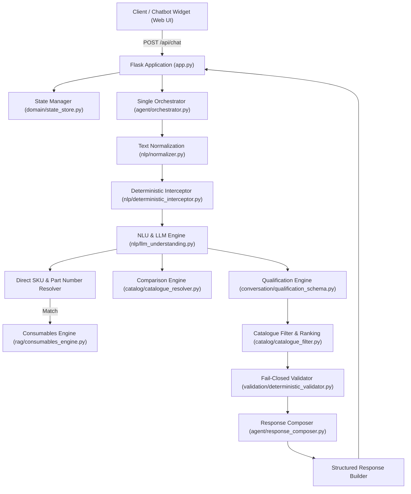

# Kepler Tech SalesAI — Developer Guide & Architecture Documentation

This document provides a comprehensive technical overview of the Kepler Tech SalesAI architecture, internal modules, conversational state machine, catalog resolution, and developer workflows.

---

## 1. High-Level Architecture Overview

Kepler Tech SalesAI is built with a **deterministic-first, fail-closed architecture**. Deterministic Python business rules manage customer qualification, catalog filtering, anti-frustration guards, product comparisons, and pricing guardrails, while local Large Language Models (via Ollama) or rule-based fallback NLU handle natural language understanding and response phrasing.



---

## 2. Directory Structure & Module Breakdown

| Directory / File | Description |
|---|---|
| [`app.py`](file:///opt/salesai/app.py) | Main Flask web application, HTTP routes, security middleware, and session lifecycle. |
| [`run.py`](file:///opt/salesai/run.py) | Entry point runner configured for local/production server deployment. |
| [`config.py`](file:///opt/salesai/config.py) | Centralized environment variable parsing, model allowlists, and timeouts. |
| [`ollama_client.py`](file:///opt/salesai/ollama_client.py) | Resilient HTTP client for Ollama LLM inference with health probes and failover. |
| **`agent/`** | Core orchestration logic: |
| ↳ [`orchestrator.py`](file:///opt/salesai/agent/orchestrator.py) | **Canonical conversational pipeline** — single source of truth for turn processing. |
| ↳ [`decision_engine.py`](file:///opt/salesai/agent/decision_engine.py) | Autonomous action decisions and tool dispatching. |
| ↳ [`tool_executor.py`](file:///opt/salesai/agent/tool_executor.py) | Dynamic executor for catalog searches, product specs, and consumable queries. |
| ↳ [`response_composer.py`](file:///opt/salesai/agent/response_composer.py) | Natural language response generation with deterministic grounding. |
| **`catalog/`** | Product catalog management and resolution: |
| ↳ [`catalogue_loader.py`](file:///opt/salesai/catalog/catalogue_loader.py) | Strict loader enforcing the approved 43-hardware-product catalog scope. |
| ↳ [`catalogue_filter.py`](file:///opt/salesai/catalog/catalogue_filter.py) | Deterministic filtering based on width, scanner, dual roll, and volume. |
| ↳ [`catalogue_resolver.py`](file:///opt/salesai/catalog/catalogue_resolver.py) | Exact model detection, comparisons, and variant handling (e.g. SC-P900 Roll). |
| ↳ [`subcategory_resolver.py`](file:///opt/salesai/catalog/subcategory_resolver.py) | Maps requirements to specific category/subcategory branches. |
| **`conversation/`** | Multi-turn dialog qualification and normalization: |
| ↳ [`qualification_schema.py`](file:///opt/salesai/conversation/qualification_schema.py) | Category requirement schemas, mandatory fields, and questions. |
| ↳ [`contextual_slot_resolver.py`](file:///opt/salesai/conversation/contextual_slot_resolver.py) | Context-aware slot resolution for bare values (e.g. "24", "yes", "large"). |
| ↳ [`next_question_engine.py`](file:///opt/salesai/conversation/next_question_engine.py) | Strict one-question-at-a-time prioritization. |
| ↳ [`normalizer.py`](file:///opt/salesai/conversation/normalizer.py) | Deterministic entity normalization (dimensions, booleans, sizes). |
| **`data/`** | Product databases and verified source data: |
| ↳ [`catalogue_products.json`](file:///opt/salesai/data/catalogue_products.json) | The 43 approved hardware models with full verified specifications. |
| ↳ [`products.json`](file:///opt/salesai/data/products.json) | Complete repository of 790+ hardware, consumables, inks, and paper media. |
| ↳ [`verified_descriptions.json`](file:///opt/salesai/data/verified_descriptions.json) | Authorized descriptions vetted against official brochures. |
| **`domain/`** | Type definitions, enums, and state models: |
| ↳ [`conversation_state.py`](file:///opt/salesai/domain/conversation_state.py) | Thread-safe conversation state model tracking turns, requirements, and history. |
| ↳ [`conversation_types.py`](file:///opt/salesai/domain/conversation_types.py) | Enums (`Intent`, `DialogueAct`, `RouteName`) and structured dataclasses. |
| ↳ [`state_store.py`](file:///opt/salesai/domain/state_store.py) | In-memory LRU session store with Redis integration support. |
| **`nlp/`** | Natural Language Processing & Understanding: |
| ↳ [`llm_understanding.py`](file:///opt/salesai/nlp/llm_understanding.py) | Fast-path intent classifier and robust rule-based fallback NLU. |
| ↳ [`deterministic_interceptor.py`](file:///opt/salesai/nlp/deterministic_interceptor.py) | Intercepts greetings, direct inquiries, and price policy questions. |
| **`rag/`** | Information retrieval & consumables: |
| ↳ [`consumables_engine.py`](file:///opt/salesai/rag/consumables_engine.py) | Compatibility graph resolver linking printers to genuine inks and media. |
| ↳ [`retriever.py`](file:///opt/salesai/rag/retriever.py) | In-memory BM25/Vector RAG retriever with SKU indexation. |
| **`validation/`** | Security, hallucination prevention, and guardrails: |
| ↳ [`catalogue_validator.py`](file:///opt/salesai/validation/catalogue_validator.py) | Enforces approved catalog boundaries; rejects unapproved models. |
| ↳ [`deterministic_validator.py`](file:///opt/salesai/validation/deterministic_validator.py) | Validates generated assistant text against verified catalog facts. |

---

## 3. Conversational Processing Pipeline

Every user message sent to `/api/chat` passes through [`Orchestrator.process_turn()`](file:///opt/salesai/agent/orchestrator.py#L69-L1200):

```
1. Input Sanitization & Normalization
   ├── Remove script tags, normalize whitespace, handle dimension variations (e.g. 4x6, 4×6).
   
2. Deterministic Interception
   ├── High-priority triggers: reset, greetings, contact requests, price inquiries.

3. Intent & Entity Extraction (NLU)
   ├── Ollama LLM Classifier (using prompts/understanding_prompt.py).
   └── Fallback NLU engine for instant offline rule-based classification.

4. Direct SKU & Part Number Resolution
   ├── Matches part numbers (e.g., C13T11C340, C13S210057, CX2.4x6).
   └── Instantly formats and returns genuine consumable card.

5. Direct Hardware & Comparison Routing
   ├── Exact Model Inquiries (e.g. "tell me about SC-P900", "specs of WF-C5890").
   └── Direct Multi-Product Comparisons (e.g. "compare SC-P700 and SC-P900").

6. Consumables Routing
   ├── Identifies target printer hardware and fetches compatible genuine inks/media.
   └── Filters by color when specified (e.g., "magenta ink for WF-C5890").

7. Structured Qualification & Discovery Flow
   ├── Step A: Prompt for category if unknown (CAD, Photo, Office, Dye-Sub, Photo Booth).
   ├── Step B: Inspect qualification schema for missing mandatory fields.
   ├── Step C: Ask strictly ONE missing question at a time.
   ├── Step D: If all mandatory fields satisfied, execute deterministic catalogue filter.
   └── Step E: Return verified candidate product cards.

8. Fail-Closed Validation & Guardrails
   ├── Ensure no unapproved or non-catalogue models are suggested.
   └── Verify generated text contains zero hallucinated specs.
```

---

## 4. SKU & Consumables Resolution

Kepler Tech SalesAI features direct part number resolution to accommodate customers who supply manufacturer part numbers without product descriptions:

### Supported Part Number Schemes:
- **Epson Consumables & Accessories:** `C13T...` (inks), `C13S...` (maintenance boxes), `C12C...` (adapters/accessories).
- **Citizen Photo Media:** `CX2.4x6`, `CX2.6X8`, `CX2W 812`, `CY-MS46`, `CY-MS68`, etc.
- **Dynamic Catalog Lookup:** Any alphanumeric SKU indexed in [`data/products.json`](file:///opt/salesai/data/products.json) via [`rag_retriever.get_by_sku()`](file:///opt/salesai/rag/retriever.py).

### Resolution Behavior:
- When a user enters `"i need C13T11C340"`, `"i want C13T11C340"`, or `"C13S210057"`, the system:
  1. Identifies the SKU via regex and indexed SKU cache.
  2. Bypasses printer qualification questionnaires.
  3. Executes `get_product_specs` and constructs the verified consumable card.
  4. Returns the genuine card with official image, price in AED, description, and link to Kepler Tech's website.

---

## 5. Session State Management

Conversation state is represented by [`ConversationState`](file:///opt/salesai/domain/conversation_state.py) and stored via [`state_manager`](file:///opt/salesai/domain/state_store.py):

```python
class ConversationState:
    session_id: str
    stage: str                          # "greeting" | "qualifying" | "recommending" | "comparing"
    category: Optional[str]             # "technical_cad" | "photo_fine_art" | "office_enterprise" | ...
    requirements: Dict[str, Any]        # {"print_width": 36, "scanner_required": True, ...}
    awaiting_field: Optional[str]       # Field currently being asked to prevent loop repetition
    active_product: Optional[Dict]      # Product under active discussion
    active_printer_for_consumables: Optional[str]
    history: List[Dict[str, str]]       # Multi-turn conversational history
    turns: int                          # Sequential turn counter
```

State is thread-safe, automatically expires after 2 hours of inactivity (LRU eviction), and can be backed by Redis for multi-worker scaling by configuring `REDIS_URL`.

---

## 6. Development & Testing Workflows

### Environment Setup
1. Use the pre-configured virtual environment:
   ```bash
   source /opt/salesai/venv/bin/activate
   ```
2. Verify configuration:
   ```bash
   python -c "from config import PORT, DEFAULT_MODEL; print(f'Port: {PORT}, Model: {DEFAULT_MODEL}')"
   ```

### Running Test Suites
The test suite contains over 230 automated unit, integration, and security tests:

```bash
# Run all unit tests
pytest

# Run specific domain test suites
pytest tests/test_direct_sku_resolution.py -v
pytest tests/test_comparison_engine.py -v
pytest tests/test_adversarial_and_resilience.py -v
pytest tests/test_architecture_single_orchestrator.py -v
```

### Managing the Live Server Service
The application runs as a systemd user service on Linux:

```bash
# Check service status
systemctl --user status salesai.service

# Restart service after code modifications
systemctl --user restart salesai.service

# View live service logs
journalctl --user -u salesai.service -f
```

---

## 7. API Specification

### `POST /api/chat`
Processes a conversational turn.

#### Request Body:
```json
{
  "message": "i need C13T11C340",
  "session_id": "session-12345"
}
```

#### Response Body:
```json
{
  "success": true,
  "session_id": "session-12345",
  "reply": "Here is the verified genuine consumable for **C13T11C340 Epson WF-C53xx / WF-C58xx Series Magenta Ink** (SKU: `C13T11C340`):",
  "source": "route:consumables:direct_sku",
  "product_cards": [],
  "consumable_cards": [
    {
      "id": "C13T11C340",
      "name": "C13T11C340 Epson WF-C53xx / WF-C58xx Series Magenta Ink",
      "sku": "C13T11C340",
      "price_formatted": "AED 220.00",
      "image_url": "https://www.keplertechllc.com/wp-content/uploads/2023/07/WF-C53xx-WF-C58xx-Series-Ink-Cartridge-L-Magenta.webp",
      "url": "https://www.keplertechllc.com/product/c13t11c340-epson-wf-c53xx-c58xx-magenta-ink/",
      "card_type": "consumable"
    }
  ],
  "suggested_chips": ["Order Consumables", "View Compatible Printers", "Ask for Quote"],
  "grounding": {
    "is_grounded": true,
    "status": "verified_catalogue_source"
  }
}
```

### Health Probes
- `GET /health/live`: Fast liveness check (`{"status": "alive"}`).
- `GET /health/ready`: Readiness check verifying catalogue integrity and Ollama connectivity.
