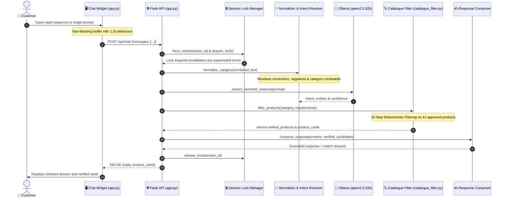

# Kepler Tech SalesAI — Workflow & Product Decision Flowcharts

This document details the complete qualification workflow, conversational architecture, and deterministic decision trees mapping customer inquiries directly to the **41 certified hardware models** in the Kepler Tech catalogue.

---

## 1. Product Qualification Decision Tree (with Exact Models)

```mermaid
flowchart TD
    START(["👤 Customer Requirement / Prompt"]) --> CAT{"Identify Main Category"}

    %% 1. Office Enterprise
    CAT -->|"Office / Business / Copier"| OFF["Office Enterprise Printers"]
    OFF --> OFF_SIZE{"Paper Size?"}
    
    OFF_SIZE -->|"A4 Output"| A4_TECH{"Technology & Speed"}
    A4_TECH -->|"Standard Business MFP (34 ppm)"| M_WF5890["WorkForce Pro WF-C5890DWF"]
    A4_TECH -->|"Compact RIPS Ink Pack (25 ppm)"| M_EMC800["WorkForce Pro EM-C800"]
    A4_TECH -->|"Heat-Free Line-Head (40 ppm)"| M_AMC400["WorkForce Enterprise AM-C400"]
    A4_TECH -->|"Heat-Free Line-Head (55 ppm)"| M_AMC550["WorkForce Enterprise AM-C550"]

    OFF_SIZE -->|"A3 Output"| A3_TECH{"Speed & Volume Class"}
    A3_TECH -->|"Departmental RIPS (25 ppm)"| M_A3_RIPS["WorkForce Pro WF-C878R / WF-C879R"]
    A3_TECH -->|"Enterprise Line-Head (40 ppm)"| M_AMC4000["WorkForce Enterprise AM-C4000"]
    A3_TECH -->|"Enterprise Line-Head (50 ppm)"| M_AMC5000["WorkForce Enterprise AM-C5000"]
    A3_TECH -->|"Enterprise Line-Head (60 ppm)"| M_AMC6000["WorkForce Enterprise AM-C6000"]
    A3_TECH -->|"Flagship Line-Head (100 ppm)"| M_WFC21000["WorkForce Enterprise WF-C21000 D4TW"]

    %% 2. Technical Large Format (CAD/GIS)
    CAT -->|"CAD / Blueprint / GIS Plotters"| TECH["Technical Large Format (CAD/GIS)"]
    TECH --> T_WIDTH{"Plotter Width?"}
    
    T_WIDTH -->|"24-inch (A1)"| T24_OPT{"Configuration"}
    T24_OPT -->|"Desktop / Stand Entry"| M_T3100["SureColor SC-T3100"]
    T24_OPT -->|"Compact Production Single Roll"| M_T3700E["SureColor SC-T3700E"]
    T24_OPT -->|"Production Dual Roll"| M_T3700D["SureColor SC-T3700D / SC-T3700DE"]

    T_WIDTH -->|"36-inch (A0)"| T36_SCAN{"Integrated Scanner?"}
    T36_SCAN -->|"Print-Only"| M_T36_PRT["SureColor SC-T5100 / SC-T5405 / SC-T5700D"]
    T36_SCAN -->|"Scan & Copy MFP"| M_T36_MFP["SureColor SC-T5100M / SC-T5400M / SC-T5700DM"]

    T_WIDTH -->|"44-inch Production"| T44_SCAN{"Multifunction?"}
    T44_SCAN -->|"Print-Only"| M_T7700D["SureColor SC-T7700D / SC-T7700DL (1.6L ink)"]
    T44_SCAN -->|"MFP Dual-Roll"| M_T7700DM["SureColor SC-T7700DM"]

    %% 3. Photography & Fine Art
    CAT -->|"Photo / Fine Art / Gallery"| PHO["Photography & Fine Art"]
    PHO --> P_WIDTH{"Width / Form Factor?"}
    
    P_WIDTH -->|"13-inch (A3+)"| M_P700["SureColor SC-P700 (10-Colour Carbon Black)"]
    P_WIDTH -->|"17-inch (A2+)"| P17_OPT{"Roll or Heavy Duty?"}
    P17_OPT -->|"Desktop Sheet"| M_P900["SureColor SC-P900"]
    P17_OPT -->|"Panoramic Roll"| M_P900R["SureColor SC-P900 with Roll Unit"]
    P17_OPT -->|"Production Heavy Duty"| M_P5300["SureColor SC-P5300"]

    P_WIDTH -->|"24-inch Gallery"| P24_OPT{"Proofing / Calibration?"}
    P24_OPT -->|"Commercial Compact"| M_P6500["SureColor SC-P6500E / D / DE"]
    P24_OPT -->|"12-Colour Master Studio"| M_P7500["SureColor SC-P7500"]
    P24_OPT -->|"Automated Calibration"| M_P7500S["SureColor SC-P7500 with Spectro"]

    P_WIDTH -->|"44-inch Gallery"| P44_OPT{"Proofing / Calibration?"}
    P44_OPT -->|"Production MFP"| M_P8500["SureColor SC-P8500D / SC-P8500DM"]
    P44_OPT -->|"12-Colour Master Studio"| M_P9500["SureColor SC-P9500"]
    P44_OPT -->|"Spectro Proofer"| M_P9500S["SureColor SC-P9500 with Spectro"]

    P_WIDTH -->|"64-inch Production"| M_P20500["SureColor SC-P20500 (1.6L Bulk Inks)"]

    %% 4. Citizen Dye-Sub Photo
    CAT -->|"Photo Booth / Instant Event"| CTZ["Citizen Dye-Sublimation Photo"]
    CTZ --> C_SIZE{"Print Format?"}
    C_SIZE -->|"4-inch Ultra-Compact"| M_CZ01["Citizen CZ-01 (Photo Booths)"]
    C_SIZE -->|"6-inch Standard Events"| M_CX02["Citizen CX-02 / CY-02 (700 prints)"]
    C_SIZE -->|"8-inch Wide Event"| M_CX02W["Citizen CX-02W (8x10 & 8x12)"]

    %% 5. Dye Sublimation
    CAT -->|"Apparel / T-Shirt / Mug"| DYE["Dye Sublimation"]
    DYE --> D_SIZE{"Volume & Format?"}
    D_SIZE -->|"A4 Desktop Gifts"| M_F100["SureColor SC-F100 (Refillable Tanks)"]
    D_SIZE -->|"24-inch Roll Apparel"| M_F500["SureColor SC-F500 (Textiles & Signage)"]

    %% 6. Scanners
    CAT -->|"Scanning Solutions"| SCN["Professional Scanners"]
    SCN --> S_TYPE{"Document Type?"}
    S_TYPE -->|"Graphic & Fine Art Film"| M_12000XL["Expression 12000XL / 12000XL Pro"]
    S_TYPE -->|"Books & Stacks (Hybrid)"| M_HYBRID["WorkForce DS-1630 / DS-6500 / DS-60000 / DS-70000"]
    S_TYPE -->|"High-Speed Sheetfed"| M_SHEETFED["WorkForce DS-530II / DS-790WN / DS-800WN / DS-32000"]
```

---

## 2. End-to-End Chat Turn Lifecycle

---

## 3. Product Catalogue Matrix

| Category | Model | Form Factor | Max Width / Media | Key Feature |
| :--- | :--- | :--- | :--- | :--- |
| **Office A4** | **WorkForce Pro WF-C5890DWF** | Desktop MFP | A4 Sheet | 25 ppm, 10,000 page ink packs |
| **Office A4** | **WorkForce Pro EM-C800** | Desktop MFP | A4 Sheet | 25 ppm, compact RIPS |
| **Office A4** | **WorkForce Enterprise AM-C400** | Floorstand MFP | A4 Sheet | 40 ppm Heat-Free line-head |
| **Office A4** | **WorkForce Enterprise AM-C550** | Floorstand MFP | A4 Sheet | 55 ppm Heat-Free line-head |
| **Office A3** | **WorkForce Pro WF-C878R DWF** | Floorstand MFP | A3+ Sheet | 25 ppm, 86k mono / 50k color yield |
| **Office A3** | **WorkForce Pro WF-C879R DWF** | Floorstand MFP | A3+ Sheet | 26 ppm, heavy duty ADF |
| **Office A3** | **WorkForce Enterprise AM-C4000** | Departmental MFP | A3+ Sheet | 40 ppm Heat-Free line-head |
| **Office A3** | **WorkForce Enterprise AM-C5000** | Departmental MFP | A3+ Sheet | 50 ppm Heat-Free line-head |
| **Office A3** | **WorkForce Enterprise AM-C6000** | Departmental MFP | A3+ Sheet | 60 ppm Heat-Free line-head |
| **Office A3** | **WorkForce Enterprise WF-C21000**| Flagship MFP | A3+ Sheet | 100 ppm ultra-fast line-head |
| **CAD/GIS 24″** | **SureColor SC-T3100** | Stand / Desktop | 24-inch Roll | Compact entry plotter |
| **CAD/GIS 24″** | **SureColor SC-T3700E** | Production Plotter | 24-inch Roll | Single roll, compact flat-top |
| **CAD/GIS 24″** | **SureColor SC-T3700D / DE** | Production Plotter | 24-inch Dual Roll | Dual roll auto-switching, Red ink |
| **CAD/GIS 36″** | **SureColor SC-T5100** | Stand Plotter | 36-inch Roll | High accuracy 36″ line drawings |
| **CAD/GIS 36″** | **SureColor SC-T5405** | Production Plotter | 36-inch Roll | High-speed CAD printing |
| **CAD/GIS 36″** | **SureColor SC-T5700D** | Dual Roll Plotter | 36-inch Dual Roll | Dual roll, Red ink gamut |
| **CAD/GIS 36″** | **SureColor SC-T5100M** | Compact MFP | 36-inch Roll | Integrated 36″ scanner |
| **CAD/GIS 36″** | **SureColor SC-T5400M** | Production MFP | 36-inch Roll | Integrated CIS scanner for CAD |
| **CAD/GIS 36″** | **SureColor SC-T5700DM** | Production MFP | 36-inch Dual Roll | Dual light CIS scanner + dual roll |
| **CAD/GIS 44″** | **SureColor SC-T7700D** | Dual Roll Plotter | 44-inch Dual Roll | 44″ high capacity technical |
| **CAD/GIS 44″** | **SureColor SC-T7700DL** | Bulk Ink Plotter | 44-inch Dual Roll | 1.6L bulk ink supply |
| **CAD/GIS 44″** | **SureColor SC-T7700DM** | Dual Roll MFP | 44-inch Dual Roll | 44″ dual roll with 36″ scanner |
| **Photo 13″** | **SureColor SC-P700** | Desktop Photo | 13-inch (A3+) | UltraChrome PRO10, Carbon Black |
| **Photo 17″** | **SureColor SC-P900** | Desktop Photo | 17-inch (A2+) | 10-colour PRO10, optional roll unit |
| **Photo 17″** | **SureColor SC-P5300** | Production Photo | 17-inch Roll | Built-in roll, 10-colour PRO10 |
| **Photo 24″** | **SureColor SC-P6500E / D / DE**| Compact Photo | 24-inch Roll | Flat-back design, dual roll |
| **Photo 24″** | **SureColor SC-P7500** | Master Studio | 24-inch Roll | 12-colour UltraChrome PRO12 |
| **Photo 24″** | **SureColor SC-P7500 Spectro** | Studio Proofer | 24-inch Roll | Integrated ILS30 spectrophotometer |
| **Photo 44″** | **SureColor SC-P8500D / DM** | Commercial Photo | 44-inch Dual Roll | 44″ dual roll photo + scanner |
| **Photo 44″** | **SureColor SC-P9500** | Master Studio | 44-inch Roll | 12-colour UltraChrome PRO12 |
| **Photo 44″** | **SureColor SC-P9500 Spectro** | Studio Proofer | 44-inch Roll | Integrated ILS30 spectrophotometer |
| **Photo 64″** | **SureColor SC-P20500** | Flagship Production| 64-inch Roll | 12-colour 1.6L bulk inks |
| **Citizen** | **Citizen CZ-01** | Photo Booth | 4-inch Roll | Ultra-lightweight (5.8 kg) |
| **Citizen** | **Citizen CX-02** | Event Photo | 6-inch Roll | Ribbon rewind, fast event prints |
| **Citizen** | **Citizen CY-02** | High Capacity | 6-inch Roll | 700 prints per roll capacity |
| **Citizen** | **Citizen CX-02W** | Wide Event Photo | 8-inch Roll | 8x10″ and 8x12″ instant photos |
| **Dye-Sub** | **SureColor SC-F100** | Desktop Sublimation| A4 Sheet | Refillable ink tanks, gifts |
| **Dye-Sub** | **SureColor SC-F500** | 24″ Sublimation | 24-inch Roll | Textiles, apparel, jersey transfer |
| **Scanners** | **Expression 12000XL / Pro** | Fine Art Flatbed | A3 Flatbed | 2400 x 4800 dpi, Transparency unit|
| **Scanners** | **WorkForce DS-530II / 790WN** | Document Sheetfed | A4 Sheetfed | 35 to 45 ppm, touchscreen network|
| **Scanners** | **WorkForce DS-60000 / 70000** | Archival Flatbed | A3 Flatbed + ADF | Heavy duty 70 ppm, 200 sheet ADF |
